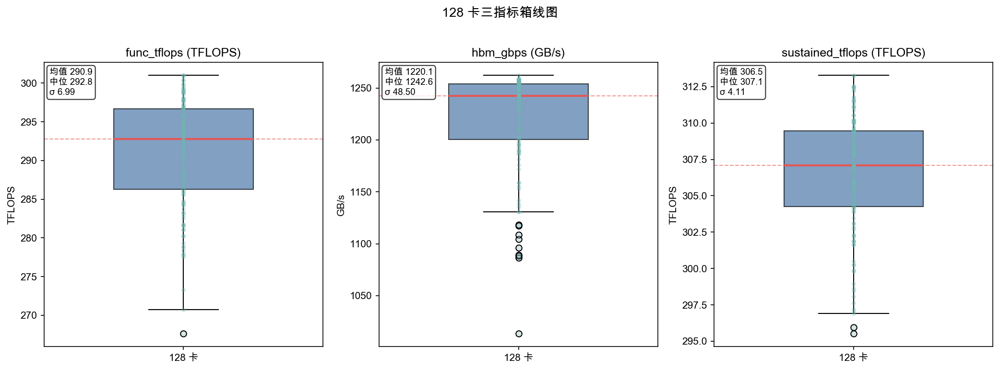
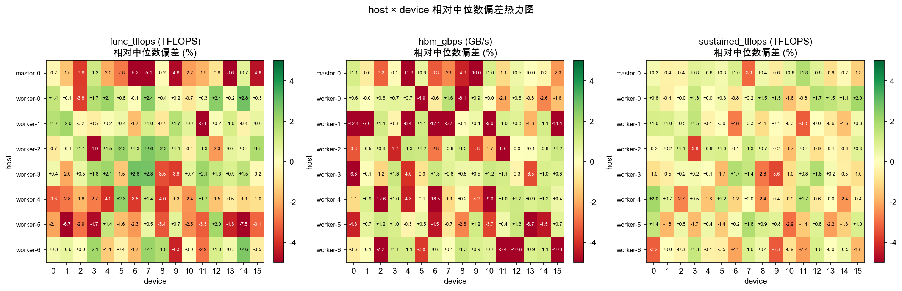
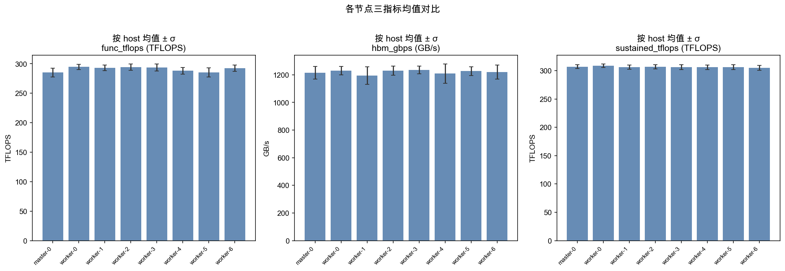
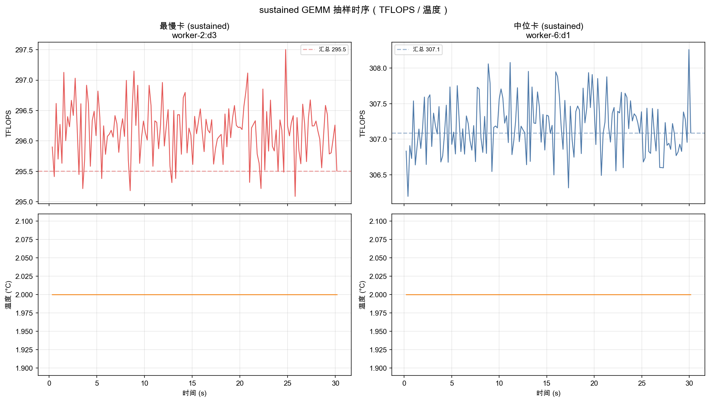
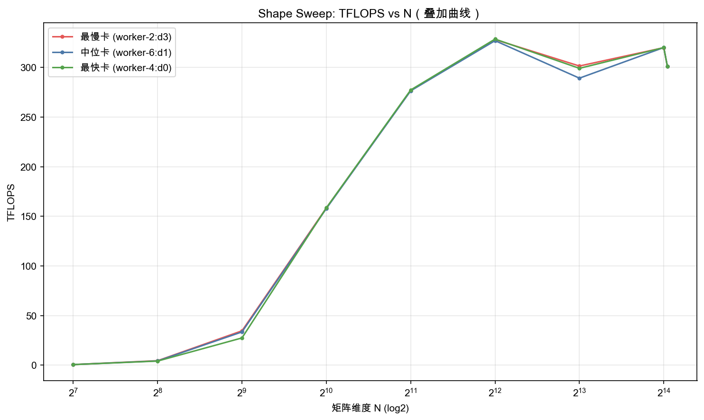

# 128 卡 Card Screen 性能报告

**数据来源**: `/Users/yinjinrun/random-thing/logs/card-screen-128-20260710_224218/results`  
**集群规模**: 128 卡 / 8 节点  
**设备**: Ascend910_9392 (NPU)  
**生成时间**: 2026-07-10

---

## 1. 指标说明

| 指标 | 含义 | 测量方式 |
|------|------|----------|
| **func_tflops** | 功能性 GEMM 峰值算力 | 多轮 GEMM 基准测试（`gemm_round`），取代表性峰值 TFLOPS |
| **hbm_gbps** | HBM 内存带宽 | HBM 读写压测（`hbm_round`），汇总有效 GB/s |
| **sustained_tflops** | 持续算力 | 长时间 sustained GEMM（`gemm_sustained_sample`），反映稳态吞吐 |

附加探测：`gemm_shape_sample` 对不同矩阵维度 N 扫频，观察算力随 shape 变化；SDC/健康检查均通过。

---

## 2. 128 卡汇总 (cluster summary)

- **总卡数**: 128
- **节点列表**: master-0, worker-0, worker-1, worker-2, worker-3, worker-4, worker-5, worker-6
- **slow_frac 阈值**: 0.2
- **verdict 分布**: good = **128**，slow = 0，其余 = 0

**集群中位数（用于偏差计算）**:

| 指标 | 中位数 |
|------|--------|
| func_tflops | 292.79 TFLOPS |
| hbm_gbps | 1242.62 GB/s |
| sustained_tflops | 307.09 TFLOPS |

---

## 3. 全集群统计量

| 指标 | 均值 | 中位数 | 标准差 | 最小 | 最大 | CV(%) |
|------|------|--------|--------|------|------|-------|
| func_tflops | 290.93 | 292.79 | 6.99 | 267.60 | 300.99 | 2.40 |
| hbm_gbps | 1220.06 | 1242.62 | 48.50 | 1013.32 | 1262.14 | 3.97 |
| sustained_tflops | 306.46 | 307.09 | 4.11 | 295.51 | 313.28 | 1.34 |

---

## 4. 相对中位数偏差

偏差 = `(值 - 集群中位数) / 集群中位数 × 100%`。

- **func_tflops**: 偏差范围 [-8.60%, +2.80%]，绝对偏差均值 1.90%，标准差 2.39%
- **hbm_gbps**: 偏差范围 [-18.45%, +1.57%]，绝对偏差均值 2.63%，标准差 3.90%
- **sustained_tflops**: 偏差范围 [-3.77%, +2.02%]，绝对偏差均值 1.05%，标准差 1.34%

---

## 5. 最慢 / 最快 Top 10

### func_tflops

#### 最慢 Top 10

| host | device | 值 | 相对中位数偏差 |
|------|--------|-----|----------------|
| master-0 | 13 | 267.60 | -8.60% |
| worker-5 | 14 | 270.74 | -7.53% |
| worker-5 | 1 | 273.26 | -6.67% |
| master-0 | 6 | 277.56 | -5.20% |
| master-0 | 7 | 277.80 | -5.12% |
| worker-1 | 11 | 277.91 | -5.08% |
| worker-2 | 3 | 278.34 | -4.93% |
| master-0 | 9 | 278.75 | -4.79% |
| worker-5 | 3 | 278.90 | -4.74% |
| master-0 | 15 | 279.31 | -4.60% |

#### 最快 Top 10

| host | device | 值 | 相对中位数偏差 |
|------|--------|-----|----------------|
| worker-3 | 6 | 300.99 | +2.80% |
| worker-0 | 14 | 300.99 | +2.80% |
| worker-3 | 7 | 300.90 | +2.77% |
| worker-2 | 7 | 300.42 | +2.61% |
| worker-6 | 14 | 300.36 | +2.59% |
| worker-0 | 12 | 299.87 | +2.42% |
| worker-0 | 7 | 299.81 | +2.40% |
| worker-4 | 5 | 299.51 | +2.30% |
| worker-2 | 5 | 299.31 | +2.23% |
| worker-2 | 8 | 299.27 | +2.21% |

### hbm_gbps

#### 最慢 Top 10

| host | device | 值 | 相对中位数偏差 |
|------|--------|-----|----------------|
| worker-4 | 6 | 1013.32 | -18.45% |
| worker-4 | 2 | 1086.50 | -12.56% |
| worker-1 | 0 | 1088.09 | -12.44% |
| worker-1 | 6 | 1089.08 | -12.36% |
| master-0 | 4 | 1095.92 | -11.81% |
| worker-1 | 15 | 1104.55 | -11.11% |
| worker-6 | 12 | 1108.78 | -10.77% |
| worker-6 | 15 | 1117.45 | -10.07% |
| master-0 | 9 | 1118.48 | -9.99% |
| worker-1 | 10 | 1130.56 | -9.02% |

#### 最快 Top 10

| host | device | 值 | 相对中位数偏差 |
|------|--------|-----|----------------|
| worker-0 | 7 | 1262.14 | +1.57% |
| worker-2 | 4 | 1258.97 | +1.32% |
| worker-3 | 6 | 1258.50 | +1.28% |
| worker-6 | 8 | 1258.40 | +1.27% |
| worker-3 | 3 | 1258.31 | +1.26% |
| worker-2 | 8 | 1258.27 | +1.26% |
| worker-5 | 12 | 1258.24 | +1.26% |
| worker-3 | 10 | 1258.07 | +1.24% |
| worker-2 | 15 | 1258.03 | +1.24% |
| worker-2 | 5 | 1257.82 | +1.22% |

### sustained_tflops

#### 最慢 Top 10

| host | device | 值 | 相对中位数偏差 |
|------|--------|-----|----------------|
| worker-2 | 3 | 295.51 | -3.77% |
| worker-3 | 9 | 295.96 | -3.62% |
| worker-6 | 9 | 296.90 | -3.32% |
| worker-1 | 11 | 297.05 | -3.27% |
| worker-6 | 0 | 297.22 | -3.21% |
| master-0 | 7 | 297.63 | -3.08% |
| worker-5 | 10 | 298.07 | -2.93% |
| worker-3 | 8 | 298.44 | -2.81% |
| worker-1 | 6 | 298.62 | -2.76% |
| worker-4 | 2 | 298.94 | -2.65% |

#### 最快 Top 10

| host | device | 值 | 相对中位数偏差 |
|------|--------|-----|----------------|
| worker-4 | 0 | 313.28 | +2.02% |
| worker-0 | 15 | 313.27 | +2.01% |
| master-0 | 11 | 312.53 | +1.77% |
| worker-3 | 12 | 312.50 | +1.76% |
| worker-5 | 7 | 312.49 | +1.76% |
| worker-3 | 6 | 312.44 | +1.74% |
| worker-4 | 11 | 312.34 | +1.71% |
| worker-0 | 12 | 312.21 | +1.67% |
| worker-0 | 8 | 311.81 | +1.54% |
| worker-0 | 9 | 311.72 | +1.51% |

---

## 6. 方差解读

1. **func_tflops** CV = 2.40%：峰值 GEMM 在各卡间离散度较低，范围 267.6–301.0 TFLOPS（跨度 33.4）。
2. **hbm_gbps** CV = 3.97%：HBM 带宽一致性一般，范围 1013.3–1262.1 GB/s。
3. **sustained_tflops** CV = 1.34%：持续算力波动最小，说明稳态负载下集群表现均匀。

**代表性卡片**:
- 最慢 sustained: `worker-2:device3` = 295.51 TFLOPS
- 中位 sustained: `worker-6:device1` = 307.09 TFLOPS
- 最快 sustained: `worker-4:device0` = 313.28 TFLOPS

全部 128 卡 verdict 均为 **good**，无 thermal/power throttling 标记；温度读数均为 2°C（NPU 遥测占位值，不代表真实热状态）。
节点间均值差异主要来自单卡微观波动，未见系统性 host 级退化。

---

## 7. 图表

### 三指标箱线图

### host×device 相对中位数偏差热力图

### 各节点均值 ± 标准差

### sustained 抽样时序（最慢 vs 中位卡）

### Shape Sweep: TFLOPS vs N

## 拓展指标（NVIDIA → CANN）

### npu_telemetry_bench（空载 15s + 满载 GEMM 15s）

脚本：`scripts/cluster/npu_telemetry_bench.py`。结果：`logs/telemetry-20260710_224628/results/master0.jsonl`（对标 `nvidia-smi dmon` / DCGM 采样）。

### dtype GEMM 扫描（N=8192，device0）

| dtype | TFLOPS | ms/iter |
|-------|--------|---------|
| fp32 | 89.77 | 12.25 |
| fp16 | 293.54 | 3.75 |
| bf16 | 290.41 | 3.79 |

结论：fp16/bf16 接近 CARD_SCREEN `func_tflops` 中位数（~293）；fp32 约为其 30%。NPU 无 CUDA 式降频原因位，长期负载仍看 sustained 曲线。
