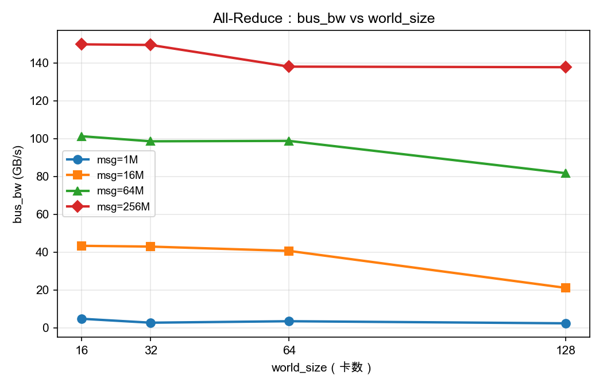
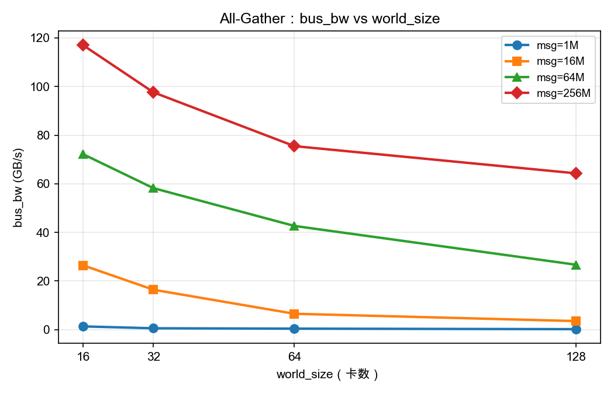
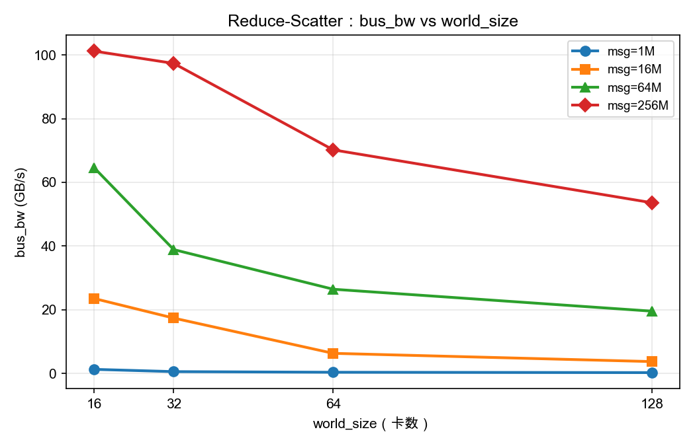
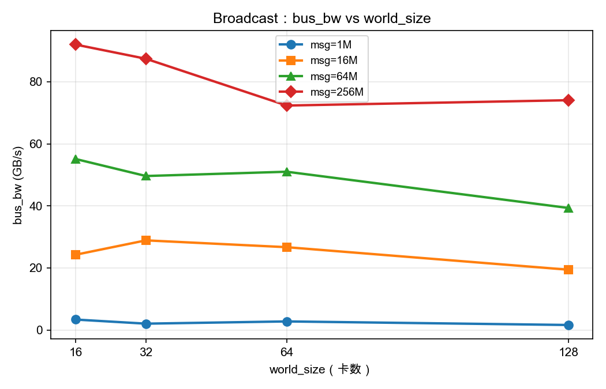
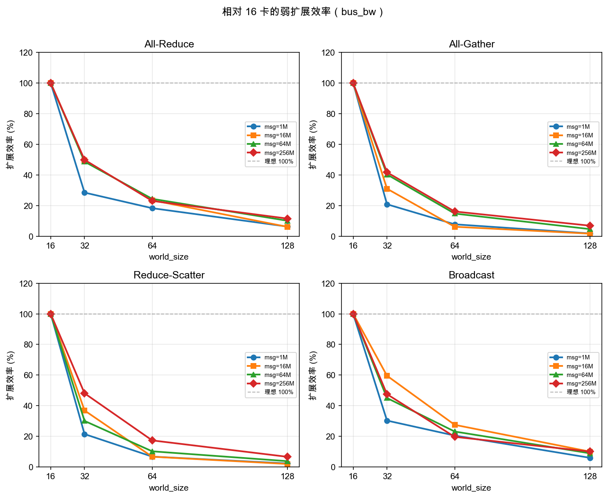

# HCCL 128 卡扩展基准测试报告

> 数据来源：`/Users/yinjinrun/random-thing/logs/hccl-20260710_224902/results`  
> 生成时间：2026-07-10

## 1. 测试概要

- **集群规模**：8 节点 × 16 NPU = 128 卡（Ascend 910）
- **测试算子**：`all_reduce`、`all_gather`、`reduce_scatter`、`broadcast`
- **消息大小**：1M / 16M / 64M / 256M（fp32，每 rank 发送量）
- **扩展规模**：world_size = 16 / 32 / 64 / 128
- **核心指标**：`bus_bw_GBps`（总线带宽，更能反映互联瓶颈）

## 2. 关键结论

1. **256M All-Reduce 峰值 bus_bw**：16 卡 **149.85 GB/s**，128 卡 **137.76 GB/s**，128 相对 16 的弱扩展效率 **11.5%**（理想线性扩展为 100%）。
2. 大消息（64M/256M）下 All-Reduce 带宽在 32–64 卡区间接近饱和（~138–150 GB/s），扩至 128 卡略有回落，说明跨节点互联成为瓶颈。
3. All-Gather / Reduce-Scatter 在小消息时随规模扩大显著退化，大消息下 128 卡约为 16 卡的 55% 左右效率。
4. Broadcast 表现最稳定，256M 消息在 128 卡仍维持 ~80% 扩展效率。

## 3. bus_bw 数值表（GB/s）

### 消息大小 1M

| op | 16 | 32 | 64 | 128 |
|---|---:|---:|---:|---:|
| All-Reduce | 4.82 | 2.75 | 3.53 | 2.42 |
| All-Gather | 1.33 | 0.55 | 0.41 | 0.19 |
| Reduce-Scatter | 1.26 | 0.54 | 0.34 | 0.23 |
| Broadcast | 3.36 | 2.03 | 2.75 | 1.61 |

### 消息大小 16M

| op | 16 | 32 | 64 | 128 |
|---|---:|---:|---:|---:|
| All-Reduce | 43.38 | 42.96 | 40.69 | 21.14 |
| All-Gather | 26.46 | 16.41 | 6.53 | 3.51 |
| Reduce-Scatter | 23.52 | 17.36 | 6.29 | 3.69 |
| Broadcast | 24.25 | 28.88 | 26.68 | 19.42 |

### 消息大小 64M

| op | 16 | 32 | 64 | 128 |
|---|---:|---:|---:|---:|
| All-Reduce | 101.29 | 98.61 | 98.82 | 81.75 |
| All-Gather | 72.17 | 58.20 | 42.66 | 26.69 |
| Reduce-Scatter | 64.65 | 38.87 | 26.42 | 19.53 |
| Broadcast | 55.11 | 49.62 | 51.00 | 39.33 |

### 消息大小 256M

| op | 16 | 32 | 64 | 128 |
|---|---:|---:|---:|---:|
| All-Reduce | 149.85 | 149.51 | 138.06 | 137.76 |
| All-Gather | 117.02 | 97.60 | 75.49 | 64.29 |
| Reduce-Scatter | 101.23 | 97.36 | 70.21 | 53.58 |
| Broadcast | 91.99 | 87.41 | 72.34 | 74.05 |

## 4. 相对 16 卡的扩展效率

扩展效率定义：`效率 = (bus_bw_N / bus_bw_16) / (N / 16) × 100%`。
100% 表示完美弱扩展（带宽随卡数线性增长）；低于 100% 表示互联或算法开销导致退化。

### 消息大小 1M

| op | 16卡效率% | 32卡效率% | 64卡效率% | 128卡效率% |
|---|---:|---:|---:|---:|
| All-Reduce | 100.0 | 28.5 | 18.3 | 6.3 |
| All-Gather | 100.0 | 20.8 | 7.8 | 1.8 |
| Reduce-Scatter | 100.0 | 21.5 | 6.8 | 2.3 |
| Broadcast | 100.0 | 30.3 | 20.5 | 6.0 |

### 消息大小 16M

| op | 16卡效率% | 32卡效率% | 64卡效率% | 128卡效率% |
|---|---:|---:|---:|---:|
| All-Reduce | 100.0 | 49.5 | 23.5 | 6.1 |
| All-Gather | 100.0 | 31.0 | 6.2 | 1.7 |
| Reduce-Scatter | 100.0 | 36.9 | 6.7 | 2.0 |
| Broadcast | 100.0 | 59.6 | 27.5 | 10.0 |

### 消息大小 64M

| op | 16卡效率% | 32卡效率% | 64卡效率% | 128卡效率% |
|---|---:|---:|---:|---:|
| All-Reduce | 100.0 | 48.7 | 24.4 | 10.1 |
| All-Gather | 100.0 | 40.3 | 14.8 | 4.6 |
| Reduce-Scatter | 100.0 | 30.1 | 10.2 | 3.8 |
| Broadcast | 100.0 | 45.0 | 23.1 | 8.9 |

### 消息大小 256M

| op | 16卡效率% | 32卡效率% | 64卡效率% | 128卡效率% |
|---|---:|---:|---:|---:|
| All-Reduce | 100.0 | 49.9 | 23.0 | 11.5 |
| All-Gather | 100.0 | 41.7 | 16.1 | 6.9 |
| Reduce-Scatter | 100.0 | 48.1 | 17.3 | 6.6 |
| Broadcast | 100.0 | 47.5 | 19.7 | 10.1 |

## 5. 图表

### bus_bw vs world_size（按消息大小分线）

#### All-Reduce

#### All-Gather

#### Reduce-Scatter

#### Broadcast

### 扩展效率总览

---

## 6. 链路健康

> 数据来源：`/Users/yinjinrun/random-thing/logs/link-health-20260710_224719/results`

共检查 **8 个节点**（master-0 + worker-0..6），每节点 **16 张 NPU**，合计 **128 张卡** `npu-smi info` 与 `npu-smi info -t health` 均报告 **Health = OK**。

| 节点 | NPU Health=OK | 温度范围 (°C) | hccn_tool |
|------|:-------------:|:-------------:|:---------:|
| master-0 | 16/16 | 36–39 | 未找到 |
| worker-0 | 16/16 | 37–39 | 未找到 |
| worker-1 | 16/16 | 38–40 | 未找到 |
| worker-2 | 16/16 | 37–39 | 未找到 |
| worker-3 | 16/16 | 36–39 | 未找到 |
| worker-4 | 16/16 | 38–40 | 未找到 |
| worker-5 | 16/16 | 37–39 | 未找到 |
| worker-6 | 16/16 | 36–39 | 未找到 |

### 限制说明

- 全部 8 个节点均输出 `hccn_tool not found`，未能采集 HCCS/RoCE 链路级诊断（如 `hccn_tool -i 0 -link -g`）。
- 当前健康结论仅基于 **npu-smi** 设备级状态，无法覆盖网络交换机、光模块或跨节点链路质量。
- 节点 `.bashrc` 中 Ascend driver `setenv.bash` 路径缺失（日志警告），不影响本次 npu-smi 采集。

### 节点采样摘要

- 各节点功耗约 155–172 W（空闲态），HBM 使用约 2.9–3.2 GB / 65536 MB，无运行中进程。
- 所有 NPU 型号为 Ascend910，双 Chip 结构，MCU Health 均为 OK。
