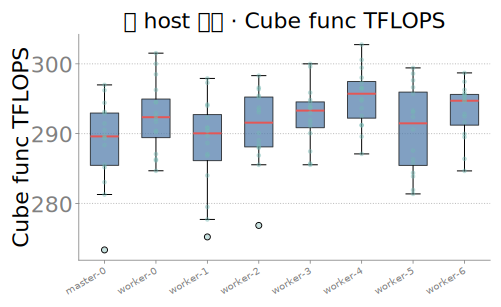
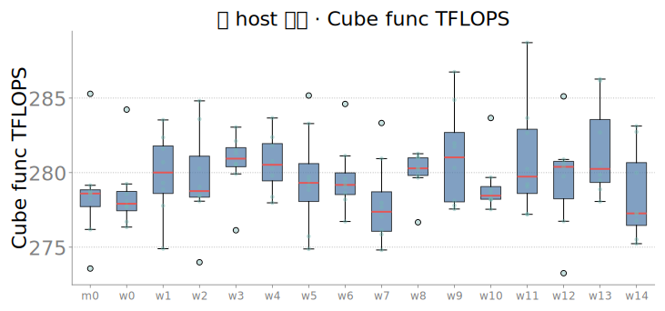
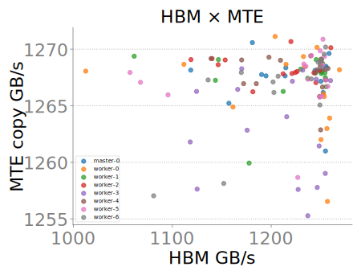
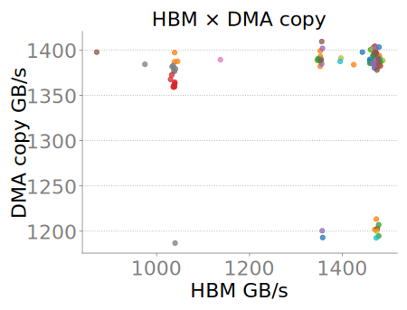
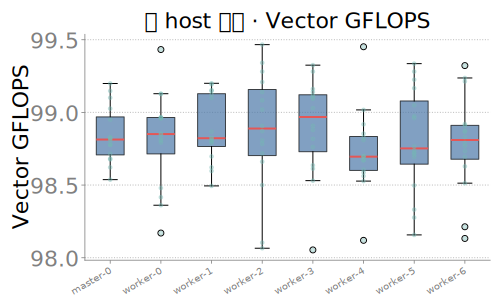
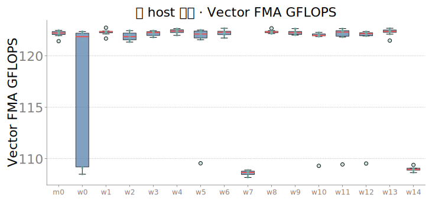
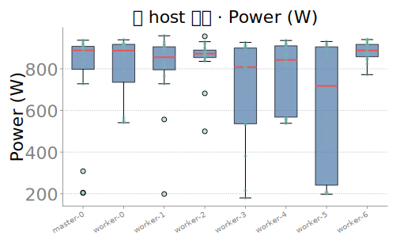
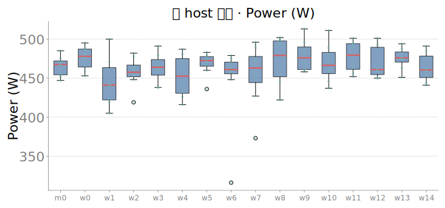
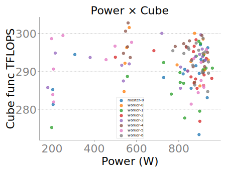
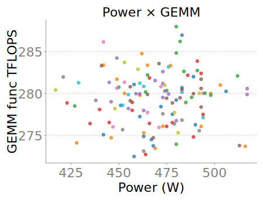

# 卡级体质对照：昇腾 Ascend910 vs 沐曦 C550（128 卡）· 20260713

> **各自集群内部的卡间差异**（不是本文对照口径）另见 [`WITHIN_CLUSTER_CARD_VARIATION_20260713.md`](WITHIN_CLUSTER_CARD_VARIATION_20260713.md)：昇腾/沐曦各自 128 卡内部谁齐、谁散、谁该被运维盯上，以及 launch latency（sync/host_overhead/burst）专节。

> **一句话**：这份报告比的是**卡**——同一批 128 张昇腾 Ascend910 和 128 张沐曦 C550，在矩阵算力、访存搬运、非矩阵探针、功耗热、体质齐性五个面上分别测到了什么，以及这些差异有多少能用**芯片结构**（昇腾 AICore 的 Cube/Vector/Scalar/MTE 分工 vs 沐曦 XCORE 统一核 + MACA）解释。**机间通信不是本文重点**，本批沐曦多机通信未打通，不做机间对比（详见 §1 边界）。

| 侧 | 硬件 / 拓扑 | 主报告 |
|----|-------------|--------|
| 昇腾（华为） | Ascend910 · **8×16=128** | [`CAMPAIGN_FINAL_20260711.md`](CAMPAIGN_FINAL_20260711.md) |
| 沐曦 | MetaX C550-PL · **16×8=128** | [`CAMPAIGN_FINAL_MUXI_20260711.md`](CAMPAIGN_FINAL_MUXI_20260711.md) |
| 硬件词条 | — | 昇腾 [`ASCEND_HARDWARE_GLOSSARY_20260711.md`](ASCEND_HARDWARE_GLOSSARY_20260711.md)；沐曦 [`METAX_HARDWARE_GLOSSARY_20260711.md`](METAX_HARDWARE_GLOSSARY_20260711.md) |
| 语义手册 | — | [`METRIC_SEMANTICS_20260711.md`](METRIC_SEMANTICS_20260711.md) · [`METRIC_SEMANTICS_MUXI_20260711.md`](METRIC_SEMANTICS_MUXI_20260711.md) |

---

## 1. 对照口径与边界

1. **对照单位是「卡」，不是「机间」**：全文数字都是单卡探针（体质 constitution128）在 128 张卡上的分布，或跨卡聚合统计；不涉及跨节点集合通信。
2. **同构探针 ≠ 同构硅**：两边 JSONL 用了同一批字段名（`func_tflops`、`cube_vector_tflops`、`mte_gbps`、`vector_gflops`、`scalar_elems_per_s`、`sfu_gflops`……），这是**为了对齐口径而设计的壳键名**。昇腾侧字段名对应公开文档里确有其名的硬件部件（Cube/Vector/Scalar/MTE）；沐曦侧同名字段测的是 MACA/CUDA 兼容软件栈上的探针，**不代表沐曦芯片里存在同名的硬件分块**。§2 会把这层对应关系摆开讲清楚。
3. **绝对值慎比**：方阵 GEMM TFLOPS、HBM GB/s、功耗、温度受制程代际、功耗墙、传感器口径、探针参数（N、精度、缓冲大小）影响，**本文不做「谁峰值更高/谁更省电」的跨厂商排名**。可比的是**结构、齐性、异常形态**。
4. **`health_*` ≠ 健康分**：`health_power_w` / `health_temp_c` 只是 constitution 流程**早期轻载阶段**的一次快照标签，不是健康评分，也不是同一热稳态下的另一次读数。
5. **冒烟 ≠ 体质**：沐曦有两套独立判定——冒烟（`good=106/slow=19/bad=1/contended=2`）与体质（`good=119/contended=8/bad=1`），采样阶段和规则都不同，**不可相加或直接换算**。昇腾本批对外主结论是体质 **128 GOOD**，未给出同口径四级冒烟拆分。
6. **机间不做**：本批沐曦跨节点通信未打通（走 `eth0` socket，IB/RoCE 数据面未切），不构成可用的机间基线。**本批沐曦多机通信未打通，不做机间对比。**[^1]

[^1]: 若后续需要机间信息，另见沐曦总汇报 §通信 与 [`CAMPAIGN_FINAL_MUXI_20260711.md`](CAMPAIGN_FINAL_MUXI_20260711.md)；本文不展开跨节点保持率、断崖量级或跨节点 P2P/MFU 的并排对比。

---

## 2. 芯片结构怎么对应到「卡上测到的面」

昇腾把一块 AI Core 拆成**四个有独立命名和职责的部件**：Cube（矩阵）、Vector（向量）、Scalar（标量/控制流）、MTE（片上 Buffer↔Global Memory 搬运引擎），并配有 L0A/L0B/L0C、Unified Buffer 等专用片上存储层次，几路指令队列可在满足依赖时并行推进。沐曦公开叙述里的 **XCORE** 是「标量 + 矢量 + 张量单元」的**统一主计算核**，没有对外公开的、与 Cube/Vector/Scalar/MTE 一一对应的独立部件名；软件栈是 CUDA 兼容的 MACA，探针落在 `torch.cuda` Event 上。

也就是说，**同一组字段在两边测到的「硬件面」粒度不同**：

| 探针字段（本文用） | 昇腾对应硬件面 | 沐曦对应软件/硬件面 | 结构含义 |
|---|---|---|---|
| `func_tflops` / `sustained_tflops` / `shape_sweep_peak_tflops`（BNMK 峰） | **Cube** 单元：独立矩阵乘加流水，L0A/L0B 存输入、L0C 存结果 | **XCORE** 内的张量道；MACA 上 `a@b` 走的执行路径，公开资料未单独命名 | 昇腾把矩阵算力做成了可独立寻址、独立存储层次的子部件；沐曦对外只给「统一核」的整体能力 |
| `cube_vector_tflops`（GEMM+epilogue） | **Cube→Vector** 两条流水的衔接（矩阵乘后接向量 scale+bias） | **XCORE** 内张量道到矢量道的衔接（同一统一核内） | 两边都是「矩阵算完再接一次向量后处理」，但衔接是否跨越独立部件、是否有独立队列缓冲，两边不同 |
| `vector_gflops` / `sfu_gflops` | **Vector** 单元：独立指令队列，源/目的数据在 Unified Buffer，公开列举支持向量四则、比较、部分数学函数 | **XCORE** 内矢量道；MACA 软件探针（`a*b+c` / `torch.exp`） | 同上，昇腾侧有独立部件文档锚点，沐曦侧是统一核内的软件路径代理 |
| `scalar_elems_per_s` | **Scalar** 单元：负责循环/分支及给 Cube/Vector/MTE 算地址参数，是独立于 Cube/Vector 的控制流部件 | **XCORE** 内标量道 | 见 §5：这条尤其容易被误读成硬件能力对比，实际是软件串行依赖链探针 |
| `mte_gbps`（纯 copy） | **MTE**：独立搬运引擎，MTE1/2/3 三条队列分管 L1↔L0/UB↔GM 等方向，可与计算队列并行 | 无独立命名的搬运引擎；`Tensor.copy_` 经 MACA/驱动管理的通用存储通路 | 结构性差异最大的一项：昇腾把「搬运」做成显式硬件引擎+独立指令队列；沐曦这层由软件栈隐式管理，没有对外可引用的独立部件名 |
| `hbm_gbps` | 片外 HBM，多路径（Cube/Vector/MTE）经 Global Memory 访问 | 片外 HBM，经 XCORE 统一访存路径 | 两边都是物理意义上的高带宽外存，接口层概念相通，只是芯片内谁去调度访问不同 |

**怎么用这张表**：后面每一节看到「昇腾 X vs 沐曦 X」，先看这张表最后一列——如果结构上本来就不是同一层硬件（比如 MTE vs 通用 copy 通路），差异就更可能来自**设计选择**而非「谁的芯片更强」；如果两边确实落在可比的物理层（比如都经过片外 HBM），差异更可能来自**体质/工艺/参数**而非结构。

---

## 3. 卡级主算力：矩阵乘 func / sustained / BNMK / epilogue

**结论**：两边单卡矩阵算力**同量级**，都不是「整批卡算力崩了」；昇腾在「短窗→稳态→epilogue」链路上的相对保持比沐曦更平。

| 指标 | 人话 | 昇腾中位 | 沐曦中位 | 覆盖 |
|---|---|---:|---:|---|
| `func_tflops` | 单卡方阵 GEMM 短窗吞吐 | **292.4** | **279.9** | 128/128 · 127/128 |
| `sustained_tflops` | 连续烤机后的可持续吞吐（末窗） | **~306.9** | **280** | 128/128 · 127/128 |
| `shape_sweep_peak_tflops`（本批=BNMK 各形状中位吞吐最大值） | 10 个训练层形状里最能打的一个 | **310.7** | **~286** | 128/128 · 127/128 |
| `cube_vector_tflops`（GEMM+epilogue） | 矩阵乘后接一次 scale+bias 的端到端吞吐 | **240.2** | **195.2** | 128/128 · 127/128 |

图证（跨卡箱线，看齐性不看谁峰值高）：

| 昇腾 Ascend910 | 沐曦 C550 |
|:---:|:---:|
|  |  |

**稳态轨迹**（横轴时间窗，纵轴 TFLOPS；p50≈128 卡当前窗中位，p05≈尾部偏慢卡；`sustained_tflops` 取每卡最后一个 ~30s 窗，用来看降频/争用）：

| 昇腾 Ascend910 | 沐曦 C550 |
|:---:|:---:|
|  |  |

**与芯片结构的关系**：`cube_vector_tflops` 相对 `func_tflops` 的比值，昇腾约 82%（240.2/292.4），沐曦约 70%（195.2/279.9）——即接上向量 epilogue 后，沐曦掉点相对更多。§2 的表给出一个可能但**未经细粒度剖析验证**的结构假设：昇腾 Cube→Vector 是两条有独立队列的硬件流水，衔接损耗可能更小；沐曦 XCORE 是统一核内完成矩阵与向量两步，可能存在核内资源复用/调度开销。这是**假设**，不是结论——要坐实需要更细的 kernel-level profiling，本批探针粒度不够。

---

## 4. 卡级访存与搬运：HBM / 纯 copy

**结论**：两边片外带宽同量级，沐曦名义中位更高，但**沐曦有两个整节点级的 HBM 掉速簇**，这是体质异常，不是芯片结构差异。

| 指标 | 人话 | 昇腾中位 | 沐曦中位 | 覆盖 |
|---|---|---:|---:|---|
| `hbm_gbps` | 访存+轻算混合带宽代理（`dst=src*2.0`，R+W 计） | **~1241** | **1469** | 128/128 · 127/128 |
| `mte_gbps` | 纯搬运带宽代理（`Tensor.copy_`，R+W 计） | **~1268** | **1387** | 128/128 · 127/128 |

图证（相对集群中位热图，看是否成片偏低；**不比两侧色标绝对值**）：

| 昇腾 Ascend910 | 沐曦 C550 |
|:---:|:---:|
|  |  |

**HBM vs 纯 copy 散点**（同一张卡两个探针是否同向掉速，用来判断是「访存链路整体慢」还是「单一探针噪声」）：

| 昇腾 Ascend910 | 沐曦 C550 |
|:---:|:---:|
|  |  |

**沐曦异常细节**：`worker-7`、`worker-14` 两个节点均为 **8/8** 卡 HBM 偏慢（约 **1040–1050 GB/s**，相对冒烟中位约 **1487 GB/s**）——**是整节点成簇**，不是单卡随机噪声。这提示排查方向是节点级（供电/散热/PCIe 拓扑/驱动），而不是「沐曦这块芯片的 HBM 接口结构有问题」。

**与芯片结构的关系**：HBM 是两边都要经过的片外物理内存，§2 表里两边接口层概念相通；**成簇掉速这类异常本质是体质/节点问题**，芯片结构（Cube/MTE vs XCORE 统一访存路径）本身解释不了「为什么恰好是这两个节点」——需要运维介入而不是架构复盘（详见 §7）。

---

## 5. 卡级非矩阵探针：Vector / Scalar / SFU（同构键陷阱）

**结论**：Vector/SFU 两边同量级；Scalar 探针数字相差几百倍，**这是软件代理口径差异，禁止读成硬件标量单元的速度对比**。

| 指标 | 人话 | 昇腾中位 | 沐曦中位 | 覆盖 |
|---|---|---:|---:|---|
| `vector_gflops` | 逐元素 FMA 吞吐（`a*b+c`，2 flops/elem） | **98.8** | **122.2** | 128/128 · 127/128 |
| `sfu_gflops` | 一元特殊函数吞吐代理（默认 `torch.exp`，1 op/elem，量纲更接近 Gops/s） | **156.5** | **177.4** | 128/128 · 127/128 |
| `scalar_elems_per_s` | 长依赖串行链吞吐（`torch.cumsum`） | **2.799e+08** | **1.209e+11** | 128/128 · 127/128 |

图证（跨卡箱线）：

| 昇腾 Ascend910 | 沐曦 C550 |
|:---:|:---:|
|  |  |

**关于 Scalar 的陷阱**：`scalar_elems_per_s` 两边相差约 **432 倍**（1.209e+11 / 2.799e+08）。这**不能**写成「沐曦标量单元比昇腾快几百倍」——`torch.cumsum` 在两套完全不同的软件栈（CANN/`torch_npu` Event vs MACA/`torch.cuda` Event）上，长依赖串行链的编译、调度、同步实现差异巨大，探针测的是**软件路径的串行吞吐代理**，不是同一把尺子量出来的硬件 Scalar 部件周期数。同理，`sfu_gflops` 按 1 op/元素计，量纲偏 Gops/s，不要跟 Vector 的 2 flops/elem 直接换算倍速。

**与芯片结构的关系**：昇腾 Scalar 是 AI Core 内独立于 Cube/Vector 的控制流部件，有明确的公开文档锚点；沐曦侧同名字段只是**沿用昇腾键名的软件探针**，测的是 MACA 上 `torch.cumsum` 这条路径，**不对应任何被公开命名的沐曦硬件标量分块**。这正是 §2 表格提醒的「同构探针 ≠ 同构硅」在本节最容易踩雷的地方。

---

## 6. 卡级功耗与热

**结论**：两边功耗/温度画像结构合理（负载态明显高于轻载态），**不做能效或功耗绝对值的跨厂商排名**——TDP、功耗墙、传感器口径、探针负载都不同。

| 指标 | 人话 | 昇腾 | 沐曦 |
|---|---|---|---|
| 轻载功耗 `health_power_w` | constitution 早期轻载快照 | **~168 W** | **~94.84 W** |
| 负载功耗 `power_w` | 负载探针末轮实时功耗 | **~872 W** | **~471 W**（功耗墙 `power_limit_w` **550 W**） |
| 轻载温度 `health_temp_c` | 早期轻载温度快照 | **~40 °C** | **~38.5 °C** |
| 板温 `board_temp_c` | 负载态板温 | **~66 °C** | **~54 °C** |

图证（第一行功耗分布箱线，第二行功耗×算力散点）：

| 昇腾 Ascend910 | 沐曦 C550 |
|:---:|:---:|
|  |  |
|  |  |

**与芯片结构的关系**：本节数字受制程代际、封装、功耗墙设定影响远大于「Cube/Vector/Scalar/MTE 分工」这类微架构差异，**不适合用来反推芯片结构优劣**；唯一可读的结构性信号是两边负载态功耗都显著高于轻载态（说明探针确实把卡从轻载推到了满载），可作为体质数据可信度的旁证。

---

## 7. 128 卡体质齐性与异常清单

**结论**：昇腾本批**干净**（128 GOOD / 0 BAD，多数指标 CV < 4%）；沐曦主算力齐，但异常**更成簇**：1 张正确性坏卡 + 2 个整节点 HBM 慢簇。

| 维度 | 昇腾 | 沐曦 |
|---|---|---|
| 体质判定 | **128 GOOD / 0 BAD** | 体质：good **119** / contended **8** / bad **1**（128 卡） |
| 冒烟判定（沐曦另有独立四级） | 本批无同口径拆分 | good **106** / slow **19** / contended **2** / bad **1**（**不可**与体质数字相加） |
| 坏卡 | 未报告 | `worker-12:0` 冒烟判定 **bad**，GEMM `max_rel_err=0.0762` |
| 节点级带宽簇 | 未报告整节点 HBM 掉速簇 | `worker-7`、`worker-14` 均 **8/8** 卡 HBM 偏慢（~1040–1050 vs 中位~1487 GB/s） |
| 一眼齐性 | 多数指标 **CV < 4%** | 主算力齐，异常集中在少数节点/单卡 |

图证（体质总览箱线，一图看多指标齐性）：

| 昇腾 Ascend910 | 沐曦 C550 |
|:---:|:---:|
|  |  |

**运维含义**：`worker-12:0` 需隔离复测（怀疑 SDC 级正确性问题）；`worker-7`/`worker-14` 建议整节点下线或换机复测 HBM，而不是逐卡排查——因为异常已经是「一个节点里全部卡」而不是「某张卡」。判定口径提醒：冒烟与体质是两套不同阶段、不同规则的判定，对外材料不要混用。

---

## 8. 机内互连印象（不比跨节点）

本文不做机间对比（见 §1 边界），但机内层面两边都有可用的健康信号，值得记一句：昇腾 HCCS 拓扑在本批可用；沐曦 MetaXLink 机内链路健康（`mx-smi`/topo 显示 16/16）。这只是「机内互连可工作」的印象性记录，**不构成跨节点带宽或保持率的证据**，也不替代机间基线——机间基线要等沐曦切换 IB/RoCE 数据面重测后才能给出。

---

## 9. 总结：卡表现差异 ↔ 芯片结构，能解释什么 / 不能解释什么

**结构可能解释的**：
- 昇腾把 Cube/Vector/Scalar/MTE 做成有独立命名、独立存储层次和指令队列的部件，沐曦 XCORE 是统一核——这类设计差异，可能是 §3 中「epilogue 相对 func 的保持比」两边不同的一个候选原因（**假设，未经细粒度验证**）。
- `mte_gbps`（纯 copy）在结构上昇腾对应一个独立硬件搬运引擎，沐曦对应软件栈隐式管理的存储通路——这解释了为什么本文只能把两边都称为「探针代理」，而不能直接对比成「谁的搬运引擎更快」。

**结构解释不了的（是体质/口径问题，不是架构问题）**：
- 沐曦 `worker-7`/`worker-14` 整节点 HBM 慢簇、`worker-12:0` 正确性坏卡——这是本批具体机器的体质异常，与 XCORE 统一核还是 Cube/Vector 分离没有因果关系，需要运维排查而非架构复盘。
- `scalar_elems_per_s` 相差 432 倍——这是同构键名下两套软件栈的探针口径差异（§5），不是「沐曦标量单元」对「昇腾 Scalar 单元」的硬件对比。
- 功耗/温度/HBM 绝对值高低——受代际、封装、功耗墙、传感器口径影响远大于微架构分工，本文不据此排名。

**复测建议**：
1. 沐曦隔离 `worker-12:0` 复测正确性；`worker-7`/`worker-14` 整节点下线或换机复测 HBM。
2. 若要坐实 §3 的 epilogue 结构假设，需要更细粒度的 kernel-level profiling（区分矩阵/向量阶段各自耗时），而不是端到端 TFLOPS 一个数。
3. 两侧对外材料统一口径：不混用冒烟/体质判定；不用 `health_*` 当健康分；不用同构键名暗示沐曦存在 Ascend Cube/Vector/Scalar/MTE 硅部件。
4. 机间对比留待沐曦完成 IB/RoCE 数据面切换后另起报告，不在本文范围内。

---

## 10. 数据与图索引

| 用途 | 路径 |
|------|------|
| 昇腾总汇报 | [`CAMPAIGN_FINAL_20260711.md`](CAMPAIGN_FINAL_20260711.md) |
| 沐曦总汇报 | [`CAMPAIGN_FINAL_MUXI_20260711.md`](CAMPAIGN_FINAL_MUXI_20260711.md) |
| 昇腾体质主报告 + 图 | [`card_constitution_20260711.md`](card_constitution_20260711.md) · `card_constitution_20260711_figs/` |
| 沐曦体质主报告 + 图 | [`card_constitution_muxi_20260711.md`](card_constitution_muxi_20260711.md) · `card_constitution_muxi_20260711_figs/` |
| 昇腾硬件词条 | [`ASCEND_HARDWARE_GLOSSARY_20260711.md`](ASCEND_HARDWARE_GLOSSARY_20260711.md) |
| 沐曦硬件词条 | [`METAX_HARDWARE_GLOSSARY_20260711.md`](METAX_HARDWARE_GLOSSARY_20260711.md) |
| 沐曦架构对齐笔记 | [`../research/METAX_ARCH_ALIGNMENT_20260711.md`](../research/METAX_ARCH_ALIGNMENT_20260711.md) |
| 语义手册 | [`METRIC_SEMANTICS_20260711.md`](METRIC_SEMANTICS_20260711.md) · [`METRIC_SEMANTICS_MUXI_20260711.md`](METRIC_SEMANTICS_MUXI_20260711.md) |

---

> 成文日期：2026-07-13。数字以两边 `CAMPAIGN_FINAL*`、`card_constitution*`、`METRIC_SEMANTICS*` 现稿核验；若后续沐曦完成节点复测或架构剖析有新证据，应更新 §7/§9。
