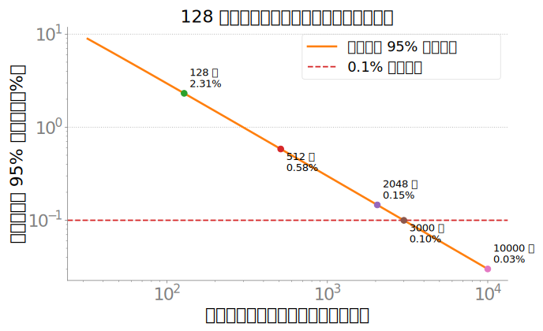
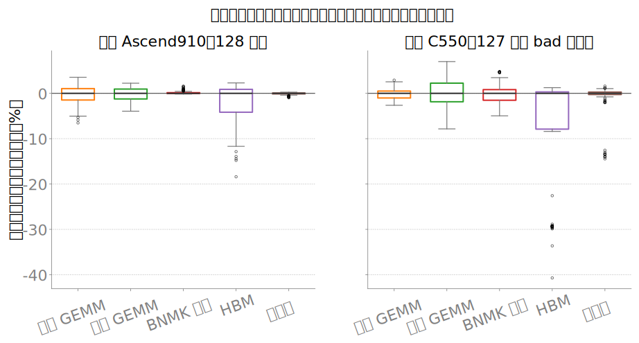
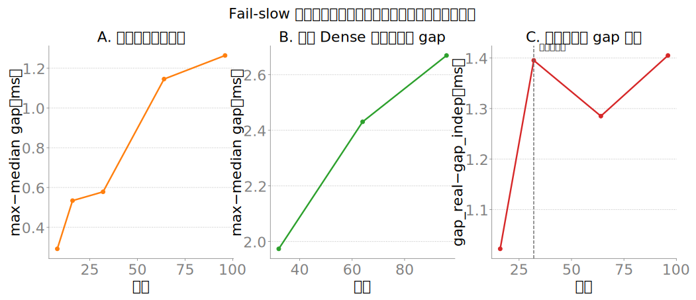
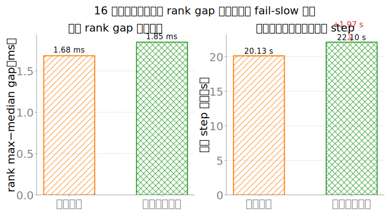
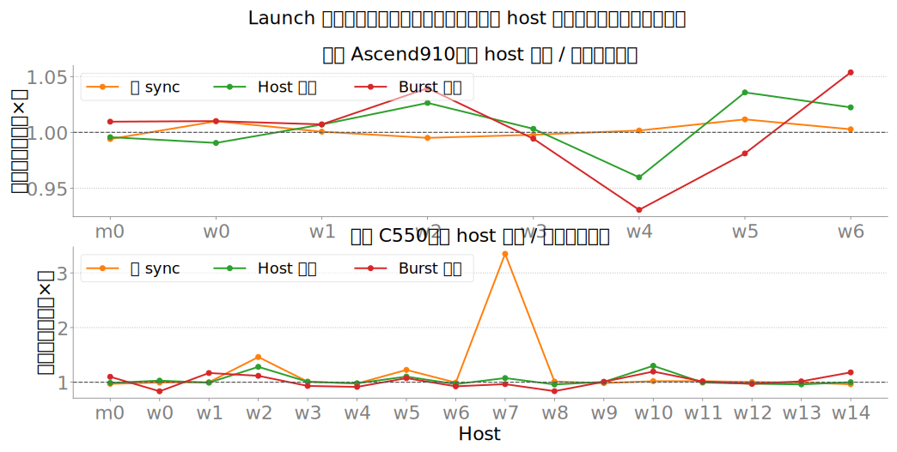

# 128 卡初筛实验：对万卡训练稳定性、Fail-slow 与性能效率的初步预期

**日期**：2026-07-13  
**定位**：万卡训练前的先导初筛，不是万卡验收，也不是跨厂商绝对性能排名  
**样本**：昇腾 Ascend910（8×16=128 卡）；沐曦 C550（16×8=128 卡）

> **核心结论**：这轮 128 卡初筛没有证明万卡训练已经稳定高效，但已经把风险优先级看清了。主体单卡计算体质不是当前最突出的矛盾；真正会被规模放大的是**低概率尾部、节点/网络域相关异常、同步对最慢 rank 的传播、集合通信的层级退化，以及故障后的恢复成本**。昇腾样本在 128 卡以内具备继续扩容验证的基础，但 All-Gather / Reduce-Scatter 已出现明显风险；沐曦样本已观察到正确性坏卡和节点级 HBM 慢簇，且跨节点网络路径尚未打通，目前不能做多机效率外推。两侧都缺少万卡稳定性最关键的 device-hours、MTBF/MTTR 和 checkpoint/restart 闭环。

---

## 0. 先回答：128 卡让我们对万卡有什么预期

### 已经有证据的判断

1. **主体卡的矩阵计算与访存能力基本集中。**  
   昇腾本批没有观察到正确性坏卡或整节点 HBM 慢簇；沐曦主体矩阵算力同样集中，但尾部出现了独立坏卡和节点相关慢簇。万卡风险更可能来自少数尾部及其相关性，而不是平均单卡峰值。

2. **Fail-slow 的传播机制已经确认，但天然发生率尚未测得。**  
   ≤96 卡 Dense 短跑中的可见 `max rank − median rank` 约为 step 的 0.01%，但这个比值只是 rank 墙钟离散度，不是效率损失；受控延迟注入又证明，局部慢 rank 会被同步吸收到全局 step，表面 rank gap 反而几乎不变。因此“当前 gap 小”不能等价为“万卡没有 fail-slow”。

3. **通信风险已经早于计算齐性显现。**  
   昇腾 128 卡 256MB All-Reduce 微基准保持率为 89.4%，而 All-Gather / Reduce-Scatter 仅为 54.0% / 46.4%。这不能直接代表具体训练框架效率，但已经把 AG/RS 密集的 FSDP、ZeRO、部分 TP/SP 列为 512 卡前的优先验证对象；MoE 所需 All-to-All 尚未测，是明确盲区。

4. **节点级相关异常比随机单卡异常更危险。**  
   沐曦 `worker-7`、`worker-14` 均出现 8/8 卡 HBM 同向偏低；`worker-7` 还伴随整节点 launch sync 偏高。数据只支持“同节点多信号共现”，尚不能证明共同根因，但已经说明万卡模型不能采用简单的独立卡假设。

5. **短窗可跑不等于长训有效。**  
   昇腾 TP4PP2 Dense 从 16→128 卡的固定 GBS 短窗 MFU 保持约 86%，给出了强扩展方向的初步锚点；但每档只有 5 iter，不能替代长时间运行、尾部统计、故障恢复和有效训练时间。

### 目前不能回答的问题

- 万卡作业平均多久遇到一次卡、节点、网络或软件故障；
- fail-slow 事件每小时发生多少次、持续多久、拖慢多少 step；
- 跨机架、跨网络域后 collective 是否出现新断崖；
- checkpoint 写入、作业重建与恢复训练需要多久；
- 万卡 MoE All-to-All 的带宽、尾部和稳定性；
- 万卡最终 MFU、tokens/s 或有效训练比例的单点数值。

所以，本报告给出的是**风险方向、机制证据、统计边界和下一阶段门禁**，不制造过早的万卡点预测。

---

## 1. 128 卡初筛能回答什么

128 卡实验承担三种不同任务，不能混成一张“谁更散”的 CV 表。

### 1.1 总体抽样：问题以什么形态出现

卡体质用于发现：

- 正确性/SDC；
- 主体性能分布；
- 单卡、节点内部分卡、整节点慢簇；
- 当前 verdict 是否漏检；
- 哪些遥测字段与真实性能状态不一致。

只有当样本是从未来资源池中**随机、具有代表性地抽取**时，事件计数才可解释为总体比例；便利样本只能发现问题类型，不能估计万卡发生率。

### 1.2 缩比系统：问题怎样被同步与拓扑放大

真实训练、collective、P2P 和受控注入用于观察：

- 从机内扩到跨节点时是否出现台阶；
- 哪类 collective 先退化；
- 最慢 rank 是否抬高全局 step；
- TP/PP/DP 组合改变后，MFU 如何保持；
- 节点级异常是否沿并行组传播。

### 1.3 扩展曲线锚点：为 512 / 2048 设置下一轮门禁

128 卡只是第一个可信锚点。万卡外推至少还需要：

- 128→512：首次验证更多节点和更多网络层级；
- 512→2048：验证并行拓扑、长尾与建链成功率；
- 2048→10000：验证跨网络域、长时间可用率和故障恢复。

### 图 1：为什么“128 卡零坏卡”仍不足以约束万卡低概率风险

图中纵轴是“同口径筛查中零事件”时，真实事件率的 95% 单侧上界，按二项模型 `1−0.05^(1/n)` 计算；横轴为完成筛查的代表性卡数。128 卡零事件对应上界约 2.31%，约 3000 卡零事件才把上界压到 0.1%。这是一条**统计分辨率边界**，不是万卡坏卡数量预测；若样本非随机或事件按节点相关发生，该模型不成立。

---

## 2. 卡体质初筛：主体情况与异常形态

### 2.1 主体计算体质

昇腾本批 128 张 Ascend910：

- constitution：**128 GOOD / 0 BAD**；
- 方阵 GEMM：中位 **292.4 TFLOPS**，逐卡 CV 1.90%；
- 持续 GEMM：中位约 **306.9 TFLOPS**，逐卡 CV 1.39%；
- HBM 带宽代理：中位约 **1241 GB/s**，逐卡 CV 4.34%；
- 未观察到整节点 HBM 慢簇。

沐曦本批 128 张 C550：

- constitution：**119 good / 8 contended / 1 bad**；
- 127 张有效性能记录的方阵 GEMM 中位为 **279.9 TFLOPS**；
- 存在一张正确性坏卡；
- 存在两个整节点 HBM 慢簇，以及节点内部分卡偏慢和单卡极端值。

### 图 2：稳定性能主体与异常尾部

每个箱线都先除以**本侧、该字段自己的中位数**，纵轴表示相对中位偏差；因此图只用于看各自 128 卡内部的主体宽度和尾部，不比较两侧绝对 TFLOPS/GB/s。方阵/持续 GEMM 来自 `a@b` 的设备计时，BNMK 是本批 10 个训练层形状的峰值回填，HBM 是 `dst=src*2.0` 的访存+轻算代理，纯搬运是 `Tensor.copy_`。昇腾 HBM 有零散低尾；沐曦 HBM 出现明显慢簇，BNMK 主体在两侧都较紧。

### 2.2 异常必须按覆盖范围分类

万卡初筛中，同样的“低 20%”有三种完全不同的意义：

1. **单卡异常**：影响一个 rank，可通过隔离或重映射处理；
2. **节点内部分卡异常**：提示槽位、局部链路或卡级因素，但根因需复测；
3. **整节点/整域异常**：一次影响一组 rank，可能破坏并行组和拓扑映射。

### 图 3：HBM 异常是零散还是按节点成簇

| 昇腾 Ascend910 | 沐曦 C550 |
|:---:|:---:|
|  |  |

每个格子是对应 host/device 的 `hbm_gbps` 相对本侧全卡中位偏差。底层为设备侧大缓冲 `dst=src*2.0`，fp32，流量按读+写统计；它测访存+轻算路径，不是 `npu-smi`/`mx-smi` 瞬时带宽利用率。昇腾没有整行慢簇；沐曦 `worker-7`、`worker-14` 呈整行偏低，`worker-0` 是部分格子偏低。颜色只在各自集群内部解释，不能跨图比较绝对深浅。

### 2.3 128 卡样本给出的统计边界

- 昇腾 **0/128** 正确性坏卡：二项模型下 95% 单侧上界约 **2.31%**；
- 沐曦 **1/128** 正确性坏卡：点估计 0.78%，Clopper–Pearson 95% 双侧区间约 **0.02%–4.28%**；
- 沐曦 **2/16** 节点出现整节点 HBM 慢簇：节点事件点估计 12.5%，95% 区间约 **1.55%–38.35%**。

这些区间都很宽。尤其节点慢簇违反卡级独立假设，不能换算成“万卡预计多少张慢卡”。本轮真正有价值的是识别了**独立卡事件与节点相关事件必须分账**。

---

## 3. 从卡间差异到 Fail-slow

Fail-slow 与硬故障不同：作业仍在运行，但局部持续/间歇变慢，全局 step 被同步拖住。万卡下最关键的不是平均 rank，而是尾部、持续时间和影响域。

### 3.1 三层测量链分别看到了什么

### 图 4：独立尾部、真实同步可见离散与启发式残差

- **A：设备独立执行尾部。** `virtual_sync_bench_npu.py --mode independent` 运行无 HCCL 的纯 MLP，步长约 81 ms；`max−median` 从 8 卡 0.29 ms 增加到 96 卡 1.26 ms，反映抽取更多设备后极值上移，但不是实际训练 step。
- **B：真实 Dense 同步后可见 gap。** TP4PP2、SEQ=4096、GBS 随 DP 等比例增加，约 70 个稳态 iter；`failslow_step_timer.py` 将各 rank 的 step 墙钟写入 `step_times_rank*.jsonl`，每 iter 计算 `max−median` 后再取中位。32/64/96 卡 gap 为 1.97/2.43/2.67 ms，约为 19–21 s step 的 0.010%–0.013%。这个比值只表示同步后仍可见的 rank 离散度，不能当作效率损失。
- **C：跨节点相关的启发式残差。** 数据文件把 `gap_real − gap_indep` 记为 `network_contrib`；16→32 首次跨节点时由 1.02 ms 升至 1.40 ms，之后在 1.28–1.40 ms。但独立 MLP 与真实 Dense 的步长、算子、同步和软件路径都不同，这个差值**不能隔离网络因果**，只能作为跨节点相关残差，不能读成通信时间占比或外推跨网络域趋势。

固定 GBS=1920 的另一组实验中，卡数增加使每卡 microbatch 减少、step 从约 120 s 缩到 20 s，绝对 gap 反而由 6.57 ms 降到 2.26 ms。该曲线用于证明控制变量混淆，不用于判断 fail-slow 随规模减弱。

### 3.2 同步会掩盖 rank 差，却保留全局损失

### 图 5：延迟注入前后，表面 gap 与全局 step 的响应相反

16 卡真实 Dense 同步训练中，对 rank 12–15 各 8 个迭代注入约 2 秒延迟，delay 被放入 `perf_counter` 计时窗内。聚合脚本按迭代分成 delayed / normal 两组，分别对 rank `max−median` 和全局 step 取中位，并写入 `exp3_delayed_iter_analysis.json`。左图 gap 仅由 1.68 ms 变为 1.85 ms；右图全局 step 由 20.13 s 升至 22.10 s，增加 **1.97 s**。底层同步使其他 rank 一起等待，因此只看 rank gap 会产生假阴性；正确观测必须同时保留独立执行、collective wait 和全局 step。

### 3.3 当前能对万卡 Fail-slow 说什么

如果单卡在某个观测窗内出现慢事件的概率为 `p`，独立近似下万卡至少出现一个慢事件的概率为：

\[
1-(1-p)^{10000}\approx1-e^{-10000p}
\]

这只说明极值放大机制：即使单卡慢事件很少，万卡也更容易在任一时刻遇到尾部。但当前短跑无法测出 `10^-4` 或 `10^-5` 量级事件率；节点、网络域相关事件又进一步破坏独立假设。

真正的 fail-slow 效率税需要按事件类型 `c` 统计：

\[
\text{fail-slow tax}\approx\sum_c \lambda_c\,d_c\,s_c
\]

- `λ`：事件发生率；
- `d`：持续时间；
- `s`：对全局 step 的慢化比例；
- 每类事件还要记录影响域：单卡、节点、机架或网络域。

**当前结论**：

- ≤96 卡 Dense 短跑中同步后仍可见的 rank 墙钟离散度很小，但它不等于效率损失；
- 局部慢传播为全局 step 损失的机制已经确认；
- 节点相关慢簇已经在卡体质中出现；
- 万卡自然事件率、持续时间与效率税仍未知。

---

## 4. 通信扩展：哪些训练路径会先撞墙

### 图 6：256MB collective 的 16→128 卡保持率

“保持率”表示固定 256MB 消息下，HCCL 算子的总线带宽相对 16 卡基线保留多少；底层为 `torch.distributed` + HCCL 的 `all_reduce`、`broadcast`、`all_gather`、`reduce_scatter`，CPU 计时并配合 `torch.npu.synchronize`。保持率定义为 `bus_bw_N / bus_bw_16`，不是再除以卡数的弱扩展效率。

| 算子 | w32 | w64 | w128 | 主要训练路径 |
|---|---:|---:|---:|---|
| All-Reduce | 96.8% | 94.9% | **89.4%** | DP 梯度同步、部分 TP |
| Broadcast | 91.4% | 86.8% | **86.8%** | 初始化、参数/状态广播 |
| All-Gather | 88.0% | 64.2% | **54.0%** | FSDP/ZeRO-3、部分 TP/SP |
| Reduce-Scatter | 91.8% | 71.0% | **46.4%** | FSDP/ZeRO-2/3、部分 TP 后向 |

由此得到：

- 固定 256MB 的 All-Reduce 微基准到 128 卡未出现同幅度断崖，但仍需真实 DP 梯度大小和 overlap 验证；
- AG/RS 在该消息大小与 16–128 卡范围内退化更快，因此 FSDP/ZeRO 与通信较重 TP/SP 是 512 卡前的优先验证对象，而不是已经量化的训练效率结论；
- PP 需要按真实 stage 映射测跨域 P2P，不能只看任意 ring 边；
- MoE EP 所需 All-to-All 未测，属于未知高风险；
- 本批严格串行单对 P2P 微基准中，机间约 119 GB/s、机内约 122 GB/s；它只提供当前 8 节点域内的空载基线，不能概括拥塞下链路健康，也不能外推跨 SuperPod。

沐曦单节点 8 卡 All-Reduce@256MB 约 190.5 GB/s；首次跨节点后保持率约 0.13%，现有证据表明实际走 `eth0` socket，RoCE 数据面未打通。该结果证明的是**多机网络路径阻断**，不是 C550/MetaXLink 的扩展上限，不参与两侧通信排名。

---

## 5. 真实训练效率：短窗可扩展，长期有效效率仍未知

### 图 7：有实际 TP/PP 的 Dense MFU 固定 GBS 强扩展

图中为各并行拓扑的 MFU 相对其最小规模基线；数据链路是 MindSpeed 日志中的 `throughput per GPU (TFLOP/s/GPU)`，每档丢弃首个 iter 后取中位，再除以该实验账本固定的 peak=292.79 TFLOPS/卡。模型为 20 层、hidden 4096、SEQ=4096、MBS=1、GBS=2048、CP=1、EP=1；固定 GBS、增加 world 属于**强扩展**。每档只有 5 iter，适合看短窗方向，不代表长训稳态。

生产参考价值较高的 TP4PP2：

| world | MFU |
|---:|---:|
| 16 | 42.9% |
| 32 | 42.9% |
| 64 | 36.6% |
| 128 | 37.0% |

128 卡相对 16 卡保持约 **86%**，说明该 TP4PP2 配置的短窗强扩展到 64 卡后出现平台下移。这个结果是下一阶段的性能锚点，不是“可用扩展”验收结论。

万卡有效效率应分解为：

\[
\eta_{\mathrm{effective}}
=
\eta_{\mathrm{compute}}
\times
\eta_{\mathrm{communication}}
\times
\eta_{\mathrm{straggler}}
\times
\eta_{\mathrm{availability}}
\]

当前对 `compute` 和 `communication` 有短窗证据；对 `straggler` 只有 ≤96 卡天然抖动和 16 卡注入机制；对故障、恢复和可用率几乎没有数据。因此 37% MFU 或 86% 保持率都不能直接称为万卡有效训练效率。

---

## 6. 次级画像：哪些元件差异可能被特定模型放大

这些指标不单独决定是否扩容，但用于判断模型敏感性和定位慢训来源。

| 指标面 | 人话含义 | 更敏感的场景 | 报告定位 |
|---|---|---|---|
| Cube / BNMK | 矩阵乘与真实训练层 shape 吞吐 | Dense、Attention GEMM | 主体计算基线 |
| HBM / MTE | 访存+轻算、纯 copy 搬运 | 优化器、FSDP、访存密集算子 | 核心体质 + 定位 |
| Vector / SFU | 逐元素 FMA、exp 等特殊函数代理 | Norm、激活、Softmax | 工作负载相关观察 |
| GEMM+epilogue | 矩阵乘后接 scale+bias 的端到端路径 | 融合后处理 | 工作负载相关观察 |
| Launch | sync、Host 发射、小核 burst | 小算子、MoE 路由、小 batch | 运行时尾部信号 |
| 功耗/温度/利用率 | 采样时刻的遥测快照 | 降频、争用、散热诊断 | 旁路证据，不直接判体质 |

### 6.1 Launch 延迟为什么值得保留

Launch 不会按“卡数 × 单卡微秒”空间相加。可能出现两种放大：

1. **时间关键路径累计**：一个 step 中若有许多串行 tiny kernel，Host enqueue 开销可能沿关键路径累积；
2. **同步极值放大**：各 rank 并行发射，但每个同步阶段等待最慢 rank；rank 越多，遇到 launch 尾部的机会越高。

更接近的表达是：

\[
\Delta T_{\mathrm{step}}
\approx
\sum_{j\in\text{关键串行链}}
\max_r \delta_{r,j}
\]

算子融合、异步队列、图执行和 overlap 会改变累计量，因此 constitution 的 tiny-kernel 探针只能发现运行时尾部，不能直接换算训练 step。

### 图 8：Launch 三类信号在 host 间的相对偏离

每条线都是某 host 的卡级中位除以**本侧全卡中位**：空 sync 是 `adapter.sync()` / `torch.cuda.synchronize()` 的 CPU 往返基线；Host 发射是 tiny `add_` 的 CPU 墙钟减设备 Event；Burst 每核是连续 enqueue 64 个 tiny kernel 后一次同步的总时延除以 64。每卡 launch 预热 50 次、主采样 500 次；burst 使用 `samples//10` 组。两侧驱动与运行时不同，绝对微秒不可排名；图只看各自内部是否出现节点级偏离。沐曦 `worker-7` 的空 sync 是最明显的整节点尾部，其他 launch 字段并未同幅度共振，因此它是复测线索，不是共同根因结论。

完整 Vector/SFU/Scalar、功耗、温度、利用率、launch 直方图与逐卡排序保留在两侧 `card_constitution_*` 图集中，不进入万卡主叙事。

---

## 7. 稳定性：最大缺口是运行时间与恢复闭环

现有材料中：

- sustained GEMM 约 30 秒；
- Dense fail-slow 有 70–220 iter 的短批；
- TP/PP 固定 GBS 强扩展每档只有 5 iter；
- 有延迟与资源抢占注入；
- 没有统一 device-hours / node-hours 账本；
- 没有 checkpoint → kill/fail → restart → loss/step 对齐闭环；
- 没有足够样本估计 MTBF、MTTR 和训练可用率。

万卡作业故障强度来自多层事件叠加：

\[
\lambda_{\mathrm{job}}
\approx
N_{\mathrm{card}}\lambda_{\mathrm{card}}
+
N_{\mathrm{node}}\lambda_{\mathrm{node}}
+
N_{\mathrm{domain}}\lambda_{\mathrm{network}}
+
\lambda_{\mathrm{software}}
\]

独立卡、节点相关和网络域事件必须分开统计。当前只能说 128 卡已验证若干故障形态与同步传播机制，尚未测得“单位时间事件率 × 恢复成本”。

最终应同时报告稳态 MFU 与：

\[
\text{有效训练比例}
=
\frac{\text{有效 optimizer step 时间}}
{\text{资源占用总时间}}
\]

只有两者同时可接受，才说明万卡既跑得快又跑得住。

---

## 8. 万卡风险图谱

| 风险面 | 当前观测 | 万卡放大机制 | 当前判断 | 证据强度 |
|---|---|---|---|---|
| 主体计算体质 | 主体矩阵/搬运集中 | 极端尾部随卡数增加 | 非当前首要瓶颈 | 中 |
| 正确性坏卡 | 昇腾 0/128；沐曦 1/128 | 任一错误可污染同步组 | 必须全量入池筛查 | 中 |
| 节点慢簇 | 沐曦 2/16 节点 HBM 慢簇 | 一次影响多 rank | 比独立慢卡更危险 | 中 |
| Dense rank 墙钟离散 | ≤96 卡可见 gap/step 约 0.01%，不等于效率损失 | 最大 rank 尾部随 N 增长 | 表面离散较小，万卡损失未知 | 中偏低 |
| 局部慢传播 | 人为注入约 2 s，使全局 step +1.97 s | 同步扩散至整个并行组 | 传播机制已确认，自然影响未知 | 中偏高 |
| All-Reduce@256MB | w128 微基准保持 89.4% | DP 域、消息大小与网络层级变化 | 该口径未见同幅度断崖 | 中偏高 |
| AG / RS | w128 保持 54.0% / 46.4% | FSDP/ZeRO/TP/SP 高频通信 | 下一阶段明确风险 | 高（到 128） |
| All-to-All | 未测 | MoE token 路由与拥塞 | 未知高风险 | 缺 |
| Launch 尾部 | 观察到节点级相对偏离 | 小核关键链 + 同步取极值 | 工作负载相关风险 | 中偏低 |
| 长时间可用率 | 无 device-hours / MTBF / MTTR | 组件数与运行时长共同放大 | 无法估计 | 缺 |
| 故障恢复 | 无 checkpoint/restart 闭环 | 重建与回退代价可能很高 | 无法估计 | 缺 |
| 沐曦跨节点 | 首次跨节点落到 eth0 | 网络路径未准备好 | 阻断多机效率预测 | 高 |

---

## 9. 扩容门禁

以下是本轮风险导出的实验建议，不是行业标准。

### 9.1 128→512：确认没有新断崖

1. 复测 All-Reduce / All-Gather / Reduce-Scatter @256MB；
2. 每个规模独立建链并运行至少 5 次，记录带宽、成功率、建链时长和失败原因；
3. 固定生产候选拓扑（如 TP4PP2），GBS 随 DP 增加，每档至少 50–100 个稳态 iter；
4. 补齐 Dense 128/256/512 的 independent + real + global step 三层 fail-slow；
5. 完成一次 checkpoint → 受控终止 → restart → loss/step 对齐。

### 9.2 512→2048：验证拓扑分层与事件过程

1. 明确节点、机架、网络域映射；
2. 按真实 DP/TP/PP/EP group 测通信，而不是只按 world 汇总；
3. 增加 All-to-All 和完整 MoE fail-slow；
4. 做 4–8 小时 soak，累计 card-hours / node-hours；
5. 记录慢事件发生率、持续时间、慢化幅度和影响域；
6. 分别注入单卡慢、整节点慢和网络抖动，建立剂量—响应关系。

### 9.3 2048→10000：验证有效训练时间

万卡门禁至少同时包含：

- 入池正确性和节点级性能筛查覆盖率；
- collective 建链成功率与重复运行稳定性；
- 生产并行拓扑下 MFU / tokens/s；
- step p50 / p95 / p99 与 fail-slow tax；
- 每千 device-hours 的卡、节点、网络、软件事件数；
- checkpoint 周期、写入时长、恢复时长、回退步数；
- 有效训练时间比例。

---

## 10. 最终判断

### 昇腾

- **卡体质初筛：本批通过。** 主体计算/访存集中，未观察到正确性坏卡和整节点 HBM 慢簇。
- **128 卡扩展：形成下一阶段锚点，尚不判定通过。** All-Reduce 微基准未见同幅度断崖，短窗 Dense 给出强扩展方向；AG/RS 已是明确优先验证风险。
- **Fail-slow：机制已确认，定量不足。** ≤96 卡同步后仍可见的 rank 墙钟离散较小，局部慢传播到全局 step 已验证；万卡事件率和效率税未知。
- **万卡稳定性：证据不足。** 缺 512/2048 中间点、长跑、故障率和恢复闭环。

### 沐曦

- **卡体质初筛：发现实质风险。** 有正确性坏卡、整节点 HBM 慢簇和节点内部分异常，入池前必须同时做卡级与节点级筛查。
- **次级画像：存在节点级运行时尾部。** `worker-7` 的 HBM 与空 sync 同节点共现，需复测但不能先验归为同一根因。
- **多机扩展：当前阻断。** 跨节点路径仍走 eth0，现有数据不能用于万卡通信或训练效率外推。

### 对万卡项目的总体预期

下一阶段不应继续把重点放在刷单卡峰值，而应转向：

1. 全量入池正确性 + 节点级性能筛查；
2. AG/RS/All-to-All 与真实并行拓扑的层级扩展；
3. 独立执行、collective wait、全局 step 联合观测；
4. fail-slow 事件率、持续时间与影响域；
5. device-hours、checkpoint/restart 和有效训练时间账本。

128 卡的价值，是提前发现这些会被万卡放大的机制，并为 512 / 2048 设置可验证门禁，而不是替万卡给出一个过早的精确答案。

---

## 11. 数据与报告索引

| 内容 | 路径 |
|---|---|
| 重写计划 | [`PILOT_128_TO_10K_REWRITE_PLAN_20260713.md`](PILOT_128_TO_10K_REWRITE_PLAN_20260713.md) |
| 新图脚本 | [`../plot_pilot_128_to_10k.py`](../plot_pilot_128_to_10k.py) |
| 昇腾 128 卡总汇报 | [`CAMPAIGN_FINAL_20260711.md`](CAMPAIGN_FINAL_20260711.md) |
| 沐曦 128 卡总汇报 | [`CAMPAIGN_FINAL_MUXI_20260711.md`](CAMPAIGN_FINAL_MUXI_20260711.md) |
| 卡内差异统计附录 | [`WITHIN_CLUSTER_CARD_VARIATION_20260713.md`](WITHIN_CLUSTER_CARD_VARIATION_20260713.md) |
| 昇腾 HCCL 16→128 | [`hccl_campaign_20260711.md`](hccl_campaign_20260711.md) |
| Dense TP/PP 固定 GBS 强扩展（源报告标题仍写“弱扩展”） | [`mfu_tp_pp_scale_20260711.md`](mfu_tp_pp_scale_20260711.md) |
| Dense fail-slow ≤96 | [`dense_failslow_96_20260713.md`](dense_failslow_96_20260713.md) |
| 同步放大 / 注入实验 | [`ascend_publish_20260713/CAMPAIGN_FINAL.md`](ascend_publish_20260713/CAMPAIGN_FINAL.md) |
| 逐卡统计产物 | [`within_cluster_variation_stats.json`](within_cluster_variation_stats.json) |

原始体质数据（相对仓库根 `random-thing/`）：

- 昇腾：`logs/card-fillgap-20260711_140301/results/constitution128.merged.jsonl`
- 沐曦：`logs/muxi-constitution-20260711_232400-muxi-constitution128/results/constitution128.merged.jsonl`

> **阅读边界**：两侧探针软件栈、节点拓扑和跨节点网络状态不同。本报告用两套 128 卡样本发现规模风险机制，不据此做跨厂商绝对性能排名；尤其沐曦跨节点路径未打通，通信数字不能与昇腾直接比较。
