# 卡内差异：昇腾 Ascend910 与沐曦 C550 各自 128 卡「卡与卡之间」值得关注什么 · 20260713

> **一句话**：这份报告看的是**各自集群内部**——昇腾 128 张 Ascend910 之间、沐曦 128 张 C550 之间，谁齐、谁散、谁该被运维盯上；两家的数字并排放在一张表里是为了**对照查阅**，不是跨厂商排名（跨厂商排名见边界 §1）。**机间/跨节点通信不是本文重点**，最多脚注提一句（详见 [`COMPARE_ASCEND_MUXI_STABILITY_20260713.md`](COMPARE_ASCEND_MUXI_STABILITY_20260713.md) §1/§8）。

| 侧 | 硬件 / 拓扑 | 主报告 | 卡级体质报告 |
|----|-------------|--------|--------------|
| 昇腾（华为） | Ascend910 · **8×16=128** | [`CAMPAIGN_FINAL_20260711.md`](CAMPAIGN_FINAL_20260711.md) | [`card_constitution_20260711.md`](card_constitution_20260711.md) |
| 沐曦 | MetaX C550-PL · **16×8=128** | [`CAMPAIGN_FINAL_MUXI_20260711.md`](CAMPAIGN_FINAL_MUXI_20260711.md) | [`card_constitution_muxi_20260711.md`](card_constitution_muxi_20260711.md) |
| 卡↔芯片结构对照（同构键名怎么读） | — | — | [`COMPARE_ASCEND_MUXI_STABILITY_20260713.md`](COMPARE_ASCEND_MUXI_STABILITY_20260713.md) |

---

## 1. 口径与边界

1. **看的是「卡内齐性/异常形态」，不是跨厂商排名**：§2 的全量中位对照表把两侧数字并排放在同一行，方便查阅，但**不据此判断谁的芯片更强**——制程代际、探针参数、功耗墙、传感器口径两侧都不同，绝对值不可比。可比的是**同一侧内部**卡与卡之间的分布形态：齐不齐、有没有成簇的坏卡/慢卡。
2. **同构键名 ≠ 同构硅**：两侧 JSONL 用同一套字段名（`func_tflops`、`cube_vector_tflops`、`mte_gbps`……），这是为了对齐口径设计的壳键名，不代表沐曦芯片里存在昇腾 Cube/Vector/Scalar/MTE 同名硬件分块。结构层的详细对照见 [`COMPARE_ASCEND_MUXI_STABILITY_20260713.md`](COMPARE_ASCEND_MUXI_STABILITY_20260713.md) §2，本文不重复展开。
3. **Scalar 陷阱**：`scalar_elems_per_s` 两侧相差约 432 倍（昇腾 2.799e8 vs 沐曦 1.209e11），这是 `torch.cumsum` 在两套完全不同软件栈（CANN/`torch_npu` vs MACA/`torch.cuda`）上的串行链探针口径差异，**禁止**读成「沐曦标量单元比昇腾快几百倍」。
4. **`health_*` ≠ 健康分**：`health_power_w` / `health_temp_c` 只是 constitution 流程**早期轻载阶段**的一次快照标签，不是健康评分。
5. **冒烟 ≠ 体质**：沐曦有两套独立判定——冒烟（`good=106/slow=19/bad=1/contended=2`，取样更早、更短）与体质（`good=119/contended=8/bad=1`，128 卡完整 constitution），**采样阶段和规则都不同，不可相加或换算**；本文 §4 分开引用，不混用。昇腾本批只有体质口径的 128 GOOD，未做同口径四级冒烟拆分。
6. **launch 延迟族**（`launch_sync_*` / `launch_host_overhead_*` / `launch_burst_*`）**绝对值跨栈不可排名**：两侧计时都经过各自驱动/运行时的 sync 路径，栈本身的调度开销不同，不能说「谁的驱动更快」。但**同一侧内部**、卡与卡之间的离散形态（谁的尾延迟更长、是否有个别卡明显偏离）是可以各自描述、值得盯的信号，§5 专节展开。
7. **不发明 CV**：本机本地没有 `constitution128.merged.jsonl` 原始数据，无法现算逐卡标准差/CV。本文只引用两侧现有报告（`CAMPAIGN_FINAL*`、`card_constitution*`、`METRIC_SEMANTICS*`）里已经写出的中位数、判定计数、已成文的定性描述（如「多数指标 CV < 4%」「CV 明显高于算力字段」），并配对应图证；不新编精确 CV/百分位数字。
8. **机间不做**：本批沐曦跨节点通信走 `eth0` socket，IB/RoCE 数据面未切，不构成可用机间基线，本文不展开。[^1]

[^1]: 若需要机间信息，见 [`CAMPAIGN_FINAL_20260711.md`](CAMPAIGN_FINAL_20260711.md) §2 通信小节、[`CAMPAIGN_FINAL_MUXI_20260711.md`](CAMPAIGN_FINAL_MUXI_20260711.md) §2 通信小节，以及 [`COMPARE_ASCEND_MUXI_STABILITY_20260713.md`](COMPARE_ASCEND_MUXI_STABILITY_20260713.md) §8。

---

## 2. 全量中位对照表（纯数据，对照查阅用）

> 数据来源：昇腾 = `logs/card-fillgap-20260711_140301/results/constitution128.merged.jsonl`（128 卡，[`card_constitution_20260711.md`](card_constitution_20260711.md)）；沐曦 = `logs/muxi-constitution-20260711_232400-muxi-constitution128/results/constitution128.merged.jsonl`（128 卡，127/128 有效，[`card_constitution_muxi_20260711.md`](card_constitution_muxi_20260711.md)）。`—` 表示该字段本批未采集/该侧无对应探针，不是数值 0。

### 2.1 矩阵算力（GEMM / epilogue / BNMK 峰）

| 字段 | 人话含义 | 昇腾中位 | 沐曦中位 | 覆盖（昇腾·沐曦） |
|---|---|---:|---:|---|
| `func_tflops` | 单卡方阵 GEMM 短窗吞吐（TFLOPS） | **292.4** | **279.9** | 128/128 · 127/128 |
| `sustained_tflops` | 连续烤机后可持续吞吐（卡级取最后一个 ~30s 窗，非中位） | **306.9** | **280** | 128/128 · 127/128 |
| `cube_vector_tflops` | GEMM 后接一次 scale+bias epilogue 的端到端吞吐 | **240.2** | **195.2** | 128/128 · 127/128 |
| `shape_sweep_peak_tflops` | 名不副实：本批是 10 个 BNMK 训练层形状里各形状中位吞吐的**最大值** | **310.7** | **~286** | 128/128 · 127/128 |

### 2.2 访存与搬运

| 字段 | 人话含义 | 昇腾中位 | 沐曦中位 | 覆盖（昇腾·沐曦） |
|---|---|---:|---:|---|
| `hbm_gbps` | 访存+轻算混合带宽代理（`dst=src*2.0`，R+W 计） | **1241** | **1469** | 128/128 · 127/128 |
| `mte_gbps` | 纯搬运带宽代理（`Tensor.copy_`，R+W 计） | **1268** | **1387** | 128/128 · 127/128 |

### 2.3 非矩阵探针（向量 / 标量 / SFU）

| 字段 | 人话含义 | 昇腾中位 | 沐曦中位 | 覆盖（昇腾·沐曦） |
|---|---|---:|---:|---|
| `vector_gflops` | 逐元素 FMA 吞吐（`a*b+c`，2 flops/elem） | **98.82** | **122.2** | 128/128 · 127/128 |
| `scalar_elems_per_s` | 长依赖串行链吞吐（`torch.cumsum`，元素/秒，**禁止**跨栈比倍速） | **2.799e+08** | **1.209e+11** | 128/128 · 127/128 |
| `sfu_gflops` | 一元特殊函数吞吐代理（默认 `torch.exp`，1 op/元素，量纲近 Gops/s） | **156.5** | **177.4** | 128/128 · 127/128 |

### 2.4 功耗与热

| 字段 | 人话含义 | 昇腾中位 | 沐曦中位 | 覆盖（昇腾·沐曦） |
|---|---|---:|---:|---|
| `health_power_w` | 流程早期轻载功耗快照（**health≠健康分**） | **167.9** | **94.84** | 128/128 · 128/128 |
| `power_w` | 负载探针末轮实时功耗 | **871.5** | **471** | 128/128 · 127/128 |
| `power_limit_w` | 功耗墙（厂商设定上限） | **—** | **550** | — · 127/128 |
| `health_temp_c` | 流程早期轻载温度快照（**health≠健康分**） | **40** | **38.5** | 128/128 · 128/128 |
| `board_temp_c` | 负载态板温 | **66** | **54** | 128/128 · 127/128 |

### 2.5 利用率与时钟

| 字段 | 人话含义 | 昇腾中位 | 沐曦中位 | 覆盖（昇腾·沐曦） |
|---|---|---:|---:|---|
| `aicore_util_pct` | 主计算核占用率（%）：昇腾=AICore Usage Rate，沐曦=GPU util | **92** | **98** | 128/128 · 127/128 |
| `aicpu_util_pct` | 器件侧 AI CPU 占用率（%），与主计算核不是同一执行体 | **0** | **—** | 128/128 · — |
| `ctrlcpu_util_pct` | 器件侧控制 CPU 占用率（%），不是宿主机 CPU% | **7** | **—** | 128/128 · — |
| `mem_bw_util_pct` | HBM 带宽占用瞬时率（%） | **18** | **—** | 128/128 · — |
| `aicore_freq_mhz` | 主计算核时钟（MHz）：沐曦=XCORE clk（`clocks.XCORE.XCORE_CLK`） | **—** | **1500** | — · 127/128 |

### 2.6 Launch 延迟全族（人话+底层见 §5）

| 字段 | 昇腾中位 | 沐曦中位 | 覆盖（昇腾·沐曦） |
|---|---:|---:|---|
| `launch_sync_p50_us` | **6.069** | **2.69** | 128/128 · 127/128 |
| `launch_sync_p99_us` | **6.78** | **4.319** | 128/128 · 127/128 |
| `launch_host_overhead_p50_us` | **240.1** | **184** | 128/128 · 127/128 |
| `launch_host_overhead_p99_us` | **628.7** | **571.3** | 128/128 · 127/128 |
| `launch_burst_p50_us` | **472.5** | **1318** | 128/128 · 127/128 |
| `launch_burst_per_kernel_p50_us` | **7.383** | **20.59** | 128/128 · 127/128 |

### 2.7 判定

| 判定口径 | 昇腾 | 沐曦 |
|---|---|---|
| 体质（constitution128，128 卡完整跑） | **128 GOOD / 0 BAD** | good **119** / contended **8** / bad **1** |
| 冒烟（更早、更短的四级判定，**不可**与体质相加） | 本批无同口径拆分 | good **106** / slow **19** / contended **2** / bad **1** |

---

## 3. 昇腾本批：卡间值得关注什么

**一眼结论：齐**。128 卡体质判定全部 **GOOD / 0 BAD**，[`CAMPAIGN_FINAL_20260711.md`](CAMPAIGN_FINAL_20260711.md) §5 的原话是「这批 128 卡算力/带宽一致性很好（多数 CV < 4%），判定全 GOOD」——本文不重新计算这个 CV，只引用这句已成文的定性结论。

本批体质总览箱线、HBM 相对中位热图、极端 10 卡剖面、机间齐性雷达，与沐曦（§4）同主题图统一放在 §4.5 并排对照表，左右对照更方便；这里先给关键结论——从 HBM 相对中位热图和 [`COMPARE_ASCEND_MUXI_STABILITY_20260713.md`](COMPARE_ASCEND_MUXI_STABILITY_20260713.md) §4 的结论看，昇腾本批**没有报告整节点级的 HBM 掉速簇**——这是与沐曦（§4）最直接的对比点。

**本批昇腾值得关注的点**：

1. **齐性是本批最大的正面信号**：128/128 GOOD、0 BAD，主算力/访存类指标多数 CV < 4%（引自 [`CAMPAIGN_FINAL_20260711.md`](CAMPAIGN_FINAL_20260711.md) §5），HBM 热图上没有看到成片偏低的节点或卡（对比沐曦 §4 的两个整节点簇）。
2. **launch 延迟族是本批相对「散」的一面**：`launch_host_overhead_p99_us`（628.7）相对 `p50`（240.1）膨胀到约 **2.6 倍**，`launch_burst_p50_us`（472.5）本身也不是一个小数——这类 host 侧发射开销的尾部值得单独盯（详细展开见 §5），但**不代表算力类指标也散**，两者是不同层面的信号。
3. **`aicpu_util_pct` 中位为 0、`ctrlcpu_util_pct` 中位仅 7%**：本批负载几乎全压在 AICore（矩阵/向量主计算核）上，AICPU/CtrlCPU 基本空闲，这是一个健康信号（没有把控制流卡在协处理器上），但也说明如果后续有 AICore 之外的瓶颈（比如控制流密集的算子），本批的 constitution 探针覆盖不到，需要另外设计探针。

---

## 4. 沐曦本批：卡间值得关注什么

**一眼结论：主算力齐，但异常比昇腾更「成簇」**。体质判定 good **119** / contended **8** / bad **1**（128 卡），已经比昇腾的 0 BAD 多一张确定坏卡；更关键的是坏卡和慢卡**不是随机撒在 128 张卡里，而是明显按节点聚集**。

### 4.1 一张正确性坏卡

`worker-12:0` 冒烟判定为 **bad**，GEMM 正确性校验 `max_rel_err=0.0762`（引自 [`muxi_smoke_20260711.md`](muxi_smoke_20260711.md)）——这不是「慢」，是**结果错**，怀疑是静默数据损坏（SDC）级问题，需要单独隔离复测，不能等它自己恢复。

### 4.2 两个整节点级 HBM 慢簇

`worker-7`、`worker-14` 两个节点**均为 8/8 卡**HBM 偏慢，约 **1040–1050 GB/s**，相对集群中位（冒烟口径 ~1487 GB/s）明显偏低——**是整节点一起慢，不是某张卡随机噪声**。这个形态本身就是排查方向的线索：如果只是单卡噪声，会去查那张卡的芯片；但「一个节点里全部卡」更该怀疑节点级问题（供电、散热、PCIe 拓扑、驱动版本），运维应该整节点下线复测，而不是逐卡排查。HBM 热图、极端 10 卡剖面、机间齐性雷达与昇腾（§3）同主题图并排见下方 §4.5。

### 4.3 慢卡成因：`intrinsic` 与功耗墙争用（contended）

[`muxi_smoke_20260711.md`](muxi_smoke_20260711.md) 记录 19 张慢卡（多为 HBM ~1040–1050 GB/s），slow-cause 多标 `intrinsic` 或 `power_cap`（满载贴近 **550 W** 功耗墙）；另有 `worker-0:5`、`worker-9:3` 被标记 `perf_quality:timing_flatline`（**contended**，怀疑与其他负载争用资源，不是芯片本身的问题）。这提示本批沐曦的慢卡至少有两类完全不同的根因——**功耗墙触顶降频** vs **资源争用**——运维排查时不能用同一套动作处理。

### 4.4 判定口径别混用

本批体质是 good 119 / contended 8 / bad 1；冒烟是 good 106 / slow 19 / contended 2 / bad 1——两套判定**取样阶段和规则都不同**（§1.5），对外汇报时只能各自引用各自的判定结果，不能相加成「128 里有多少张有问题」。

**本批沐曦值得关注的点**：

1. **`worker-12:0` 正确性坏卡**（`max_rel_err=0.0762`）——优先级最高，SDC 级问题不能带病跑训练。
2. **`worker-7`/`worker-14` 两个整节点 HBM 慢簇**（8/8 卡，~1040–1050 vs 中位 ~1487 GB/s）——按节点处理，不按单卡处理。
3. **慢卡至少两种根因并存**（功耗墙 `power_cap` vs 资源争用 `contended`/`timing_flatline`）——复测前先按 slow-cause 分类，避免一刀切。

### 4.5 图证并排对照：昇腾（§3）vs 沐曦（§4）同主题图

**体质总览箱线**（一图看多指标齐性，箱体窄=齐；昇腾 128 GOOD/0 BAD 的齐性在箱体宽度上直观可见，沐曦箱体略宽，对应 good119/contended8/bad1）：

| 昇腾 Ascend910 | 沐曦 C550 |
|:---:|:---:|
| 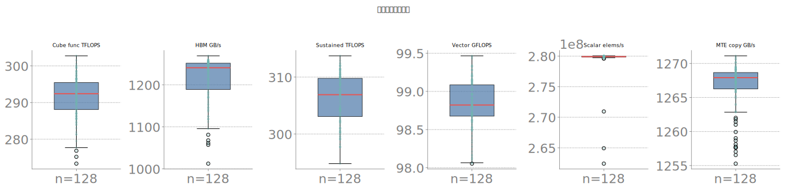 | 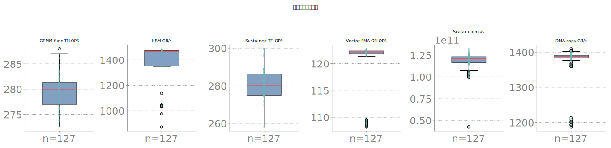 |

**HBM 相对集群中位偏差热图**（host×device，看是否有成片偏低的簇；**不比两侧色标绝对值**，只看各自内部有没有块状异常——昇腾没有成片偏低区域，沐曦 `worker-7`/`worker-14` 两个节点整片偏低）：

| 昇腾 Ascend910 | 沐曦 C550 |
|:---:|:---:|
| 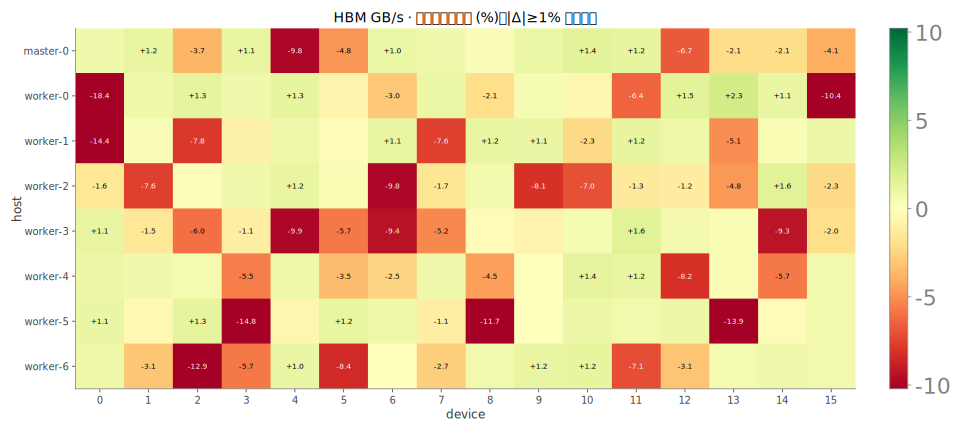 | 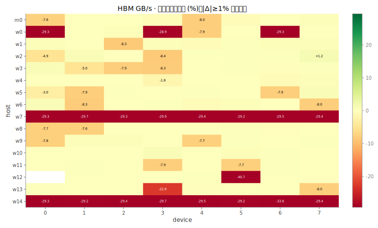 |

**极端 10 卡剖面**（按 `sustained_tflops` 挑最慢/最快各 10 卡，看多指标是否一起慢，用来判断「慢是全面慢」还是「单探针噪声」；沐曦这张图可用来看 `worker-7`/`worker-14` 的卡是不是在多个指标上一起偏离，还是只有 HBM 单项掉速）：

| 昇腾 Ascend910 | 沐曦 C550 |
|:---:|:---:|
| 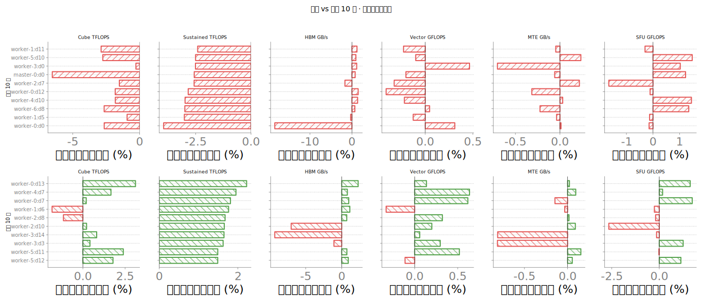 | 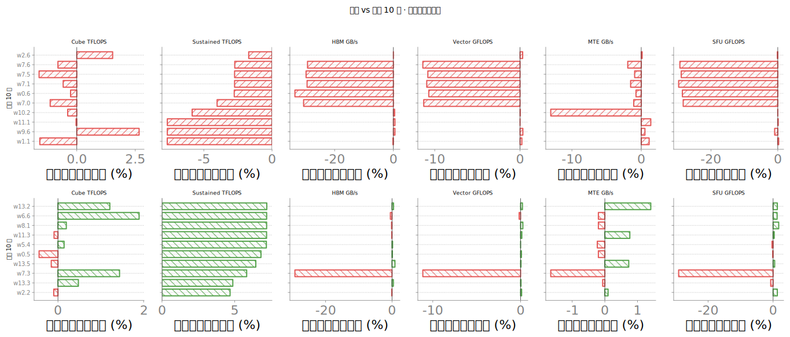 |

**机间体质齐性雷达**（各 host 中位相对集群中位，1.0=集群水平；用来看是不是某几个节点整体偏离）：

| 昇腾 Ascend910 | 沐曦 C550 |
|:---:|:---:|
| 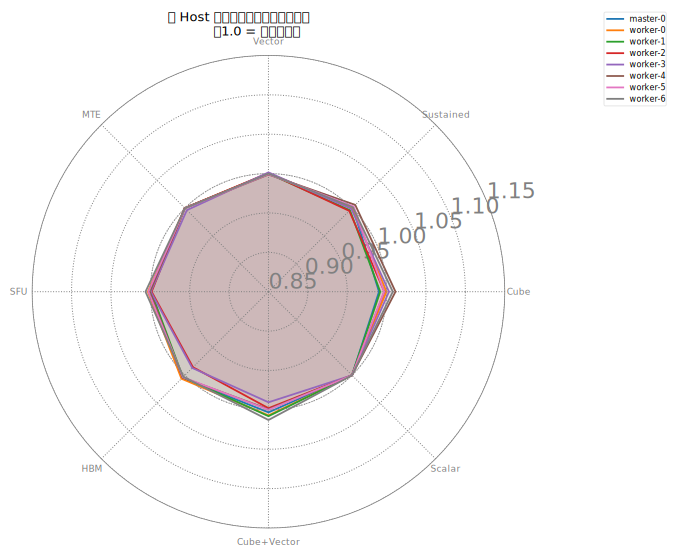 | 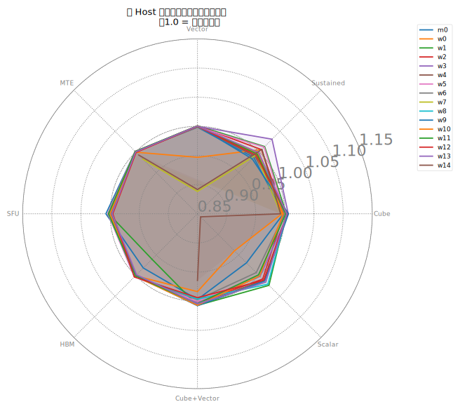 |

---

## 5. Launch latency 专节：sync / host_overhead / burst

### 5.1 三个字段分别测什么（人话 + 底层）

| 字段 | 人话含义 | 底层测法 |
|---|---|---|
| `launch_sync_p50/p99_us` | 空设备 `synchronize()` 一次往返的延迟分位数；反映驱动/设备响应基线，**跟有没有 kernel 要发射无关** | CPU `time.perf_counter()` 包一层 `adapter.sync(device)`（昇腾对应 CANN 同步调用，沐曦对应 `torch.cuda.synchronize`/MACA 同步）；每卡采 500 次（`samples=500`），预热 50 次（`warmup=50`），取 p50/p99 |
| `launch_host_overhead_p50/p99_us` | Host 侧发射一个**极小核**（`x.add_(1.0)`，1 个元素）的额外开销 ≈ 墙钟时间 − 设备侧 Event 时间；衡量 enqueue/驱动排队相对设备实际执行时间的「浪费」有多少 | 同一极小核分别记录墙钟与设备 Event 时刻，`host_overhead_us = max(0, wall_us − event_us)`；需要 `timing_method=event` 才有意义；`samples=500`，`warmup=50` |
| `launch_burst_p50_us` / `launch_burst_per_kernel_p50_us` | 连续发射 64 个极小核之后只做**一次** sync 的总时延（`burst`），以及把这个总时延摊到每个核的均值（`burst / 64`）；看**队列深度**下的批量发射成本，不是单核时延 | CPU 计时：先 sync → 连续 enqueue `burst_count=64` 次 `add_` → 再 sync；总时延取 p50，除以 64 得到每核摊销值 |

### 5.2 两侧数字（引自 §2.6，这里只做换算/对照）

| 字段 | 昇腾中位 | 沐曦中位 |
|---|---:|---:|
| `launch_sync_p50_us` | 6.069 | 2.69 |
| `launch_sync_p99_us` | 6.78 | 4.319 |
| sync 的 p99/p50 比值（尾部相对基线膨胀了多少倍；**这是两个已核验中位数的比值，不是逐卡 CV**） | ×1.12 | ×1.61 |
| `launch_host_overhead_p50_us` | 240.1 | 184 |
| `launch_host_overhead_p99_us` | 628.7 | 571.3 |
| host_overhead 的 p99/p50 比值 | ×2.62 | ×3.10 |
| `launch_burst_p50_us` | 472.5 | 1318 |
| `launch_burst_per_kernel_p50_us` | 7.383 | 20.59 |

图证（分 host 箱线 / 全卡分布 / 单卡升序一览，三种视角看同一件事：卡与卡之间是否齐；sync 三行 + burst 三行 + 分host三件套一行）：

| 昇腾 Ascend910 | 沐曦 C550 |
|:---:|:---:|
| 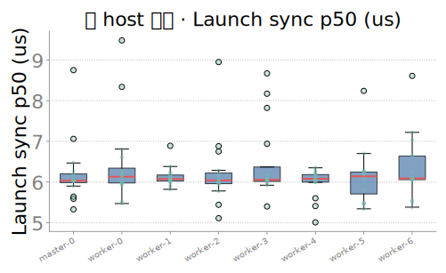 | 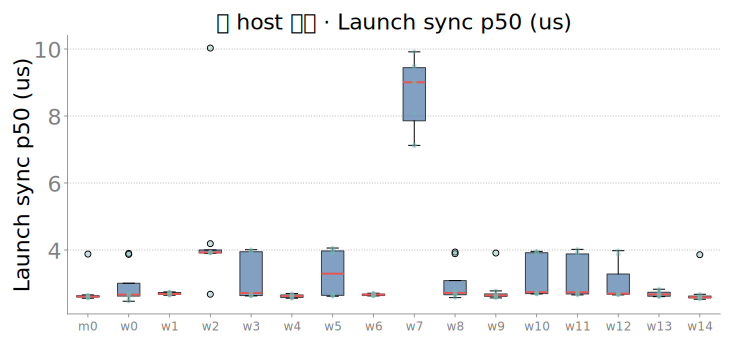 |
| 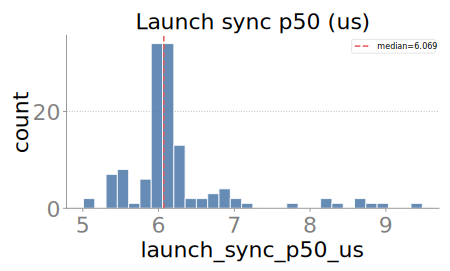 | 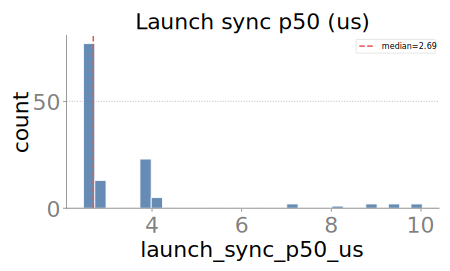 |
| 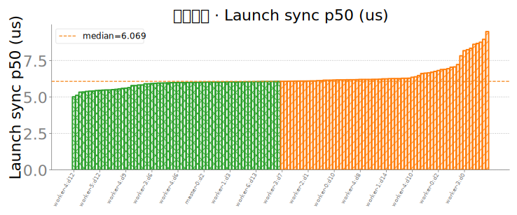 | 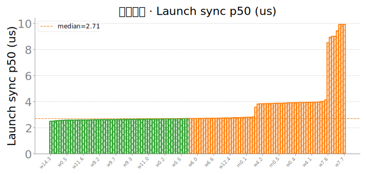 |
| 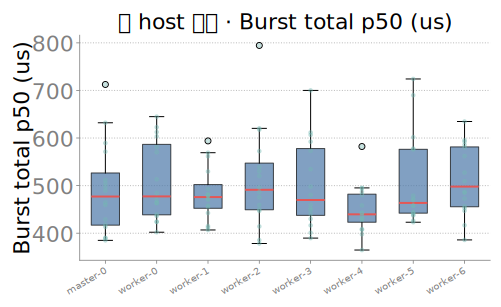 | 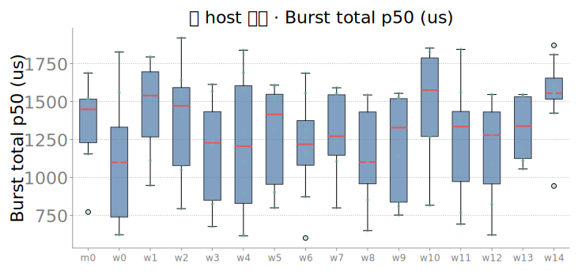 |
| 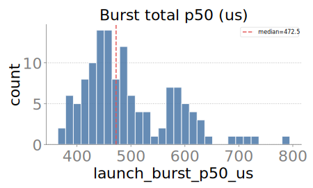 | 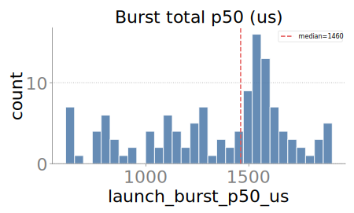 |
| 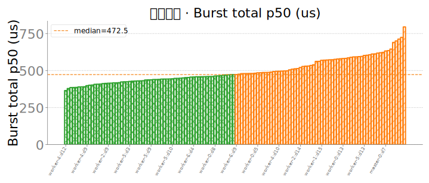 | 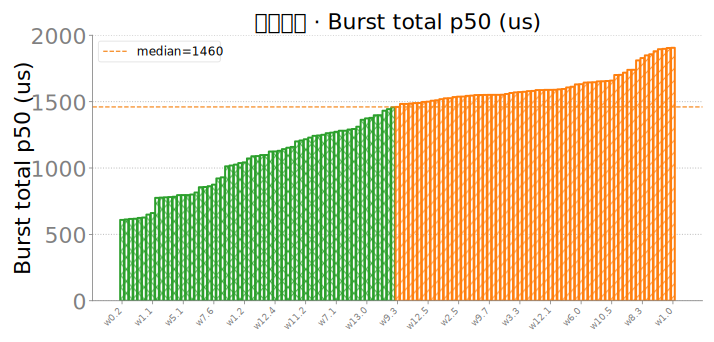 |
| 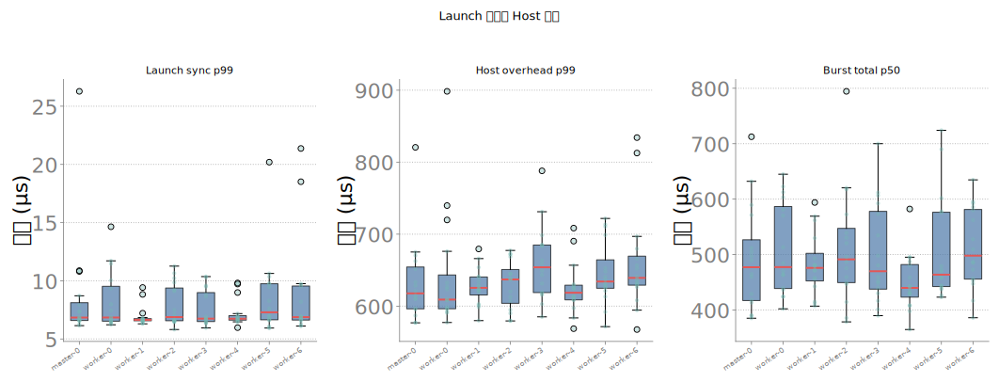 | 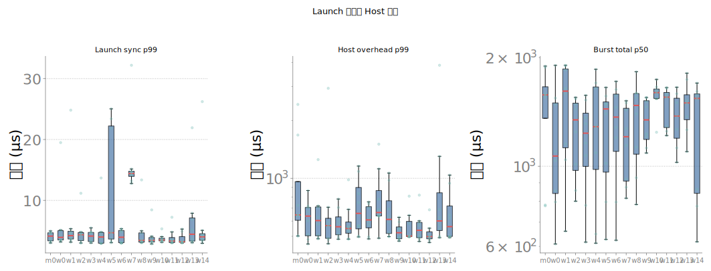 |

### 5.3 谁的卡间离散更值得盯

三条独立证据都指向**沐曦**：

1. **p99/p50 膨胀比更大**：sync 从 ×1.12（昇腾）到 ×1.61（沐曦），host_overhead 从 ×2.62（昇腾）到 ×3.10（沐曦）——沐曦的尾部相对自己的中位膨胀得更多。这只是两个已核验中位数的比值，不是逐卡标准差，但方向是一致的信号。
2. **沐曦语义手册已经写明**：[`METRIC_SEMANTICS_MUXI_20260711.md`](METRIC_SEMANTICS_MUXI_20260711.md) 对 launch 延迟族的原话是「**CV 明显高于算力字段**——更适合看尾延迟/驱动抖动，不宜作为主判定指标」；昇腾侧 [`METRIC_SEMANTICS_20260711.md`](METRIC_SEMANTICS_20260711.md) 对同一族字段**没有**类似的高离散度提示。这是两侧作者在各自数据上已经现算过、写进正文的结论，本文只引用，不重新计算。
3. **`launch_burst_p50_us` 沐曦中位（1318）远高于昇腾（472.5）**——**这条不能读成「沐曦驱动更慢」**（§1.6 已强调，绝对值跨栈不可排名，两侧栈本身开销基线不同），但配合上面两条证据，合理的关注点是：沐曦发射链路本身的**基线更高、尾部也更容易拉长**，值得在后续训练任务里专门盯一下 host 侧 kernel 发射是否成为流水线气泡的来源，尤其是小算子密集的场景（MoE 路由、小 batch 推理）。

**结论**：不排名绝对值，但**卡间/host 间离散形态**上，昇腾 launch 族的箱线更收紧、p99/p50 膨胀更小；沐曦的箱线更宽、尾部相对基线膨胀更明显，且这一点已经被沐曦自己的语义手册记录在案——**运维盯 launch 抖动，优先看沐曦**。

---

## 6. 小结：各自运维关注清单

**昇腾**：

1. 本批干净（128 GOOD / 0 BAD），没有需要立即处理的坏卡或成簇异常，可作为基线批次留存。
2. `launch_host_overhead_p99_us`（628.7，约 p50 的 2.6 倍）是本批相对最「散」的信号，建议下一批次关注是否有个别卡的尾延迟持续偏高（本文未定位到具体卡，需要原始 JSONL 逐卡复核）。
3. `aicpu_util_pct`/`ctrlcpu_util_pct` 中位极低，说明本批探针覆盖的是纯 AICore 负载；若后续要盖住控制流密集场景，需要额外探针。

**沐曦**：

1. `worker-12:0` 尽快隔离复测——正确性坏卡（`max_rel_err=0.0762`）优先级最高。
2. `worker-7`、`worker-14` 建议整节点下线或换机复测 HBM——8/8 卡一起慢，是节点级信号，不是单卡噪声。
3. 慢卡分两类根因处理：`power_cap`（贴功耗墙降频）与 `contended`/`timing_flatline`（资源争用）——复测前先按 slow-cause 分类，别用同一套动作。
4. Launch 延迟族（尤其 `launch_burst_p50_us`、host_overhead 尾部）卡间离散相对更大，建议在真实训练/推理负载里补测一次分卡的 launch 抖动，而不是只看 constitution 批次里的中位数。
5. 对外汇报严格区分冒烟判定（good106/slow19/contended2/bad1）与体质判定（good119/contended8/bad1），不要相加或换算。

---

## 7. 附录：已有 CV / 分位数摘录（不新编数字）

本节只摘录两侧现有报告里**已经写出**的定性/定量结论，配对应图证描述「成簇/离群」，不据本地数据重新计算 CV。

| 摘录 | 出处 | 用途 |
|---|---|---|
| 「这批 128 卡算力/带宽一致性很好（多数 CV < 4%），判定全 GOOD」 | [`CAMPAIGN_FINAL_20260711.md`](CAMPAIGN_FINAL_20260711.md) §5 | 支撑 §3 昇腾「齐」的结论 |
| Launch 延迟族「CV 明显高于算力字段——更适合看尾延迟/驱动抖动，不宜作为主判定指标」 | [`METRIC_SEMANTICS_MUXI_20260711.md`](METRIC_SEMANTICS_MUXI_20260711.md) | 支撑 §5.3「沐曦 launch 更值得盯」的结论 |
| `worker-7`/`worker-14` 均 8/8 卡 HBM ~1040–1050 GB/s vs 中位 ~1487 GB/s；`worker-12:0` `max_rel_err=0.0762` | [`muxi_smoke_20260711.md`](muxi_smoke_20260711.md) | 支撑 §4 沐曦「成簇异常」的结论 |
| 体质 good119/contended8/bad1；冒烟 good106/slow19/contended2/bad1 | [`CAMPAIGN_FINAL_MUXI_20260711.md`](CAMPAIGN_FINAL_MUXI_20260711.md) §2 | §4.4 判定口径 |

图证索引（成簇/离群，均已在 §3–§5 正文嵌入，此处汇总路径）：

| 图 | 昇腾 | 沐曦 |
|---|---|---|
| box_overview（多指标总览箱线） | `card_constitution_20260711_figs/box_overview.svg` | `card_constitution_muxi_20260711_figs/box_overview.svg` |
| heatmap_relmed_hbm_gbps（host×device 相对中位偏差） | `card_constitution_20260711_figs/heatmap_relmed_hbm_gbps.svg` | `card_constitution_muxi_20260711_figs/heatmap_relmed_hbm_gbps.svg` |
| extreme10_small_multiples（最慢/最快各10卡剖面） | `constitution_extra_fillgap_20260711_figs/extreme10_small_multiples.svg` | `constitution_extra_muxi_20260711_figs/extreme10_small_multiples.svg` |
| radar_host_median_norm（机间齐性雷达） | `constitution_extra_fillgap_20260711_figs/radar_host_median_norm.svg` | `constitution_extra_muxi_20260711_figs/radar_host_median_norm.svg` |
| box_launch_by_host（launch 三件套分host） | `constitution_extra_fillgap_20260711_figs/box_launch_by_host.svg` | `constitution_extra_muxi_20260711_figs/box_launch_by_host.svg` |
| sorted_bar / hist / box_by_host（launch_sync_p50 / launch_burst_p50） | `card_constitution_20260711_figs/{sorted_bar,hist,box_by_host}_launch_{sync,burst}_p50_us.svg` | `card_constitution_muxi_20260711_figs/{sorted_bar,hist,box_by_host}_launch_{sync,burst}_p50_us.svg` |

**稳态轨迹（可选，跨卡 p05/p50，看降频/争用趋势）**：

| 昇腾 Ascend910 | 沐曦 C550 |
|:---:|:---:|
| 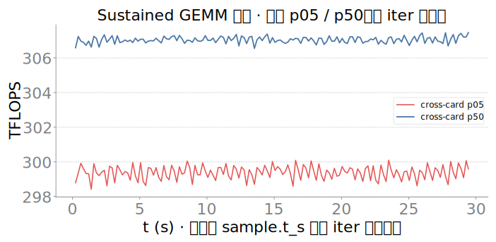 | 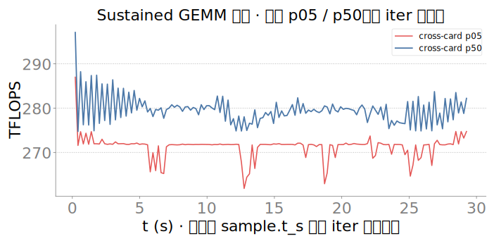 |

---

## 8. 数据与报告索引

| 用途 | 路径 |
|---|---|
| 卡↔芯片结构对照（同构键名怎么读，本文不重复） | [`COMPARE_ASCEND_MUXI_STABILITY_20260713.md`](COMPARE_ASCEND_MUXI_STABILITY_20260713.md) |
| 昇腾总汇报 | [`CAMPAIGN_FINAL_20260711.md`](CAMPAIGN_FINAL_20260711.md) |
| 沐曦总汇报 | [`CAMPAIGN_FINAL_MUXI_20260711.md`](CAMPAIGN_FINAL_MUXI_20260711.md) |
| 昇腾体质主报告 + 图 | [`card_constitution_20260711.md`](card_constitution_20260711.md) · `card_constitution_20260711_figs/` |
| 沐曦体质主报告 + 图 | [`card_constitution_muxi_20260711.md`](card_constitution_muxi_20260711.md) · `card_constitution_muxi_20260711_figs/` |
| 昇腾体质增强图 | [`constitution_extra_fillgap_20260711.md`](constitution_extra_fillgap_20260711.md) · `constitution_extra_fillgap_20260711_figs/` |
| 沐曦体质增强图 | [`constitution_extra_muxi_20260711.md`](constitution_extra_muxi_20260711.md) · `constitution_extra_muxi_20260711_figs/` |
| 沐曦冒烟明细（坏卡/慢卡清单） | [`muxi_smoke_20260711.md`](muxi_smoke_20260711.md) |
| 语义手册 | [`METRIC_SEMANTICS_20260711.md`](METRIC_SEMANTICS_20260711.md) · [`METRIC_SEMANTICS_MUXI_20260711.md`](METRIC_SEMANTICS_MUXI_20260711.md) |
| 硬件词条 | [`ASCEND_HARDWARE_GLOSSARY_20260711.md`](ASCEND_HARDWARE_GLOSSARY_20260711.md) · [`METAX_HARDWARE_GLOSSARY_20260711.md`](METAX_HARDWARE_GLOSSARY_20260711.md) |

---

> 成文日期：2026-07-13。数字以两侧 `CAMPAIGN_FINAL*`、`card_constitution*`、`METRIC_SEMANTICS*`、`muxi_smoke_20260711.md` 现稿核验；本机本地无 `constitution128.merged.jsonl` 原始数据，未现算任何新的 CV/分位数，§5.2 的 p99/p50 比值为已核验中位数的直接换算，非逐卡统计量。若后续沐曦完成 `worker-7`/`worker-14`/`worker-12:0` 复测，应更新 §4/§6。
