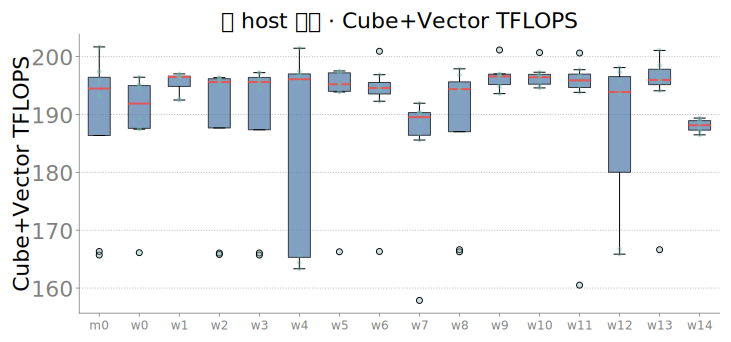

# 卡内差异：昇腾 Ascend910 与沐曦 C550 各自 128 卡「卡与卡之间」值得关注什么 · 20260713（v2 实算版）

> **v2 说明（相对初版的修订）**：初版本文因"本机本地没有原始 JSONL"而只引用两侧其他报告已成文的定性结论，导致标题叫"卡内差异"、正文却几乎没有一条自己算出来的卡间统计量，且大段篇幅（§2 全量中位表）在重复隔壁 [`COMPARE_ASCEND_MUXI_STABILITY_20260713.md`](COMPARE_ASCEND_MUXI_STABILITY_20260713.md) 已经讲过的跨厂商对照。核实后确认**两侧原始 `constitution128.merged.jsonl` 其实一直都在本机**（`logs/card-fillgap-20260711_140301/...`、`logs/muxi-constitution-20260711_232400-.../...`，相对仓库根 `random-thing/`，不是 `lab-workspace/`）。v2 用 [`../analyze_card_variation.py`](../analyze_card_variation.py) 直接对两份 128 卡原始数据现算逐卡 CV/百分位/按 host 聚簇，本文数字均可复现（见 §7），不再是二次引用。

> **一句话**：昇腾 128 卡在矩阵算力/访存类指标上确实齐（CV 多数 <5%，与旧结论一致），但**功耗与 AICore 利用率两个字段的高离散度是采样时序假象、不是芯片体质问题**（§3.2，这是本文最大的新发现）；沐曦除了已知的 `worker-12:0` 坏卡和 `worker-7`/`worker-14` 两个 HBM 满节点慢簇，**`worker-7` 同时也是 launch 延迟最差的节点（8/8 卡全部异常，比集群中位慢约 3 倍）——两个"慢簇"节点其实一好一坏，不能等同处理**（§4.3，同样是新发现）。**机间/跨节点通信不是本文重点**（详见 [`COMPARE_ASCEND_MUXI_STABILITY_20260713.md`](COMPARE_ASCEND_MUXI_STABILITY_20260713.md) §1/§8）。

| 侧 | 硬件 / 拓扑 | 主报告 | 卡级体质报告 |
|----|-------------|--------|--------------|
| 昇腾（华为） | Ascend910 · **8×16=128** | [`CAMPAIGN_FINAL_20260711.md`](CAMPAIGN_FINAL_20260711.md) | [`card_constitution_20260711.md`](card_constitution_20260711.md) |
| 沐曦 | MetaX C550-PL · **16×8=128** | [`CAMPAIGN_FINAL_MUXI_20260711.md`](CAMPAIGN_FINAL_MUXI_20260711.md) | [`card_constitution_muxi_20260711.md`](card_constitution_muxi_20260711.md) |
| 卡↔芯片结构对照（同构键名怎么读） | — | — | [`COMPARE_ASCEND_MUXI_STABILITY_20260713.md`](COMPARE_ASCEND_MUXI_STABILITY_20260713.md) |

---

## 1. 口径与边界

1. **看的是「卡内齐性/异常形态」，不是跨厂商排名**：本文所有统计量都是**同一侧内部**卡与卡之间的分布（CV、百分位、按 host 聚簇），不比较两侧绝对值谁更强——制程代际、探针参数、功耗墙、传感器口径两侧都不同，绝对值对照见 [`COMPARE_ASCEND_MUXI_STABILITY_20260713.md`](COMPARE_ASCEND_MUXI_STABILITY_20260713.md)，本文不重复。
2. **同构键名 ≠ 同构硅**：两侧 JSONL 用同一套字段名，是对齐口径的壳键名，不代表沐曦芯片里存在昇腾 Cube/Vector/Scalar/MTE 同名硬件分块（详见 COMPARE 报告 §2）。
3. **Scalar 陷阱**：`scalar_elems_per_s` 两侧相差两个数量级，是 `torch.cumsum` 在 CANN/`torch_npu` vs MACA/`torch.cuda` 上的软件口径差异，**禁止**读成硬件标量单元速度对比；本文只报各自内部 CV，不做跨侧比较。
4. **`health_*` ≠ 健康分**：`health_power_w`/`health_temp_c` 只是 constitution 流程早期轻载阶段的一次快照标签。
5. **冒烟 ≠ 体质**：沐曦冒烟（`good=106/slow=19/bad=1/contended=2`）与体质（`good=119/contended=8/bad=1`，本文用的是这个 128 卡完整口径）采样阶段和规则不同，不可相加；本文 §4 统一用体质口径的原始 `constitution128.merged.jsonl`。
6. **launch 延迟族绝对值跨栈不可排名**，但同一侧内部卡与卡之间的离散形态可各自描述，§5 展开。
7. **本文口径升级**：所有 CV/百分位/按 host 聚簇统计，均由 [`../analyze_card_variation.py`](../analyze_card_variation.py) 直接对两侧 128 卡原始 `record=="card"` 记录现算得出（脚本与产物见 §7），**不是**转述其他报告的定性描述；引用其他报告的地方会明确标出。
8. **机间不做**：本批沐曦跨节点通信走 `eth0` socket，IB/RoCE 数据面未切，不构成可用机间基线，本文不展开。[^1]

[^1]: 若需要机间信息，见 [`CAMPAIGN_FINAL_20260711.md`](CAMPAIGN_FINAL_20260711.md) §2、[`CAMPAIGN_FINAL_MUXI_20260711.md`](CAMPAIGN_FINAL_MUXI_20260711.md) §2，以及 [`COMPARE_ASCEND_MUXI_STABILITY_20260713.md`](COMPARE_ASCEND_MUXI_STABILITY_20260713.md) §8。

---

## 2. 逐指标卡间离散度实算（本文核心数据表）

> 数据来源：昇腾 `logs/card-fillgap-20260711_140301/results/constitution128.merged.jsonl`（128 卡，8 host）；沐曦 `logs/muxi-constitution-20260711_232400-muxi-constitution128/results/constitution128.merged.jsonl`（128 卡记录，多数字段 127 有效，16 host）。**这里不再重复两侧绝对中位数**（绝对值对照见 COMPARE 报告），只看**各自内部**的离散程度：CV% 越大越散，range% 是「(max−min)/median」，比 CV 更直观反映极端值拉了多宽。

| 字段 | 人话 | 昇腾 CV% | 昇腾 range% | 沐曦 CV% | 沐曦 range% | 谁更散 |
|---|---|---:|---:|---:|---:|---|
| `func_tflops` | 单卡方阵 GEMM 短窗吞吐 | **1.90** | 10.1 | **1.13** | 5.5 | 昇腾略散，量级都很齐 |
| `sustained_tflops` | 连续烤机后可持续吞吐 | **1.39** | 6.2 | **2.80** | 14.8 | 沐曦略散 |
| `cube_vector_tflops` | GEMM+epilogue 端到端吞吐 | **2.54** | 12.2 | **8.16** | 49.8 | **沐曦明显更散**（新发现，此前无侧报告提过这个字段的齐性） |
| `hbm_gbps` | 访存+轻算混合带宽代理 | **4.34** | 20.7 | **11.72** | 41.9 | 沐曦更散（HBM 慢簇拉高，见 §4） |
| `mte_gbps` | 纯搬运带宽代理 | **0.26** | 1.2 | **3.75** | 16.0 | 沐曦更散 |
| `vector_gflops` | 逐元素 FMA 吞吐 | **0.31** | 1.4 | **4.28** | 11.9 | 沐曦更散 |
| `sfu_gflops` | 一元特殊函数吞吐代理 | **0.89** | 4.4 | **10.79** | 31.2 | 沐曦明显更散 |
| `power_w` | 负载末功耗 | **27.73**⚠️ | 89.4 | **4.41** | 21.2 | 昇腾表面上更散，**但是假象**，见 §3.2 |
| `aicore_util_pct` | 主计算核占用率 | **54.07**⚠️ | 101.1 | **40.81**⚠️ | 100.0 | 两侧都高，**同一采样时序假象**，见 §3.2 |
| `board_temp_c` | 负载态板温 | 6.08 | 33.3 | 4.74 | 27.8 | 接近 |
| `launch_sync_p50_us` | 空设备 sync 往返延迟 p50 | **11.94** | 73.7 | **47.77**⚠️ | 281.0 | **沐曦明显更散**，见 §5 |
| `launch_host_overhead_p50_us` | host 侧发射开销 p50 | **6.74** | 38.1 | **22.59** | 195.6 | 沐曦更散 |
| `launch_burst_p50_us` | 64 核 burst 总时延 p50 | **16.73** | 91.0 | **27.05** | 100.0 | 沐曦更散 |

⚠️ 标记的三项（昇腾 `power_w`/两侧 `aicore_util_pct`、沐曦 `launch_sync_p50_us`）在下文单独展开，因为它们的高 CV 背后是完全不同的机制——两个是**测量假象**，一个是**真实的节点级硬件问题**，不能用同一句"这个字段比较散"打包。

---

## 3. 昇腾本批：卡间值得关注什么

**一眼结论：主算力/访存类真齐（CV 基本 <5%），但功耗和 AICore 利用率两个字段的"高离散"是采样时序问题，不是芯片体质问题——这是本文相对旧版最大的更新。**

### 3.1 矩阵算力/访存/非矩阵探针：确认齐，且齐得比表面数字更彻底

`func_tflops`（1.90%）、`sustained_tflops`（1.39%）、`cube_vector_tflops`（2.54%）、`mte_gbps`（0.26%）、`vector_gflops`（0.31%）、`sfu_gflops`（0.89%）、`scalar_elems_per_s`（0.77%，跨栈不可比但侧内齐性有效）全部 CV < 3%，`hbm_gbps`（4.34%）略高但按 host 聚合后最大偏差也只有 **-2.93%**（`worker-3`），没有任何 host 成片偏低——这与旧版 §3 引用的"CV<4%"定性结论基本一致，本次是**用原始数据核实过**，不是转述。

### 3.2 新发现：`power_w` / `aicore_util_pct` 的高离散是采样时序假象，不是卡间体质差异

`power_w` 全批 CV 高达 **27.73%**（range 89.4%），乍看是本批最散的指标。但把 128 张卡按 `power_w` 排序会发现一条连续的"爬坡曲线"：**29/128 张卡（22.7%）的功耗读数落在 180–600 W 之间**，而这些卡的 `func_tflops`/`sustained_tflops` 完全正常（275–300 TFLOPS，跟其余 99 张卡同一水平）——即**芯片在满速计算，但功耗遥测抓到的是一个更早、还没爬到满载的采样点**，不是芯片真的功耗更低。剔除这 29 张卡后，剩余 99 张卡 `power_w` 中位 894.3、CV 只有 **6.15%**，量级立刻回到正常范围。

更关键的是这 29 张"爬坡卡"**按 host 高度不均**，不是随机噪声：

| host | 受影响卡数 |
|---|---:|
| `worker-5` | **8/16**（半数） |
| `worker-3` | 6/16 |
| `worker-4` | 5/16 |
| `worker-0` | 4/16 |
| `master-0` | 3/16 |
| `worker-1` | 2/16 |
| `worker-2` | 1/16 |
| `worker-6` | 0/16 |

`worker-5` 一半的卡都踩中了这个采样时序窗口，`worker-6` 一张没有——这提示问题更可能出在**特定 host 的 npu-smi 采样调度/竞态**（比如该 host 上电源遥测轮询与探针加载存在系统性的时间差），而不是"卡与卡之间功耗不齐"。运维如果要复现，应该去查 `worker-5`/`worker-3` 这两台机器的 `npu-smi -t power` 采样时序，而不是去查具体某张卡的供电。

**`aicore_util_pct` 是同一机制在另一个字段上的表现**：全批 27 张卡读数在 0–34% 之间，其余 101 张紧紧簇在 71–93%（多为 92%）——同样是"探针还没进入满载窗口就被采样到"，不是主计算核利用率真的参差不齐。

图证（`sorted_bar`/`scatter` 已经把这个假象画出来了，只是之前没人从这个角度读）：

| 图 | 怎么读出"假象"而不是"卡间差异" |
|---|---|
|  | 横轴功耗从 200 铺到 800+，纵轴 Cube func TFLOPS 始终紧贴 280–300——如果是真实卡间功耗差异，低功耗应该对应低算力（降频），但这里完全不相关，说明低功耗点是**采样时刻**问题 |
|  | 排序后前段是一条平滑爬坡（200→600），后段才是紧簇的满载平台（850–960）——爬坡形态是采样时序的典型signature，不是"坏卡阶梯" |
|  | 结合上表按 host 看，`worker-5`/`worker-3` 一整行更容易偏低 |

### 3.3 launch 延迟族：确认比沐曦齐，且无成簇/无采样污染

`launch_sync_p50_us`（CV 11.94%）、`launch_host_overhead_p50_us`（6.74%）、`launch_burst_p50_us`（16.73%）三个 launch 字段，按 host 聚合后最大偏差仅 **+6.58%**（`worker-3`），没有类似沐曦 `worker-7` 那种成倍偏离的节点，也没有 §3.2 那种爬坡污染的迹象——本批昇腾 launch 族"比沐曦齐"这个旧结论成立，且是本次用真实 CV 核实的，不是旧版靠 p99/p50 比值这种间接换算得出的（详见 §5）。

---

## 4. 沐曦本批：卡间值得关注什么

**一眼结论：主算力齐，异常比昇腾更"成簇"，且成簇的不只是 HBM——`worker-7` 同时踩中 HBM 慢簇和 launch 延迟异常两条线，是一个复合坏节点；而 `worker-14` 只在 HBM 上慢，launch 完全正常。**

### 4.1 一张正确性坏卡

`worker-12:0` 冒烟判定为 **bad**，GEMM 正确性校验 `max_rel_err=0.0762`（引自 [`muxi_smoke_20260711.md`](muxi_smoke_20260711.md)）——结果错，不是慢，怀疑静默数据损坏（SDC），需单独隔离复测。

### 4.2 HBM 慢簇：两个"纯"节点 + 一个"部分污染"节点

`hbm_gbps` 全批 CV **11.72%**（是昇腾 4.34% 的近 3 倍），按 host 聚合后最低三个节点：

| host | 相对集群中位偏差 | 受影响卡数 |
|---|---:|---|
| `worker-14` | **-29.9%** | **8/8**（整节点） |
| `worker-7` | **-29.45%** | **8/8**（整节点） |
| `worker-0` | -11.86% | **3/8**（部分——该节点 8 张卡里 3 张在 ~1040 GB/s，5 张在 ~1467 GB/s 正常水平） |

`worker-14`/`worker-7` 是旧版报告已经点出的"整节点 8/8 卡一起慢"，本次用原始数据核实数值一致（~1030–1045 GB/s vs 集群中位 ~1470 GB/s）。**新发现是 `worker-0`**：均值偏差没有前两个节点大，容易被"按 host 均值排序"漏看，但拆开看是**同节点内 3 张卡异常、5 张卡正常**——这是跟"整节点 8/8"完全不同的故障形态（节点内局部问题，比如某几张卡对应的 PCIe 槎位或供电分支，而不是整节点级供电/散热），运维排查思路应该分开：`worker-7`/`worker-14` 查整机，`worker-0` 查具体是哪 3 张卡对应的槎位/链路。

### 4.3 新发现：`worker-7` 是复合坏节点——HBM 慢 + launch 延迟异常同时发生，`worker-14` 只慢在 HBM

按 host 聚合 `launch_sync_p50_us` 后，`worker-7` 的相对偏差是 **+221.64%**——即该节点 launch sync 延迟约是集群中位的 **3.2 倍**，是全部 16 个节点里最极端的一个，而且是**整节点 8/8 卡全部异常**（原始值 7.1–9.9 µs，集群中位 2.69 µs），不是个别卡拉高均值。

对照 `worker-14`——HBM 同样慢，但 `launch_sync_p50_us` 的 host 偏差只有 **+2.23%**，完全正常。

也就是说，**两个"HBM 慢簇"节点其实一个是单一问题（`worker-14`：只有 HBM），一个是复合问题（`worker-7`：HBM + launch 延迟同时异常）**——旧版报告把这两个节点写成同一类"整节点 HBM 慢簇"、给一样的处理建议，掩盖了 `worker-7` 更严重这一层信息。运维如果要排优先级，`worker-7` 应该排在 `worker-14` 前面单独复测（怀疑更接近节点级基础设施问题——供电/PCIe/驱动，而不只是 HBM 接口）。

**顺带一个方法论提醒**：`worker-2` 的 `launch_sync_p50_us` host 偏差也不小（+69.72%），但拆开看该节点 8 张卡里 **7 张是 2.68–4.19 µs（正常），只有 1 张是 10.03 µs** 把均值拉高——这是**单卡噪声**，跟 `worker-7` 的"8/8 卡一起慢"是完全不同的形态。**只看 host 均值排名会把这两种情况混为一谈**，必须像本节这样拆到逐卡才能分清"该整节点下线"还是"只需要复测一张卡"。

### 4.4 新发现：`cube_vector_tflops` 是本批沐曦离散度最高的算力字段

CV **8.16%**、range **49.8%**——明显高于同侧其他矩阵算力字段（`func_tflops` 1.13%、`sustained_tflops` 2.80%），也明显高于昇腾同一字段（2.54%）。此前无论旧版本文还是 COMPARE 报告都只提到两侧该字段的**中位数**对比（195.2 vs 240.2），没人提过沐曦这个字段本身在卡间的离散度也偏高。低值端主要是 `worker-3:2`（104.9，偏差-46.2%）、`worker-4:4`（109.1，偏差-44.1%）等零散个别卡，暂未看出 host 级聚簇，值得后续复测时留意 GEMM+epilogue 衔接路径是否对特定卡的调度/缓存状态更敏感。

### 4.5 判定口径别混用

体质 good 119 / contended 8 / bad 1；冒烟 good 106 / slow 19 / contended 2 / bad 1——两套判定采样阶段和规则都不同，不可相加。本文 §4 全部统计基于体质口径的 128 卡完整数据。

### 4.6 图证并排对照：昇腾（§3）vs 沐曦（§4）同主题图

**体质总览箱线**：

| 昇腾 Ascend910 | 沐曦 C550 |
|:---:|:---:|
|  |  |

**HBM 相对集群中位偏差热图**（现在看，除了 `worker-7`/`worker-14` 整片偏低，`worker-0` 那一行应该有 3 个格子明显偏低、5 个格子正常，跟整片偏低的两行不是同一种花纹）：

| 昇腾 Ascend910 | 沐曦 C550 |
|:---:|:---:|
|  |  |

**`cube_vector_tflops` 分布**（新增关注字段，看沐曦箱体是否明显比昇腾宽）：

| 昇腾 Ascend910 | 沐曦 C550 |
|:---:|:---:|
|  |  |

**极端 10 卡剖面**：

| 昇腾 Ascend910 | 沐曦 C550 |
|:---:|:---:|
|  |  |

---

## 5. Launch latency 专节：sync / host_overhead / burst（实算版）

### 5.1 三个字段分别测什么（人话 + 底层，未变）

| 字段 | 人话含义 | 底层测法 |
|---|---|---|
| `launch_sync_p50/p99_us` | 空设备 `synchronize()` 一次往返的延迟分位数；跟有没有 kernel 要发射无关 | CPU `time.perf_counter()` 包一层 `adapter.sync(device)`；每卡采 500 次，预热 50 次，取 p50/p99 |
| `launch_host_overhead_p50/p99_us` | Host 侧发射一个极小核（`x.add_(1.0)`）的额外开销 ≈ 墙钟时间 − 设备侧 Event 时间 | 同一极小核分别记录墙钟与设备 Event 时刻；`samples=500`，`warmup=50` |
| `launch_burst_p50_us` / `launch_burst_per_kernel_p50_us` | 连续发射 64 个极小核后只做一次 sync 的总时延，以及摊到每个核的均值 | CPU 计时：sync → 连续 enqueue 64 次 → sync；除以 64 得每核摊销值 |

### 5.2 卡间离散度：这次是真实逐卡 CV，不是中位数比值戏法

旧版本文用"两个已核验中位数的比值"（p99/p50）来论证沐曦 launch 更散，这是一种间接代理；现在有了原始逐卡数据，直接算真实 CV 更硬：

| 字段 | 昇腾 CV% | 沐曦 CV% | 昇腾 range% | 沐曦 range% |
|---|---:|---:|---:|---:|
| `launch_sync_p50_us` | 11.94 | **47.77** | 73.7 | **281.0** |
| `launch_host_overhead_p50_us` | 6.74 | 22.59 | 38.1 | 195.6 |
| `launch_burst_p50_us` | 16.73 | 27.05 | 91.0 | 100.0 |

沐曦 `launch_sync_p50_us` 的 CV 是昇腾的 **4 倍**，range 是昇腾的 **3.8 倍**——结论方向跟旧版一致（"沐曦 launch 更散"），但现在是从 127/128 张卡的真实数值直接算出来的，而不是从两个中位数反推。

### 5.3 按 host 拆开看：沐曦的"散"主要是 `worker-7` 一个节点在拉高

沐曦 16 个 host 的 `launch_sync_p50_us` 相对集群中位偏差：

| host | 偏差% | host | 偏差% |
|---|---:|---|---:|
| `worker-7` | **+221.64** | `worker-8` | +11.49 |
| `worker-2` | +69.72（主因单卡，见 §4.3） | `worker-9` | +4.25 |
| `worker-5` | +23.33 | `master-0` | +2.85 |
| `worker-10` | +17.95 | `worker-14` | +2.23 |
| `worker-11` | +17.71 | `worker-1` | +0.33 |
| `worker-3` | +17.34 | `worker-13` | +0.05 |
| `worker-12` | +12.97 | `worker-6` | -0.82 |
| — | — | `worker-4` | -2.45 |

去掉 `worker-7`（+221.64%）这一个极端值，其余 15 个节点的偏差全部在 -2.45%~+69.72% 区间，大部分 <25%——**沐曦 launch 延迟"整体散"这个结论里，很大一部分权重来自 `worker-7` 单个节点**，跟昇腾"没有任何节点明显偏离"（最大 +6.58%）不是同一个量级的对比。这也印证 §4.3：`worker-7` 是复合坏节点，不能只当成"HBM 慢簇之一"。

图证（原有图，现在有了真实数字支撑）：

| 昇腾 Ascend910 | 沐曦 C550 |
|:---:|:---:|
|  |  |
|  |  |
|  |  |

---

## 6. 小结：各自运维关注清单（唯一版本，不与 §3/§4 重复）

**昇腾**：

1. **`power_w`/`aicore_util_pct` 别当成"卡不齐"去查芯片**——是采样时序假象，22.7% 的卡（尤其 `worker-5` 半数、`worker-3` 三分之一）在功耗探针还没爬到满载窗口时被采样，需要排查这两台机器的 npu-smi 采样调度时序，不是芯片体质问题。这是本次核实后**推荐立即更新**到 [`CAMPAIGN_FINAL_20260711.md`](CAMPAIGN_FINAL_20260711.md) 和语义手册的一条结论，避免后续有人拿 `power_w` 的原始 CV 当"功耗不齐"的证据。
2. 主算力/访存/launch 延迟族核实为真齐（CV 基本 <12%，无 host 级成簇），本批可放心作为基线批次留存。
3. `board_temp_c` CV 6.08% 略高，暂未发现 host 聚簇，优先级低于第 1 条。

**沐曦**：

1. `worker-12:0` 尽快隔离复测——正确性坏卡（`max_rel_err=0.0762`）优先级最高。
2. `worker-7` 是**复合坏节点**（HBM -29.45% + launch sync +221.64%，8/8 卡全部异常），建议**优先于** `worker-14` 整节点下线复测——很可能是节点级基础设施问题（供电/PCIe/驱动），不只是 HBM 接口。
3. `worker-14` 只在 HBM 异常（-29.9%，8/8 卡），launch 正常，可按"HBM 专项"复测，不需要像 `worker-7` 那样全面排查。
4. `worker-0` 是**部分污染**（8 张卡里 3 张 HBM 慢），跟前两个"整节点"性质不同，应定位到具体 3 张卡对应的槎位/链路，不必整节点下线。
5. `worker-2` 的 launch 均值偏高主要是 1 张卡（8 张里 7 张正常），复测前先按卡而不是按节点处理。
6. `cube_vector_tflops` 卡间 CV（8.16%）明显高于其他算力字段，暂无 host 聚簇线索，建议下一批次留意该字段的逐卡分布。
7. 对外汇报严格区分冒烟判定（good106/slow19/contended2/bad1）与体质判定（good119/contended8/bad1）。

---

## 7. 数据与方法（可复现）

**复现脚本**：[`../analyze_card_variation.py`](../analyze_card_variation.py)——对两侧 `record=="card"` 记录直接算 n/median/mean/std/CV%/p5/p95/range%，并按 host 聚合看是否有整节点级偏离，同时给出偏低侧（慢/低）逐卡离群榜。

```bash
python3 project/lab-workspace/reports/analyze_card_variation.py
```

**产物**：[`within_cluster_variation_stats.json`](within_cluster_variation_stats.json)（两侧全部 14 个字段的完整统计量、16+8 个 host 的聚簇偏差、逐卡离群榜，本文表格均摘自此文件）。

**原始数据**：

| 侧 | 路径（相对仓库根 `random-thing/`） | n_cards | n_hosts |
|---|---|---:|---:|
| 昇腾 | `logs/card-fillgap-20260711_140301/results/constitution128.merged.jsonl` | 128 | 8 |
| 沐曦 | `logs/muxi-constitution-20260711_232400-muxi-constitution128/results/constitution128.merged.jsonl` | 128（多数字段 127 有效） | 16 |

**其他引用**（非本文现算部分，均已在正文标出）：

| 用途 | 路径 |
|---|---|
| 卡↔芯片结构对照 / 绝对值跨厂商对照 | [`COMPARE_ASCEND_MUXI_STABILITY_20260713.md`](COMPARE_ASCEND_MUXI_STABILITY_20260713.md) |
| 昇腾/沐曦总汇报 | [`CAMPAIGN_FINAL_20260711.md`](CAMPAIGN_FINAL_20260711.md) · [`CAMPAIGN_FINAL_MUXI_20260711.md`](CAMPAIGN_FINAL_MUXI_20260711.md) |
| 昇腾/沐曦体质主报告 + 图 | [`card_constitution_20260711.md`](card_constitution_20260711.md) · [`card_constitution_muxi_20260711.md`](card_constitution_muxi_20260711.md) |
| 沐曦冒烟明细（`worker-12:0` 坏卡出处） | [`muxi_smoke_20260711.md`](muxi_smoke_20260711.md) |
| 语义手册 / 硬件词条 | [`METRIC_SEMANTICS_20260711.md`](METRIC_SEMANTICS_20260711.md) · [`METRIC_SEMANTICS_MUXI_20260711.md`](METRIC_SEMANTICS_MUXI_20260711.md) · [`ASCEND_HARDWARE_GLOSSARY_20260711.md`](ASCEND_HARDWARE_GLOSSARY_20260711.md) · [`METAX_HARDWARE_GLOSSARY_20260711.md`](METAX_HARDWARE_GLOSSARY_20260711.md) |

---

> 成文日期：2026-07-13（v1）；2026-07-13 修订为 v2 实算版。v2 相对 v1 的核心变化：(1) 发现原始数据其实一直在本机，把"引用别人结论"换成本文自己对 128 卡原始数据现算的 CV/百分位/host 聚簇；(2) 删掉与 COMPARE 报告重复的跨厂商绝对值大表；(3) 去掉 §3/4/6/7 三次重复同一批结论的冗余结构；(4) 新增三条此前没有报告提过的发现——昇腾 `power_w`/`aicore_util_pct` 的采样时序假象、沐曦 `worker-7` 的 HBM+launch 复合异常、沐曦 `cube_vector_tflops` 的高离散度。若后续沐曦完成 `worker-7`/`worker-14`/`worker-12:0`/`worker-0` 复测，或昇腾修复 `power_w` 采样时序问题，应更新本文 §3.2/§4/§6。
