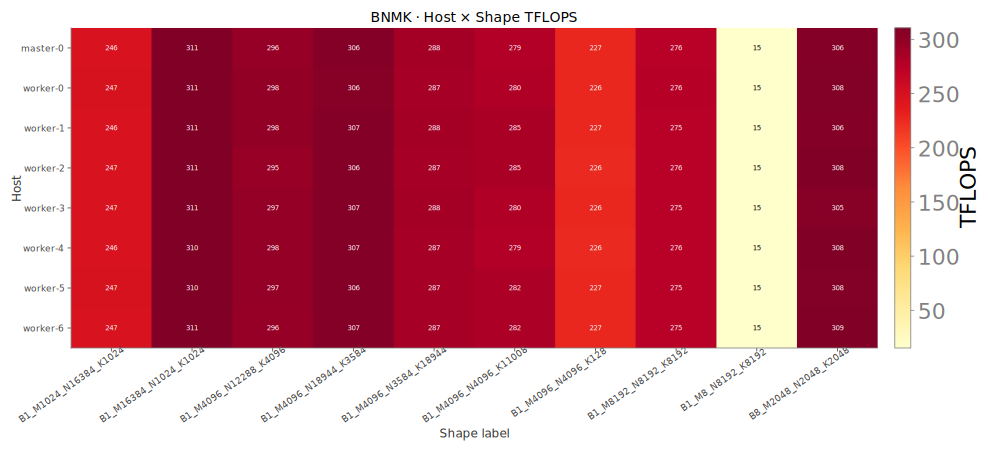
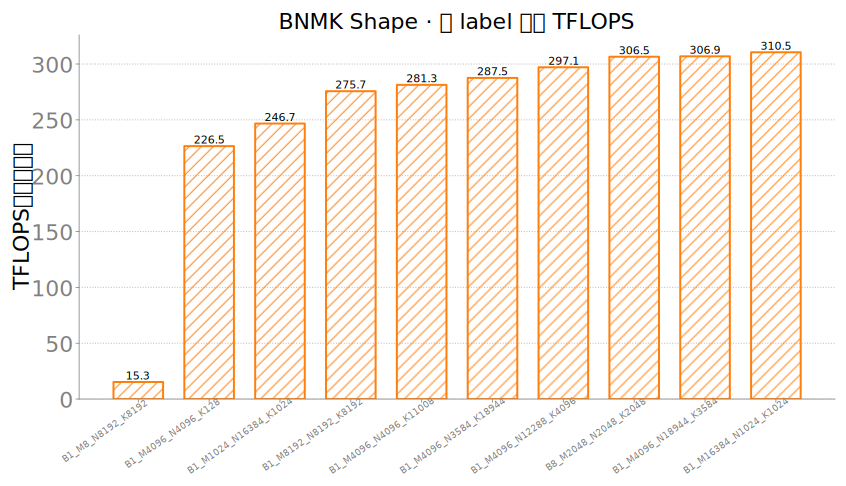
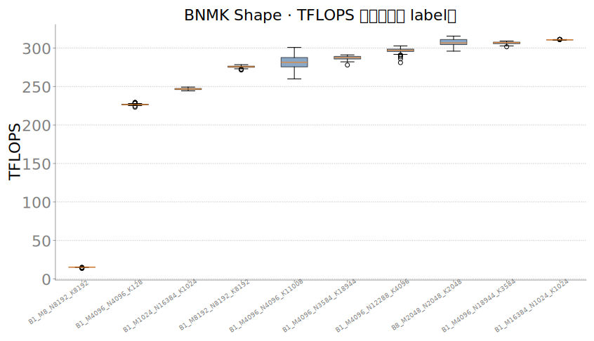

# BNMK · 20260711

**BNMK 是什么**：按显式 `(B,M,N,K)` 做 batched GEMM（`a[B,M,K]@b[B,K,N]`），FLOPs=`2·B·M·N·K`，得到训练层形状代理吞吐（TFLOPS，bf16）。明细 `record=gemm_bnmk_sample`；本批 10 个 shape × 128 卡 = 1280 样本。
底层：`gemm_bnmk_sweep`，NPU Event，每 shape 多窗取中位 tflops。

**bnmk_host_shape_heatmap.svg**：host×shape 的平均 TFLOPS（看某机某形状是否掉队）。

**bnmk_tflops_bar_median_by_label.svg**：每个 shape 的跨卡中位 TFLOPS。

**bnmk_tflops_box_by_label.svg**：每个 shape label 在 128 卡上的 TFLOPS 分布。

