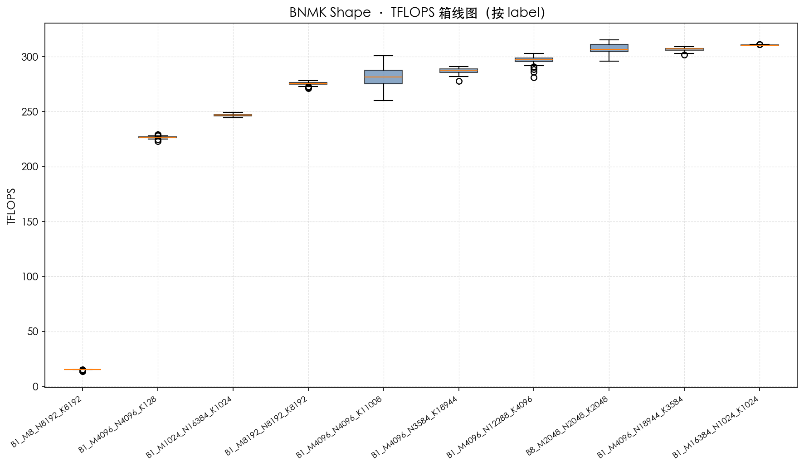
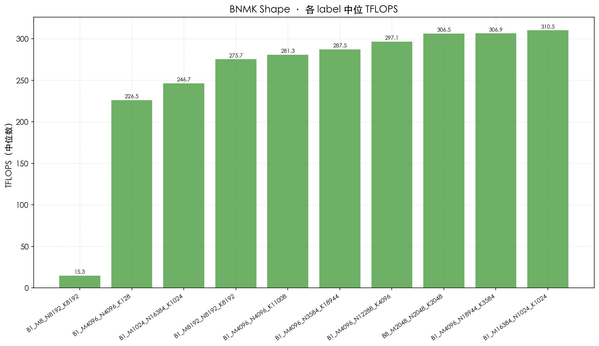
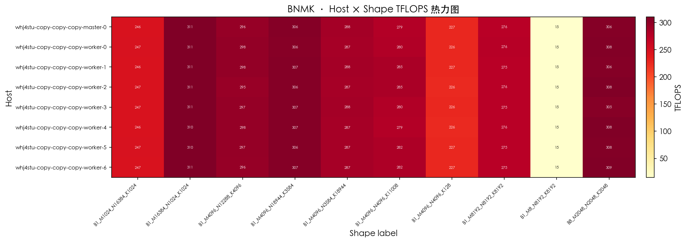

# BNMK Shape 报告 · 20260711

> 生成时间：2026-07-11 14:11
> 数据目录：`/Users/yinjinrun/random-thing/logs/card-fillgap-20260711_140301/results`

## 摘要

- 样本数：**2560**
- Shape 种类：**10**
- 节点数：**8**

## 各 Shape TFLOPS 统计

| Label | N | 中位数 | 均值 | 最小 | 最大 |
|-------|---|--------|------|------|------|
| B1_M1024_N16384_K1024 | 256 | 246.69 | 246.73 | 244.30 | 249.25 |
| B1_M16384_N1024_K1024 | 256 | 310.53 | 310.56 | 310.14 | 311.13 |
| B1_M4096_N12288_K4096 | 256 | 297.07 | 296.75 | 280.99 | 302.73 |
| B1_M4096_N18944_K3584 | 256 | 306.89 | 306.44 | 301.63 | 309.02 |
| B1_M4096_N3584_K18944 | 256 | 287.55 | 287.20 | 277.88 | 291.03 |
| B1_M4096_N4096_K11008 | 256 | 281.31 | 281.38 | 259.88 | 300.69 |
| B1_M4096_N4096_K128 | 256 | 226.49 | 226.62 | 223.03 | 229.35 |
| B1_M8192_N8192_K8192 | 256 | 275.68 | 275.56 | 271.39 | 278.38 |
| B1_M8_N8192_K8192 | 256 | 15.27 | 15.23 | 13.68 | 15.36 |
| B8_M2048_N2048_K2048 | 256 | 306.52 | 307.37 | 295.93 | 315.45 |

## 图表

### TFLOPS 箱线图（按 label）

### 各 label 中位 TFLOPS 柱状图

### Host × Shape 热力图

