# Card Constitution · 20260711

指标「是什么 / 底层 API」详见 [`METRIC_SEMANTICS_20260711.md`](METRIC_SEMANTICS_20260711.md)。
数据：`logs/card-fillgap-20260711_140301/results/constitution128.merged.jsonl`；job `whj4stu-copy-copy-copy` 8×16；`screen.py` + `config.constitution128.yaml`。

## 关键中位

| 字段 | 人话 | 中位 |
|---|---|---:|
| `func_tflops` | Cube GEMM | 292.4 |
| `sustained_tflops` | 稳态 Cube | 306.9 |
| `hbm_gbps` | HBM 带宽代理 | 1241 |
| `vector_gflops` | Vector FMA | 98.82 |
| `mte_gbps` | 纯 copy/MTE | 1268 |
| `health_power_w` | 健康功耗 | 167.9 |
| `power_w` | 负载末功耗 | 871.5 |

## 逐图（含义优先）

**`cube_vector_tflops`**（分 host 均值±σ）。本批中位≈**240.2**。**含义**：Cube GEMM + Vector epilogue（scale+bias）端到端吞吐（TFLOPS）。看 Cube→Vector 衔接。  **底层**：`c=a@b; c*scale+bias`；FLOPs=`2N³+3N²`；N=4096 bf16。数值通常低于纯 `func_tflops`。

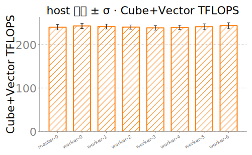

**`func_tflops`**（分 host 均值±σ）。本批中位≈**292.4**。**含义**：单卡 Cube 矩阵乘吞吐（TFLOPS）。测的是昇腾 Cube 主算力路径，越高说明方阵 GEMM 越强。  **底层**：torch 算子 `a@b`（bf16），FLOPs=`2·N³`，NPU Event 计时取中位；N=8192，warmup=20，iters=50。

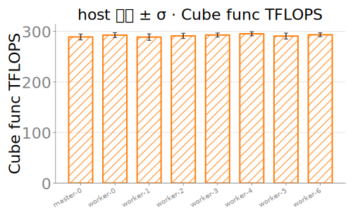

**`hbm_gbps`**（分 host 均值±σ）。本批中位≈**1241**。**含义**：HBM 有效带宽代理（GB/s）。反映高带宽内存读+写通路是否健康。  **底层**：设备侧大缓冲 `dst = src * 2.0`（fp32，含一次乘法，非纯 DMA）；流量按 R+W；Event 计时中位。默认 1024MB，w20/i50。

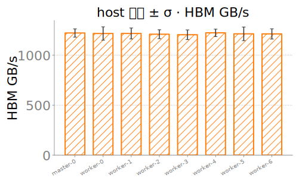

**`health_power_w`**（分 host 均值±σ）。本批中位≈**167.9**。**含义**：健康/轻载路径实时功耗（W），常近空闲。  **底层**：`npu-smi info -t power -i -c` → Real-time Power。**不要**和 `power_w`（负载末）直接相减当降频证据。

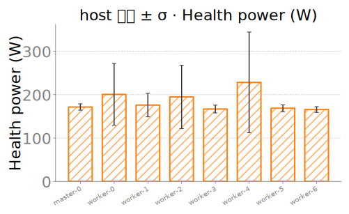

**`health_temp_c`**（分 host 均值±σ）。本批中位≈**40**。**含义**：健康/开测路径温度快照（°C）。  **底层**：`npu-smi info -t temp -i <card> -c <chip>` 解析。与负载中 board_temp **不同时刻**。

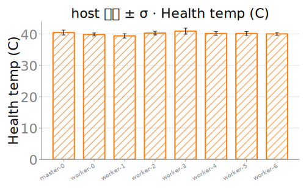

**`mte_gbps`**（分 host 均值±σ）。本批中位≈**1268**。**含义**：纯拷贝带宽（GB/s）。代理 MTE/DMA 搬运通路，用来拆「算发访存」vs「纯搬运」。  **底层**：`Tensor.copy_`；流量按 R+W；512MB；Event 中位。w20/i50。

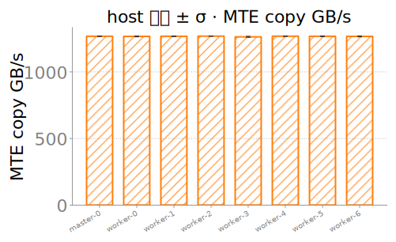

**`power_w`**（分 host 均值±σ）。本批中位≈**871.5**。**含义**：负载探针时段实时功耗（W），常为数百～近千瓦。  **底层**：`npu-smi -t power`；卡级取 vector_fma **末轮**。与 `health_power_w`（~百瓦级健康快照）工况不同。

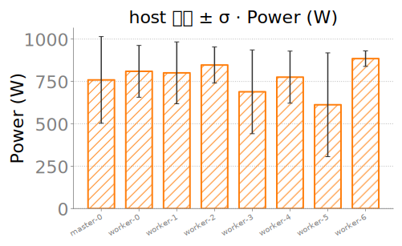

**`scalar_elems_per_s`**（分 host 均值±σ）。本批中位≈**2.799e+08**。**含义**：长依赖串行链吞吐（元素/秒）。更贴近 Scalar/控制流+同步，不是 SIMD 峰值。  **底层**：`torch.cumsum`；elems_per_s = elems/dt；16M fp32。量纲不是 GFLOPS，勿与 vector 直接比倍速。

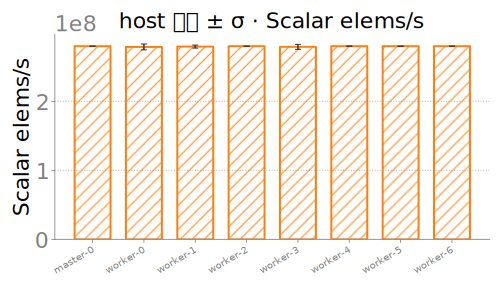

**`sfu_gflops`**（分 host 均值±σ）。本批中位≈**156.5**。**含义**：特殊函数单元吞吐。字段叫 gflops，实现按 1 op/元素计，实质是 Gops/s 量级。  **底层**：默认 `torch.exp(x)`；`gflops≈elems/dt/1e9`；64M fp32。与 SDC 正确性探针不是一回事。

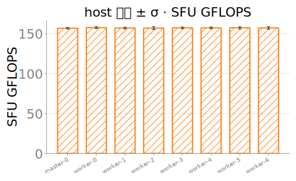

**`sustained_tflops`**（分 host 均值±σ）。本批中位≈**306.9**。**含义**：稳态 Cube 吞吐（TFLOPS）。连续烤机后的可持续算力，用来看降频/争用，不是瞬时峰值。  **底层**：循环 `a@b` 跑满 ~30s，每窗 50 次 GEMM 用 NPU Event 计时；**卡级字段取最后一个时间窗**（非中位）。N=8192 bf16。

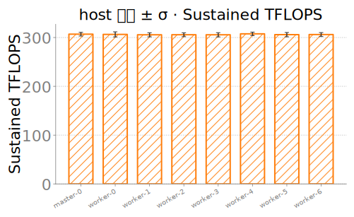

**`vector_gflops`**（分 host 均值±σ）。本批中位≈**98.82**。**含义**：Vector 单元 FMA 吞吐（GFLOPS）。代理 Ascend Vector 宽并行，不是 Cube。  **底层**：逐元素 `a*b+c`，按 2 flops/elem；64M 元素 fp32；NPU Event 中位。w20/i50。

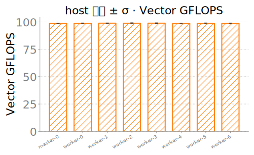

**`aicore_util_pct`**（分 host 箱线）。本批中位≈**92**。**含义**：AICore 利用率（%）。  **底层**：`npu-smi info -t usages`；卡级多为 vector_fma 末轮瞬时率，非 30s sustained 平均。

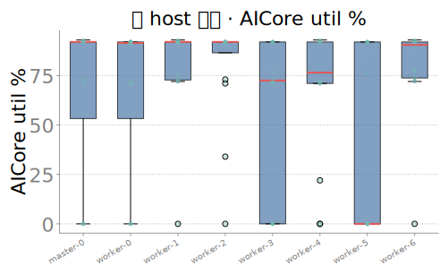

**`aicpu_util_pct`**（分 host 箱线）。本批中位≈**0**。**含义**：AICPU 利用率（%）。  **底层**：同上 `-t usages`。本批常全 0。

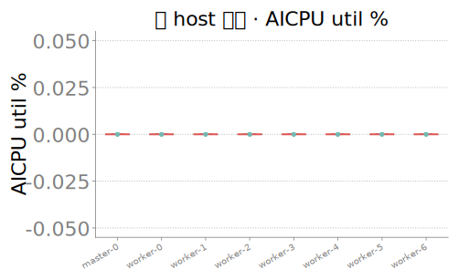

**`board_temp_c`**（分 host 箱线）。本批中位≈**66**。**含义**：板/NPU 温度（°C），取自负载遥测缓存。  **底层**：`npu-smi -t temp/board`；卡级常取 **vector_fma 探针末轮** 回填，不是 sustained 烤机峰值时刻。

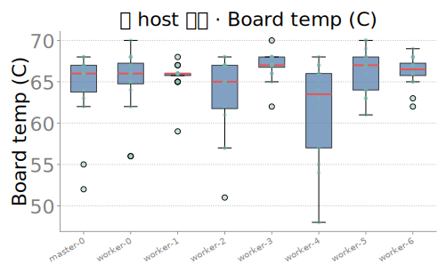

**`ctrlcpu_util_pct`**（分 host 箱线）。本批中位≈**7**。**含义**：CtrlCPU 利用率（%）。  **底层**：同上。

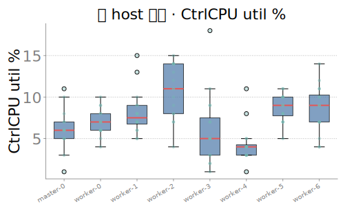

**`cube_vector_tflops`**（分 host 箱线）。本批中位≈**240.2**。**含义**：Cube GEMM + Vector epilogue（scale+bias）端到端吞吐（TFLOPS）。看 Cube→Vector 衔接。  **底层**：`c=a@b; c*scale+bias`；FLOPs=`2N³+3N²`；N=4096 bf16。数值通常低于纯 `func_tflops`。

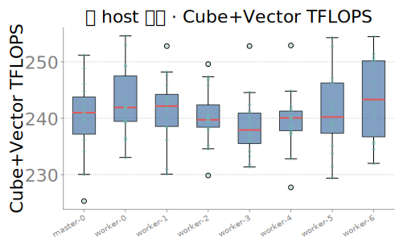

**`func_tflops`**（分 host 箱线）。本批中位≈**292.4**。**含义**：单卡 Cube 矩阵乘吞吐（TFLOPS）。测的是昇腾 Cube 主算力路径，越高说明方阵 GEMM 越强。  **底层**：torch 算子 `a@b`（bf16），FLOPs=`2·N³`，NPU Event 计时取中位；N=8192，warmup=20，iters=50。

**`hbm_gbps`**（分 host 箱线）。本批中位≈**1241**。**含义**：HBM 有效带宽代理（GB/s）。反映高带宽内存读+写通路是否健康。  **底层**：设备侧大缓冲 `dst = src * 2.0`（fp32，含一次乘法，非纯 DMA）；流量按 R+W；Event 计时中位。默认 1024MB，w20/i50。

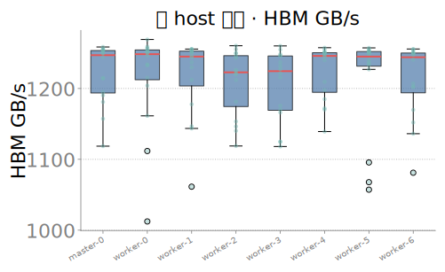

**`health_power_w`**（分 host 箱线）。本批中位≈**167.9**。**含义**：健康/轻载路径实时功耗（W），常近空闲。  **底层**：`npu-smi info -t power -i -c` → Real-time Power。**不要**和 `power_w`（负载末）直接相减当降频证据。

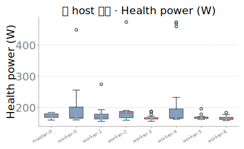

**`health_temp_c`**（分 host 箱线）。本批中位≈**40**。**含义**：健康/开测路径温度快照（°C）。  **底层**：`npu-smi info -t temp -i <card> -c <chip>` 解析。与负载中 board_temp **不同时刻**。

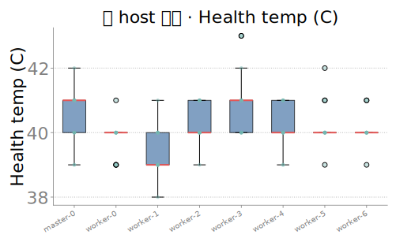

**`launch_burst_p50_us`**（分 host 箱线）。本批中位≈**472.5**。**含义**：连续 enqueue 64 个极小核后一次 sync 的总时延 p50（µs）。  **底层**：CPU 计时 burst；看队列深度下的发射成本。

**`launch_burst_per_kernel_p50_us`**（分 host 箱线）。本批中位≈**7.383**。**含义**：突发总时延 / 64，每核摊销 p50（µs）。  **底层**：由 burst 派生。

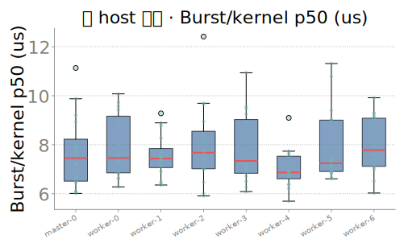

**`launch_host_overhead_p50_us`**（分 host 箱线）。本批中位≈**240.1**。**含义**：Host 侧发射开销 p50（µs）≈ wall − device event。  **底层**：极小核 add 的墙钟与 NPU Event 差分；需 timing_method=event 才有意义。

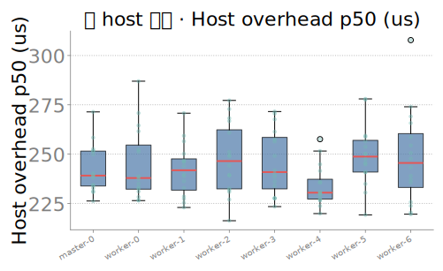

**`launch_host_overhead_p99_us`**（分 host 箱线）。本批中位≈**628.7**。**含义**：Host 发射开销 p99（µs）。  **底层**：同上。

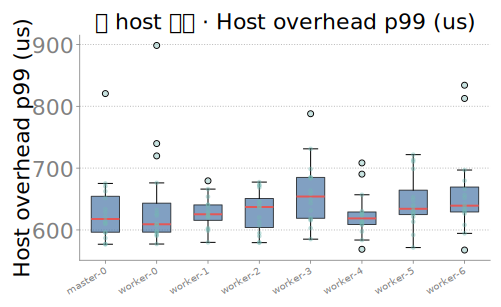

**`launch_sync_p50_us`**（分 host 箱线）。本批中位≈**6.069**。**含义**：空设备 `synchronize()` 往返延迟的 p50（µs）。反映驱动/设备响应基线。  **底层**：CPU `perf_counter` 包一层 `adapter.sync`；samples=500，warmup=50。与 kernel 发射无关。

**`launch_sync_p99_us`**（分 host 箱线）。本批中位≈**6.78**。**含义**：同上的 p99（µs）。看调度抖动尾延迟。  **底层**：同 launch_latency 探针。

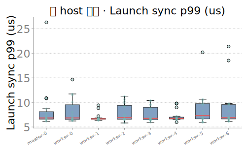

**`mem_bw_util_pct`**（分 host 箱线）。本批中位≈**18**。**含义**：HBM Bandwidth Usage Rate（%）。  **底层**：同上 `-t usages`；瞬时率。

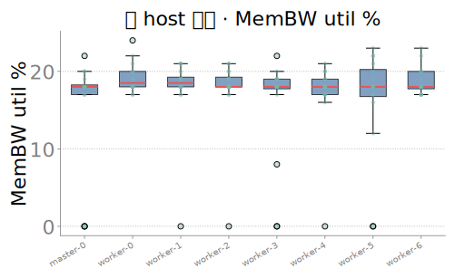

**`mte_gbps`**（分 host 箱线）。本批中位≈**1268**。**含义**：纯拷贝带宽（GB/s）。代理 MTE/DMA 搬运通路，用来拆「算发访存」vs「纯搬运」。  **底层**：`Tensor.copy_`；流量按 R+W；512MB；Event 中位。w20/i50。

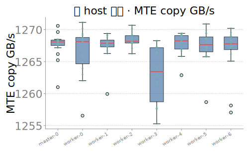

**`power_w`**（分 host 箱线）。本批中位≈**871.5**。**含义**：负载探针时段实时功耗（W），常为数百～近千瓦。  **底层**：`npu-smi -t power`；卡级取 vector_fma **末轮**。与 `health_power_w`（~百瓦级健康快照）工况不同。

**`scalar_elems_per_s`**（分 host 箱线）。本批中位≈**2.799e+08**。**含义**：长依赖串行链吞吐（元素/秒）。更贴近 Scalar/控制流+同步，不是 SIMD 峰值。  **底层**：`torch.cumsum`；elems_per_s = elems/dt；16M fp32。量纲不是 GFLOPS，勿与 vector 直接比倍速。

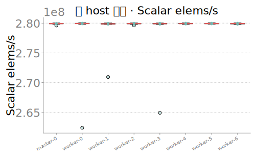

**`sfu_gflops`**（分 host 箱线）。本批中位≈**156.5**。**含义**：特殊函数单元吞吐。字段叫 gflops，实现按 1 op/元素计，实质是 Gops/s 量级。  **底层**：默认 `torch.exp(x)`；`gflops≈elems/dt/1e9`；64M fp32。与 SDC 正确性探针不是一回事。

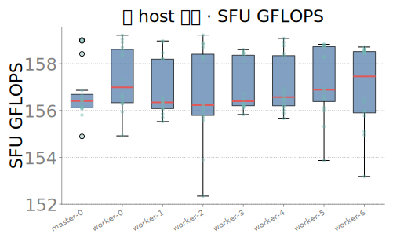

**`shape_sweep_peak_tflops`**（分 host 箱线）。本批中位≈**310.7**。**含义**：名义「shape sweep 峰值」，本批实际是 **BNMK 各形状中位吞吐的最大值**。  **底层**：constitution128 关闭方阵 shape_sweep、开启 bnmk_sweep；`jsonl.py` 用 max(BNMK tflops) 回填此键。

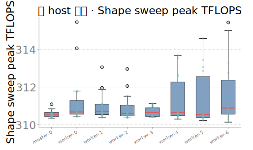

**`sustained_tflops`**（分 host 箱线）。本批中位≈**306.9**。**含义**：稳态 Cube 吞吐（TFLOPS）。连续烤机后的可持续算力，用来看降频/争用，不是瞬时峰值。  **底层**：循环 `a@b` 跑满 ~30s，每窗 50 次 GEMM 用 NPU Event 计时；**卡级字段取最后一个时间窗**（非中位）。N=8192 bf16。

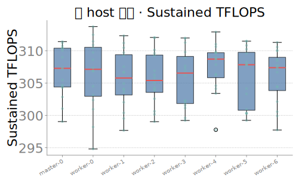

**`vector_gflops`**（分 host 箱线）。本批中位≈**98.82**。**含义**：Vector 单元 FMA 吞吐（GFLOPS）。代理 Ascend Vector 宽并行，不是 Cube。  **底层**：逐元素 `a*b+c`，按 2 flops/elem；64M 元素 fp32；NPU Event 中位。w20/i50。

多指标全集群箱线总览；各轴字段含义见上表与语义手册。

**`aicore_util_pct`**（host×device 相对集群中位偏差%（|Δ|≥1% 才标数））。本批中位≈**92**。**含义**：AICore 利用率（%）。  **底层**：`npu-smi info -t usages`；卡级多为 vector_fma 末轮瞬时率，非 30s sustained 平均。

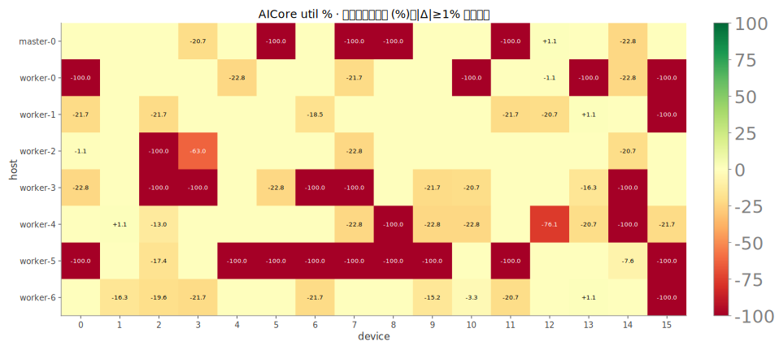

**`aicpu_util_pct`**（host×device 相对集群中位偏差%（|Δ|≥1% 才标数））。本批中位≈**0**。**含义**：AICPU 利用率（%）。  **底层**：同上 `-t usages`。本批常全 0。

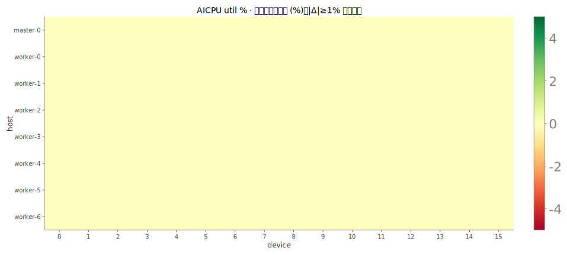

**`board_temp_c`**（host×device 相对集群中位偏差%（|Δ|≥1% 才标数））。本批中位≈**66**。**含义**：板/NPU 温度（°C），取自负载遥测缓存。  **底层**：`npu-smi -t temp/board`；卡级常取 **vector_fma 探针末轮** 回填，不是 sustained 烤机峰值时刻。

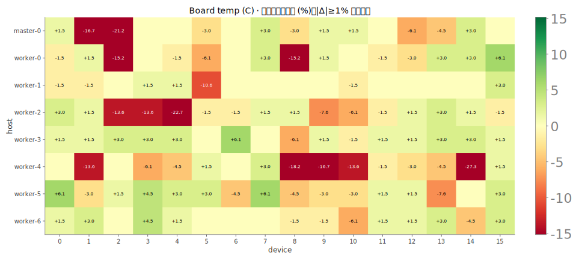

**`ctrlcpu_util_pct`**（host×device 相对集群中位偏差%（|Δ|≥1% 才标数））。本批中位≈**7**。**含义**：CtrlCPU 利用率（%）。  **底层**：同上。

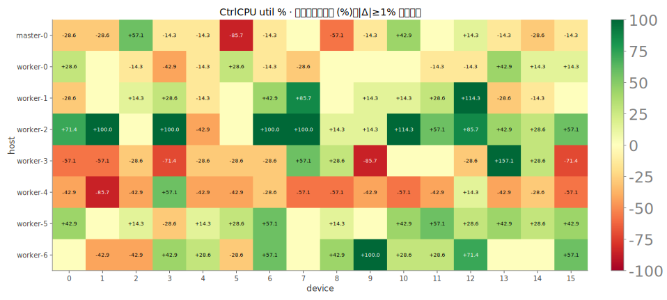

**`cube_vector_tflops`**（host×device 相对集群中位偏差%（|Δ|≥1% 才标数））。本批中位≈**240.2**。**含义**：Cube GEMM + Vector epilogue（scale+bias）端到端吞吐（TFLOPS）。看 Cube→Vector 衔接。  **底层**：`c=a@b; c*scale+bias`；FLOPs=`2N³+3N²`；N=4096 bf16。数值通常低于纯 `func_tflops`。

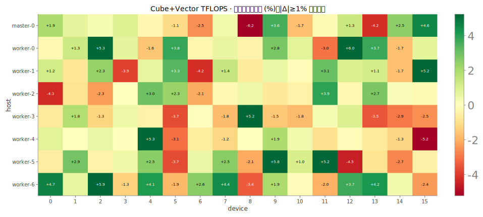

**`func_tflops`**（host×device 相对集群中位偏差%（|Δ|≥1% 才标数））。本批中位≈**292.4**。**含义**：单卡 Cube 矩阵乘吞吐（TFLOPS）。测的是昇腾 Cube 主算力路径，越高说明方阵 GEMM 越强。  **底层**：torch 算子 `a@b`（bf16），FLOPs=`2·N³`，NPU Event 计时取中位；N=8192，warmup=20，iters=50。

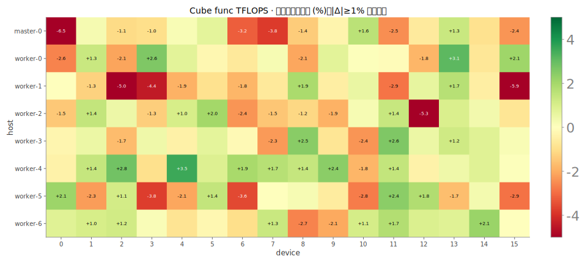

**`hbm_gbps`**（host×device 相对集群中位偏差%（|Δ|≥1% 才标数））。本批中位≈**1241**。**含义**：HBM 有效带宽代理（GB/s）。反映高带宽内存读+写通路是否健康。  **底层**：设备侧大缓冲 `dst = src * 2.0`（fp32，含一次乘法，非纯 DMA）；流量按 R+W；Event 计时中位。默认 1024MB，w20/i50。

**`health_power_w`**（host×device 相对集群中位偏差%（|Δ|≥1% 才标数））。本批中位≈**167.9**。**含义**：健康/轻载路径实时功耗（W），常近空闲。  **底层**：`npu-smi info -t power -i -c` → Real-time Power。**不要**和 `power_w`（负载末）直接相减当降频证据。

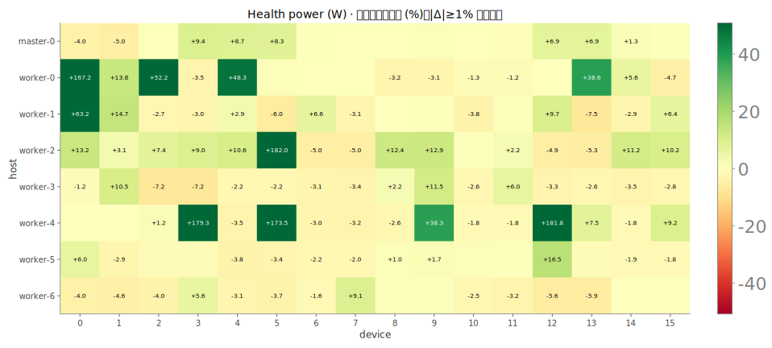

**`health_temp_c`**（host×device 相对集群中位偏差%（|Δ|≥1% 才标数））。本批中位≈**40**。**含义**：健康/开测路径温度快照（°C）。  **底层**：`npu-smi info -t temp -i <card> -c <chip>` 解析。与负载中 board_temp **不同时刻**。

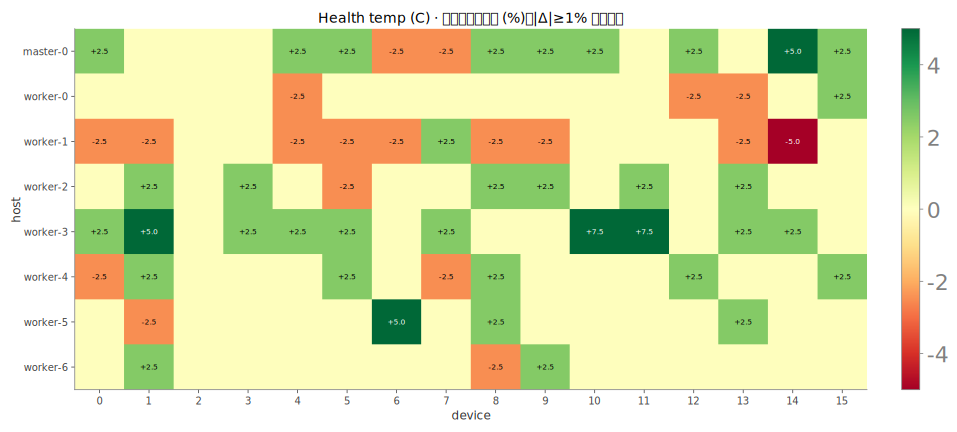

**`launch_burst_p50_us`**（host×device 相对集群中位偏差%（|Δ|≥1% 才标数））。本批中位≈**472.5**。**含义**：连续 enqueue 64 个极小核后一次 sync 的总时延 p50（µs）。  **底层**：CPU 计时 burst；看队列深度下的发射成本。

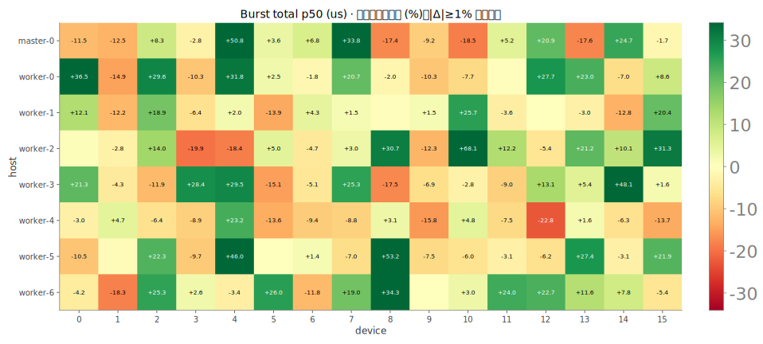

**`launch_burst_per_kernel_p50_us`**（host×device 相对集群中位偏差%（|Δ|≥1% 才标数））。本批中位≈**7.383**。**含义**：突发总时延 / 64，每核摊销 p50（µs）。  **底层**：由 burst 派生。

**`launch_host_overhead_p50_us`**（host×device 相对集群中位偏差%（|Δ|≥1% 才标数））。本批中位≈**240.1**。**含义**：Host 侧发射开销 p50（µs）≈ wall − device event。  **底层**：极小核 add 的墙钟与 NPU Event 差分；需 timing_method=event 才有意义。

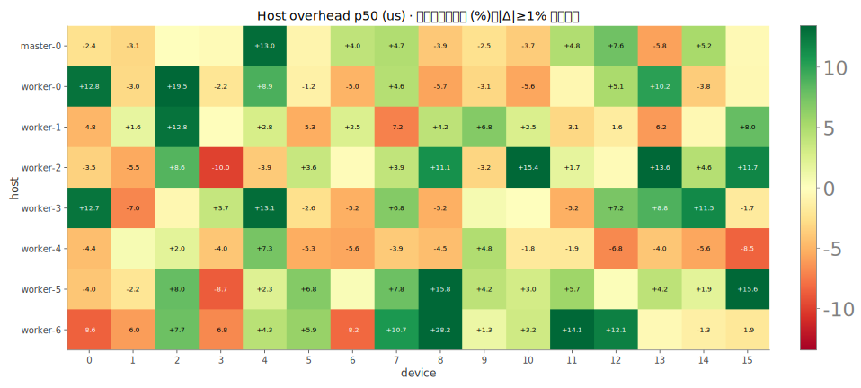

**`launch_host_overhead_p99_us`**（host×device 相对集群中位偏差%（|Δ|≥1% 才标数））。本批中位≈**628.7**。**含义**：Host 发射开销 p99（µs）。  **底层**：同上。

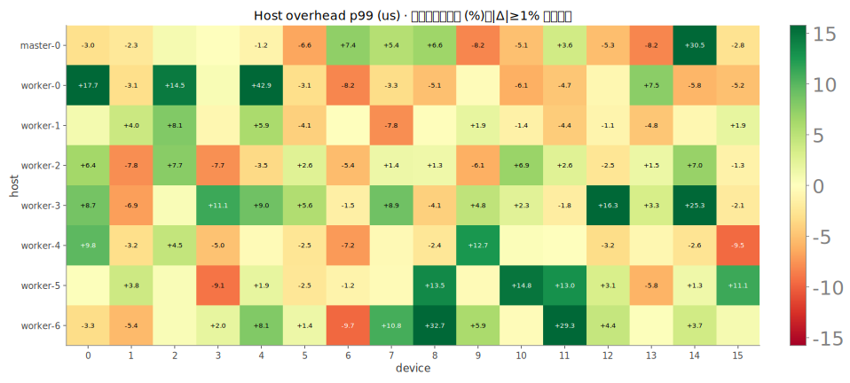

**`launch_sync_p50_us`**（host×device 相对集群中位偏差%（|Δ|≥1% 才标数））。本批中位≈**6.069**。**含义**：空设备 `synchronize()` 往返延迟的 p50（µs）。反映驱动/设备响应基线。  **底层**：CPU `perf_counter` 包一层 `adapter.sync`；samples=500，warmup=50。与 kernel 发射无关。

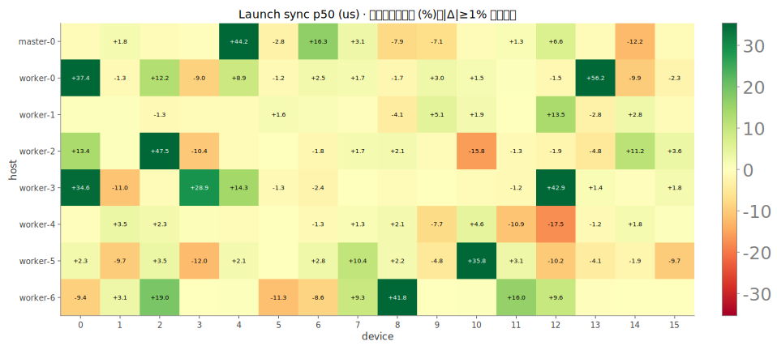

**`launch_sync_p99_us`**（host×device 相对集群中位偏差%（|Δ|≥1% 才标数））。本批中位≈**6.78**。**含义**：同上的 p99（µs）。看调度抖动尾延迟。  **底层**：同 launch_latency 探针。

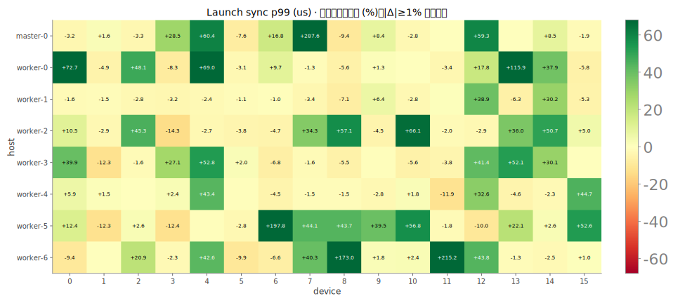

**`mem_bw_util_pct`**（host×device 相对集群中位偏差%（|Δ|≥1% 才标数））。本批中位≈**18**。**含义**：HBM Bandwidth Usage Rate（%）。  **底层**：同上 `-t usages`；瞬时率。

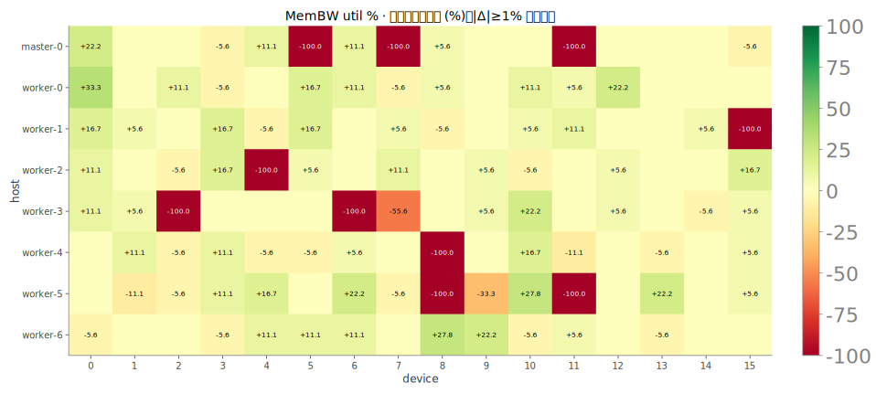

**`mte_gbps`**（host×device 相对集群中位偏差%（|Δ|≥1% 才标数））。本批中位≈**1268**。**含义**：纯拷贝带宽（GB/s）。代理 MTE/DMA 搬运通路，用来拆「算发访存」vs「纯搬运」。  **底层**：`Tensor.copy_`；流量按 R+W；512MB；Event 中位。w20/i50。

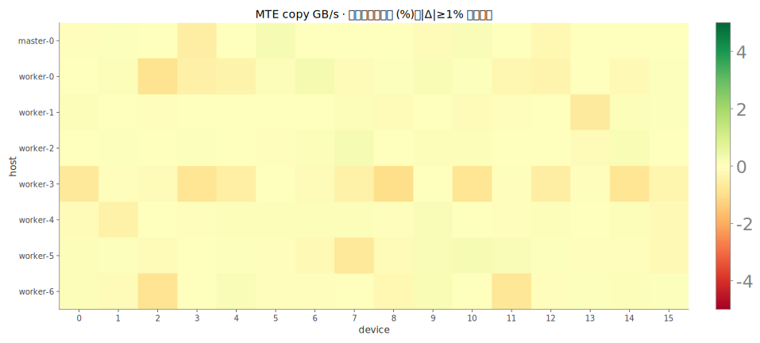

**`power_w`**（host×device 相对集群中位偏差%（|Δ|≥1% 才标数））。本批中位≈**871.5**。**含义**：负载探针时段实时功耗（W），常为数百～近千瓦。  **底层**：`npu-smi -t power`；卡级取 vector_fma **末轮**。与 `health_power_w`（~百瓦级健康快照）工况不同。

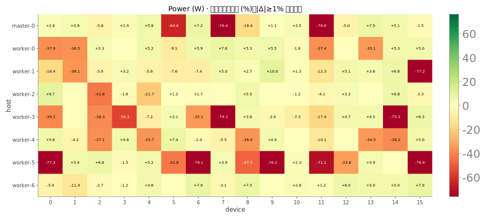

**`scalar_elems_per_s`**（host×device 相对集群中位偏差%（|Δ|≥1% 才标数））。本批中位≈**2.799e+08**。**含义**：长依赖串行链吞吐（元素/秒）。更贴近 Scalar/控制流+同步，不是 SIMD 峰值。  **底层**：`torch.cumsum`；elems_per_s = elems/dt；16M fp32。量纲不是 GFLOPS，勿与 vector 直接比倍速。

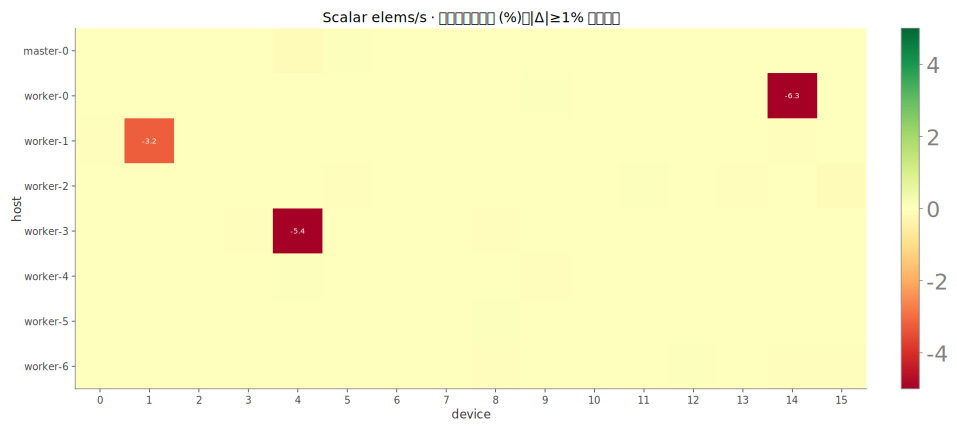

**`sfu_gflops`**（host×device 相对集群中位偏差%（|Δ|≥1% 才标数））。本批中位≈**156.5**。**含义**：特殊函数单元吞吐。字段叫 gflops，实现按 1 op/元素计，实质是 Gops/s 量级。  **底层**：默认 `torch.exp(x)`；`gflops≈elems/dt/1e9`；64M fp32。与 SDC 正确性探针不是一回事。

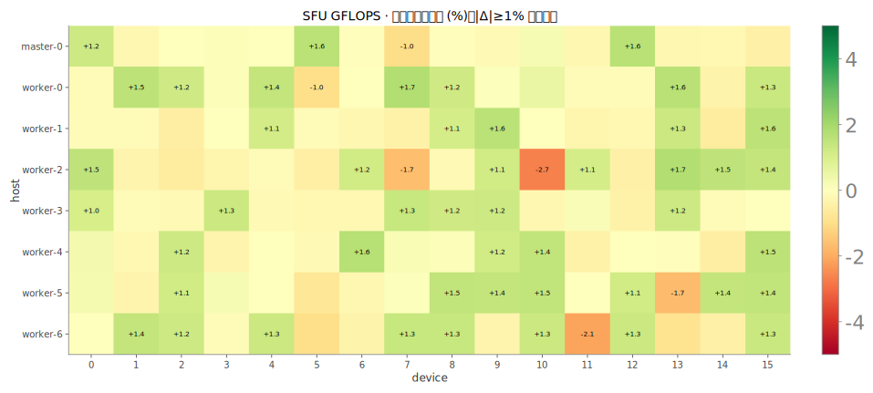

**`shape_sweep_peak_tflops`**（host×device 相对集群中位偏差%（|Δ|≥1% 才标数））。本批中位≈**310.7**。**含义**：名义「shape sweep 峰值」，本批实际是 **BNMK 各形状中位吞吐的最大值**。  **底层**：constitution128 关闭方阵 shape_sweep、开启 bnmk_sweep；`jsonl.py` 用 max(BNMK tflops) 回填此键。

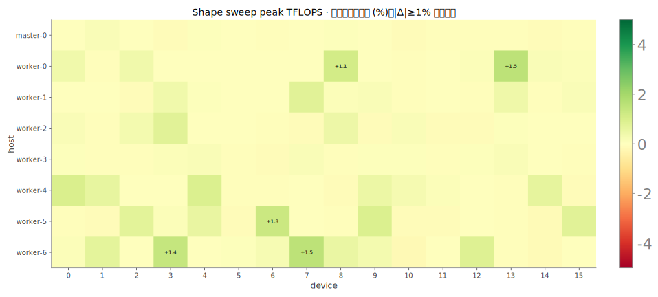

**`sustained_tflops`**（host×device 相对集群中位偏差%（|Δ|≥1% 才标数））。本批中位≈**306.9**。**含义**：稳态 Cube 吞吐（TFLOPS）。连续烤机后的可持续算力，用来看降频/争用，不是瞬时峰值。  **底层**：循环 `a@b` 跑满 ~30s，每窗 50 次 GEMM 用 NPU Event 计时；**卡级字段取最后一个时间窗**（非中位）。N=8192 bf16。

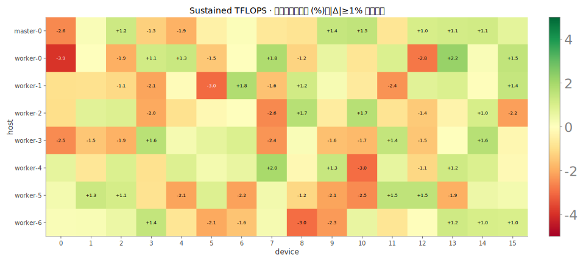

**`vector_gflops`**（host×device 相对集群中位偏差%（|Δ|≥1% 才标数））。本批中位≈**98.82**。**含义**：Vector 单元 FMA 吞吐（GFLOPS）。代理 Ascend Vector 宽并行，不是 Cube。  **底层**：逐元素 `a*b+c`，按 2 flops/elem；64M 元素 fp32；NPU Event 中位。w20/i50。

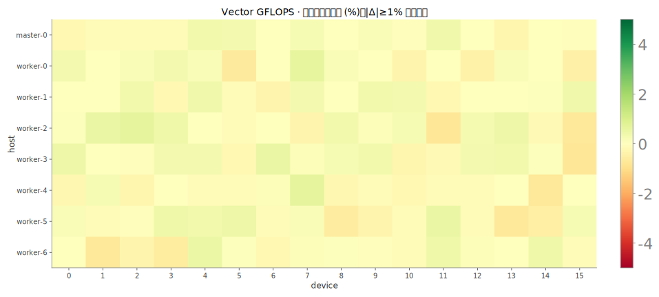

**`aicore_util_pct`**（全卡分布）。本批中位≈**92**。**含义**：AICore 利用率（%）。  **底层**：`npu-smi info -t usages`；卡级多为 vector_fma 末轮瞬时率，非 30s sustained 平均。

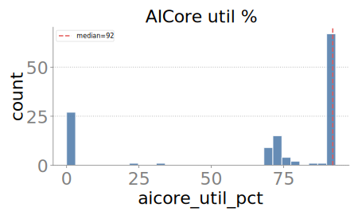

**`aicpu_util_pct`**（全卡分布）。本批中位≈**0**。**含义**：AICPU 利用率（%）。  **底层**：同上 `-t usages`。本批常全 0。

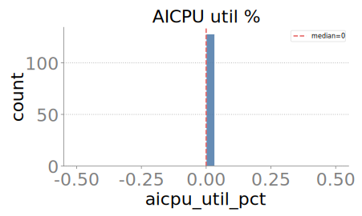

**`board_temp_c`**（全卡分布）。本批中位≈**66**。**含义**：板/NPU 温度（°C），取自负载遥测缓存。  **底层**：`npu-smi -t temp/board`；卡级常取 **vector_fma 探针末轮** 回填，不是 sustained 烤机峰值时刻。

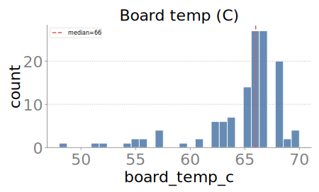

**`ctrlcpu_util_pct`**（全卡分布）。本批中位≈**7**。**含义**：CtrlCPU 利用率（%）。  **底层**：同上。

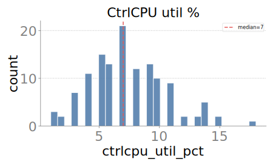

**`cube_vector_tflops`**（全卡分布）。本批中位≈**240.2**。**含义**：Cube GEMM + Vector epilogue（scale+bias）端到端吞吐（TFLOPS）。看 Cube→Vector 衔接。  **底层**：`c=a@b; c*scale+bias`；FLOPs=`2N³+3N²`；N=4096 bf16。数值通常低于纯 `func_tflops`。

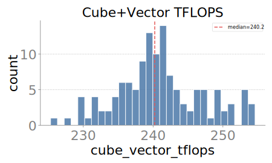

**`func_tflops`**（全卡分布）。本批中位≈**292.4**。**含义**：单卡 Cube 矩阵乘吞吐（TFLOPS）。测的是昇腾 Cube 主算力路径，越高说明方阵 GEMM 越强。  **底层**：torch 算子 `a@b`（bf16），FLOPs=`2·N³`，NPU Event 计时取中位；N=8192，warmup=20，iters=50。

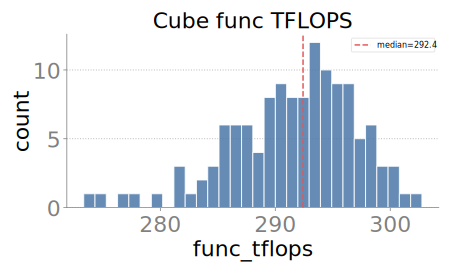

**`hbm_gbps`**（全卡分布）。本批中位≈**1241**。**含义**：HBM 有效带宽代理（GB/s）。反映高带宽内存读+写通路是否健康。  **底层**：设备侧大缓冲 `dst = src * 2.0`（fp32，含一次乘法，非纯 DMA）；流量按 R+W；Event 计时中位。默认 1024MB，w20/i50。

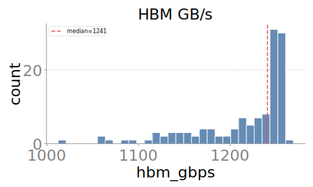

**`health_power_w`**（全卡分布）。本批中位≈**167.9**。**含义**：健康/轻载路径实时功耗（W），常近空闲。  **底层**：`npu-smi info -t power -i -c` → Real-time Power。**不要**和 `power_w`（负载末）直接相减当降频证据。

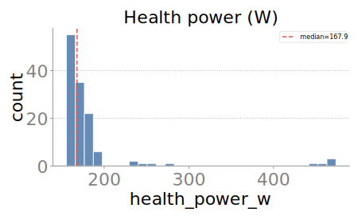

**`health_temp_c`**（全卡分布）。本批中位≈**40**。**含义**：健康/开测路径温度快照（°C）。  **底层**：`npu-smi info -t temp -i <card> -c <chip>` 解析。与负载中 board_temp **不同时刻**。

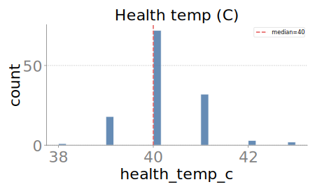

**`launch_burst_p50_us`**（全卡分布）。本批中位≈**472.5**。**含义**：连续 enqueue 64 个极小核后一次 sync 的总时延 p50（µs）。  **底层**：CPU 计时 burst；看队列深度下的发射成本。

**`launch_burst_per_kernel_p50_us`**（全卡分布）。本批中位≈**7.383**。**含义**：突发总时延 / 64，每核摊销 p50（µs）。  **底层**：由 burst 派生。

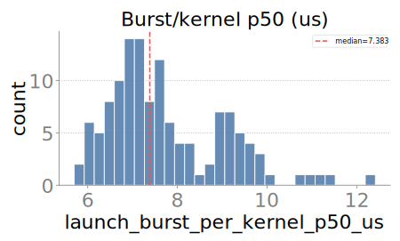

**`launch_host_overhead_p50_us`**（全卡分布）。本批中位≈**240.1**。**含义**：Host 侧发射开销 p50（µs）≈ wall − device event。  **底层**：极小核 add 的墙钟与 NPU Event 差分；需 timing_method=event 才有意义。

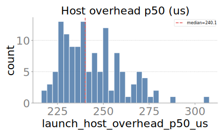

**`launch_host_overhead_p99_us`**（全卡分布）。本批中位≈**628.7**。**含义**：Host 发射开销 p99（µs）。  **底层**：同上。

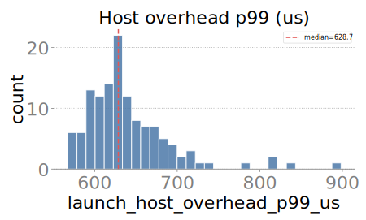

**`launch_sync_p50_us`**（全卡分布）。本批中位≈**6.069**。**含义**：空设备 `synchronize()` 往返延迟的 p50（µs）。反映驱动/设备响应基线。  **底层**：CPU `perf_counter` 包一层 `adapter.sync`；samples=500，warmup=50。与 kernel 发射无关。

**`launch_sync_p99_us`**（全卡分布）。本批中位≈**6.78**。**含义**：同上的 p99（µs）。看调度抖动尾延迟。  **底层**：同 launch_latency 探针。

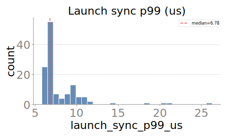

**`mem_bw_util_pct`**（全卡分布）。本批中位≈**18**。**含义**：HBM Bandwidth Usage Rate（%）。  **底层**：同上 `-t usages`；瞬时率。

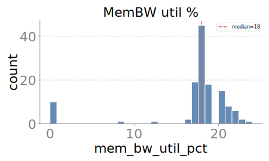

**`mte_gbps`**（全卡分布）。本批中位≈**1268**。**含义**：纯拷贝带宽（GB/s）。代理 MTE/DMA 搬运通路，用来拆「算发访存」vs「纯搬运」。  **底层**：`Tensor.copy_`；流量按 R+W；512MB；Event 中位。w20/i50。

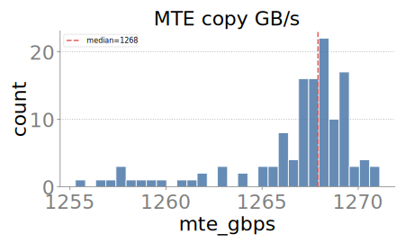

**`power_w`**（全卡分布）。本批中位≈**871.5**。**含义**：负载探针时段实时功耗（W），常为数百～近千瓦。  **底层**：`npu-smi -t power`；卡级取 vector_fma **末轮**。与 `health_power_w`（~百瓦级健康快照）工况不同。

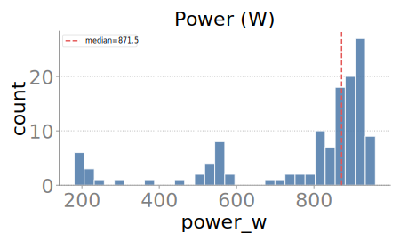

**`scalar_elems_per_s`**（全卡分布）。本批中位≈**2.799e+08**。**含义**：长依赖串行链吞吐（元素/秒）。更贴近 Scalar/控制流+同步，不是 SIMD 峰值。  **底层**：`torch.cumsum`；elems_per_s = elems/dt；16M fp32。量纲不是 GFLOPS，勿与 vector 直接比倍速。

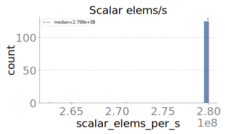

**`sfu_gflops`**（全卡分布）。本批中位≈**156.5**。**含义**：特殊函数单元吞吐。字段叫 gflops，实现按 1 op/元素计，实质是 Gops/s 量级。  **底层**：默认 `torch.exp(x)`；`gflops≈elems/dt/1e9`；64M fp32。与 SDC 正确性探针不是一回事。

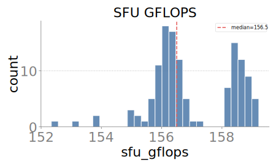

**`shape_sweep_peak_tflops`**（全卡分布）。本批中位≈**310.7**。**含义**：名义「shape sweep 峰值」，本批实际是 **BNMK 各形状中位吞吐的最大值**。  **底层**：constitution128 关闭方阵 shape_sweep、开启 bnmk_sweep；`jsonl.py` 用 max(BNMK tflops) 回填此键。

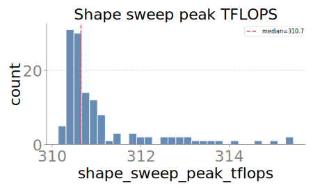

**`sustained_tflops`**（全卡分布）。本批中位≈**306.9**。**含义**：稳态 Cube 吞吐（TFLOPS）。连续烤机后的可持续算力，用来看降频/争用，不是瞬时峰值。  **底层**：循环 `a@b` 跑满 ~30s，每窗 50 次 GEMM 用 NPU Event 计时；**卡级字段取最后一个时间窗**（非中位）。N=8192 bf16。

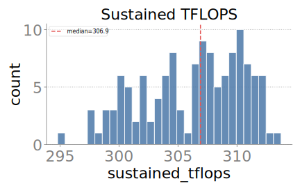

**`vector_gflops`**（全卡分布）。本批中位≈**98.82**。**含义**：Vector 单元 FMA 吞吐（GFLOPS）。代理 Ascend Vector 宽并行，不是 Cube。  **底层**：逐元素 `a*b+c`，按 2 flops/elem；64M 元素 fp32；NPU Event 中位。w20/i50。

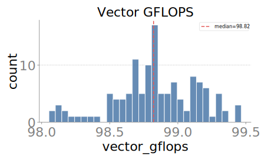

横轴 `func_tflops`，纵轴 `vector_gflops`（每卡一点）。**含义**：单卡 Cube 矩阵乘吞吐（TFLOPS）。测的是昇腾 Cube 主算力路径，越高说明方阵 GEMM 越强。  **底层**：torch 算子 `a@b`（bf16），FLOPs=`2·N³`，NPU Event 计时取中位；N=8192，warmup=20，iters=50。 **含义**：Vector 单元 FMA 吞吐（GFLOPS）。代理 Ascend Vector 宽并行，不是 Cube。  **底层**：逐元素 `a*b+c`，按 2 flops/elem；64M 元素 fp32；NPU Event 中位。w20/i50。

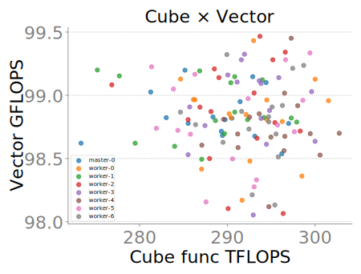

横轴 `hbm_gbps`，纵轴 `mte_gbps`（每卡一点）。**含义**：HBM 有效带宽代理（GB/s）。反映高带宽内存读+写通路是否健康。  **底层**：设备侧大缓冲 `dst = src * 2.0`（fp32，含一次乘法，非纯 DMA）；流量按 R+W；Event 计时中位。默认 1024MB，w20/i50。 **含义**：纯拷贝带宽（GB/s）。代理 MTE/DMA 搬运通路，用来拆「算发访存」vs「纯搬运」。  **底层**：`Tensor.copy_`；流量按 R+W；512MB；Event 中位。w20/i50。

横轴 `health_power_w`，纵轴 `func_tflops`（每卡一点）。**含义**：健康/轻载路径实时功耗（W），常近空闲。  **底层**：`npu-smi info -t power -i -c` → Real-time Power。**不要**和 `power_w`（负载末）直接相减当降频证据。 **含义**：单卡 Cube 矩阵乘吞吐（TFLOPS）。测的是昇腾 Cube 主算力路径，越高说明方阵 GEMM 越强。  **底层**：torch 算子 `a@b`（bf16），FLOPs=`2·N³`，NPU Event 计时取中位；N=8192，warmup=20，iters=50。

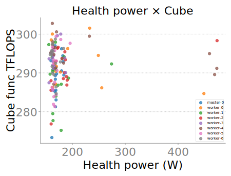

横轴 `health_power_w`，纵轴 `hbm_gbps`（每卡一点）。**含义**：健康/轻载路径实时功耗（W），常近空闲。  **底层**：`npu-smi info -t power -i -c` → Real-time Power。**不要**和 `power_w`（负载末）直接相减当降频证据。 **含义**：HBM 有效带宽代理（GB/s）。反映高带宽内存读+写通路是否健康。  **底层**：设备侧大缓冲 `dst = src * 2.0`（fp32，含一次乘法，非纯 DMA）；流量按 R+W；Event 计时中位。默认 1024MB，w20/i50。

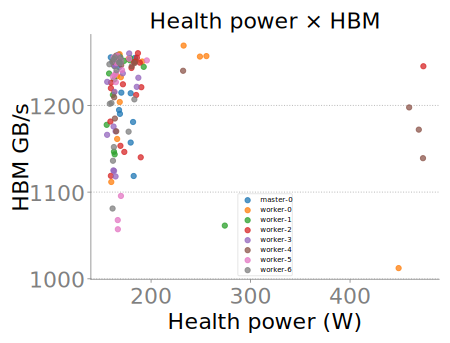

横轴 `launch_host_overhead_p50_us`，纵轴 `ctrlcpu_util_pct`（每卡一点）。**含义**：Host 侧发射开销 p50（µs）≈ wall − device event。  **底层**：极小核 add 的墙钟与 NPU Event 差分；需 timing_method=event 才有意义。 **含义**：CtrlCPU 利用率（%）。  **底层**：同上。

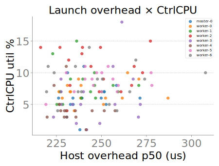

横轴 `power_w`，纵轴 `func_tflops`（每卡一点）。**含义**：负载探针时段实时功耗（W），常为数百～近千瓦。  **底层**：`npu-smi -t power`；卡级取 vector_fma **末轮**。与 `health_power_w`（~百瓦级健康快照）工况不同。 **含义**：单卡 Cube 矩阵乘吞吐（TFLOPS）。测的是昇腾 Cube 主算力路径，越高说明方阵 GEMM 越强。  **底层**：torch 算子 `a@b`（bf16），FLOPs=`2·N³`，NPU Event 计时取中位；N=8192，warmup=20，iters=50。

横轴 `power_w`，纵轴 `hbm_gbps`（每卡一点）。**含义**：负载探针时段实时功耗（W），常为数百～近千瓦。  **底层**：`npu-smi -t power`；卡级取 vector_fma **末轮**。与 `health_power_w`（~百瓦级健康快照）工况不同。 **含义**：HBM 有效带宽代理（GB/s）。反映高带宽内存读+写通路是否健康。  **底层**：设备侧大缓冲 `dst = src * 2.0`（fp32，含一次乘法，非纯 DMA）；流量按 R+W；Event 计时中位。默认 1024MB，w20/i50。

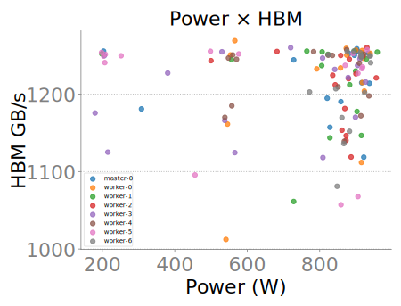

**`aicore_util_pct`**（单卡升序一览）。本批中位≈**92**。**含义**：AICore 利用率（%）。  **底层**：`npu-smi info -t usages`；卡级多为 vector_fma 末轮瞬时率，非 30s sustained 平均。

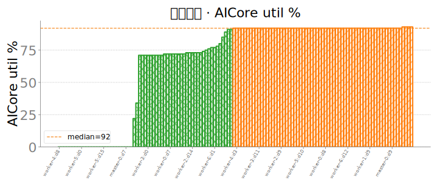

**`aicpu_util_pct`**（单卡升序一览）。本批中位≈**0**。**含义**：AICPU 利用率（%）。  **底层**：同上 `-t usages`。本批常全 0。

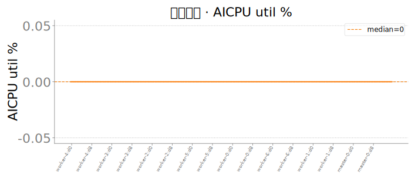

**`board_temp_c`**（单卡升序一览）。本批中位≈**66**。**含义**：板/NPU 温度（°C），取自负载遥测缓存。  **底层**：`npu-smi -t temp/board`；卡级常取 **vector_fma 探针末轮** 回填，不是 sustained 烤机峰值时刻。

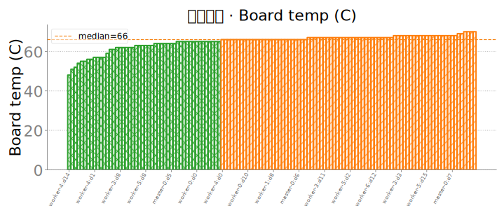

**`ctrlcpu_util_pct`**（单卡升序一览）。本批中位≈**7**。**含义**：CtrlCPU 利用率（%）。  **底层**：同上。

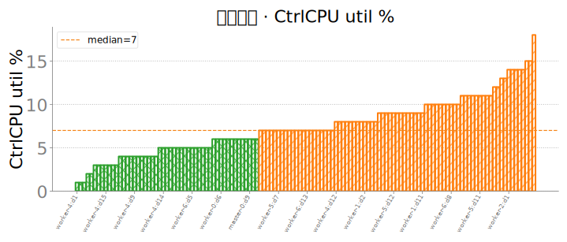

**`cube_vector_tflops`**（单卡升序一览）。本批中位≈**240.2**。**含义**：Cube GEMM + Vector epilogue（scale+bias）端到端吞吐（TFLOPS）。看 Cube→Vector 衔接。  **底层**：`c=a@b; c*scale+bias`；FLOPs=`2N³+3N²`；N=4096 bf16。数值通常低于纯 `func_tflops`。

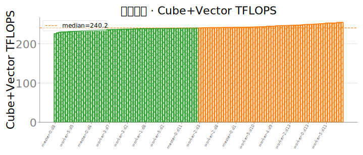

**`func_tflops`**（单卡升序一览）。本批中位≈**292.4**。**含义**：单卡 Cube 矩阵乘吞吐（TFLOPS）。测的是昇腾 Cube 主算力路径，越高说明方阵 GEMM 越强。  **底层**：torch 算子 `a@b`（bf16），FLOPs=`2·N³`，NPU Event 计时取中位；N=8192，warmup=20，iters=50。

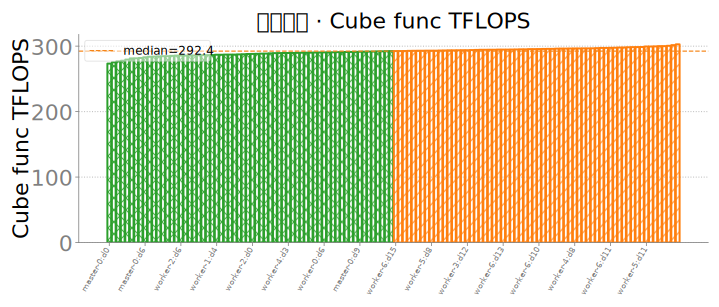

**`hbm_gbps`**（单卡升序一览）。本批中位≈**1241**。**含义**：HBM 有效带宽代理（GB/s）。反映高带宽内存读+写通路是否健康。  **底层**：设备侧大缓冲 `dst = src * 2.0`（fp32，含一次乘法，非纯 DMA）；流量按 R+W；Event 计时中位。默认 1024MB，w20/i50。

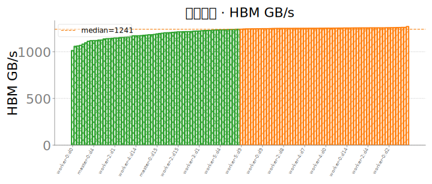

**`health_power_w`**（单卡升序一览）。本批中位≈**167.9**。**含义**：健康/轻载路径实时功耗（W），常近空闲。  **底层**：`npu-smi info -t power -i -c` → Real-time Power。**不要**和 `power_w`（负载末）直接相减当降频证据。

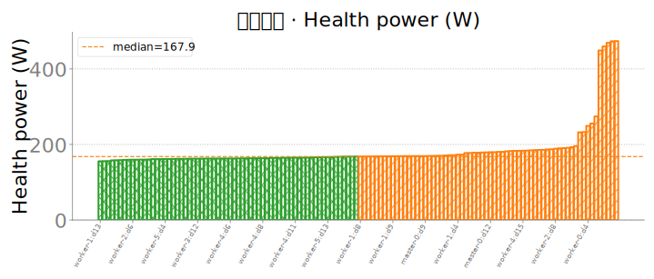

**`health_temp_c`**（单卡升序一览）。本批中位≈**40**。**含义**：健康/开测路径温度快照（°C）。  **底层**：`npu-smi info -t temp -i <card> -c <chip>` 解析。与负载中 board_temp **不同时刻**。

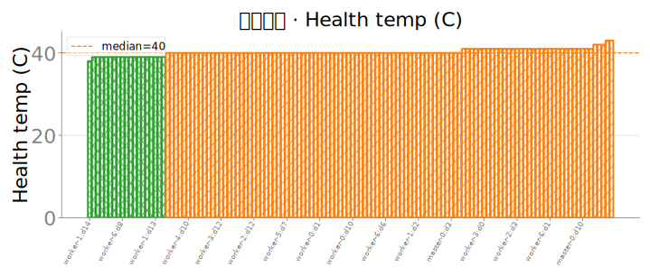

**`launch_burst_p50_us`**（单卡升序一览）。本批中位≈**472.5**。**含义**：连续 enqueue 64 个极小核后一次 sync 的总时延 p50（µs）。  **底层**：CPU 计时 burst；看队列深度下的发射成本。

**`launch_burst_per_kernel_p50_us`**（单卡升序一览）。本批中位≈**7.383**。**含义**：突发总时延 / 64，每核摊销 p50（µs）。  **底层**：由 burst 派生。

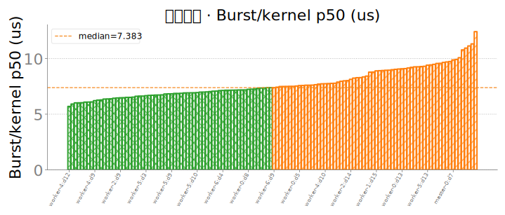

**`launch_host_overhead_p50_us`**（单卡升序一览）。本批中位≈**240.1**。**含义**：Host 侧发射开销 p50（µs）≈ wall − device event。  **底层**：极小核 add 的墙钟与 NPU Event 差分；需 timing_method=event 才有意义。

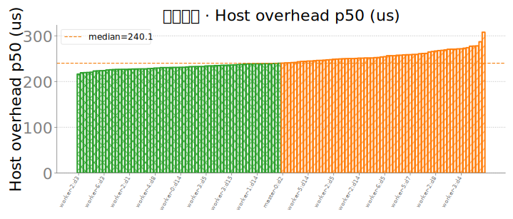

**`launch_host_overhead_p99_us`**（单卡升序一览）。本批中位≈**628.7**。**含义**：Host 发射开销 p99（µs）。  **底层**：同上。

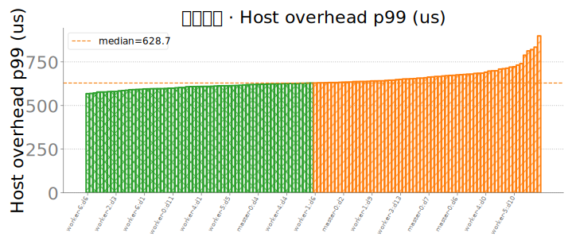

**`launch_sync_p50_us`**（单卡升序一览）。本批中位≈**6.069**。**含义**：空设备 `synchronize()` 往返延迟的 p50（µs）。反映驱动/设备响应基线。  **底层**：CPU `perf_counter` 包一层 `adapter.sync`；samples=500，warmup=50。与 kernel 发射无关。

**`launch_sync_p99_us`**（单卡升序一览）。本批中位≈**6.78**。**含义**：同上的 p99（µs）。看调度抖动尾延迟。  **底层**：同 launch_latency 探针。

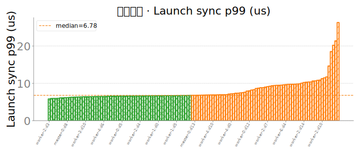

**`mem_bw_util_pct`**（单卡升序一览）。本批中位≈**18**。**含义**：HBM Bandwidth Usage Rate（%）。  **底层**：同上 `-t usages`；瞬时率。

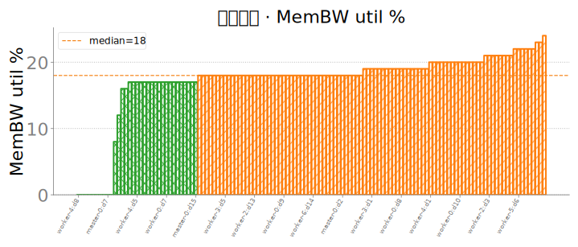

**`mte_gbps`**（单卡升序一览）。本批中位≈**1268**。**含义**：纯拷贝带宽（GB/s）。代理 MTE/DMA 搬运通路，用来拆「算发访存」vs「纯搬运」。  **底层**：`Tensor.copy_`；流量按 R+W；512MB；Event 中位。w20/i50。

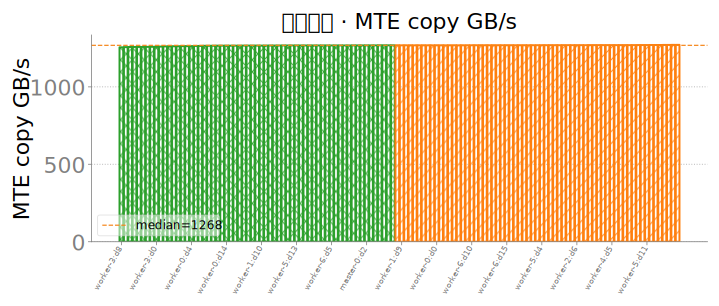

**`power_w`**（单卡升序一览）。本批中位≈**871.5**。**含义**：负载探针时段实时功耗（W），常为数百～近千瓦。  **底层**：`npu-smi -t power`；卡级取 vector_fma **末轮**。与 `health_power_w`（~百瓦级健康快照）工况不同。

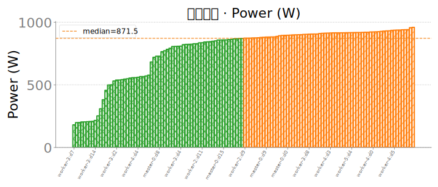

**`scalar_elems_per_s`**（单卡升序一览）。本批中位≈**2.799e+08**。**含义**：长依赖串行链吞吐（元素/秒）。更贴近 Scalar/控制流+同步，不是 SIMD 峰值。  **底层**：`torch.cumsum`；elems_per_s = elems/dt；16M fp32。量纲不是 GFLOPS，勿与 vector 直接比倍速。

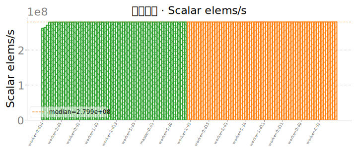

**`sfu_gflops`**（单卡升序一览）。本批中位≈**156.5**。**含义**：特殊函数单元吞吐。字段叫 gflops，实现按 1 op/元素计，实质是 Gops/s 量级。  **底层**：默认 `torch.exp(x)`；`gflops≈elems/dt/1e9`；64M fp32。与 SDC 正确性探针不是一回事。

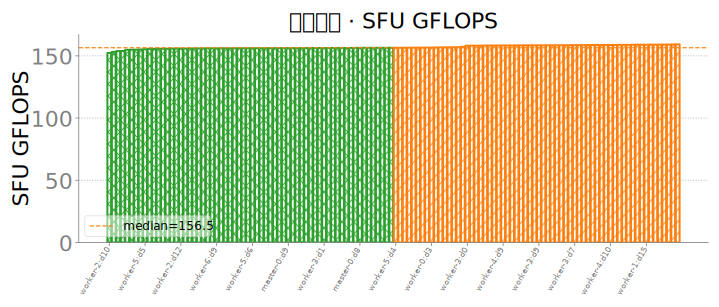

**`shape_sweep_peak_tflops`**（单卡升序一览）。本批中位≈**310.7**。**含义**：名义「shape sweep 峰值」，本批实际是 **BNMK 各形状中位吞吐的最大值**。  **底层**：constitution128 关闭方阵 shape_sweep、开启 bnmk_sweep；`jsonl.py` 用 max(BNMK tflops) 回填此键。

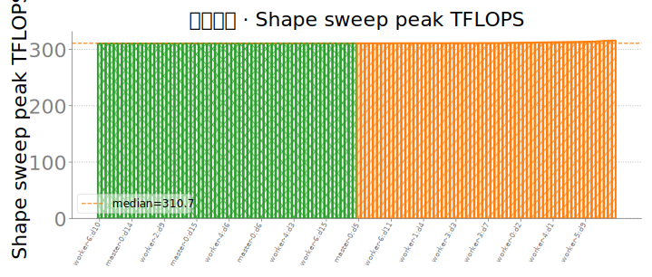

**`sustained_tflops`**（单卡升序一览）。本批中位≈**306.9**。**含义**：稳态 Cube 吞吐（TFLOPS）。连续烤机后的可持续算力，用来看降频/争用，不是瞬时峰值。  **底层**：循环 `a@b` 跑满 ~30s，每窗 50 次 GEMM 用 NPU Event 计时；**卡级字段取最后一个时间窗**（非中位）。N=8192 bf16。

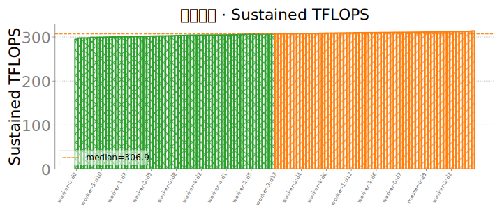

**`vector_gflops`**（单卡升序一览）。本批中位≈**98.82**。**含义**：Vector 单元 FMA 吞吐（GFLOPS）。代理 Ascend Vector 宽并行，不是 Cube。  **底层**：逐元素 `a*b+c`，按 2 flops/elem；64M 元素 fp32；NPU Event 中位。w20/i50。

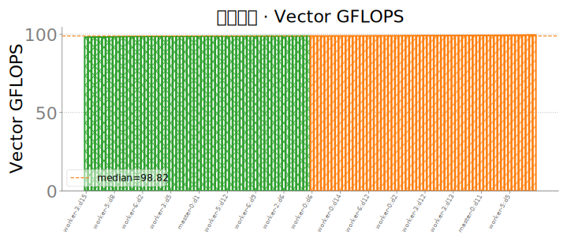

**稳态 GEMM 时间序列的跨卡分位**。原始明细 `record=gemm_sustained_sample`（iter / t_s / tflops）。每个 iter 上对全部卡的 tflops 取 **p05 与 p50**（覆盖不足 90% 卡的 iter 丢弃）；横轴用该 iter 上各卡 t_s 的中位。含义上：p50≈集群典型可持续算力轨迹，p05≈尾部偏慢卡轨迹——**不是**挑两张代表卡各自画一条线。 **含义**：稳态 Cube 吞吐（TFLOPS）。连续烤机后的可持续算力，用来看降频/争用，不是瞬时峰值。  **底层**：循环 `a@b` 跑满 ~30s，每窗 50 次 GEMM 用 NPU Event 计时；**卡级字段取最后一个时间窗**（非中位）。N=8192 bf16。

