# Card Constitution 分布报告

- 生成时间: 2026-07-11 12:24:39
- 卡数: 128
- 数据源: /Users/yinjinrun/random-thing/logs/card-screen-128-20260710_224218/results/perf128.huawei-8node-copy-master-0.jsonl, /Users/yinjinrun/random-thing/logs/card-screen-128-20260710_224218/results/perf128.huawei-8node-copy-worker-0.jsonl, /Users/yinjinrun/random-thing/logs/card-screen-128-20260710_224218/results/perf128.huawei-8node-copy-worker-1.jsonl, /Users/yinjinrun/random-thing/logs/card-screen-128-20260710_224218/results/perf128.huawei-8node-copy-worker-2.jsonl, /Users/yinjinrun/random-thing/logs/card-screen-128-20260710_224218/results/perf128.huawei-8node-copy-worker-3.jsonl, /Users/yinjinrun/random-thing/logs/card-screen-128-20260710_224218/results/perf128.huawei-8node-copy-worker-4.jsonl, /Users/yinjinrun/random-thing/logs/card-screen-128-20260710_224218/results/perf128.huawei-8node-copy-worker-5.jsonl, /Users/yinjinrun/random-thing/logs/card-screen-128-20260710_224218/results/perf128.huawei-8node-copy-worker-6.jsonl

> 本报告只做分布统计与可视化，不强调 slow / 坏卡判定。

## 跳过说明

- `vector_gflops`（Vector GFLOPS）：字段缺失或全空，跳过
- `scalar_elems_per_s`（Scalar elems/s）：字段缺失或全空，跳过
- `mte_gbps`（MTE copy GB/s）：字段缺失或全空，跳过
- `cube_vector_tflops`（Cube+Vector TFLOPS）：字段缺失或全空，跳过
- `sfu_gflops`（SFU GFLOPS）：字段缺失或全空，跳过
- `launch_sync_p50_us`（Launch sync p50 (us)）：字段缺失或全空，跳过
- `launch_sync_p99_us`（Launch sync p99 (us)）：字段缺失或全空，跳过
- `launch_host_overhead_p50_us`（Host overhead p50 (us)）：字段缺失或全空，跳过
- `launch_host_overhead_p99_us`（Host overhead p99 (us)）：字段缺失或全空，跳过
- `launch_burst_p50_us`（Burst total p50 (us)）：字段缺失或全空，跳过
- `launch_burst_per_kernel_p50_us`（Burst/kernel p50 (us)）：字段缺失或全空，跳过
- `health_temp_c`（Health temp (C)）：字段缺失或全空，跳过
- `health_power_w`（Health power (W)）：字段缺失或全空，跳过
- `aicore_freq_mhz`（AICore freq (MHz)）：字段缺失或全空，跳过
- `hbm_temp_c`（HBM temp (C)）：字段缺失或全空，跳过
- `board_temp_c`（Board temp (C)）：字段缺失或全空，跳过
- `aicore_util_pct`（AICore util %）：字段缺失或全空，跳过
- `aicpu_util_pct`（AICPU util %）：字段缺失或全空，跳过
- `ctrlcpu_util_pct`（CtrlCPU util %）：字段缺失或全空，跳过
- `mem_bw_util_pct`（MemBW util %）：字段缺失或全空，跳过
- `power_w`（Power (W)）：字段缺失或全空，跳过
- `power_limit_w`（Power limit (W)）：字段缺失或全空，跳过
- 散点 `func_tflops` × `vector_gflops`（Cube × Vector）：缺轴字段，跳过
- 散点 `hbm_gbps` × `mte_gbps`（HBM × MTE）：缺轴字段，跳过
- 散点 `power_w` × `func_tflops`（Power × Cube）：缺轴字段，跳过
- 散点 `health_power_w` × `func_tflops`（Health power × Cube）：缺轴字段，跳过
- 散点 `power_w` × `hbm_gbps`（Power × HBM）：缺轴字段，跳过
- 散点 `health_power_w` × `hbm_gbps`（Health power × HBM）：缺轴字段，跳过
- 散点 `launch_host_overhead_p50_us` × `ctrlcpu_util_pct`（Launch overhead × CtrlCPU）：缺轴字段，跳过

## 指标分布

| 指标 | n | median | mean | std | CV% | min | max | p5 | p50 | p95 |
|------|---|--------|------|-----|-----|-----|-----|----|----|-----|
| Cube func TFLOPS | 128 | 292.8 | 290.9 | 6.995 | 2.404 | 267.6 | 301.0 | 278.5 | 292.8 | 299.7 |
| HBM GB/s | 128 | 1242.6 | 1220.1 | 48.5 | 3.975 | 1013.3 | 1262.1 | 1111.8 | 1242.6 | 1258.2 |
| Sustained TFLOPS | 128 | 307.1 | 306.5 | 4.107 | 1.34 | 295.5 | 313.3 | 298.2 | 307.1 | 312.3 |
| Shape sweep peak TFLOPS | 128 | 328.9 | 328.8 | 0.8994 | 0.2735 | 326.4 | 330.7 | 327.1 | 328.9 | 330.2 |

## 相对中位数偏差

偏差 = `(值 - 集群中位数) / 集群中位数 × 100%`。

- **Cube func TFLOPS** (`func_tflops`): [-8.60%, +2.80%]，|偏差|均值 1.90%
- **HBM GB/s** (`hbm_gbps`): [-18.45%, +1.57%]，|偏差|均值 2.63%
- **Sustained TFLOPS** (`sustained_tflops`): [-3.77%, +2.02%]，|偏差|均值 1.05%
- **Shape sweep peak TFLOPS** (`shape_sweep_peak_tflops`): [-0.76%, +0.55%]，|偏差|均值 0.22%

## 元数据

- hosts (8): master-0, worker-0, worker-1, worker-2, worker-3, worker-4, worker-5, worker-6
- backends: npu

## 图表

### box overview

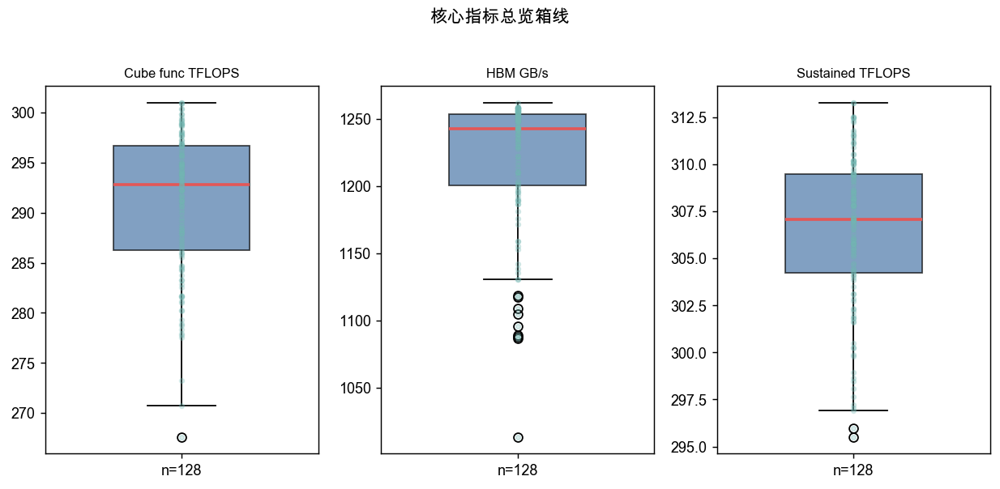

### hist func tflops

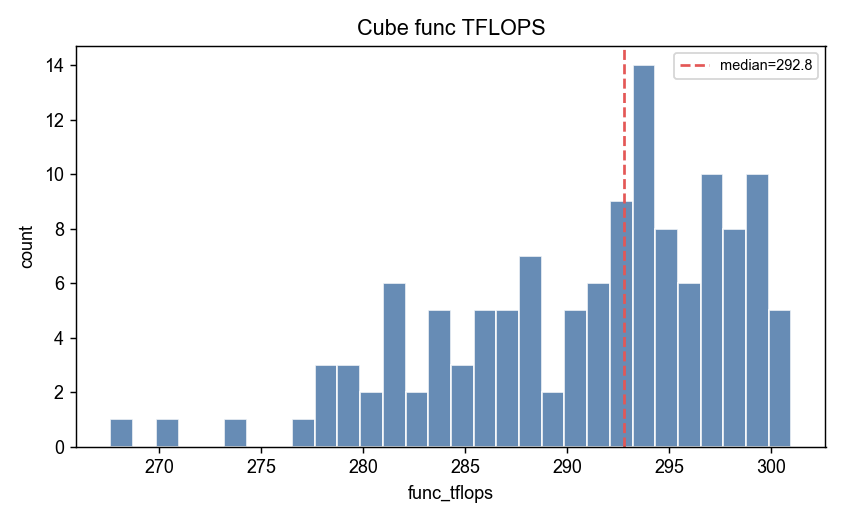

### hist hbm gbps

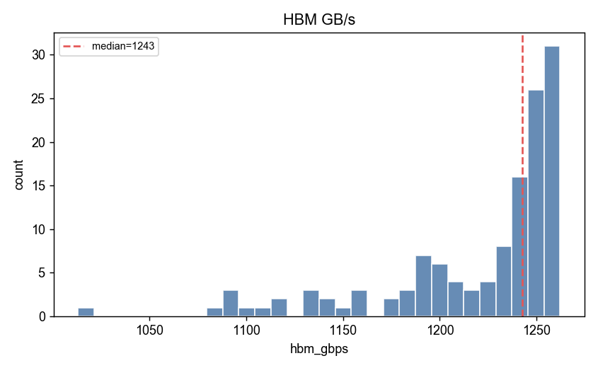

### hist sustained tflops

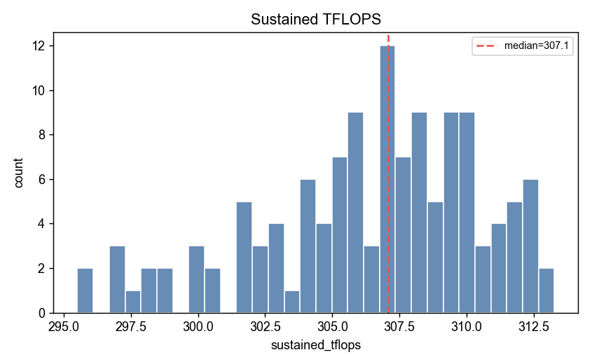

### hist shape sweep peak tflops

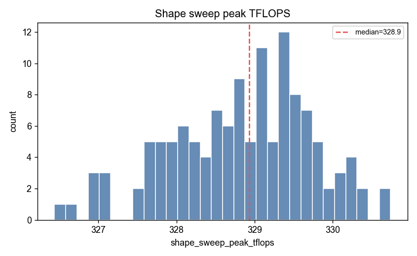

### heatmap relmed func tflops

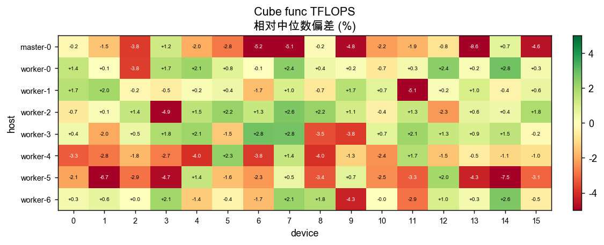

### box by host func tflops

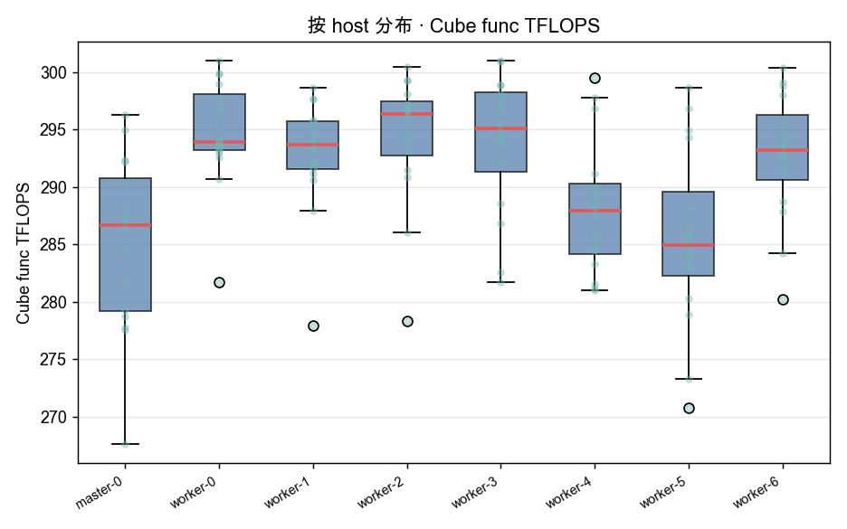

### sorted bar func tflops

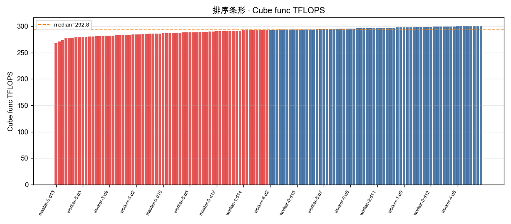

### bar host mean std func tflops

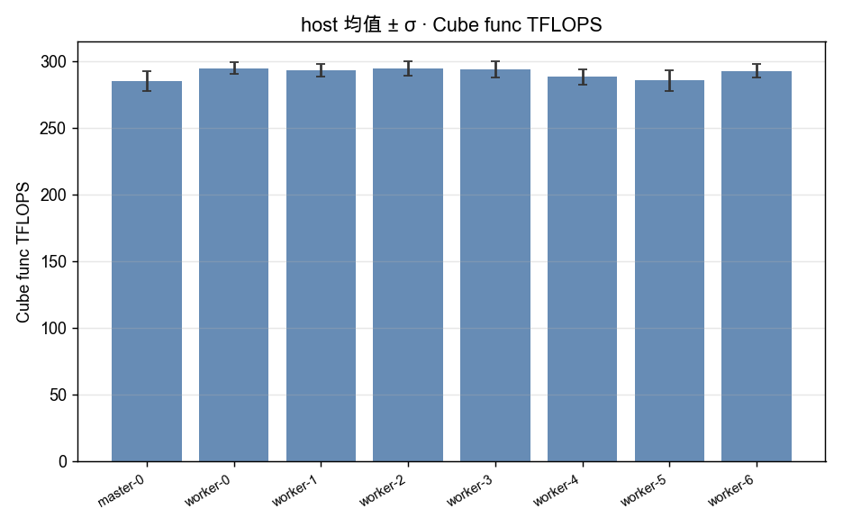

### heatmap relmed hbm gbps

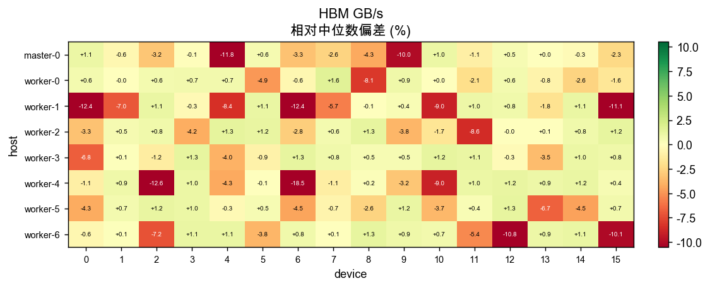

### box by host hbm gbps

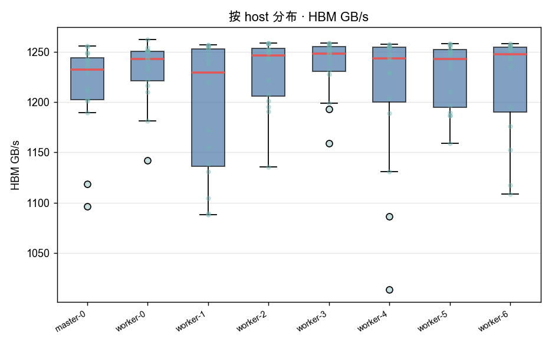

### sorted bar hbm gbps

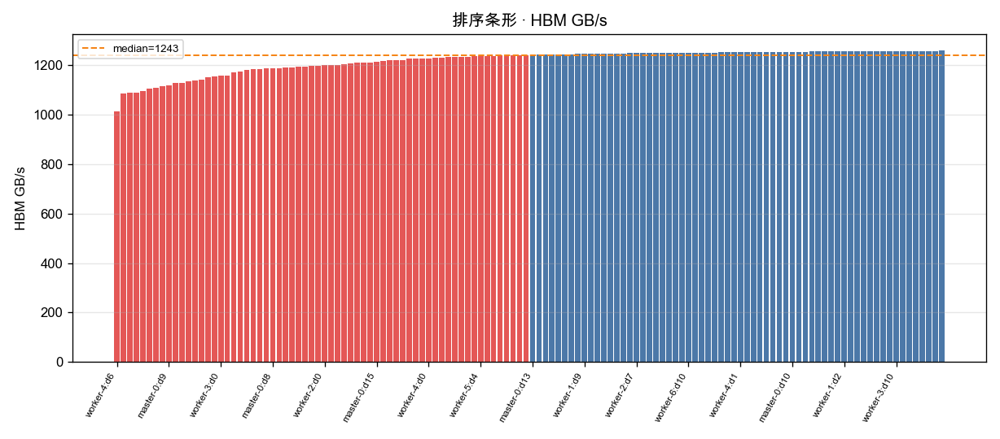

### bar host mean std hbm gbps

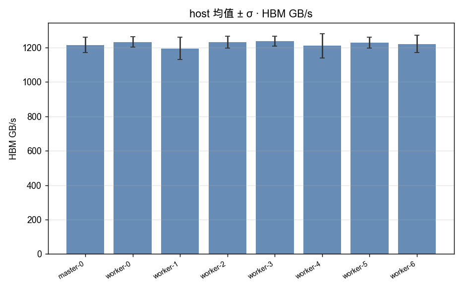

### heatmap relmed sustained tflops

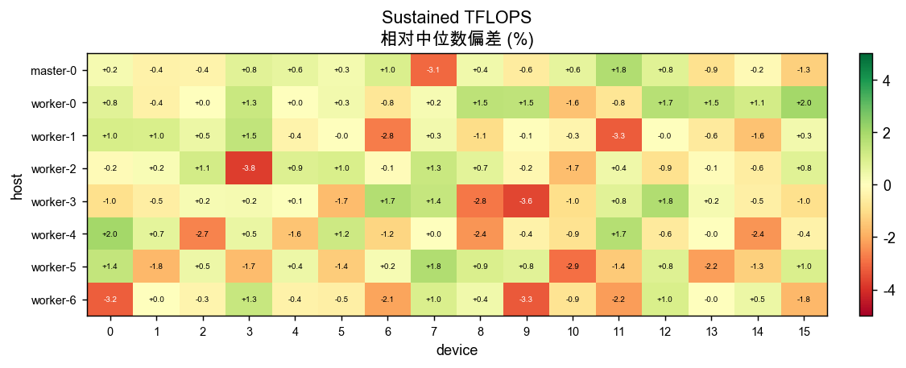

### box by host sustained tflops

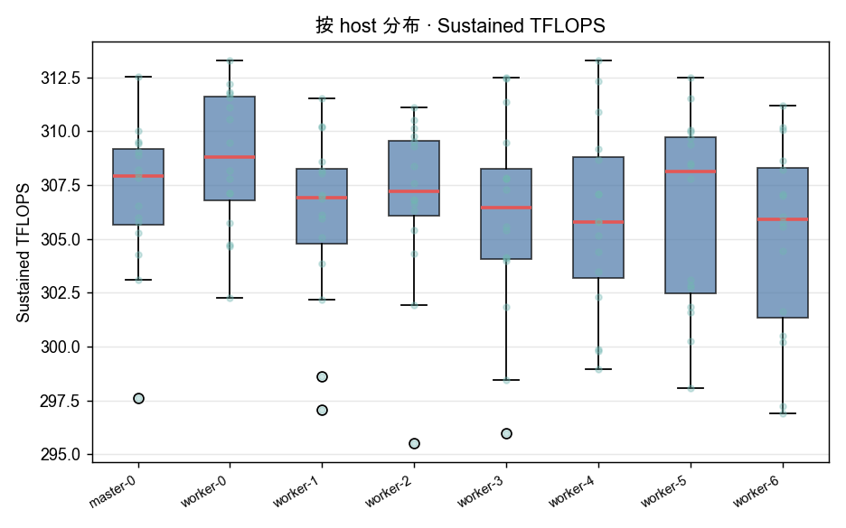

### sorted bar sustained tflops

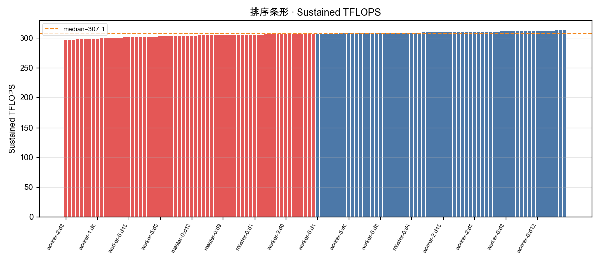

### bar host mean std sustained tflops

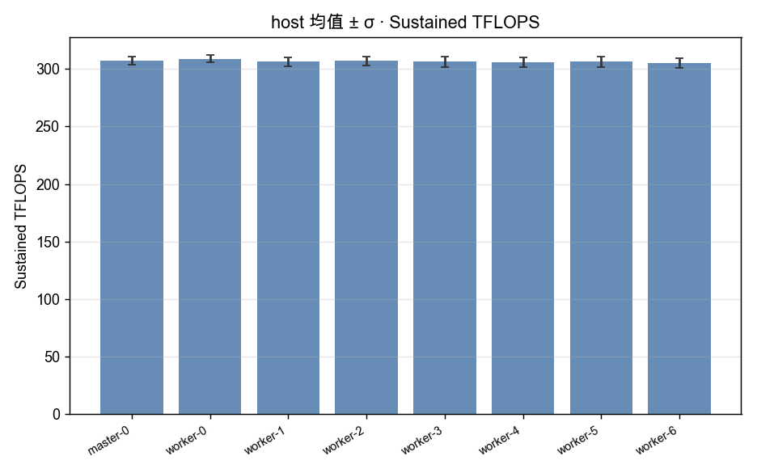

### heatmap relmed shape sweep peak tflops

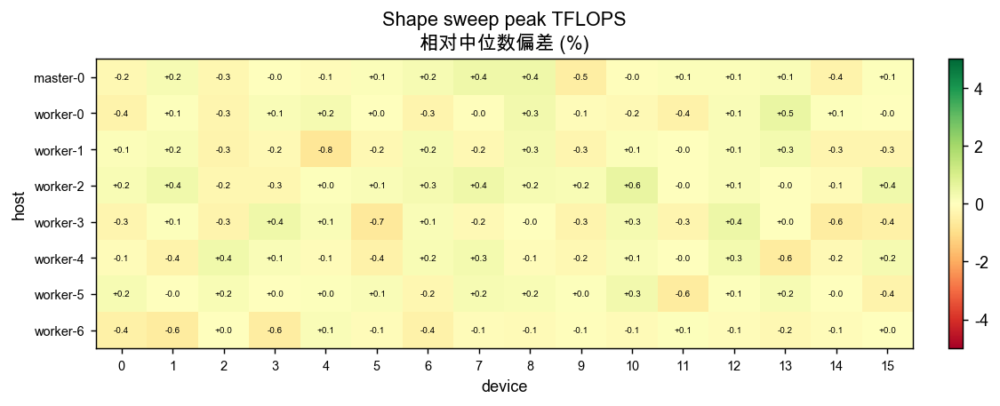

### box by host shape sweep peak tflops

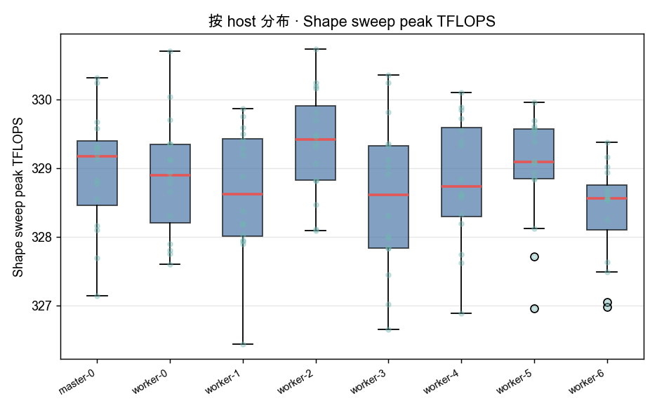

### sorted bar shape sweep peak tflops

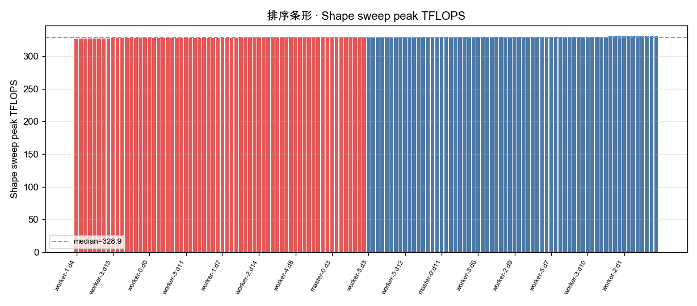

### timeseries sustained p05 p50

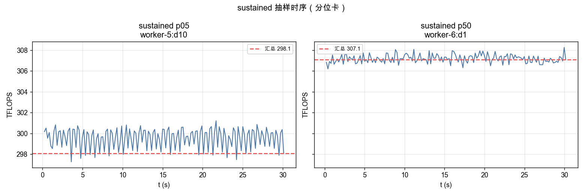

### shape tflops vs n

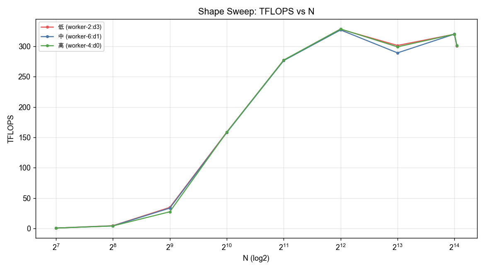

