# Card Constitution · Muxi · 20260711

指标「是什么 / 底层 API」详见 [`METRIC_SEMANTICS_MUXI_20260711.md`](METRIC_SEMANTICS_MUXI_20260711.md)。
数据：`logs/muxi-constitution-20260711_232400-muxi-constitution128/results/constitution128.merged.jsonl`；job `yushan-muxi-card-screen-128-cp-copy` **16×8=128**；`screen.py` + `config.constitution128.yaml`；`--sdc-rounds 5 --gemm-n 8192 --sustained-s 30`。
计时：CUDA/MACA Event（`torch.cuda`）；遥测：`mx-smi`。本批 **有 BNMK sample**；board_temp / GPU util / XCORE clk **已落盘**。架构对齐见 [`../research/METAX_ARCH_ALIGNMENT_20260711.md`](../research/METAX_ARCH_ALIGNMENT_20260711.md)。

## 关键中位

| 字段 | 人话 | 中位 | 覆盖 |
|---|---|---:|---:|
| `func_tflops` | 方阵 GEMM / MetaX 主算力 | 279.9 | 127/128 |
| `sustained_tflops` | 稳态 GEMM | 280 | 127/128 |
| `hbm_gbps` | HBM 带宽代理 | 1469 | 127/128 |
| `vector_gflops` | Vector FMA | 122.2 | 127/128 |
| `mte_gbps` | 纯 copy/DMA | 1387 | 127/128 |
| `cube_vector_tflops` | GEMM+epilogue | 195.2 | 127/128 |
| `sfu_gflops` | SFU（Gops/s 量级） | 177.4 | 127/128 |
| `health_power_w` | 健康功耗 | 94.84 | 128/128 |
| `power_w` | 负载末功耗 | 471 | 127/128 |
| `power_limit_w` | 功耗墙 | 550 | 127/128 |
| `health_temp_c` | 健康温度 | 38.5 | 128/128 |

## 逐图（含义优先）

**`aicore_freq_mhz`**（分 host 均值±σ）。本批中位≈**1500**。**含义**：XCORE 时钟（MHz）。键名 `aicore_*` 兼容昇腾；沐曦来自 `clocks.XCORE.XCORE_CLK`。  **底层**：负载路径 TTL 合并 `mx-smi -j`；别名 `xcore_clk_mhz` / `sm_clock_mhz`。本批已落盘。

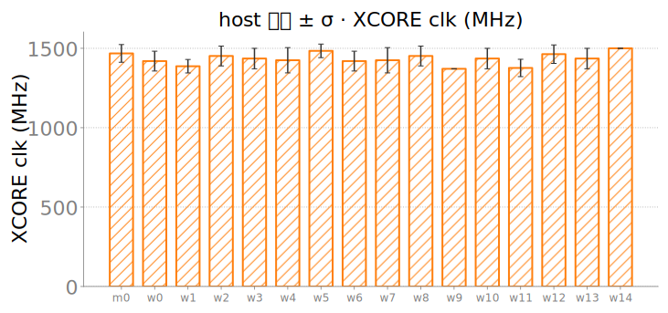

**`cube_vector_tflops`**（分 host 均值±σ）。本批中位≈**195.2**。**含义**：方阵 GEMM + Vector epilogue（scale+bias）端到端吞吐（TFLOPS）。字段名 `cube_*` 是昇腾同构遗留；沐曦上是 GEMM→向量衔接。  **底层**：`c=a@b; c*scale+bias`；FLOPs=`2N³+3N²`；N=4096 bf16。新别名 `gemm_epilogue_tflops`。

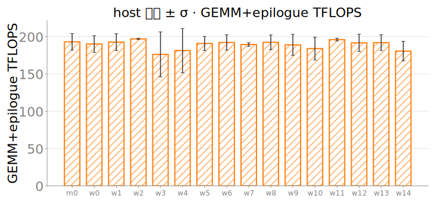

**`func_tflops`**（分 host 均值±σ）。本批中位≈**279.9**。**含义**：单卡方阵 GEMM 吞吐（TFLOPS）。测的是 MetaX 主算力路径，越高说明方阵乘越强。  **底层**：torch 算子 `a@b`（bf16），FLOPs=`2·N³`，CUDA/MACA Event（`torch.cuda`）计时取中位；N=8192，warmup=20，iters=50。

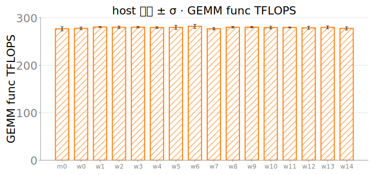

**`hbm_gbps`**（分 host 均值±σ）。本批中位≈**1469**。**含义**：HBM 有效带宽代理（GB/s）。反映高带宽内存读+写通路是否健康。  **底层**：设备侧大缓冲 `dst = src * 2.0`（fp32，含一次乘法，非纯 DMA）；流量按 R+W；Event 计时中位。默认 1024MB，w20/i50。

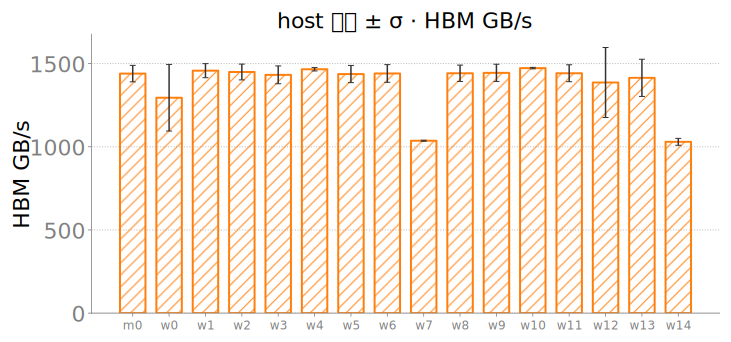

**`health_power_w`**（分 host 均值±σ）。本批中位≈**94.84**。**含义**：健康/轻载路径实时功耗（W），常近空闲。  **底层**：`mx-smi` → 实时功耗。**不要**和 `power_w`（负载末）直接相减当降频证据。

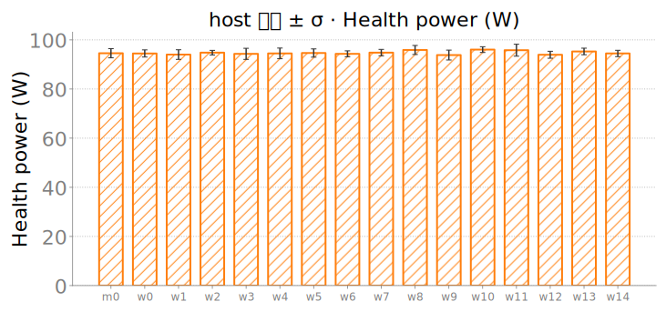

**`health_temp_c`**（分 host 均值±σ）。本批中位≈**38.5**。**含义**：健康/开测路径温度快照（°C）。沐曦侧默认是 hotspot/结温代理。  **底层**：`mx-smi`（`MxSmiProvider`）。与负载 `board_temp_c` / hotspot **不同时刻**；本批 JSONL 的 board_temp **已采集**（`--show-temperature` TTL；与 dmon hotspot 分传感器）。

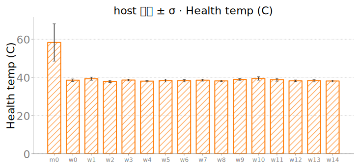

**`mte_gbps`**（分 host 均值±σ）。本批中位≈**1387**。**含义**：纯 copy / DMA 带宽（GB/s）。字段名 `mte_*` 是昇腾同构遗留；沐曦上测的是通用搬运通路。  **底层**：`Tensor.copy_`；流量按 R+W；512MB；CUDA/MACA Event 中位。新别名 `dma_copy_gbps`。

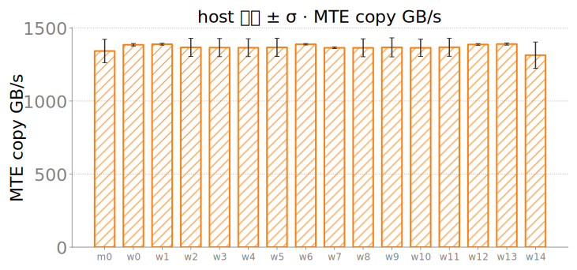

**`power_w`**（分 host 均值±σ）。本批中位≈**471**。**含义**：负载探针时段实时功耗（W）。  **底层**：`mx-smi` 功耗；卡级常取 vector_fma **末轮**。与 `health_power_w`（轻载健康快照）工况不同。

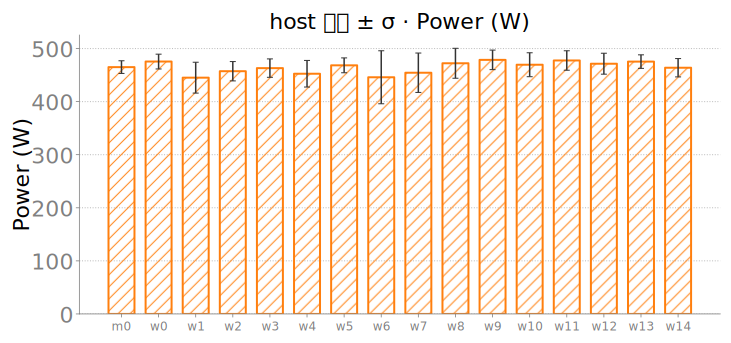

**`scalar_elems_per_s`**（分 host 均值±σ）。本批中位≈**1.209e+11**。**含义**：长依赖串行链吞吐（元素/秒）。更贴近 Scalar/控制流+同步，不是 SIMD 峰值。  **底层**：`torch.cumsum`；elems_per_s = elems/dt；16M fp32。量纲不是 GFLOPS，勿与 vector 直接比倍速。

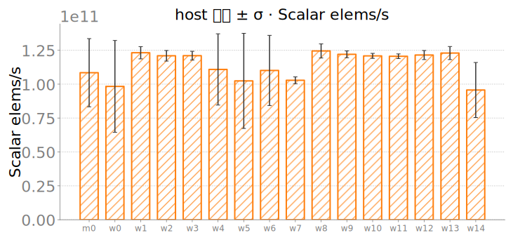

**`sfu_gflops`**（分 host 均值±σ）。本批中位≈**177.4**。**含义**：特殊函数单元吞吐。字段叫 gflops，实现按 1 op/元素计，实质是 Gops/s 量级。  **底层**：默认 `torch.exp(x)`；`gflops≈elems/dt/1e9`；64M fp32。与 SDC 正确性探针不是一回事。

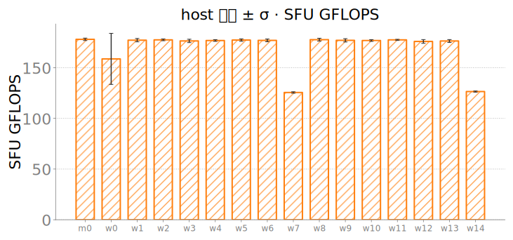

**`sustained_tflops`**（分 host 均值±σ）。本批中位≈**280**。**含义**：稳态方阵 GEMM 吞吐（TFLOPS）。连续烤机后的可持续算力，用来看降频/争用，不是瞬时峰值。  **底层**：循环 `a@b` 跑满 ~30s，每窗 50 次 GEMM 用 CUDA Event 计时；**卡级字段取最后一个时间窗**（非中位）。N=8192 bf16。

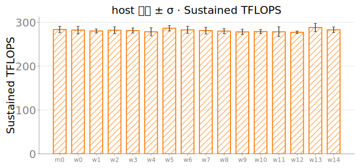

**`vector_gflops`**（分 host 均值±σ）。本批中位≈**122.2**。**含义**：宽向量 FMA 吞吐代理（GFLOPS）。不是昇腾 Vector Core；沐曦上是 MACA 向量算子路径。  **底层**：逐元素 `a*b+c`，按 2 flops/elem；64M 元素 fp32；CUDA Event 中位。w20/i50。

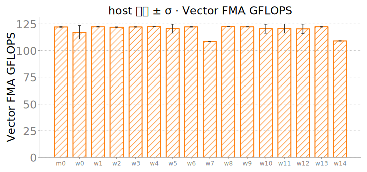

**`aicore_freq_mhz`**（分 host 箱线）。本批中位≈**1500**。**含义**：XCORE 时钟（MHz）。键名 `aicore_*` 兼容昇腾；沐曦来自 `clocks.XCORE.XCORE_CLK`。  **底层**：负载路径 TTL 合并 `mx-smi -j`；别名 `xcore_clk_mhz` / `sm_clock_mhz`。本批已落盘。

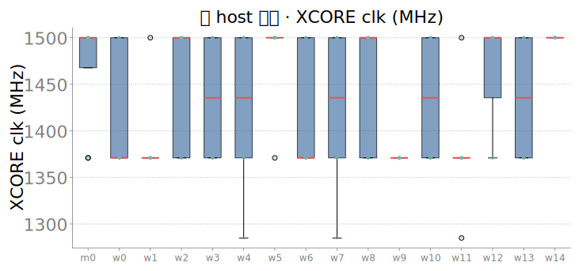

**`aicore_util_pct`**（分 host 箱线）。本批中位≈**98**。**含义**：GPU 利用率（%）。JSONL 键名 `aicore_*` 为昇腾同构兼容；沐曦语义是 GPU util。  **底层**：`mx-smi --show-usage`（TTL）。本批已落盘；别名 `gpu_util_pct`。

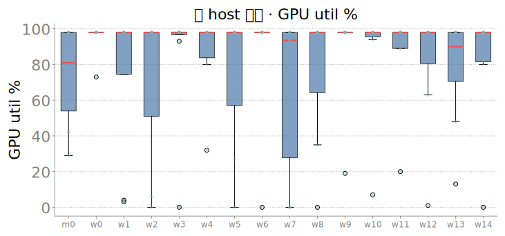

**`board_temp_c`**（分 host 箱线）。本批中位≈**54**。**含义**：板温（°C）。跨厂商通用键名；本批取 Board Temperature 传感器峰值。  **底层**：`mx-smi --show-temperature` TTL 合并（不覆盖 dmon hotspot/power）。本批已落盘。

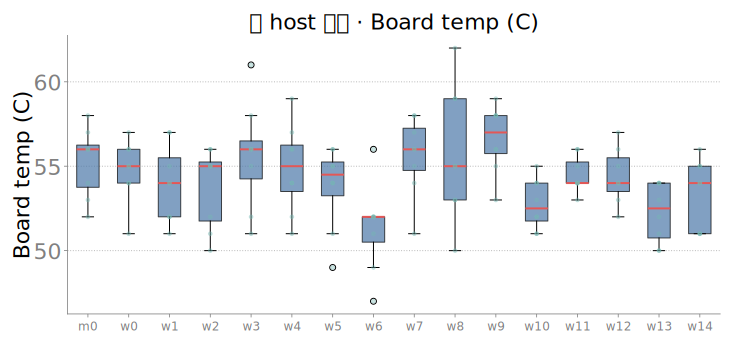

**`cube_vector_tflops`**（分 host 箱线）。本批中位≈**195.2**。**含义**：方阵 GEMM + Vector epilogue（scale+bias）端到端吞吐（TFLOPS）。字段名 `cube_*` 是昇腾同构遗留；沐曦上是 GEMM→向量衔接。  **底层**：`c=a@b; c*scale+bias`；FLOPs=`2N³+3N²`；N=4096 bf16。新别名 `gemm_epilogue_tflops`。

**`func_tflops`**（分 host 箱线）。本批中位≈**279.9**。**含义**：单卡方阵 GEMM 吞吐（TFLOPS）。测的是 MetaX 主算力路径，越高说明方阵乘越强。  **底层**：torch 算子 `a@b`（bf16），FLOPs=`2·N³`，CUDA/MACA Event（`torch.cuda`）计时取中位；N=8192，warmup=20，iters=50。

**`hbm_gbps`**（分 host 箱线）。本批中位≈**1469**。**含义**：HBM 有效带宽代理（GB/s）。反映高带宽内存读+写通路是否健康。  **底层**：设备侧大缓冲 `dst = src * 2.0`（fp32，含一次乘法，非纯 DMA）；流量按 R+W；Event 计时中位。默认 1024MB，w20/i50。

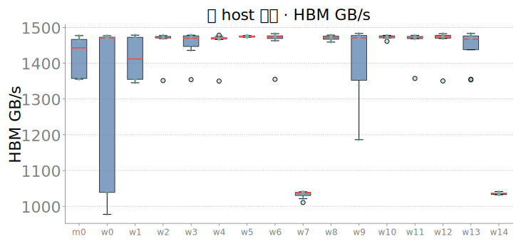

**`health_power_w`**（分 host 箱线）。本批中位≈**94.84**。**含义**：健康/轻载路径实时功耗（W），常近空闲。  **底层**：`mx-smi` → 实时功耗。**不要**和 `power_w`（负载末）直接相减当降频证据。

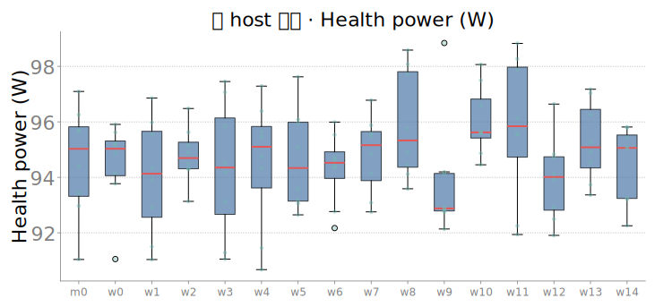

**`health_temp_c`**（分 host 箱线）。本批中位≈**38.5**。**含义**：健康/开测路径温度快照（°C）。沐曦侧默认是 hotspot/结温代理。  **底层**：`mx-smi`（`MxSmiProvider`）。与负载 `board_temp_c` / hotspot **不同时刻**；本批 JSONL 的 board_temp **已采集**（`--show-temperature` TTL；与 dmon hotspot 分传感器）。

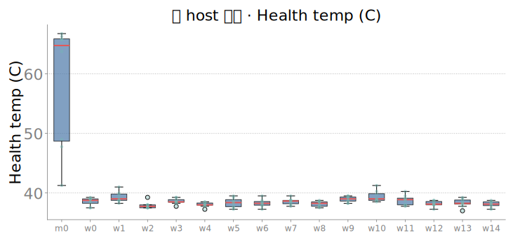

**`launch_burst_p50_us`**（分 host 箱线）。本批中位≈**1318**。**含义**：连续 enqueue 64 个极小核后一次 sync 的总时延 p50（µs）。  **底层**：CPU 计时 burst；看队列深度下的发射成本。

**`launch_burst_per_kernel_p50_us`**（分 host 箱线）。本批中位≈**20.59**。**含义**：突发总时延 / 64，每核摊销 p50（µs）。  **底层**：由 burst 派生。

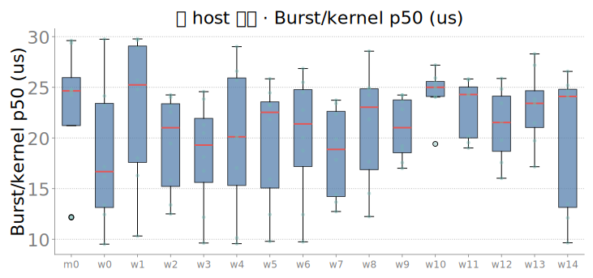

**`launch_host_overhead_p50_us`**（分 host 箱线）。本批中位≈**184**。**含义**：Host 侧发射开销 p50（µs）≈ wall − device event。  **底层**：极小核 add 的墙钟与 CUDA Event 差分；需 timing_method=event 才有意义。

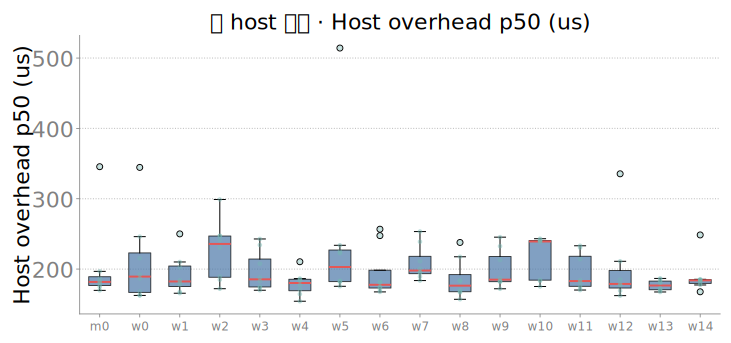

**`launch_host_overhead_p99_us`**（分 host 箱线）。本批中位≈**571.3**。**含义**：Host 发射开销 p99（µs）。  **底层**：同上。

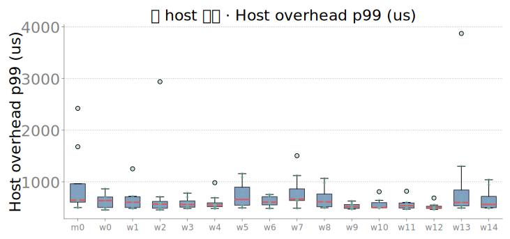

**`launch_sync_p50_us`**（分 host 箱线）。本批中位≈**2.69**。**含义**：空设备 `synchronize()` 往返延迟的 p50（µs）。反映驱动/设备响应基线。  **底层**：CPU `perf_counter` 包一层 `adapter.sync`（`torch.cuda.synchronize`）；samples=500，warmup=50。与 kernel 发射无关。

**`launch_sync_p99_us`**（分 host 箱线）。本批中位≈**4.319**。**含义**：同上的 p99（µs）。看调度抖动尾延迟。  **底层**：同 launch_latency 探针。

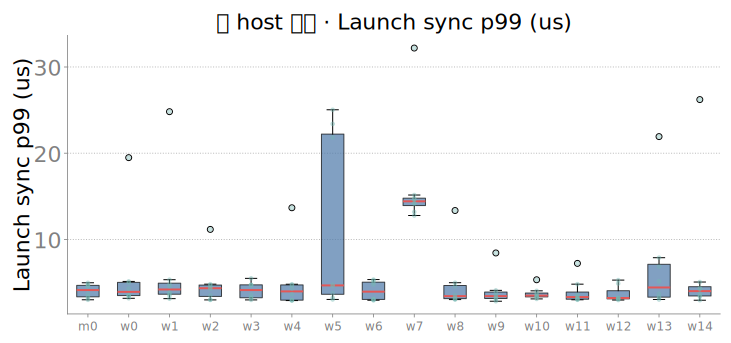

**`mte_gbps`**（分 host 箱线）。本批中位≈**1387**。**含义**：纯 copy / DMA 带宽（GB/s）。字段名 `mte_*` 是昇腾同构遗留；沐曦上测的是通用搬运通路。  **底层**：`Tensor.copy_`；流量按 R+W；512MB；CUDA/MACA Event 中位。新别名 `dma_copy_gbps`。

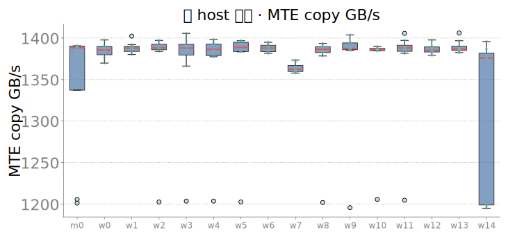

**`power_limit_w`**（分 host 箱线）。本批中位≈**550**。**含义**：功耗上限 / 功耗墙（W）。  **底层**：`mx-smi --show-board-power`；本批中位 550 W。

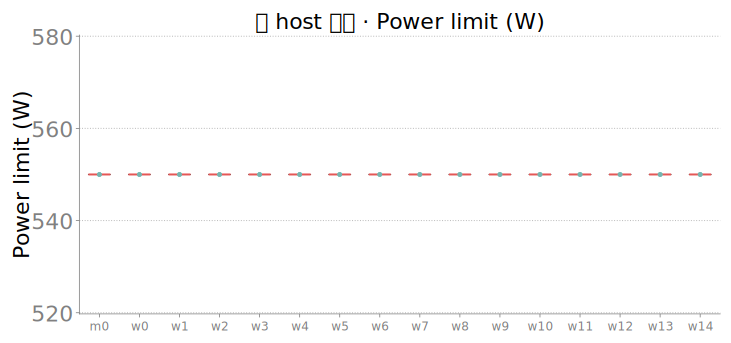

**`power_w`**（分 host 箱线）。本批中位≈**471**。**含义**：负载探针时段实时功耗（W）。  **底层**：`mx-smi` 功耗；卡级常取 vector_fma **末轮**。与 `health_power_w`（轻载健康快照）工况不同。

**`scalar_elems_per_s`**（分 host 箱线）。本批中位≈**1.209e+11**。**含义**：长依赖串行链吞吐（元素/秒）。更贴近 Scalar/控制流+同步，不是 SIMD 峰值。  **底层**：`torch.cumsum`；elems_per_s = elems/dt；16M fp32。量纲不是 GFLOPS，勿与 vector 直接比倍速。

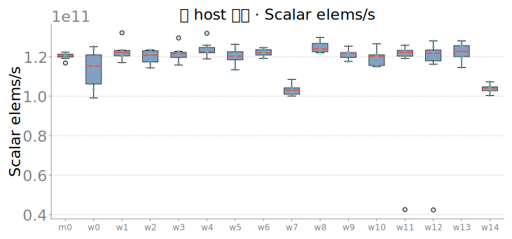

**`sfu_gflops`**（分 host 箱线）。本批中位≈**177.4**。**含义**：特殊函数单元吞吐。字段叫 gflops，实现按 1 op/元素计，实质是 Gops/s 量级。  **底层**：默认 `torch.exp(x)`；`gflops≈elems/dt/1e9`；64M fp32。与 SDC 正确性探针不是一回事。

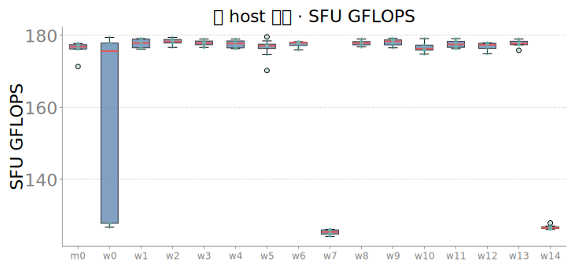

**`shape_sweep_peak_tflops`**（分 host 箱线）。本批中位≈**286**。**含义**：名义「shape sweep 峰值」。  **底层**：本批以 BNMK sample 为主；旧 shape_sweep 开关关闭。

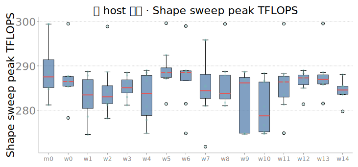

**`sustained_tflops`**（分 host 箱线）。本批中位≈**280**。**含义**：稳态方阵 GEMM 吞吐（TFLOPS）。连续烤机后的可持续算力，用来看降频/争用，不是瞬时峰值。  **底层**：循环 `a@b` 跑满 ~30s，每窗 50 次 GEMM 用 CUDA Event 计时；**卡级字段取最后一个时间窗**（非中位）。N=8192 bf16。

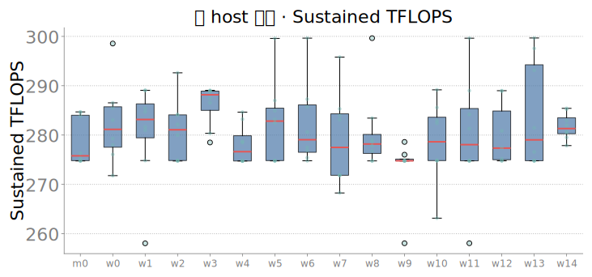

**`vector_gflops`**（分 host 箱线）。本批中位≈**122.2**。**含义**：宽向量 FMA 吞吐代理（GFLOPS）。不是昇腾 Vector Core；沐曦上是 MACA 向量算子路径。  **底层**：逐元素 `a*b+c`，按 2 flops/elem；64M 元素 fp32；CUDA Event 中位。w20/i50。

多指标全集群箱线总览；各轴字段含义见上表与语义手册。

**`aicore_freq_mhz`**（host×device 相对集群中位偏差%（|Δ|≥1% 才标数））。本批中位≈**1500**。**含义**：XCORE 时钟（MHz）。键名 `aicore_*` 兼容昇腾；沐曦来自 `clocks.XCORE.XCORE_CLK`。  **底层**：负载路径 TTL 合并 `mx-smi -j`；别名 `xcore_clk_mhz` / `sm_clock_mhz`。本批已落盘。

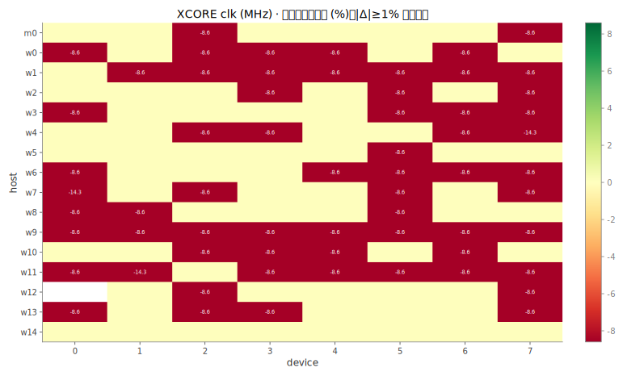

**`aicore_util_pct`**（host×device 相对集群中位偏差%（|Δ|≥1% 才标数））。本批中位≈**98**。**含义**：GPU 利用率（%）。JSONL 键名 `aicore_*` 为昇腾同构兼容；沐曦语义是 GPU util。  **底层**：`mx-smi --show-usage`（TTL）。本批已落盘；别名 `gpu_util_pct`。

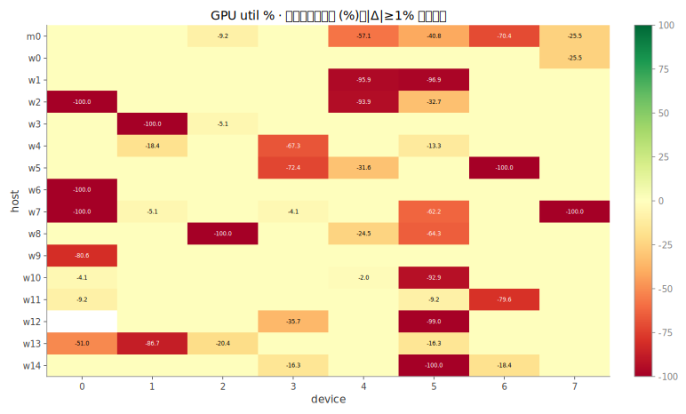

**`board_temp_c`**（host×device 相对集群中位偏差%（|Δ|≥1% 才标数））。本批中位≈**54**。**含义**：板温（°C）。跨厂商通用键名；本批取 Board Temperature 传感器峰值。  **底层**：`mx-smi --show-temperature` TTL 合并（不覆盖 dmon hotspot/power）。本批已落盘。

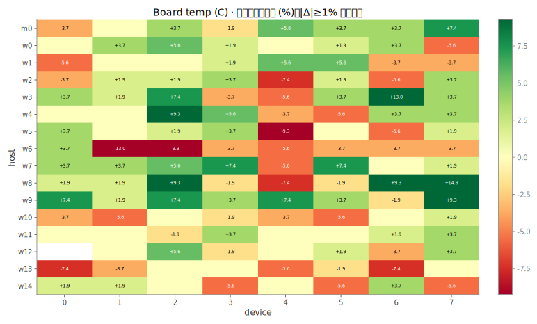

**`cube_vector_tflops`**（host×device 相对集群中位偏差%（|Δ|≥1% 才标数））。本批中位≈**195.2**。**含义**：方阵 GEMM + Vector epilogue（scale+bias）端到端吞吐（TFLOPS）。字段名 `cube_*` 是昇腾同构遗留；沐曦上是 GEMM→向量衔接。  **底层**：`c=a@b; c*scale+bias`；FLOPs=`2N³+3N²`；N=4096 bf16。新别名 `gemm_epilogue_tflops`。

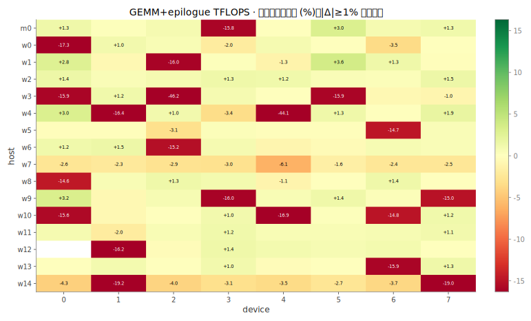

**`func_tflops`**（host×device 相对集群中位偏差%（|Δ|≥1% 才标数））。本批中位≈**279.9**。**含义**：单卡方阵 GEMM 吞吐（TFLOPS）。测的是 MetaX 主算力路径，越高说明方阵乘越强。  **底层**：torch 算子 `a@b`（bf16），FLOPs=`2·N³`，CUDA/MACA Event（`torch.cuda`）计时取中位；N=8192，warmup=20，iters=50。

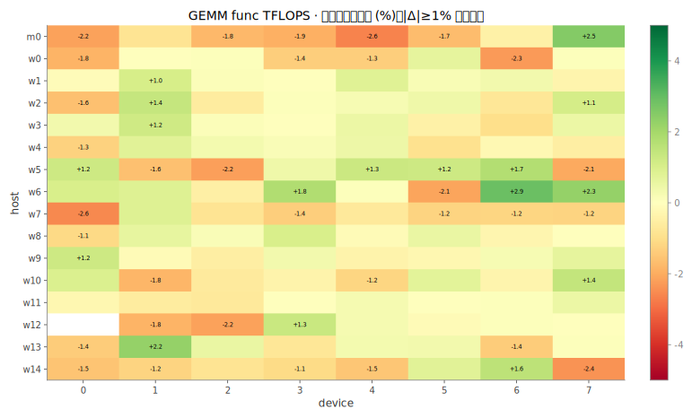

**`hbm_gbps`**（host×device 相对集群中位偏差%（|Δ|≥1% 才标数））。本批中位≈**1469**。**含义**：HBM 有效带宽代理（GB/s）。反映高带宽内存读+写通路是否健康。  **底层**：设备侧大缓冲 `dst = src * 2.0`（fp32，含一次乘法，非纯 DMA）；流量按 R+W；Event 计时中位。默认 1024MB，w20/i50。

**`health_power_w`**（host×device 相对集群中位偏差%（|Δ|≥1% 才标数））。本批中位≈**94.84**。**含义**：健康/轻载路径实时功耗（W），常近空闲。  **底层**：`mx-smi` → 实时功耗。**不要**和 `power_w`（负载末）直接相减当降频证据。

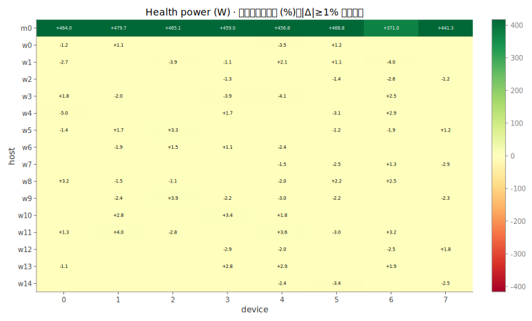

**`health_temp_c`**（host×device 相对集群中位偏差%（|Δ|≥1% 才标数））。本批中位≈**38.5**。**含义**：健康/开测路径温度快照（°C）。沐曦侧默认是 hotspot/结温代理。  **底层**：`mx-smi`（`MxSmiProvider`）。与负载 `board_temp_c` / hotspot **不同时刻**；本批 JSONL 的 board_temp **已采集**（`--show-temperature` TTL；与 dmon hotspot 分传感器）。

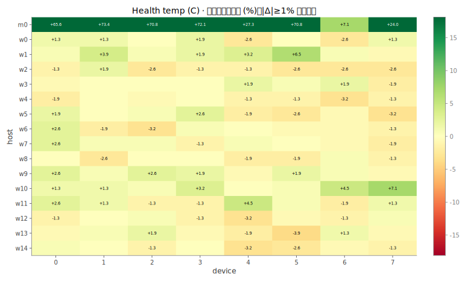

**`launch_burst_p50_us`**（host×device 相对集群中位偏差%（|Δ|≥1% 才标数））。本批中位≈**1318**。**含义**：连续 enqueue 64 个极小核后一次 sync 的总时延 p50（µs）。  **底层**：CPU 计时 burst；看队列深度下的发射成本。

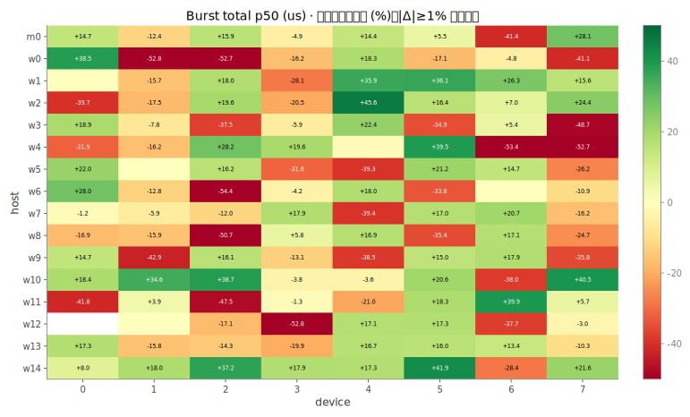

**`launch_burst_per_kernel_p50_us`**（host×device 相对集群中位偏差%（|Δ|≥1% 才标数））。本批中位≈**20.59**。**含义**：突发总时延 / 64，每核摊销 p50（µs）。  **底层**：由 burst 派生。

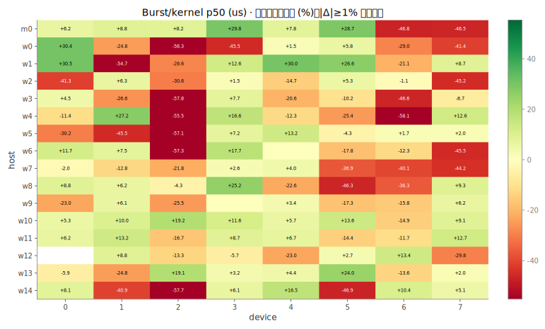

**`launch_host_overhead_p50_us`**（host×device 相对集群中位偏差%（|Δ|≥1% 才标数））。本批中位≈**184**。**含义**：Host 侧发射开销 p50（µs）≈ wall − device event。  **底层**：极小核 add 的墙钟与 CUDA Event 差分；需 timing_method=event 才有意义。

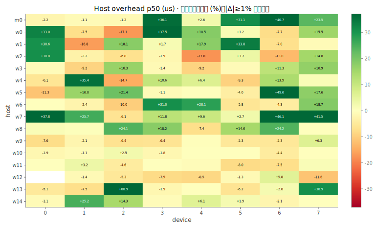

**`launch_host_overhead_p99_us`**（host×device 相对集群中位偏差%（|Δ|≥1% 才标数））。本批中位≈**571.3**。**含义**：Host 发射开销 p99（µs）。  **底层**：同上。

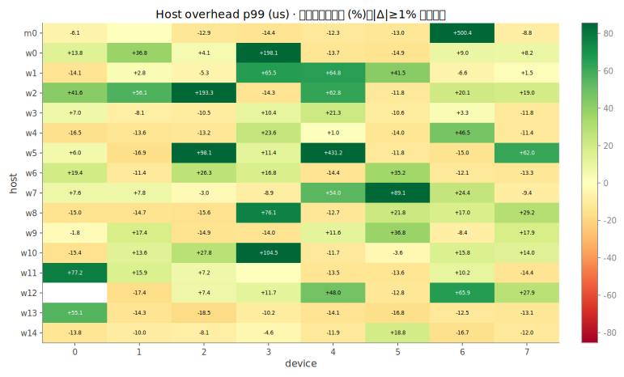

**`launch_sync_p50_us`**（host×device 相对集群中位偏差%（|Δ|≥1% 才标数））。本批中位≈**2.69**。**含义**：空设备 `synchronize()` 往返延迟的 p50（µs）。反映驱动/设备响应基线。  **底层**：CPU `perf_counter` 包一层 `adapter.sync`（`torch.cuda.synchronize`）；samples=500，warmup=50。与 kernel 发射无关。

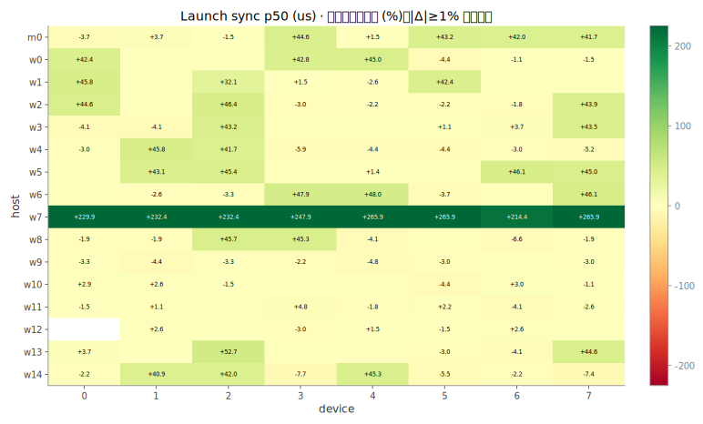

**`launch_sync_p99_us`**（host×device 相对集群中位偏差%（|Δ|≥1% 才标数））。本批中位≈**4.319**。**含义**：同上的 p99（µs）。看调度抖动尾延迟。  **底层**：同 launch_latency 探针。

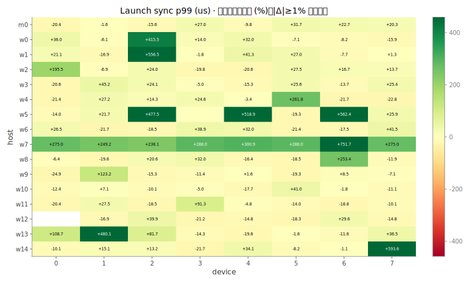

**`mte_gbps`**（host×device 相对集群中位偏差%（|Δ|≥1% 才标数））。本批中位≈**1387**。**含义**：纯 copy / DMA 带宽（GB/s）。字段名 `mte_*` 是昇腾同构遗留；沐曦上测的是通用搬运通路。  **底层**：`Tensor.copy_`；流量按 R+W；512MB；CUDA/MACA Event 中位。新别名 `dma_copy_gbps`。

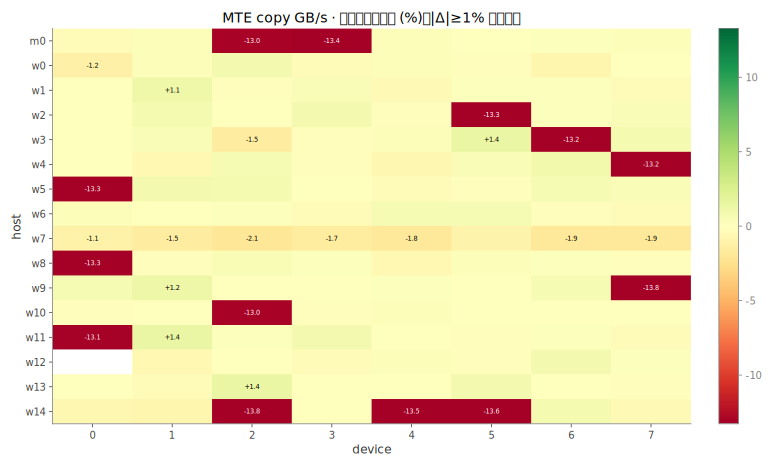

**`power_limit_w`**（host×device 相对集群中位偏差%（|Δ|≥1% 才标数））。本批中位≈**550**。**含义**：功耗上限 / 功耗墙（W）。  **底层**：`mx-smi --show-board-power`；本批中位 550 W。

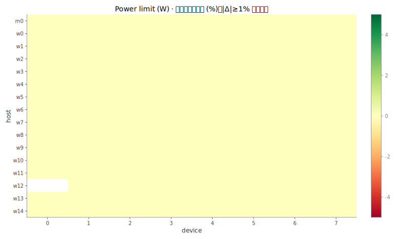

**`power_w`**（host×device 相对集群中位偏差%（|Δ|≥1% 才标数））。本批中位≈**471**。**含义**：负载探针时段实时功耗（W）。  **底层**：`mx-smi` 功耗；卡级常取 vector_fma **末轮**。与 `health_power_w`（轻载健康快照）工况不同。

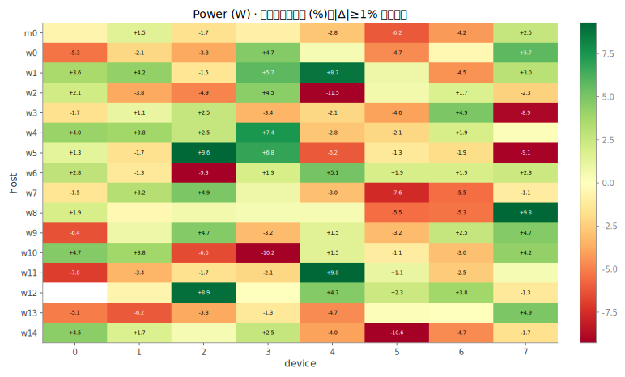

**`scalar_elems_per_s`**（host×device 相对集群中位偏差%（|Δ|≥1% 才标数））。本批中位≈**1.209e+11**。**含义**：长依赖串行链吞吐（元素/秒）。更贴近 Scalar/控制流+同步，不是 SIMD 峰值。  **底层**：`torch.cumsum`；elems_per_s = elems/dt；16M fp32。量纲不是 GFLOPS，勿与 vector 直接比倍速。

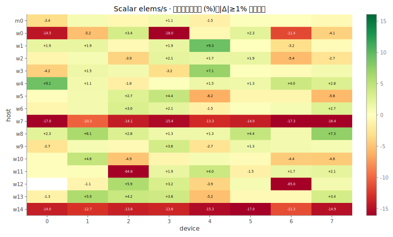

**`sfu_gflops`**（host×device 相对集群中位偏差%（|Δ|≥1% 才标数））。本批中位≈**177.4**。**含义**：特殊函数单元吞吐。字段叫 gflops，实现按 1 op/元素计，实质是 Gops/s 量级。  **底层**：默认 `torch.exp(x)`；`gflops≈elems/dt/1e9`；64M fp32。与 SDC 正确性探针不是一回事。

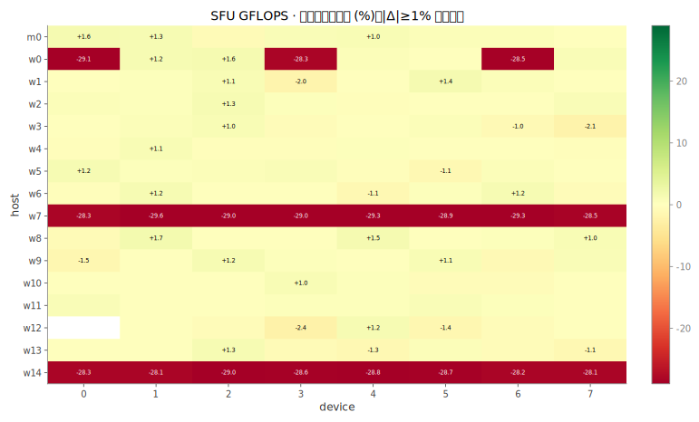

**`shape_sweep_peak_tflops`**（host×device 相对集群中位偏差%（|Δ|≥1% 才标数））。本批中位≈**286**。**含义**：名义「shape sweep 峰值」。  **底层**：本批以 BNMK sample 为主；旧 shape_sweep 开关关闭。

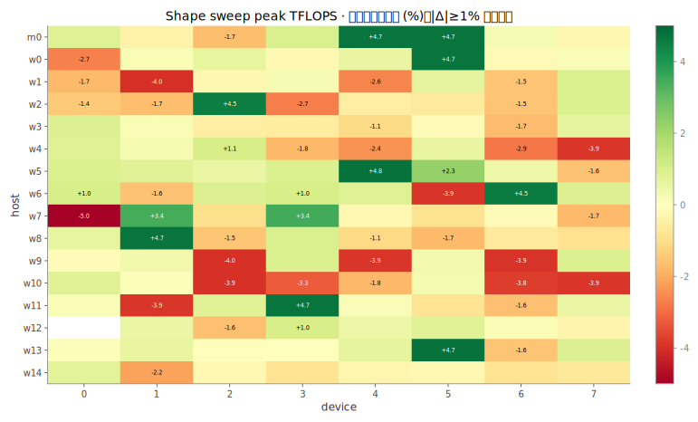

**`sustained_tflops`**（host×device 相对集群中位偏差%（|Δ|≥1% 才标数））。本批中位≈**280**。**含义**：稳态方阵 GEMM 吞吐（TFLOPS）。连续烤机后的可持续算力，用来看降频/争用，不是瞬时峰值。  **底层**：循环 `a@b` 跑满 ~30s，每窗 50 次 GEMM 用 CUDA Event 计时；**卡级字段取最后一个时间窗**（非中位）。N=8192 bf16。

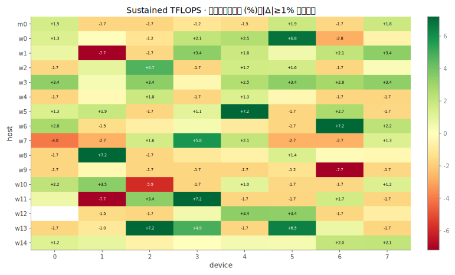

**`vector_gflops`**（host×device 相对集群中位偏差%（|Δ|≥1% 才标数））。本批中位≈**122.2**。**含义**：宽向量 FMA 吞吐代理（GFLOPS）。不是昇腾 Vector Core；沐曦上是 MACA 向量算子路径。  **底层**：逐元素 `a*b+c`，按 2 flops/elem；64M 元素 fp32；CUDA Event 中位。w20/i50。

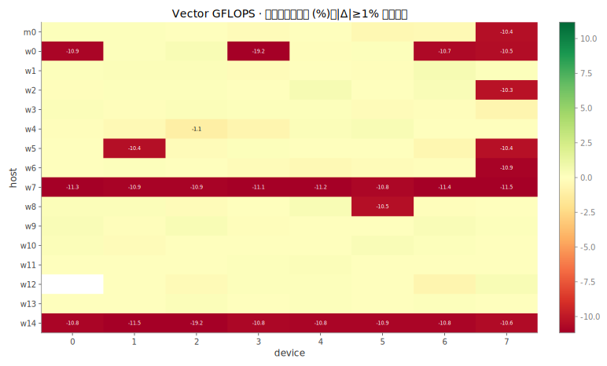

**`aicore_freq_mhz`**（全卡分布）。本批中位≈**1500**。**含义**：XCORE 时钟（MHz）。键名 `aicore_*` 兼容昇腾；沐曦来自 `clocks.XCORE.XCORE_CLK`。  **底层**：负载路径 TTL 合并 `mx-smi -j`；别名 `xcore_clk_mhz` / `sm_clock_mhz`。本批已落盘。

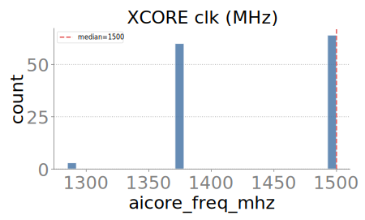

**`aicore_util_pct`**（全卡分布）。本批中位≈**98**。**含义**：GPU 利用率（%）。JSONL 键名 `aicore_*` 为昇腾同构兼容；沐曦语义是 GPU util。  **底层**：`mx-smi --show-usage`（TTL）。本批已落盘；别名 `gpu_util_pct`。

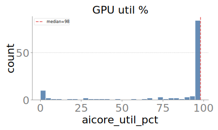

**`board_temp_c`**（全卡分布）。本批中位≈**54**。**含义**：板温（°C）。跨厂商通用键名；本批取 Board Temperature 传感器峰值。  **底层**：`mx-smi --show-temperature` TTL 合并（不覆盖 dmon hotspot/power）。本批已落盘。

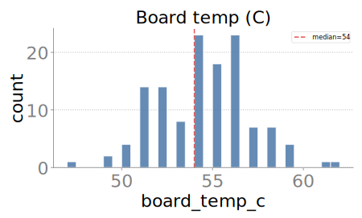

**`cube_vector_tflops`**（全卡分布）。本批中位≈**195.2**。**含义**：方阵 GEMM + Vector epilogue（scale+bias）端到端吞吐（TFLOPS）。字段名 `cube_*` 是昇腾同构遗留；沐曦上是 GEMM→向量衔接。  **底层**：`c=a@b; c*scale+bias`；FLOPs=`2N³+3N²`；N=4096 bf16。新别名 `gemm_epilogue_tflops`。

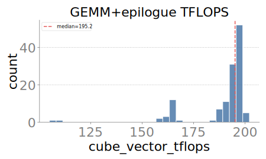

**`func_tflops`**（全卡分布）。本批中位≈**279.9**。**含义**：单卡方阵 GEMM 吞吐（TFLOPS）。测的是 MetaX 主算力路径，越高说明方阵乘越强。  **底层**：torch 算子 `a@b`（bf16），FLOPs=`2·N³`，CUDA/MACA Event（`torch.cuda`）计时取中位；N=8192，warmup=20，iters=50。

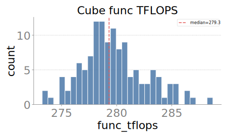

**`hbm_gbps`**（全卡分布）。本批中位≈**1469**。**含义**：HBM 有效带宽代理（GB/s）。反映高带宽内存读+写通路是否健康。  **底层**：设备侧大缓冲 `dst = src * 2.0`（fp32，含一次乘法，非纯 DMA）；流量按 R+W；Event 计时中位。默认 1024MB，w20/i50。

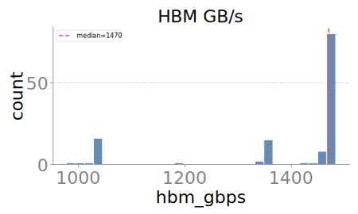

**`health_power_w`**（全卡分布）。本批中位≈**94.84**。**含义**：健康/轻载路径实时功耗（W），常近空闲。  **底层**：`mx-smi` → 实时功耗。**不要**和 `power_w`（负载末）直接相减当降频证据。

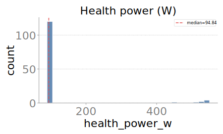

**`health_temp_c`**（全卡分布）。本批中位≈**38.5**。**含义**：健康/开测路径温度快照（°C）。沐曦侧默认是 hotspot/结温代理。  **底层**：`mx-smi`（`MxSmiProvider`）。与负载 `board_temp_c` / hotspot **不同时刻**；本批 JSONL 的 board_temp **已采集**（`--show-temperature` TTL；与 dmon hotspot 分传感器）。

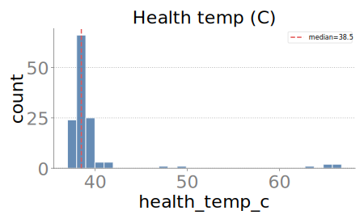

**`launch_burst_p50_us`**（全卡分布）。本批中位≈**1318**。**含义**：连续 enqueue 64 个极小核后一次 sync 的总时延 p50（µs）。  **底层**：CPU 计时 burst；看队列深度下的发射成本。

**`launch_burst_per_kernel_p50_us`**（全卡分布）。本批中位≈**20.59**。**含义**：突发总时延 / 64，每核摊销 p50（µs）。  **底层**：由 burst 派生。

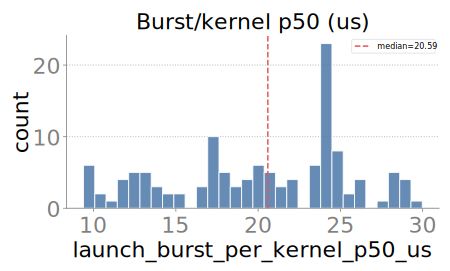

**`launch_host_overhead_p50_us`**（全卡分布）。本批中位≈**184**。**含义**：Host 侧发射开销 p50（µs）≈ wall − device event。  **底层**：极小核 add 的墙钟与 CUDA Event 差分；需 timing_method=event 才有意义。

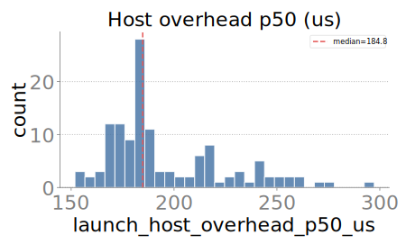

**`launch_host_overhead_p99_us`**（全卡分布）。本批中位≈**571.3**。**含义**：Host 发射开销 p99（µs）。  **底层**：同上。

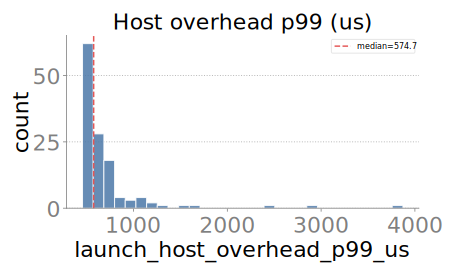

**`launch_sync_p50_us`**（全卡分布）。本批中位≈**2.69**。**含义**：空设备 `synchronize()` 往返延迟的 p50（µs）。反映驱动/设备响应基线。  **底层**：CPU `perf_counter` 包一层 `adapter.sync`（`torch.cuda.synchronize`）；samples=500，warmup=50。与 kernel 发射无关。

**`launch_sync_p99_us`**（全卡分布）。本批中位≈**4.319**。**含义**：同上的 p99（µs）。看调度抖动尾延迟。  **底层**：同 launch_latency 探针。

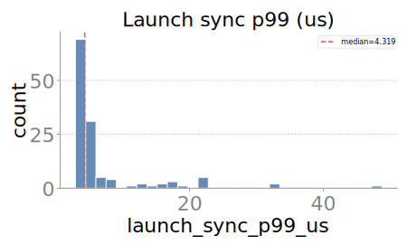

**`mte_gbps`**（全卡分布）。本批中位≈**1387**。**含义**：纯 copy / DMA 带宽（GB/s）。字段名 `mte_*` 是昇腾同构遗留；沐曦上测的是通用搬运通路。  **底层**：`Tensor.copy_`；流量按 R+W；512MB；CUDA/MACA Event 中位。新别名 `dma_copy_gbps`。

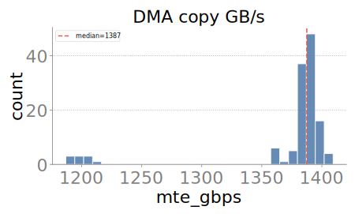

**`power_limit_w`**（全卡分布）。本批中位≈**550**。**含义**：功耗上限 / 功耗墙（W）。  **底层**：`mx-smi --show-board-power`；本批中位 550 W。

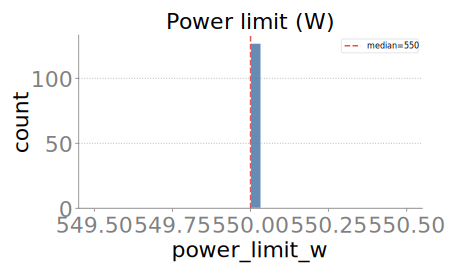

**`power_w`**（全卡分布）。本批中位≈**471**。**含义**：负载探针时段实时功耗（W）。  **底层**：`mx-smi` 功耗；卡级常取 vector_fma **末轮**。与 `health_power_w`（轻载健康快照）工况不同。

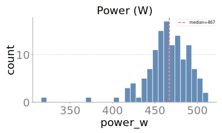

**`scalar_elems_per_s`**（全卡分布）。本批中位≈**1.209e+11**。**含义**：长依赖串行链吞吐（元素/秒）。更贴近 Scalar/控制流+同步，不是 SIMD 峰值。  **底层**：`torch.cumsum`；elems_per_s = elems/dt；16M fp32。量纲不是 GFLOPS，勿与 vector 直接比倍速。

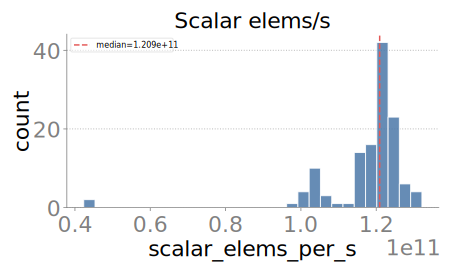

**`sfu_gflops`**（全卡分布）。本批中位≈**177.4**。**含义**：特殊函数单元吞吐。字段叫 gflops，实现按 1 op/元素计，实质是 Gops/s 量级。  **底层**：默认 `torch.exp(x)`；`gflops≈elems/dt/1e9`；64M fp32。与 SDC 正确性探针不是一回事。

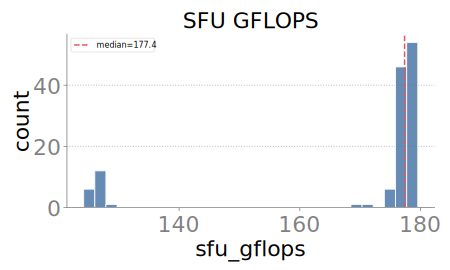

**`shape_sweep_peak_tflops`**（全卡分布）。本批中位≈**286**。**含义**：名义「shape sweep 峰值」。  **底层**：本批以 BNMK sample 为主；旧 shape_sweep 开关关闭。

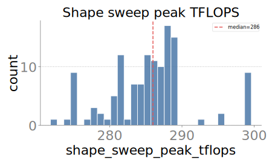

**`sustained_tflops`**（全卡分布）。本批中位≈**280**。**含义**：稳态方阵 GEMM 吞吐（TFLOPS）。连续烤机后的可持续算力，用来看降频/争用，不是瞬时峰值。  **底层**：循环 `a@b` 跑满 ~30s，每窗 50 次 GEMM 用 CUDA Event 计时；**卡级字段取最后一个时间窗**（非中位）。N=8192 bf16。

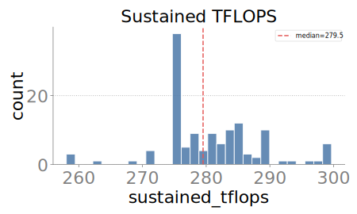

**`vector_gflops`**（全卡分布）。本批中位≈**122.2**。**含义**：宽向量 FMA 吞吐代理（GFLOPS）。不是昇腾 Vector Core；沐曦上是 MACA 向量算子路径。  **底层**：逐元素 `a*b+c`，按 2 flops/elem；64M 元素 fp32；CUDA Event 中位。w20/i50。

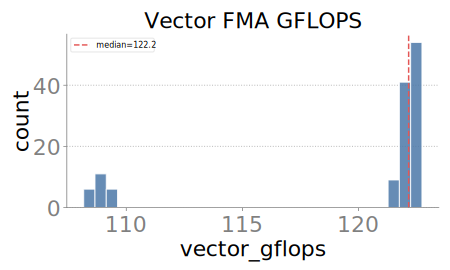

横轴 `func_tflops`，纵轴 `vector_gflops`（每卡一点）。**含义**：单卡方阵 GEMM 吞吐（TFLOPS）。测的是 MetaX 主算力路径，越高说明方阵乘越强。  **底层**：torch 算子 `a@b`（bf16），FLOPs=`2·N³`，CUDA/MACA Event（`torch.cuda`）计时取中位；N=8192，warmup=20，iters=50。 **含义**：宽向量 FMA 吞吐代理（GFLOPS）。不是昇腾 Vector Core；沐曦上是 MACA 向量算子路径。  **底层**：逐元素 `a*b+c`，按 2 flops/elem；64M 元素 fp32；CUDA Event 中位。w20/i50。

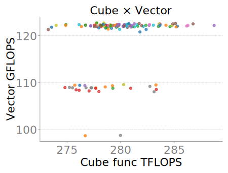

横轴 `hbm_gbps`，纵轴 `mte_gbps`（每卡一点）。**含义**：HBM 有效带宽代理（GB/s）。反映高带宽内存读+写通路是否健康。  **底层**：设备侧大缓冲 `dst = src * 2.0`（fp32，含一次乘法，非纯 DMA）；流量按 R+W；Event 计时中位。默认 1024MB，w20/i50。 **含义**：纯 copy / DMA 带宽（GB/s）。字段名 `mte_*` 是昇腾同构遗留；沐曦上测的是通用搬运通路。  **底层**：`Tensor.copy_`；流量按 R+W；512MB；CUDA/MACA Event 中位。新别名 `dma_copy_gbps`。

横轴 `health_power_w`，纵轴 `func_tflops`（每卡一点）。**含义**：健康/轻载路径实时功耗（W），常近空闲。  **底层**：`mx-smi` → 实时功耗。**不要**和 `power_w`（负载末）直接相减当降频证据。 **含义**：单卡方阵 GEMM 吞吐（TFLOPS）。测的是 MetaX 主算力路径，越高说明方阵乘越强。  **底层**：torch 算子 `a@b`（bf16），FLOPs=`2·N³`，CUDA/MACA Event（`torch.cuda`）计时取中位；N=8192，warmup=20，iters=50。

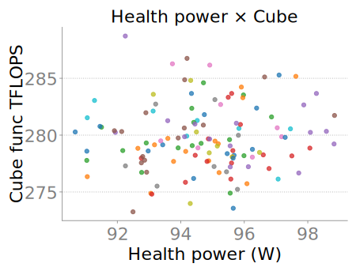

横轴 `health_power_w`，纵轴 `hbm_gbps`（每卡一点）。**含义**：健康/轻载路径实时功耗（W），常近空闲。  **底层**：`mx-smi` → 实时功耗。**不要**和 `power_w`（负载末）直接相减当降频证据。 **含义**：HBM 有效带宽代理（GB/s）。反映高带宽内存读+写通路是否健康。  **底层**：设备侧大缓冲 `dst = src * 2.0`（fp32，含一次乘法，非纯 DMA）；流量按 R+W；Event 计时中位。默认 1024MB，w20/i50。

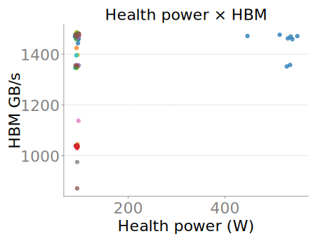

横轴 `power_w`，纵轴 `func_tflops`（每卡一点）。**含义**：负载探针时段实时功耗（W）。  **底层**：`mx-smi` 功耗；卡级常取 vector_fma **末轮**。与 `health_power_w`（轻载健康快照）工况不同。 **含义**：单卡方阵 GEMM 吞吐（TFLOPS）。测的是 MetaX 主算力路径，越高说明方阵乘越强。  **底层**：torch 算子 `a@b`（bf16），FLOPs=`2·N³`，CUDA/MACA Event（`torch.cuda`）计时取中位；N=8192，warmup=20，iters=50。

横轴 `power_w`，纵轴 `hbm_gbps`（每卡一点）。**含义**：负载探针时段实时功耗（W）。  **底层**：`mx-smi` 功耗；卡级常取 vector_fma **末轮**。与 `health_power_w`（轻载健康快照）工况不同。 **含义**：HBM 有效带宽代理（GB/s）。反映高带宽内存读+写通路是否健康。  **底层**：设备侧大缓冲 `dst = src * 2.0`（fp32，含一次乘法，非纯 DMA）；流量按 R+W；Event 计时中位。默认 1024MB，w20/i50。

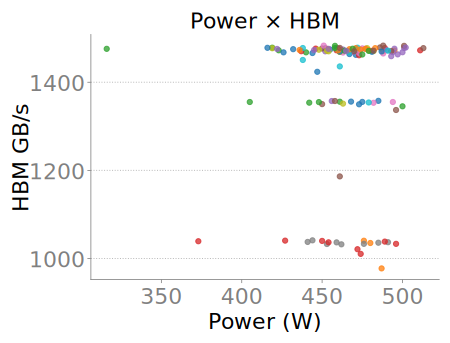

**`aicore_freq_mhz`**（单卡升序一览）。本批中位≈**1500**。**含义**：XCORE 时钟（MHz）。键名 `aicore_*` 兼容昇腾；沐曦来自 `clocks.XCORE.XCORE_CLK`。  **底层**：负载路径 TTL 合并 `mx-smi -j`；别名 `xcore_clk_mhz` / `sm_clock_mhz`。本批已落盘。

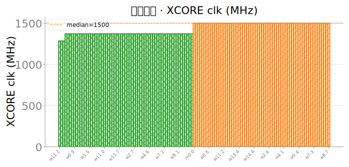

**`aicore_util_pct`**（单卡升序一览）。本批中位≈**98**。**含义**：GPU 利用率（%）。JSONL 键名 `aicore_*` 为昇腾同构兼容；沐曦语义是 GPU util。  **底层**：`mx-smi --show-usage`（TTL）。本批已落盘；别名 `gpu_util_pct`。

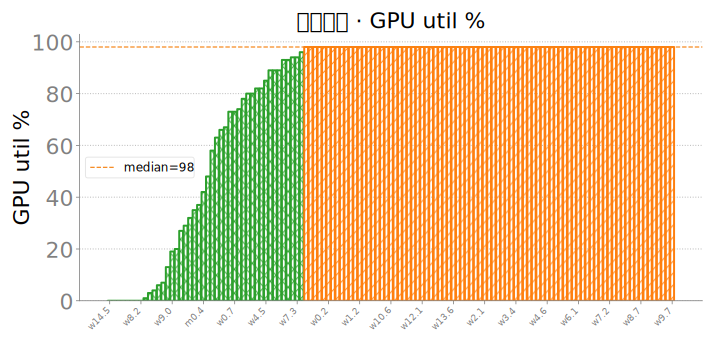

**`board_temp_c`**（单卡升序一览）。本批中位≈**54**。**含义**：板温（°C）。跨厂商通用键名；本批取 Board Temperature 传感器峰值。  **底层**：`mx-smi --show-temperature` TTL 合并（不覆盖 dmon hotspot/power）。本批已落盘。

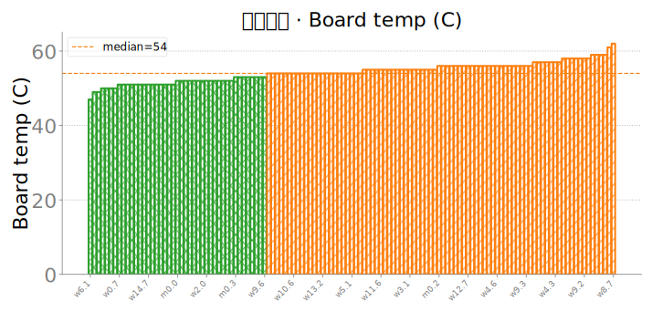

**`cube_vector_tflops`**（单卡升序一览）。本批中位≈**195.2**。**含义**：方阵 GEMM + Vector epilogue（scale+bias）端到端吞吐（TFLOPS）。字段名 `cube_*` 是昇腾同构遗留；沐曦上是 GEMM→向量衔接。  **底层**：`c=a@b; c*scale+bias`；FLOPs=`2N³+3N²`；N=4096 bf16。新别名 `gemm_epilogue_tflops`。

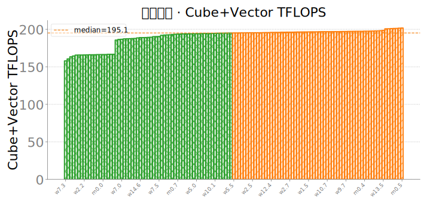

**`func_tflops`**（单卡升序一览）。本批中位≈**279.9**。**含义**：单卡方阵 GEMM 吞吐（TFLOPS）。测的是 MetaX 主算力路径，越高说明方阵乘越强。  **底层**：torch 算子 `a@b`（bf16），FLOPs=`2·N³`，CUDA/MACA Event（`torch.cuda`）计时取中位；N=8192，warmup=20，iters=50。

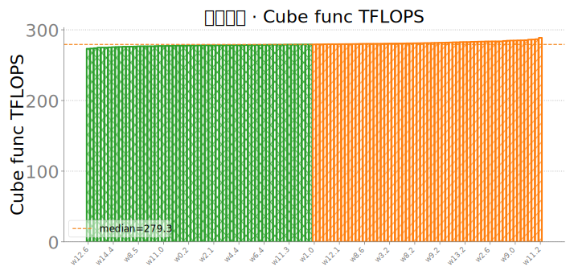

**`hbm_gbps`**（单卡升序一览）。本批中位≈**1469**。**含义**：HBM 有效带宽代理（GB/s）。反映高带宽内存读+写通路是否健康。  **底层**：设备侧大缓冲 `dst = src * 2.0`（fp32，含一次乘法，非纯 DMA）；流量按 R+W；Event 计时中位。默认 1024MB，w20/i50。

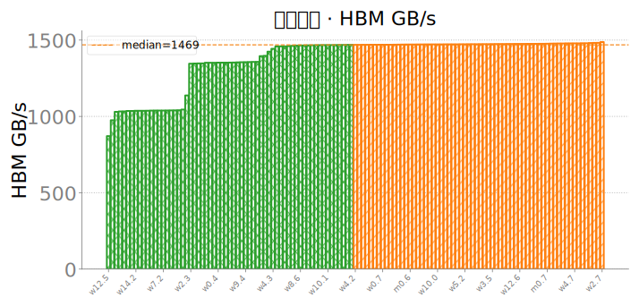

**`health_power_w`**（单卡升序一览）。本批中位≈**94.84**。**含义**：健康/轻载路径实时功耗（W），常近空闲。  **底层**：`mx-smi` → 实时功耗。**不要**和 `power_w`（负载末）直接相减当降频证据。

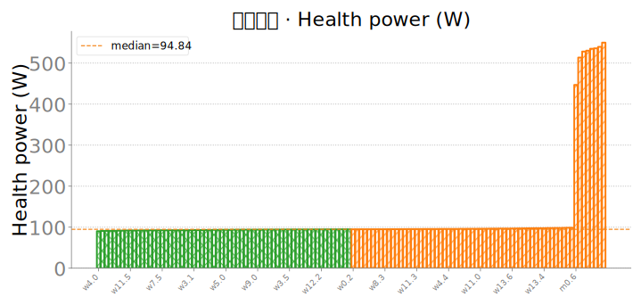

**`health_temp_c`**（单卡升序一览）。本批中位≈**38.5**。**含义**：健康/开测路径温度快照（°C）。沐曦侧默认是 hotspot/结温代理。  **底层**：`mx-smi`（`MxSmiProvider`）。与负载 `board_temp_c` / hotspot **不同时刻**；本批 JSONL 的 board_temp **已采集**（`--show-temperature` TTL；与 dmon hotspot 分传感器）。

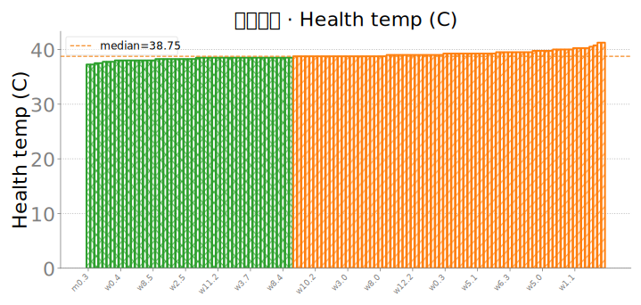

**`launch_burst_p50_us`**（单卡升序一览）。本批中位≈**1318**。**含义**：连续 enqueue 64 个极小核后一次 sync 的总时延 p50（µs）。  **底层**：CPU 计时 burst；看队列深度下的发射成本。

**`launch_burst_per_kernel_p50_us`**（单卡升序一览）。本批中位≈**20.59**。**含义**：突发总时延 / 64，每核摊销 p50（µs）。  **底层**：由 burst 派生。

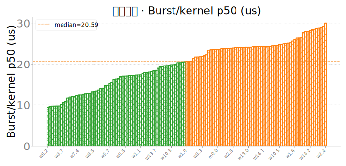

**`launch_host_overhead_p50_us`**（单卡升序一览）。本批中位≈**184**。**含义**：Host 侧发射开销 p50（µs）≈ wall − device event。  **底层**：极小核 add 的墙钟与 CUDA Event 差分；需 timing_method=event 才有意义。

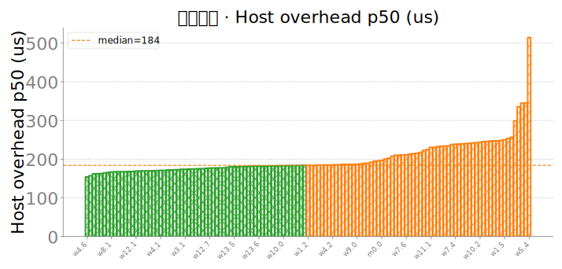

**`launch_host_overhead_p99_us`**（单卡升序一览）。本批中位≈**571.3**。**含义**：Host 发射开销 p99（µs）。  **底层**：同上。

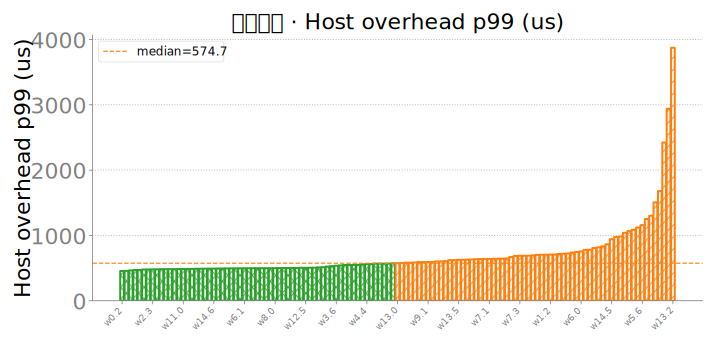

**`launch_sync_p50_us`**（单卡升序一览）。本批中位≈**2.69**。**含义**：空设备 `synchronize()` 往返延迟的 p50（µs）。反映驱动/设备响应基线。  **底层**：CPU `perf_counter` 包一层 `adapter.sync`（`torch.cuda.synchronize`）；samples=500，warmup=50。与 kernel 发射无关。

**`launch_sync_p99_us`**（单卡升序一览）。本批中位≈**4.319**。**含义**：同上的 p99（µs）。看调度抖动尾延迟。  **底层**：同 launch_latency 探针。

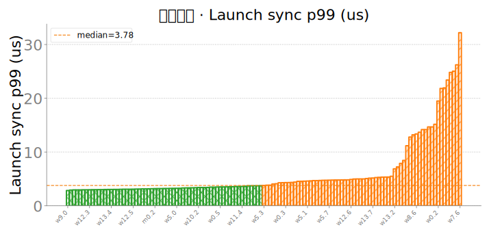

**`mte_gbps`**（单卡升序一览）。本批中位≈**1387**。**含义**：纯 copy / DMA 带宽（GB/s）。字段名 `mte_*` 是昇腾同构遗留；沐曦上测的是通用搬运通路。  **底层**：`Tensor.copy_`；流量按 R+W；512MB；CUDA/MACA Event 中位。新别名 `dma_copy_gbps`。

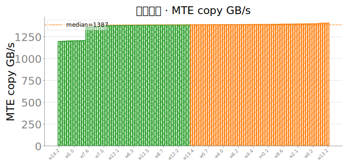

**`power_limit_w`**（单卡升序一览）。本批中位≈**550**。**含义**：功耗上限 / 功耗墙（W）。  **底层**：`mx-smi --show-board-power`；本批中位 550 W。

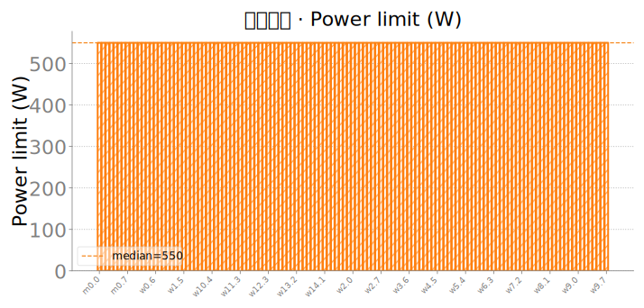

**`power_w`**（单卡升序一览）。本批中位≈**471**。**含义**：负载探针时段实时功耗（W）。  **底层**：`mx-smi` 功耗；卡级常取 vector_fma **末轮**。与 `health_power_w`（轻载健康快照）工况不同。

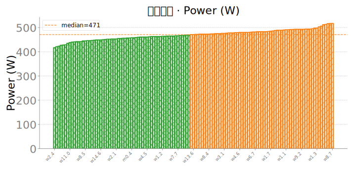

**`scalar_elems_per_s`**（单卡升序一览）。本批中位≈**1.209e+11**。**含义**：长依赖串行链吞吐（元素/秒）。更贴近 Scalar/控制流+同步，不是 SIMD 峰值。  **底层**：`torch.cumsum`；elems_per_s = elems/dt；16M fp32。量纲不是 GFLOPS，勿与 vector 直接比倍速。

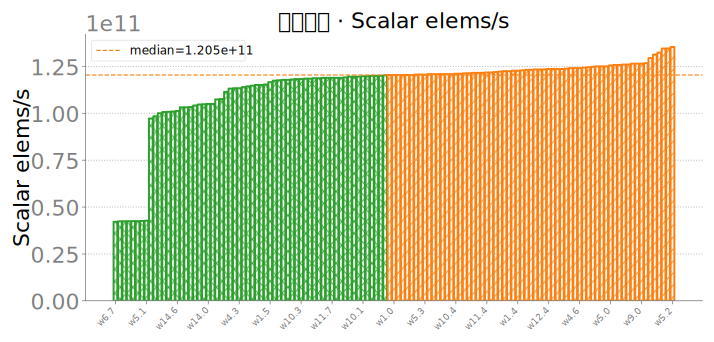

**`sfu_gflops`**（单卡升序一览）。本批中位≈**177.4**。**含义**：特殊函数单元吞吐。字段叫 gflops，实现按 1 op/元素计，实质是 Gops/s 量级。  **底层**：默认 `torch.exp(x)`；`gflops≈elems/dt/1e9`；64M fp32。与 SDC 正确性探针不是一回事。

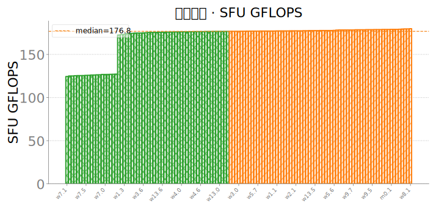

**`shape_sweep_peak_tflops`**（单卡升序一览）。本批中位≈**286**。**含义**：名义「shape sweep 峰值」。  **底层**：本批以 BNMK sample 为主；旧 shape_sweep 开关关闭。

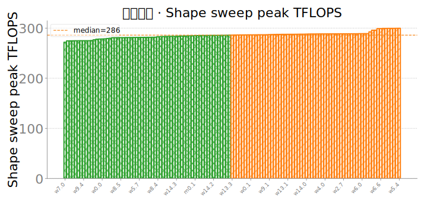

**`sustained_tflops`**（单卡升序一览）。本批中位≈**280**。**含义**：稳态方阵 GEMM 吞吐（TFLOPS）。连续烤机后的可持续算力，用来看降频/争用，不是瞬时峰值。  **底层**：循环 `a@b` 跑满 ~30s，每窗 50 次 GEMM 用 CUDA Event 计时；**卡级字段取最后一个时间窗**（非中位）。N=8192 bf16。

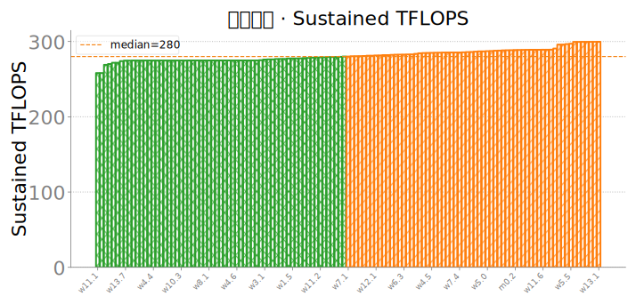

**`vector_gflops`**（单卡升序一览）。本批中位≈**122.2**。**含义**：宽向量 FMA 吞吐代理（GFLOPS）。不是昇腾 Vector Core；沐曦上是 MACA 向量算子路径。  **底层**：逐元素 `a*b+c`，按 2 flops/elem；64M 元素 fp32；CUDA Event 中位。w20/i50。

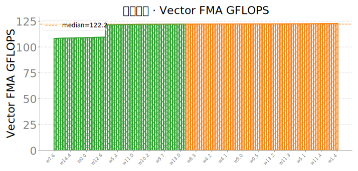

**稳态 GEMM 时间序列的跨卡分位**。原始明细 `record=gemm_sustained_sample`（iter / t_s / tflops）。每个 iter 上对全部卡的 tflops 取 **p05 与 p50**（覆盖不足 90% 卡的 iter 丢弃）；横轴用该 iter 上各卡 t_s 的中位。含义上：p50≈集群典型可持续算力轨迹，p05≈尾部偏慢卡轨迹——**不是**挑两张代表卡各自画一条线。 **含义**：稳态方阵 GEMM 吞吐（TFLOPS）。连续烤机后的可持续算力，用来看降频/争用，不是瞬时峰值。  **底层**：循环 `a@b` 跑满 ~30s，每窗 50 次 GEMM 用 CUDA Event 计时；**卡级字段取最后一个时间窗**（非中位）。N=8192 bf16。

