# Constitution 增强可视化报告

- 生成时间: 2026-07-11 14:11:35
- 卡数: 128
- 数据源: /Users/yinjinrun/random-thing/logs/card-fillgap-20260711_140301/results/constitution128.merged.jsonl

> 补充 plot_card_constitution 未覆盖的多维对比、CDF、相关矩阵、快慢卡分析。

## 核心指标 median / CV 摘要

| 指标 | n | median | CV% | min | max |
|------|---|--------|-----|-----|-----|
| Cube func TFLOPS | 128 | 292.4 | 1.899 | 273.3 | 302.8 |
| HBM GB/s | 128 | 1240.7 | 4.344 | 1012.4 | 1269.0 |
| Sustained TFLOPS | 128 | 306.9 | 1.387 | 294.8 | 313.7 |
| Vector GFLOPS | 128 | 98.82 | 0.311 | 98.05 | 99.47 |
| Scalar elems/s | 128 | 2.80e+08 | 0.7733 | 2.62e+08 | 2.80e+08 |
| MTE copy GB/s | 128 | 1267.9 | 0.2556 | 1255.3 | 1271.1 |
| Cube+Vector TFLOPS | 128 | 240.2 | 2.544 | 225.3 | 254.6 |
| SFU GFLOPS | 128 | 156.5 | 0.8917 | 152.3 | 159.2 |
| HBM 顺序拷贝 GB/s | 128 | 1268.0 | 0.2729 | 1253.9 | 1271.2 |
| HBM 跨步 GB/s | 128 | 20.04 | 0.1651 | 19.87 | 20.1 |
| HBM 读密集 GB/s | 128 | 1454.5 | 0.7419 | 1419.3 | 1481.1 |
| HBM 写密集 GB/s | 128 | 1468.1 | 0.5876 | 1436.6 | 1471.3 |
| Launch sync p99 (μs) | 128 | 6.78 | 36.9 | 5.81 | 26.28 |
| Host overhead p99 (μs) | 128 | 628.7 | 8.35 | 567.5 | 898.4 |
| Burst total p50 (μs) | 128 | 472.5 | 16.73 | 364.7 | 794.5 |

## 元数据

- hosts (8): master-0, worker-0, worker-1, worker-2, worker-3, worker-4, worker-5, worker-6

## 图表

### radar host median norm

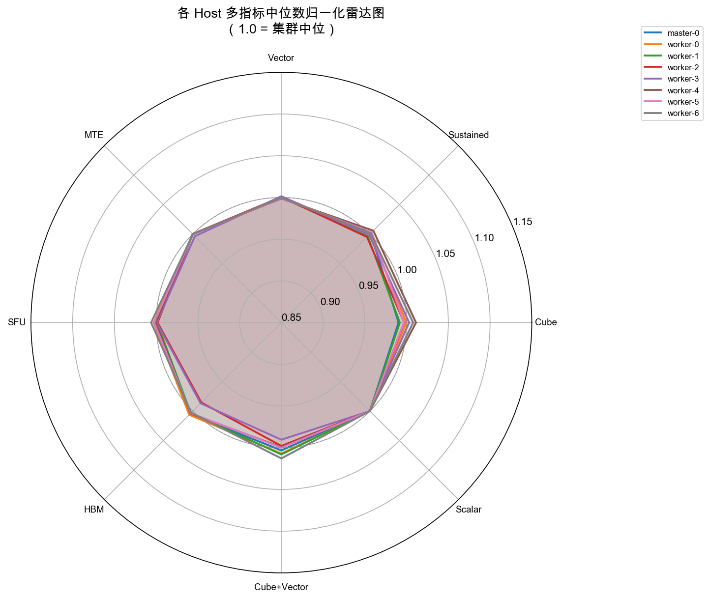

### parallel host median norm

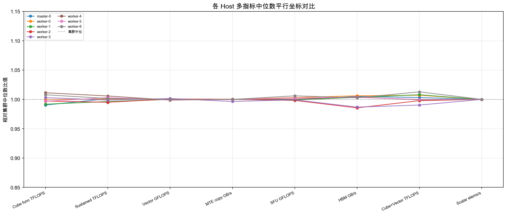

### hbm modes grouped bar

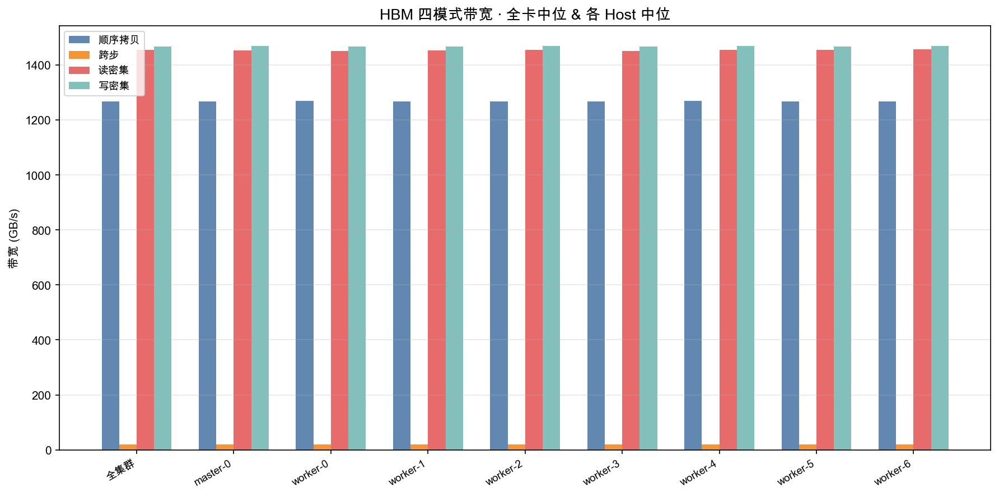

### corr cube vector sfu mte

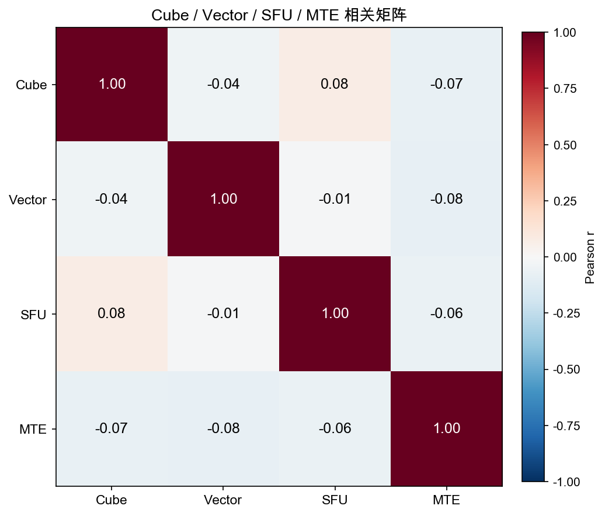

### box launch by host

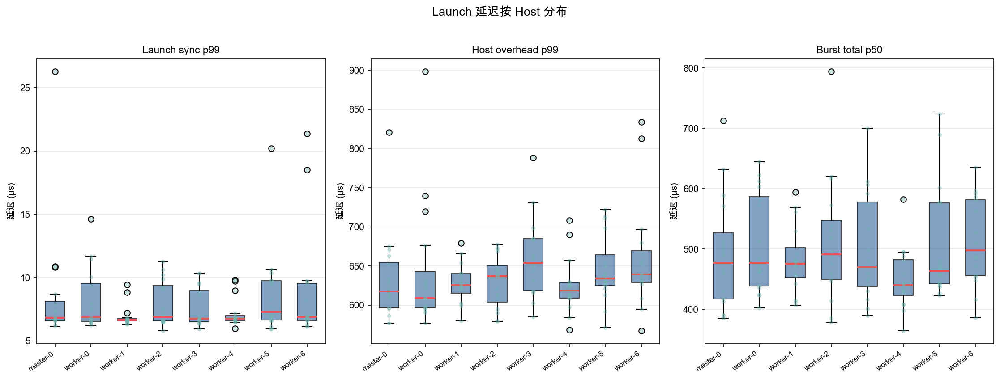

### cdf core metrics

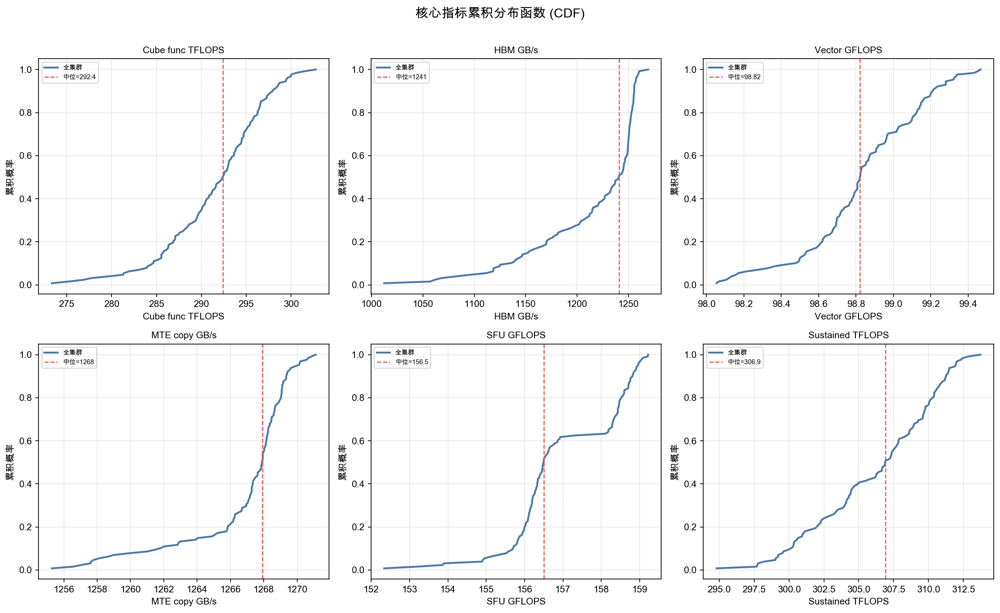

### extreme10 small multiples

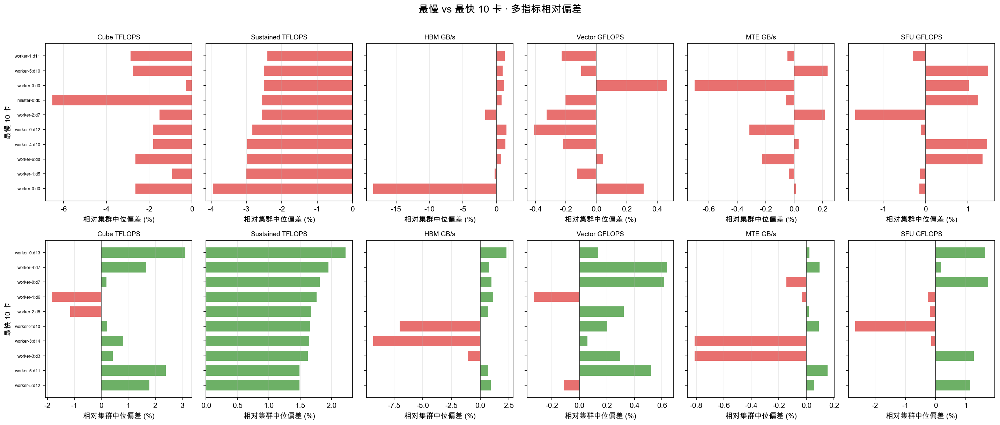

### heatmap host device vector gflops

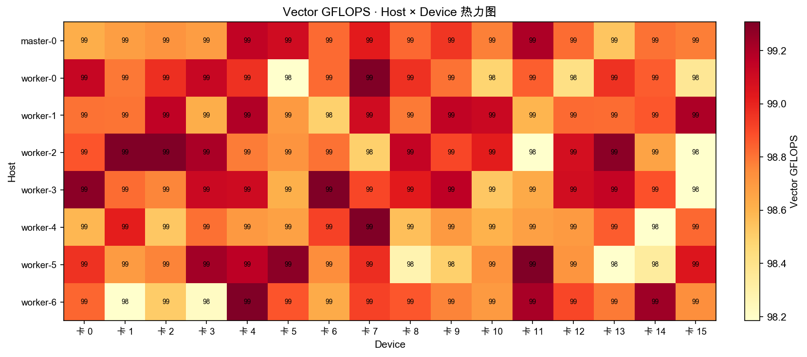

### heatmap host device mte gbps

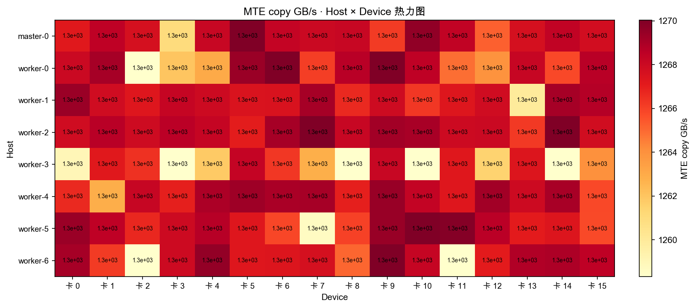

### heatmap host device sfu gflops

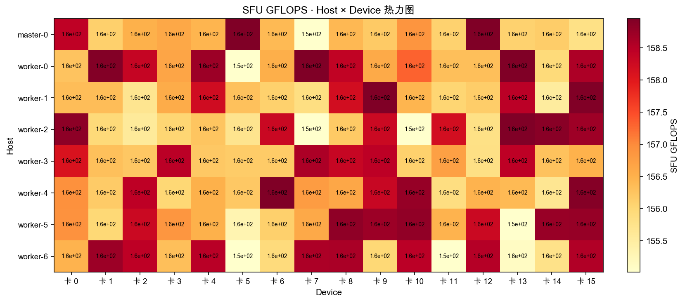

### heatmap host device scalar elems per s

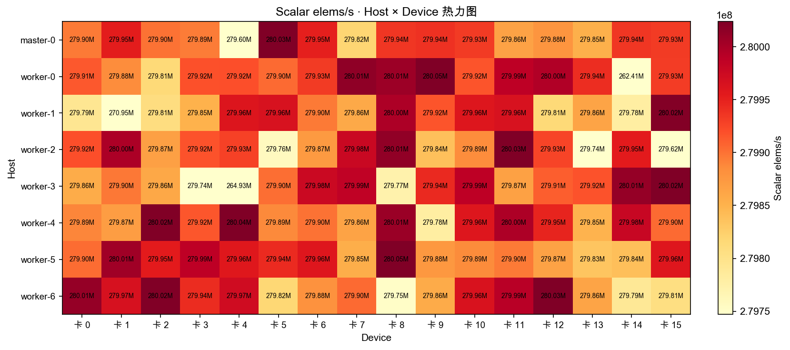

### scatter sustained vs func

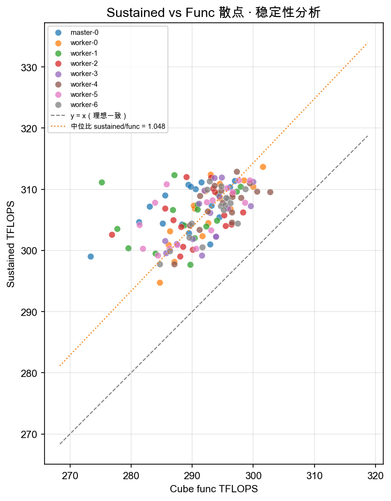

