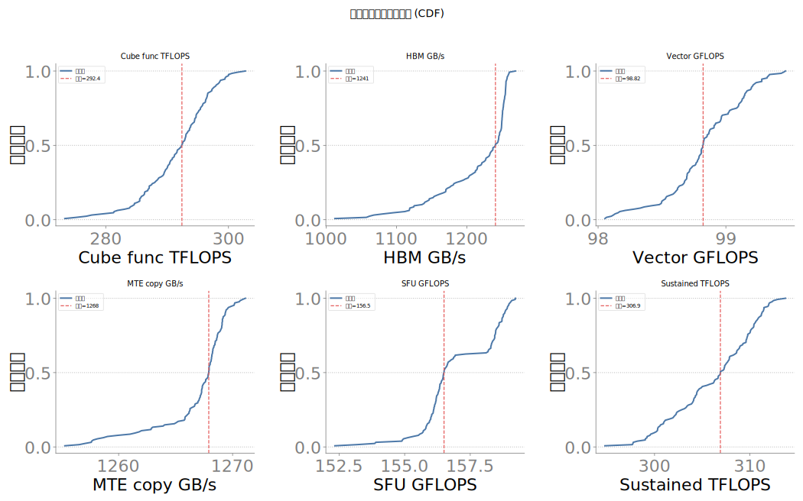
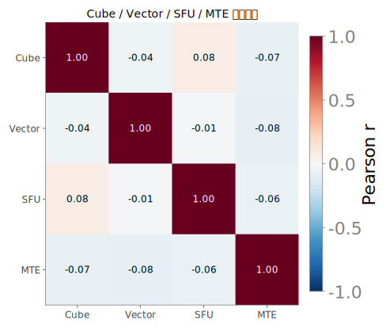
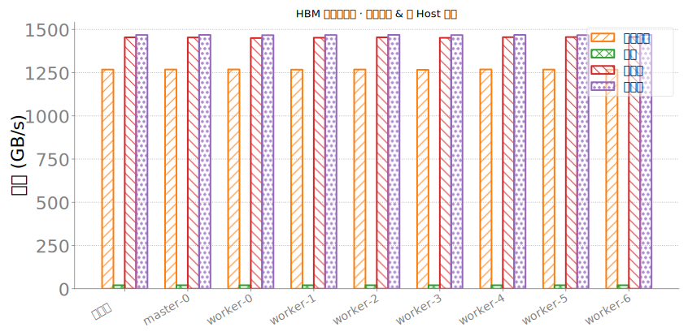
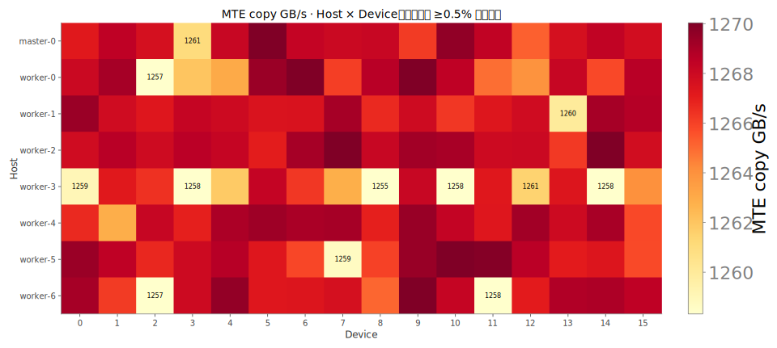
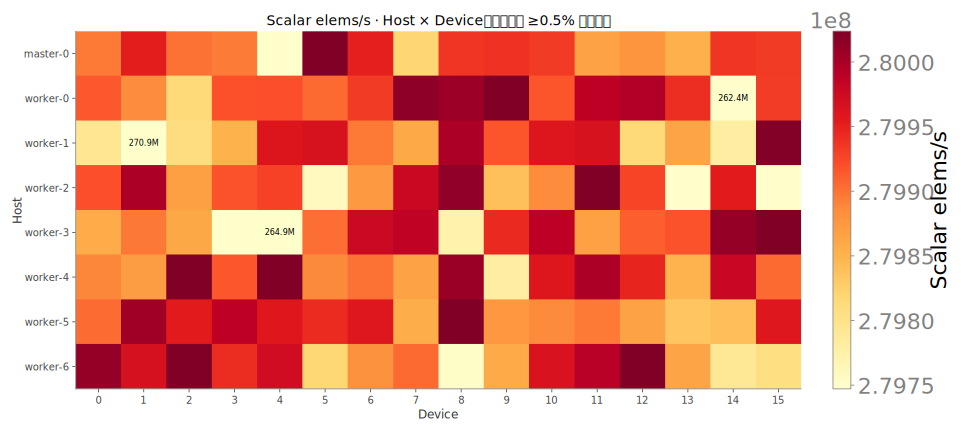
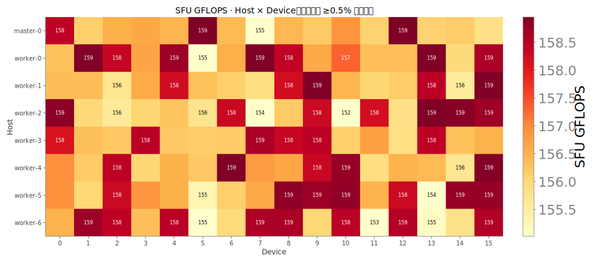
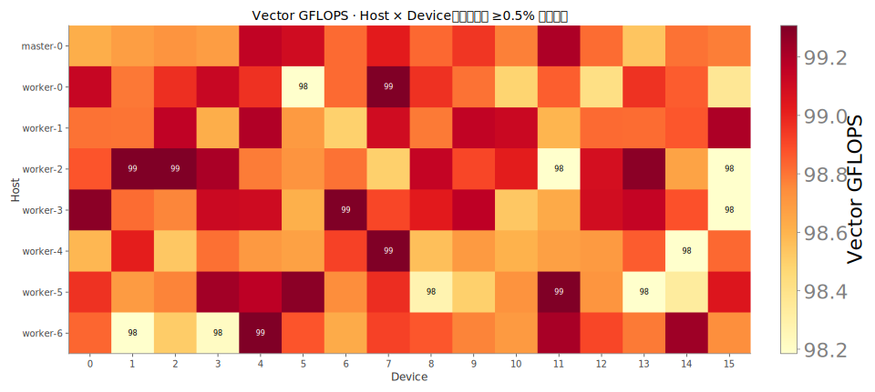
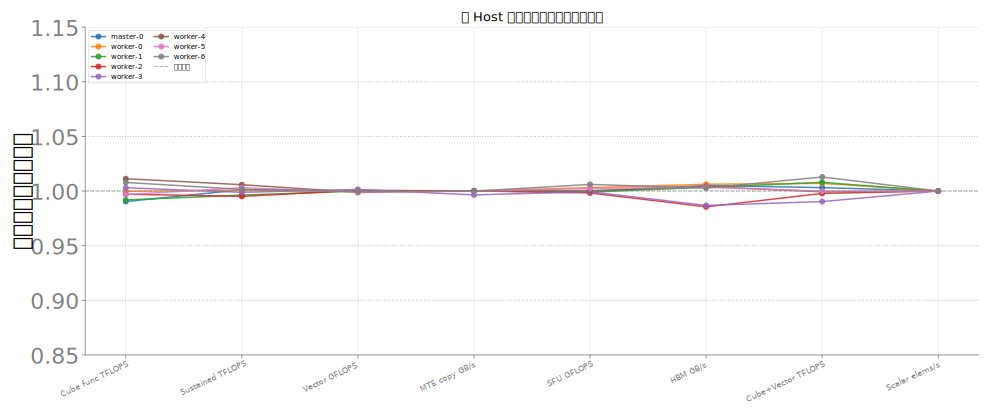
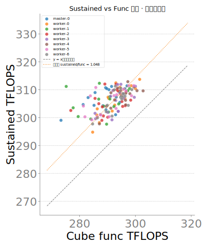

# Constitution 增强图 · 20260711

字段含义见 [`METRIC_SEMANTICS_20260711.md`](METRIC_SEMANTICS_20260711.md)。同一 fillgap merged JSONL。

**box_launch_by_host.svg**：Launch 延迟分 host：空 sync p99、host 发射开销 p99、突发总时延 p50。**含义**：同上的 p99（µs）。看调度抖动尾延迟。  **底层**：同 launch_latency 探针。

**cdf_core_metrics.svg**：核心吞吐指标的经验分布函数（CDF）。

**corr_cube_vector_sfu_mte.svg**：Cube / Vector / SFU / MTE 四路吞吐的 Pearson 相关。看子系统是否同涨同跌；相关≈0 表示彼此相对独立。

**extreme10_small_multiples.svg**：按 `sustained_tflops` 最慢/最快各 10 卡，多指标相对集群中位偏差。用来对照「慢卡是否多项一起慢」。

**hbm_modes_grouped_bar.svg**：四种 HBM 访问模式带宽：`seq_copy` / `strided` / `read_heavy` / `write_heavy`。底层是 `hbm_modes_perf`（copy / 跨步 / sum / fill），单位 GB/s；**跨模式绝对值不可直接比「谁更好」**。

**heatmap_host_device_mte_gbps.svg**：host×device 上的 **`mte_gbps` 绝对值**。**含义**：纯拷贝带宽（GB/s）。代理 MTE/DMA 搬运通路，用来拆「算发访存」vs「纯搬运」。  **底层**：`Tensor.copy_`；流量按 R+W；512MB；Event 中位。w20/i50。

**heatmap_host_device_scalar_elems_per_s.svg**：host×device 上的 **`scalar_elems_per_s` 绝对值**。**含义**：长依赖串行链吞吐（元素/秒）。更贴近 Scalar/控制流+同步，不是 SIMD 峰值。  **底层**：`torch.cumsum`；elems_per_s = elems/dt；16M fp32。量纲不是 GFLOPS，勿与 vector 直接比倍速。

**heatmap_host_device_sfu_gflops.svg**：host×device 上的 **`sfu_gflops` 绝对值**。**含义**：特殊函数单元吞吐。字段叫 gflops，实现按 1 op/元素计，实质是 Gops/s 量级。  **底层**：默认 `torch.exp(x)`；`gflops≈elems/dt/1e9`；64M fp32。与 SDC 正确性探针不是一回事。

**heatmap_host_device_vector_gflops.svg**：host×device 上的 **`vector_gflops` 绝对值**。**含义**：Vector 单元 FMA 吞吐（GFLOPS）。代理 Ascend Vector 宽并行，不是 Cube。  **底层**：逐元素 `a*b+c`，按 2 flops/elem；64M 元素 fp32；NPU Event 中位。w20/i50。

**parallel_host_median_norm.svg**：与雷达同一套 host 中位归一化，平行坐标展示。

**radar_host_median_norm.svg**：各 host 在多指标上的**中位相对集群中位**（1.0=集群水平）。用来看机间体质是否齐，不是单卡绝对值。

**scatter_sustained_vs_func.svg**：横轴短测 Cube，纵轴稳态 Cube。**含义**：单卡 Cube 矩阵乘吞吐（TFLOPS）。测的是昇腾 Cube 主算力路径，越高说明方阵 GEMM 越强。  **底层**：torch 算子 `a@b`（bf16），FLOPs=`2·N³`，NPU Event 计时取中位；N=8192，warmup=20，iters=50。 **含义**：稳态 Cube 吞吐（TFLOPS）。连续烤机后的可持续算力，用来看降频/争用，不是瞬时峰值。  **底层**：循环 `a@b` 跑满 ~30s，每窗 50 次 GEMM 用 NPU Event 计时；**卡级字段取最后一个时间窗**（非中位）。N=8192 bf16。

