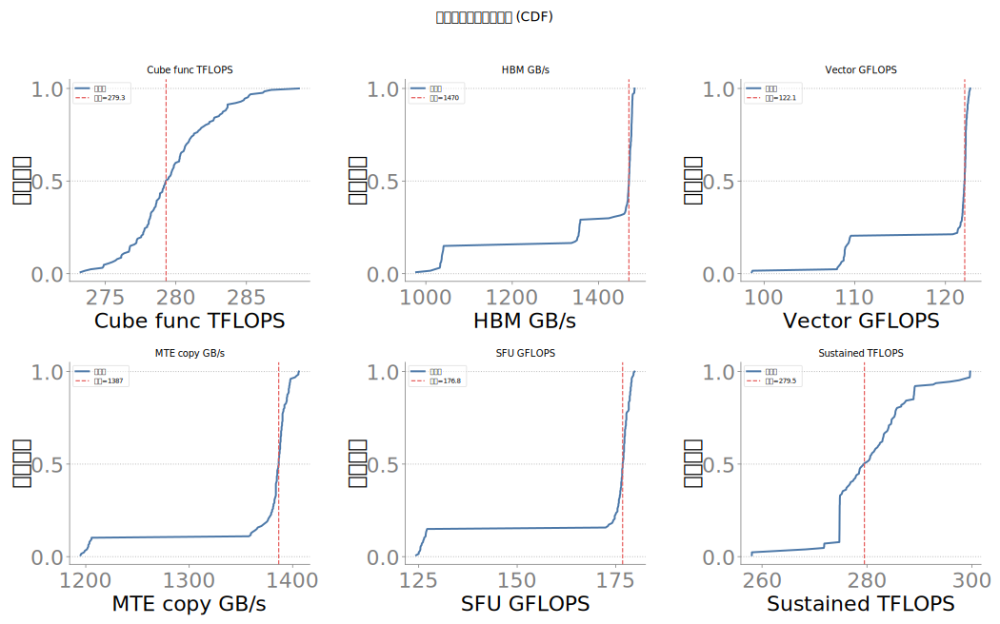
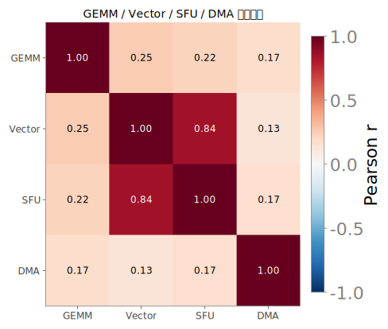
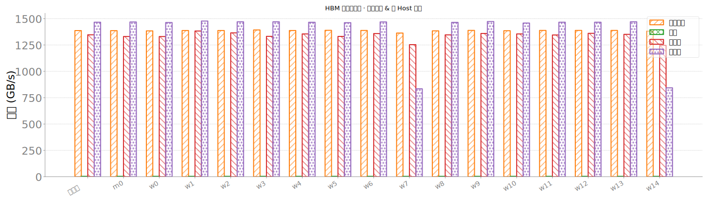
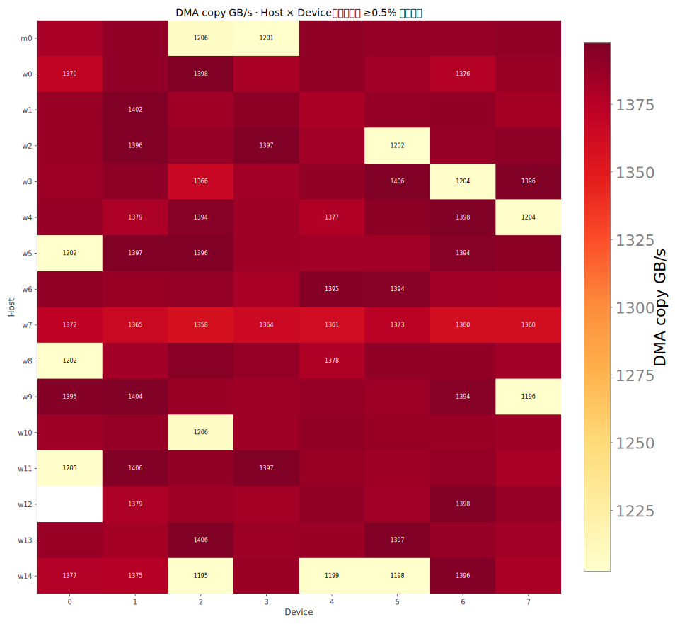
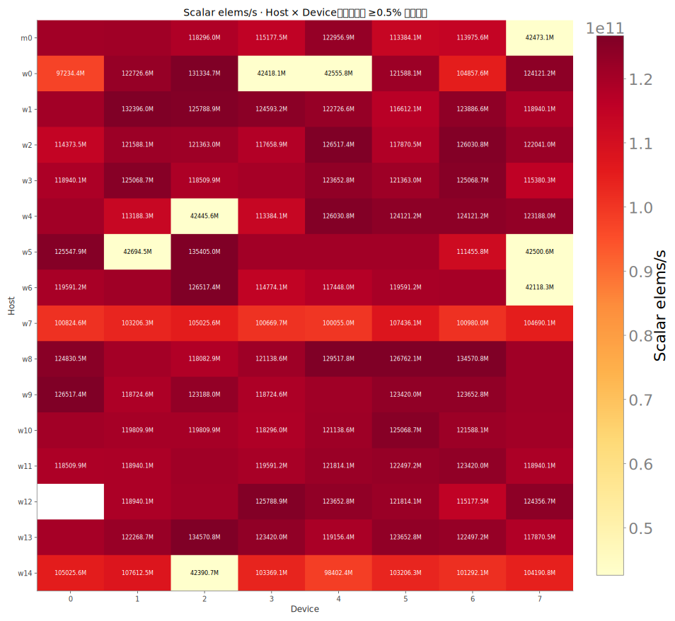
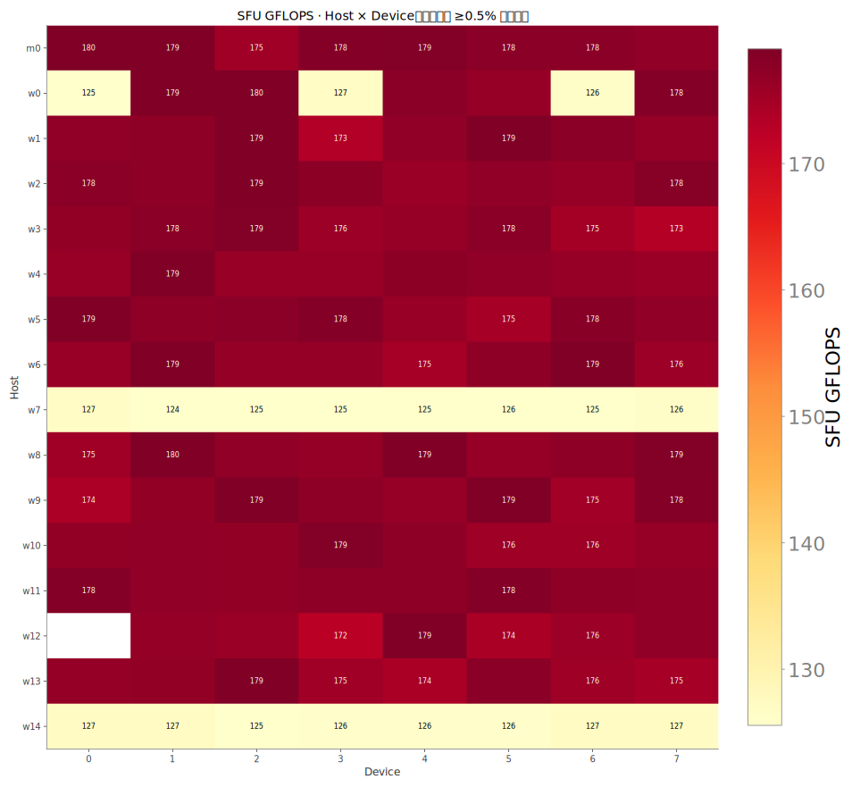
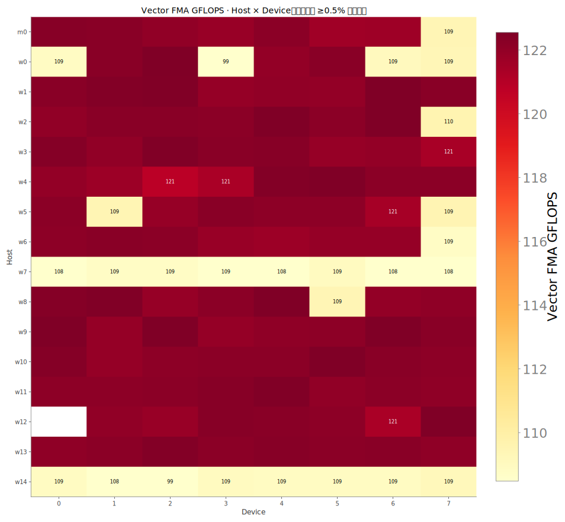
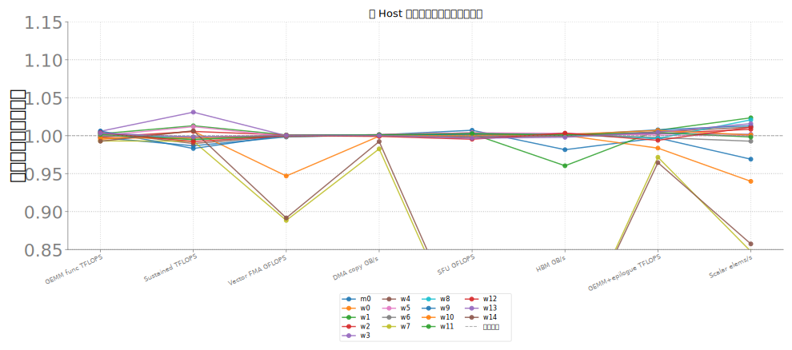
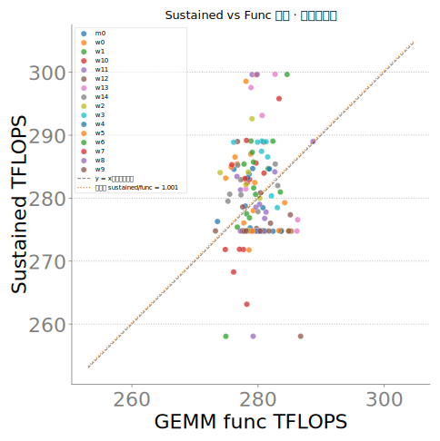

# Constitution 增强图 · Muxi · 20260711

**怎么读**：硬件词条 [`METAX_HARDWARE_GLOSSARY_20260711.md`](METAX_HARDWARE_GLOSSARY_20260711.md)；字段测法 [`METRIC_SEMANTICS_MUXI_20260711.md`](METRIC_SEMANTICS_MUXI_20260711.md)。同一 constitution merged JSONL（`muxi-constitution-20260711_232400-…`）。Cube/MTE 等为同构壳键名，实测为 MetaX/MACA 探针路径。

**box_launch_by_host.svg**：Launch 延迟分 host：`launch_sync_p99_us` / `launch_host_overhead_p99_us` / `launch_burst_p50_us`。**含义**：空 sync / host 发射开销 / 突发总时延（µs），看调度抖动尾延迟。  **底层**：`launch_latency` 探针（CPU 计时 + CUDA sync/Event）。

**cdf_core_metrics.svg**：核心吞吐指标的经验分布函数（CDF）。**含义**：对 `func_tflops` / `hbm_gbps` / `vector_gflops` 等卡级字段做 ECDF，看集群齐性与尾部。  **底层**：同 constitution merged JSONL 的 stage_a/c 探针中位。

**corr_cube_vector_sfu_mte.svg**：方阵 GEMM / 宽向量算子 / SFU（特殊函数吞吐代理，默认 `torch.exp`，按 1 op/元素计）/ 纯 copy 四路吞吐的 Pearson 相关。图名中的 `cube` / `mte` 是昇腾同构遗留键名；沐曦实际走 MetaX MACA 的 GEMM、逐元素算子与 `Tensor.copy_` DMA copy 路径，不表示存在 Ascend Cube/MTE 硬件。看子系统是否同涨同跌；相关≈0 表示彼此相对独立。

**extreme10_small_multiples.svg**：按 `sustained_tflops` 最慢/最快各 10 卡，多指标相对集群中位偏差。**含义**：极端卡剖面；对照「慢卡是否多项一起慢」。  **底层**：同 merged JSONL 卡级字段。

**hbm_modes_grouped_bar.svg**：四种 HBM（高带宽外存）访问模式带宽：`seq_copy` / `strided` / `read_heavy` / `write_heavy`。底层是 `hbm_modes_perf`（copy / 跨步 / sum / fill），单位 GB/s；**跨模式绝对值不可直接比「谁更好」**。

**heatmap_host_device_mte_gbps.svg**：host×device 上的 **`mte_gbps` 绝对值**。**含义**：纯 copy / DMA 带宽（GB/s）。`mte_*` 只是与昇腾报告对齐的同构键名；沐曦实际走 MetaX MACA 的 `Tensor.copy_` DMA copy 路径，不表示存在 Ascend MTE 硬件。  **底层**：`Tensor.copy_`；流量按 R+W；512MB；CUDA/MACA Event 中位。新别名 `dma_copy_gbps`。

**heatmap_host_device_scalar_elems_per_s.svg**：host×device 上的 **`scalar_elems_per_s` 绝对值**。**含义**：长依赖串行链吞吐（元素/秒），是 MetaX MACA `torch.cumsum` 路径的控制流与同步代理，不对应昇腾 Scalar 硬件，也不是 SIMD 峰值。  **底层**：`torch.cumsum`；elems_per_s = elems/dt；16M fp32。量纲不是 GFLOPS，勿与 vector 直接比倍速。

**heatmap_host_device_sfu_gflops.svg**：host×device 上的 **`sfu_gflops` 绝对值**。**含义**：特殊函数单元吞吐。字段叫 gflops，实现按 1 op/元素计，实质是 Gops/s 量级。  **底层**：默认 `torch.exp(x)`；`gflops≈elems/dt/1e9`；64M fp32。与 SDC 正确性探针不是一回事。

**heatmap_host_device_vector_gflops.svg**：host×device 上的 **`vector_gflops` 绝对值**。**含义**：宽向量 FMA 吞吐代理（GFLOPS）。这是同构字段名；沐曦实际走 MetaX MACA 逐元素算子路径，不对应昇腾 Vector Core。  **底层**：逐元素 `a*b+c`，按 2 flops/elem；64M 元素 fp32；CUDA Event 中位。w20/i50。

**parallel_host_median_norm.svg**：与雷达同一套 host 中位归一化，平行坐标展示。**含义**：各 host 多指标相对集群中位（1.0=集群水平），便于对照机间偏斜。  **底层**：host 中位 / 集群中位；字段同 constitution 探针。

**radar_host_median_norm.svg**：各 host 在多指标上的**中位相对集群中位**（1.0=集群水平）。**含义**：机间体质齐性雷达；不是单卡绝对值。  **底层**：host 中位 / 集群中位；字段同 constitution 探针。

**scatter_sustained_vs_func.svg**：横轴短测方阵 GEMM，纵轴稳态 GEMM。**含义**：单卡方阵 GEMM 吞吐（TFLOPS）。测的是 MetaX 主算力路径，越高说明方阵乘越强。  **底层**：torch 算子 `a@b`（bf16），FLOPs=`2·N³`，CUDA/MACA Event（`torch.cuda`）计时取中位；N=8192，warmup=20，iters=50。 **含义**：稳态方阵 GEMM 吞吐（TFLOPS）。连续烤机后的可持续算力，用来看降频/争用，不是瞬时峰值。  **底层**：循环 `a@b` 跑满 ~30s，每窗 50 次 GEMM 用 CUDA Event 计时；**卡级字段取最后一个时间窗**（非中位）。N=8192 bf16。

