# Constitution 增强可视化报告

- 生成时间: 2026-07-11 16:59:29
- 卡数: 128
- 数据源: /Users/yinjinrun/random-thing/logs/card-constitution-128-20260711_134309-constitution128/results/constitution128.merged.jsonl

> 补充 plot_card_constitution 未覆盖的多维对比、CDF、相关矩阵、快慢卡分析。

## 核心指标 median / CV 摘要

| 指标 | n | median | CV% | min | max |
|------|---|--------|-----|-----|-----|
| Cube func TFLOPS | 128 | 291.7 | 2.245 | 268.5 | 302.7 |
| HBM GB/s | 128 | 1241.7 | 3.969 | 1051.4 | 1264.0 |
| Sustained TFLOPS | 128 | 306.4 | 1.406 | 294.7 | 314.2 |
| Vector GFLOPS | 128 | 98.81 | 0.3645 | 97.81 | 99.45 |
| Scalar elems/s | 128 | 2.80e+08 | 0.5506 | 2.62e+08 | 2.80e+08 |
| MTE copy GB/s | 128 | 1267.4 | 0.303 | 1255.4 | 1270.8 |
| Cube+Vector TFLOPS | 128 | 239.5 | 2.436 | 227.3 | 254.6 |
| SFU GFLOPS | 128 | 156.6 | 0.8479 | 153.4 | 159.0 |
| HBM 顺序拷贝 GB/s | 128 | 1267.8 | 0.2389 | 1256.7 | 1270.8 |
| HBM 跨步 GB/s | 128 | 20.03 | 0.1513 | 19.89 | 20.09 |
| HBM 读密集 GB/s | 128 | 1453.8 | 0.914 | 1410.2 | 1484.7 |
| HBM 写密集 GB/s | 128 | 1467.5 | 0.7662 | 1401.8 | 1472.9 |
| Launch sync p99 (μs) | 128 | 6.971 | 52.43 | 5.852 | 35.13 |
| Host overhead p99 (μs) | 128 | 630.3 | 7.251 | 558.7 | 905.0 |
| Burst total p50 (μs) | 128 | 467.6 | 16.6 | 367.3 | 674.3 |

## 元数据

- hosts (8): master-0, worker-0, worker-1, worker-2, worker-3, worker-4, worker-5, worker-6

## 图表

### radar host median norm

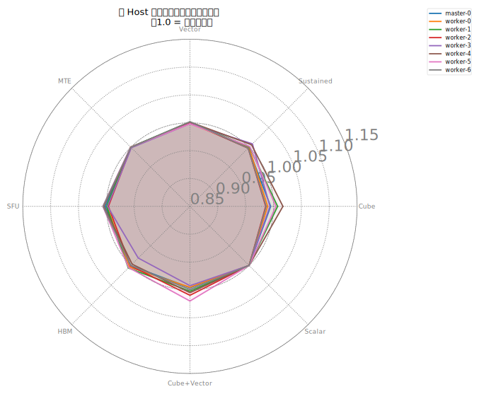

### parallel host median norm

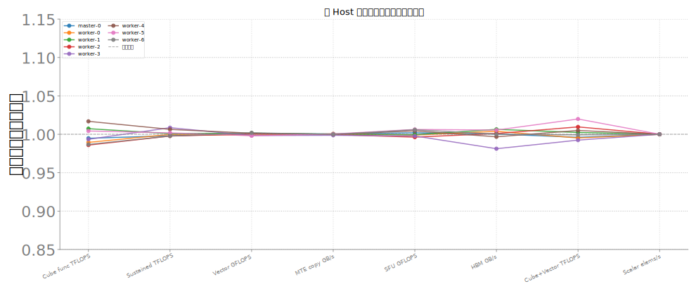

### hbm modes grouped bar

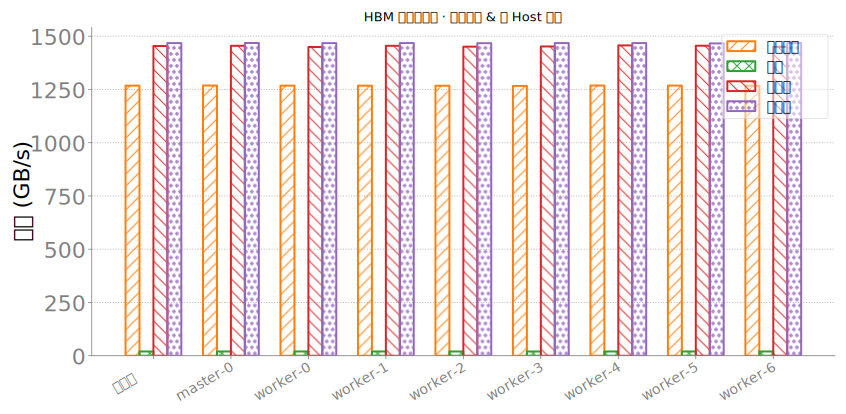

### corr cube vector sfu mte

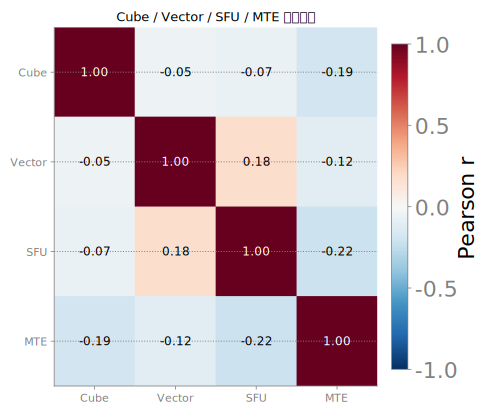

### box launch by host

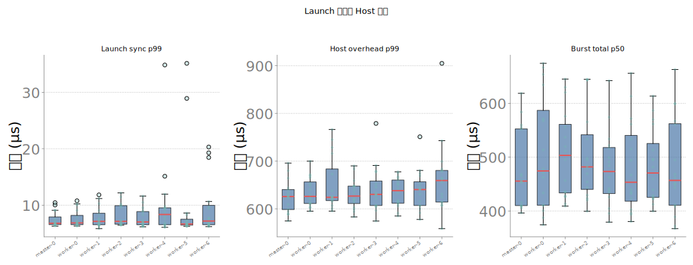

### cdf core metrics

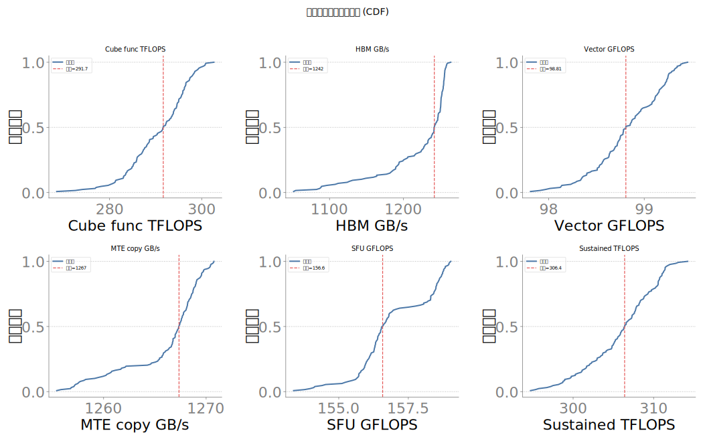

### extreme10 small multiples

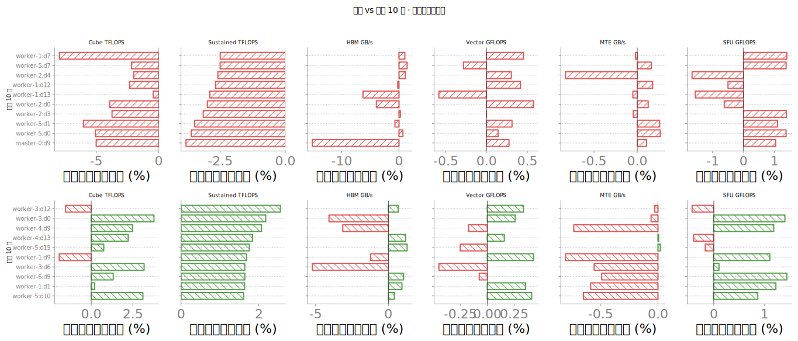

### heatmap host device vector gflops

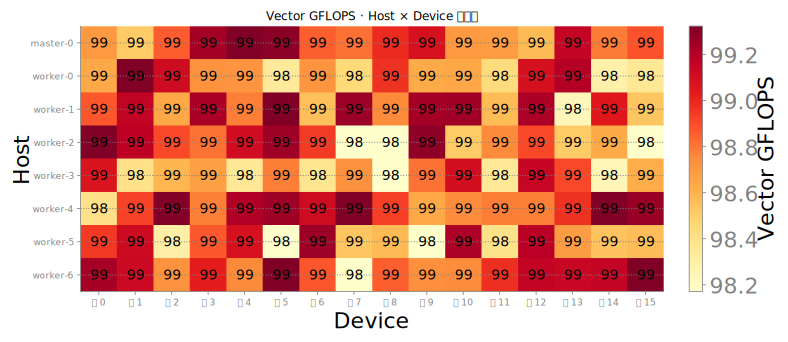

### heatmap host device mte gbps

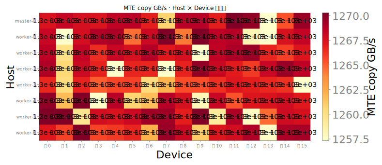

### heatmap host device sfu gflops

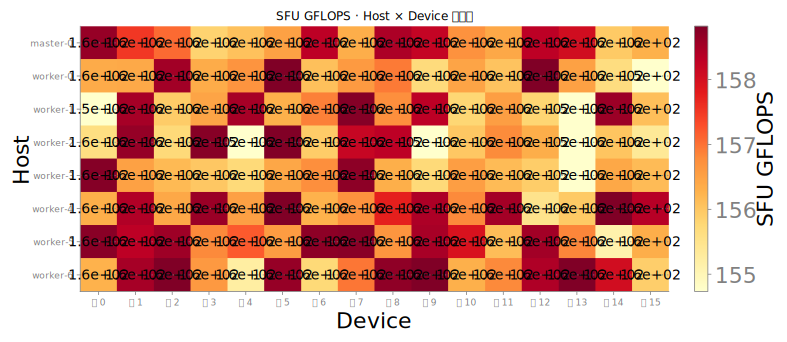

### heatmap host device scalar elems per s

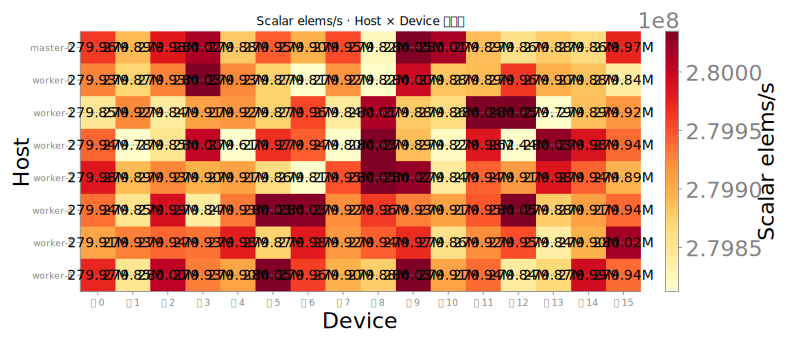

### scatter sustained vs func

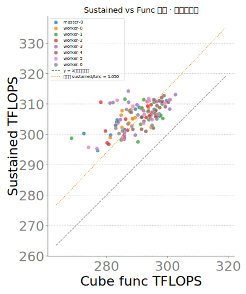

