# HCCL 通信 · 20260711

语义详见 [`METRIC_SEMANTICS_20260711.md`](METRIC_SEMANTICS_20260711.md) 通信章。

**alg_bw**：业务字节 / 平均时延 → GB/s（算法视角）。
**bus_bw**：按 NCCL-tests 同构公式把多跳折成可与链路比的总线带宽——AllReduce `×2(n-1)/n`，AG/RS `×(n-1)/n`，Broadcast `=alg`。
扩展叙事用 **bus_bw 保持率 = bus_N/bus_16**，不要用 (bus_N/bus_16)/(N/16)。

底层：`torch.distributed` + **HCCL**（`hccl_torch_bench.py`）；CPU `perf_counter` + `torch.npu.synchronize`；sizes 1M–256M；fp32；world 16→128。

## 256MB bus_bw 保持率

| op | w32 | w64 | w128 |
|---|---:|---:|---:|
| All-Reduce | 96.8% | 94.9% | 89.4% |
| Broadcast | 91.4% | 86.8% | 86.8% |
| All-Gather | 88.0% | 64.2% | 54.0% |
| Reduce-Scatter | 91.8% | 71.0% | 46.4% |

**hccl_256mb_retention_bar.svg**：256MB 上各 collective 的 bus_bw 相对 world=16 的保持率（扩展健康度）。

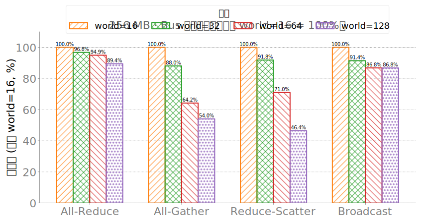

**hccl_256mb_step_bus_bw.svg**：固定 256MB，world 从 16→128 时 bus_bw 中位的阶梯变化。

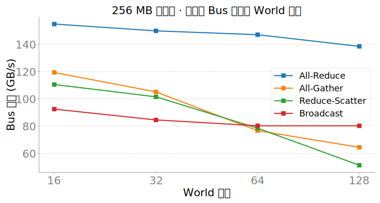

**hccl_256mb_step_per_op.svg**：固定 256MB，world 从 16→128 时 bus_bw 中位的阶梯变化。

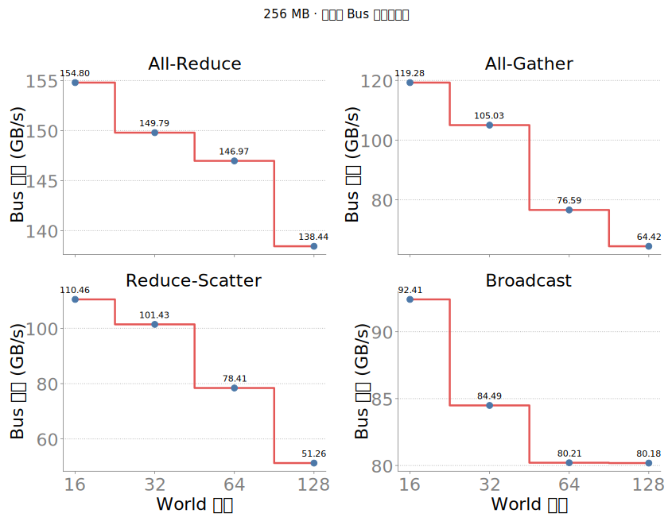

**hccl_bus_bw_vs_size_all_gather.svg**：**`all_gather` 的 bus_bw 随消息大小**。底层 `dist.all_gather`（all_gather/reduce_scatter 按 world 切分缓冲）；每点是该 (world,size) 下各 rank bus_bw 的中位。

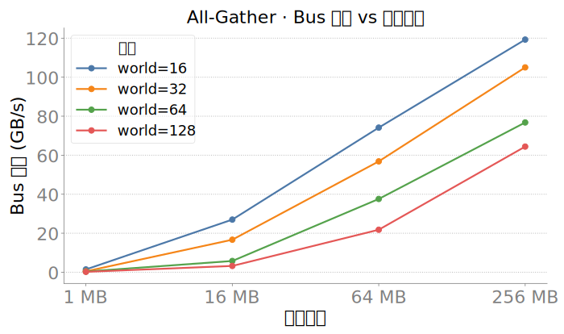

**hccl_bus_bw_vs_size_all_reduce.svg**：**`all_reduce` 的 bus_bw 随消息大小**。底层 `dist.all_reduce`（all_gather/reduce_scatter 按 world 切分缓冲）；每点是该 (world,size) 下各 rank bus_bw 的中位。

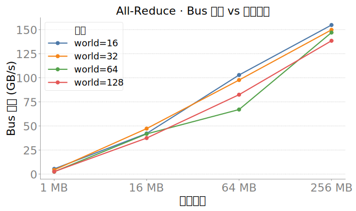

**hccl_bus_bw_vs_size_broadcast.svg**：**`broadcast` 的 bus_bw 随消息大小**。底层 `dist.broadcast`（all_gather/reduce_scatter 按 world 切分缓冲）；每点是该 (world,size) 下各 rank bus_bw 的中位。

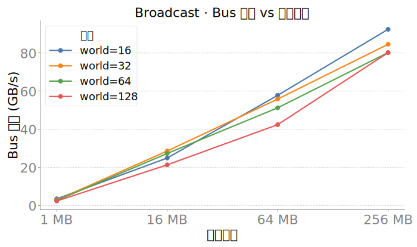

**hccl_bus_bw_vs_size_reduce_scatter.svg**：**`reduce_scatter` 的 bus_bw 随消息大小**。底层 `dist.reduce_scatter`（all_gather/reduce_scatter 按 world 切分缓冲）；每点是该 (world,size) 下各 rank bus_bw 的中位。

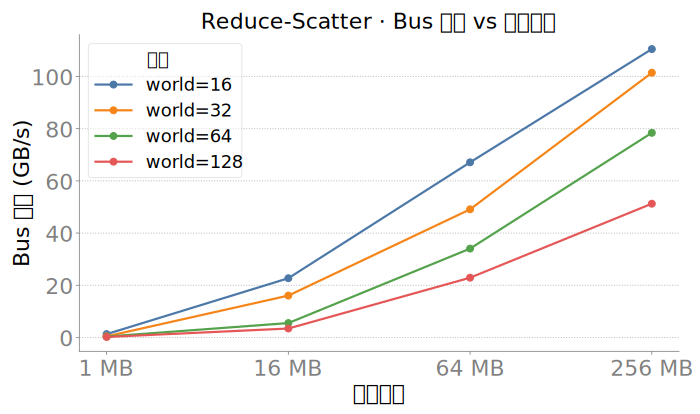

**hccl_rank_box_256mb_all_ops.svg**：同一 (op, world=?, 256MB) 下**每个 rank 各自的 bus_bw** 分布。看是否个别 rank 拖总线折算带宽。

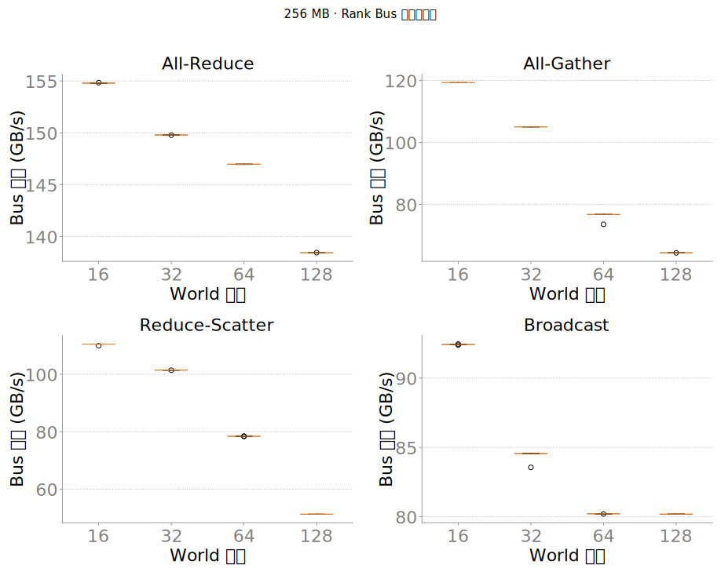

**hccl_rank_hist_w128_256mb.svg**：同一 (op, world=?, 256MB) 下**每个 rank 各自的 bus_bw** 分布。看是否个别 rank 拖总线折算带宽。

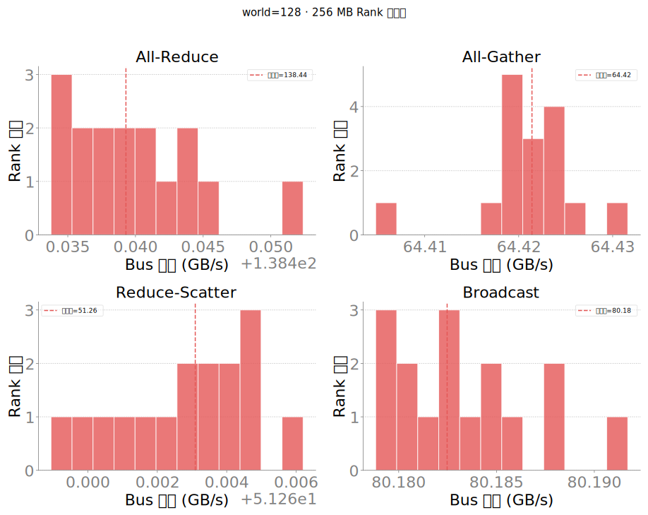

**hccl_rank_hist_w16_256mb.svg**：同一 (op, world=?, 256MB) 下**每个 rank 各自的 bus_bw** 分布。看是否个别 rank 拖总线折算带宽。

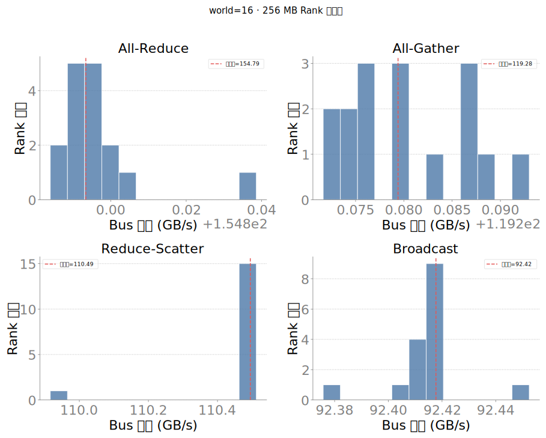

**hccl_rank_hist_w32_256mb.svg**：同一 (op, world=?, 256MB) 下**每个 rank 各自的 bus_bw** 分布。看是否个别 rank 拖总线折算带宽。

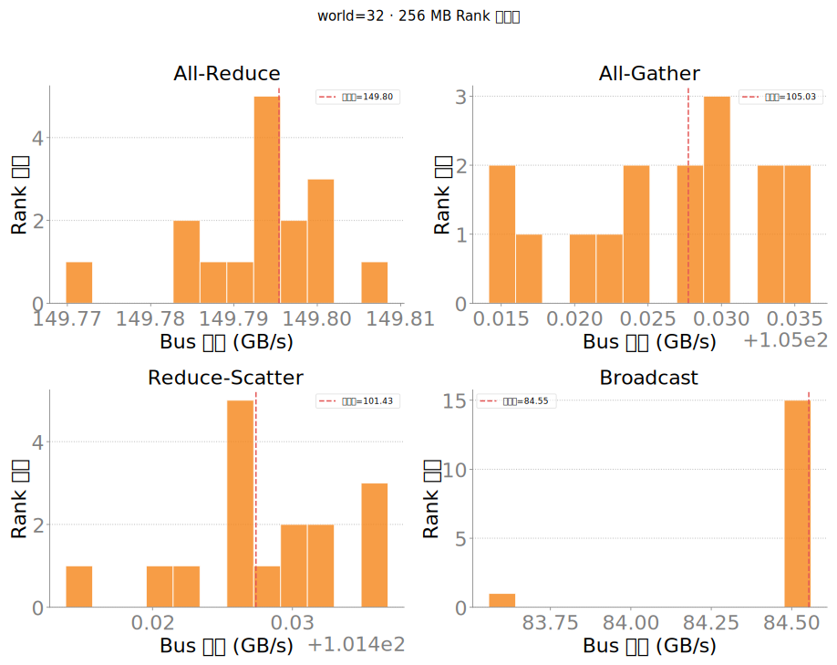

**hccl_rank_hist_w64_256mb.svg**：同一 (op, world=?, 256MB) 下**每个 rank 各自的 bus_bw** 分布。看是否个别 rank 拖总线折算带宽。

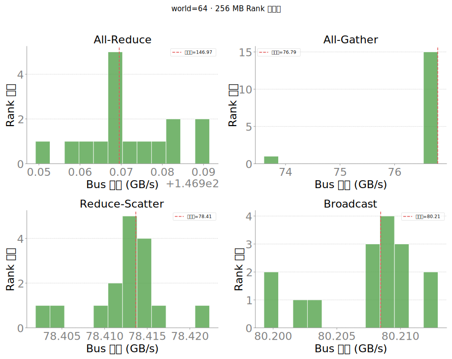

**hccl_rank_violin_256mb_all_gather.svg**：同一 (op, world=?, 256MB) 下**每个 rank 各自的 bus_bw** 分布。看是否个别 rank 拖总线折算带宽。

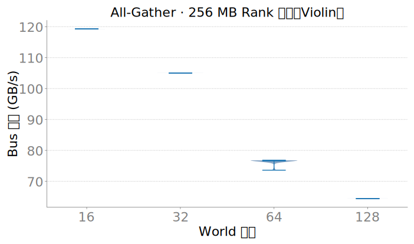

**hccl_rank_violin_256mb_all_reduce.svg**：同一 (op, world=?, 256MB) 下**每个 rank 各自的 bus_bw** 分布。看是否个别 rank 拖总线折算带宽。

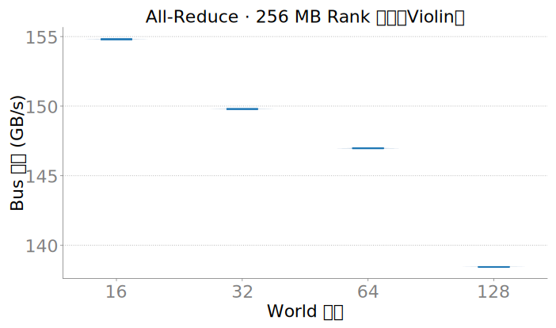

**hccl_rank_violin_256mb_broadcast.svg**：同一 (op, world=?, 256MB) 下**每个 rank 各自的 bus_bw** 分布。看是否个别 rank 拖总线折算带宽。

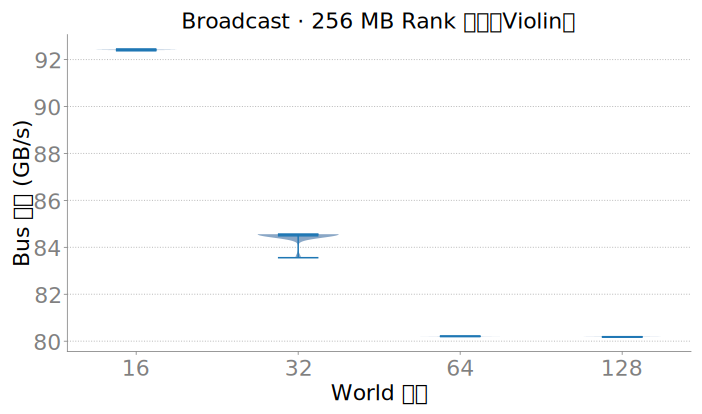

**hccl_rank_violin_256mb_reduce_scatter.svg**：同一 (op, world=?, 256MB) 下**每个 rank 各自的 bus_bw** 分布。看是否个别 rank 拖总线折算带宽。

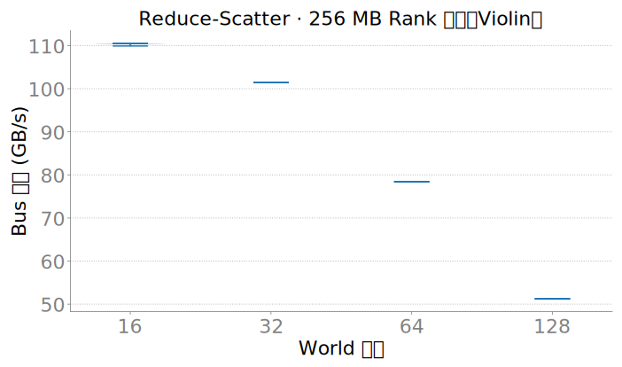

**p2p_box_compare_w16_w128_16777216.svg**：**点对点 isend/irecv 单向带宽**（GB/s），不是 bus_bw 公式。边类型含 ring / star；大 world 默认仅 ring。底层 `hccl_p2p_bench.py`，严格串行单对。

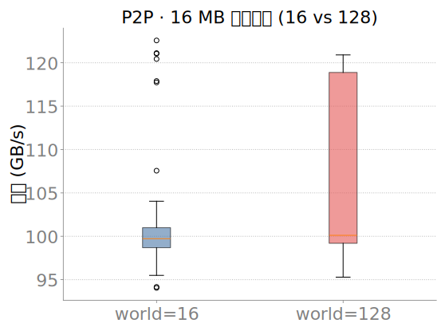

**p2p_box_compare_w16_w128_65536.svg**：**点对点 isend/irecv 单向带宽**（GB/s），不是 bus_bw 公式。边类型含 ring / star；大 world 默认仅 ring。底层 `hccl_p2p_bench.py`，严格串行单对。

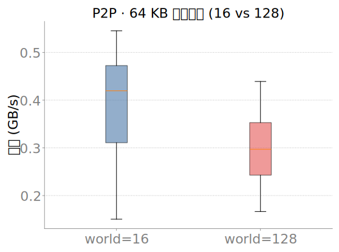

**p2p_bw_violin_by_kind_size.svg**：**点对点 isend/irecv 单向带宽**（GB/s），不是 bus_bw 公式。边类型含 ring / star；大 world 默认仅 ring。底层 `hccl_p2p_bench.py`，严格串行单对。

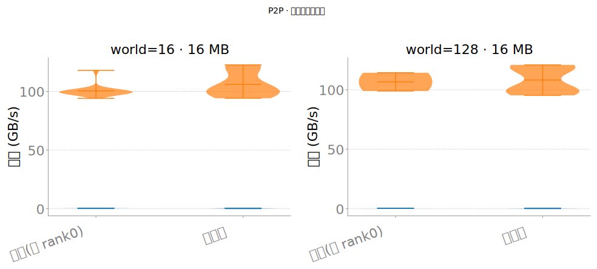

**p2p_fast_edges_top15_16mb.svg**：**点对点 isend/irecv 单向带宽**（GB/s），不是 bus_bw 公式。边类型含 ring / star；大 world 默认仅 ring。底层 `hccl_p2p_bench.py`，严格串行单对。

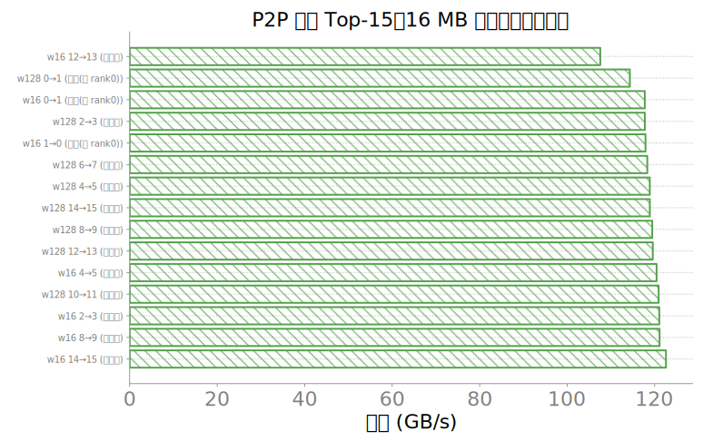

**p2p_kind_mean_compare_16mb.svg**：**点对点 isend/irecv 单向带宽**（GB/s），不是 bus_bw 公式。边类型含 ring / star；大 world 默认仅 ring。底层 `hccl_p2p_bench.py`，严格串行单对。

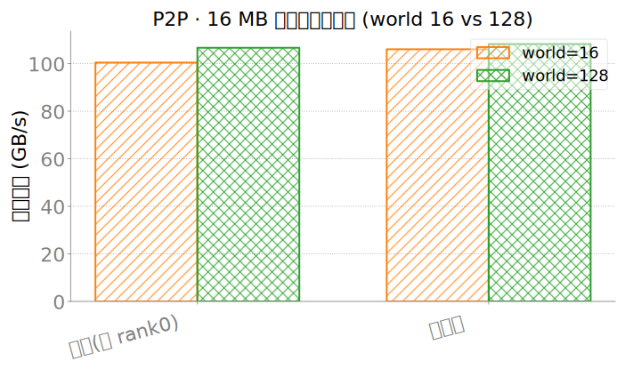

**p2p_slow_edges_top15_16mb.svg**：**点对点 isend/irecv 单向带宽**（GB/s），不是 bus_bw 公式。边类型含 ring / star；大 world 默认仅 ring。底层 `hccl_p2p_bench.py`，严格串行单对。

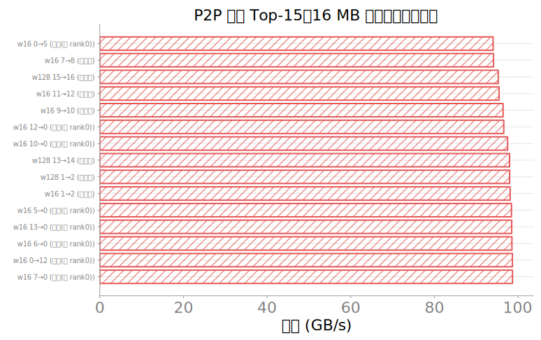

**topo_hccs_heatmap_master0.svg**：机内物理拓扑亲和：来自 **`npu-smi info -t topo`** 解析。S=SIO（die 内），空白=HCCS_SW（经交换机的 HCCS），·=self。这是静态拓扑关系，不是测速。

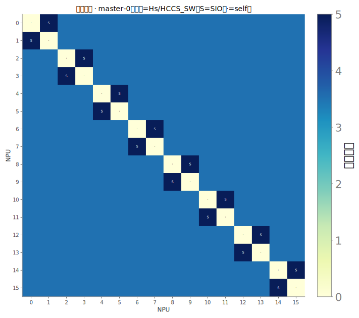

