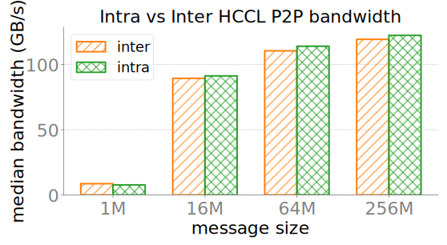

# 机内 / 机间 P2P 带宽 · 20260711

**测的是什么**：HCCL 点对点单向（或 ping-pong）有效带宽（GB/s），用来在没有 hccn 可读信息时反推机间链路能力。

**底层**：`torch.distributed.isend/irecv` + HCCL；`hccl_inter_bw_probe.py`；全员 barrier 下严格串行单对；默认流水线 uni（inflight=4）；`HCCL_BUFFSIZE=2048`。

- **intra**：同节点固定 local_rank 对 → 走机内 HCCS/SIO 平面
- **inter**：不同节点、同 local_rank 对齐 → 走机间平面（A3 上常为 UB/UBoE 域）

本批大包饱和区 inter≈119 GB/s、intra≈122 GB/s（recv 中位）；与 AllReduce bus_bw 定义不同，只能量级交叉。

## 图

**inter_vs_intra_bw.svg**：各消息大小上 intra/inter 中位带宽对比。

