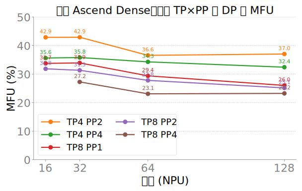
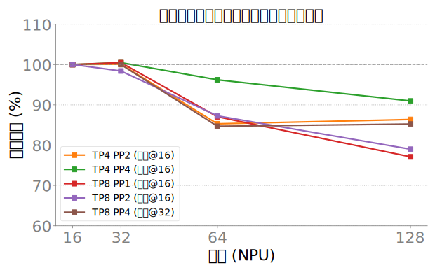
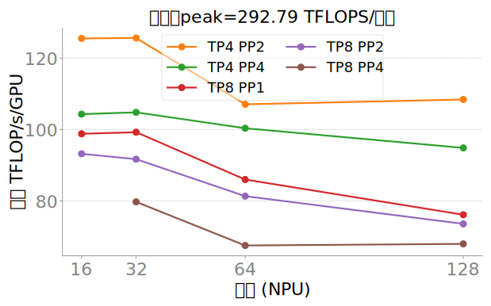

# 华为 128 卡：固定 TP×PP 扩 DP 的 Dense MFU 弱扩展

> 日期：2026-07-11  
> 集群：`montyyin-mfu-scale`（Ascend 8×16 NPU）  
> 栈：`Megatron-LM-0.12.3` + MindSpeed（`train_qwen3_8B_ascend.sh`）  
> Peak：292.79 TFLOPS/卡（card_screen `func_tflops` 中位）  
> 控制变量：SEQ=4096，MBS=1，**GBS=2048**，ITERS=5；稳态取 drop-first median  
> 设计：固定 `(TP,PP)`，只扩 `DP = world/(TP×PP)`，world∈{16,32,64,128}  
> **不包含** TP1PP1（该配置对真实模型并行部署参考价值低）

## 结论（先看这个）

1. **有意义并行下 Dense MFU 大约在 23–43%**，远低于旧优化环 TP1PP1 的 ~50–60%。  
2. **本矩阵最优：TP4 PP2**（16/32 卡 ≈ **42.9%**，128 卡仍 ≈ **37.0%**）。  
3. **TP=8 整体偏弱**（TP8PP1 约 26–34%；TP8PP4 约 23–27%），通信/切分开销更大。  
4. **弱扩展**：多数拓扑 16→32 几乎不掉；64/128 开始下滑（TP8 更明显）。  
5. 本战役为诊断扩展性，**未**再刷单点最优；MoE 队列已主动砍掉以尽快交卡。

## MFU 总表（%）

| 拓扑 | 16 | 32 | 64 | 128 | 128 相对基线 |
|------|----:|----:|----:|-----:|-------------|
| **TP4 PP2** | **42.9** | **42.9** | **36.6** | **37.0** | ≈86%（相对 16） |
| TP4 PP4 | 35.6 | 35.8 | 34.3 | 32.4 | ≈91% |
| TP8 PP1 | 33.7 | 33.9 | 29.4 | 26.0 | ≈77% |
| TP8 PP2 | 31.8 | 31.3 | 27.8 | 25.1 | ≈79% |
| TP8 PP4 | — | 27.2 | 23.1 | 23.2 | ≈85%（相对 32） |

稳态吞吐（TFLOP/s/GPU）见 CSV：`mfu_tp_pp_scale_results.csv`。

## 图

## 归因（简）

- **固定 GBS=2048**：DP↑ → 每卡 microbatch 数 ↓ → 单 iter 墙钟变短，但 **allreduce 域变大**，跨节点通信占比升，MFU 仍可能掉。  
- **TP 越大**：TP allgather / reduce-scatter 与 sequence-parallel 开销越高；本模型（20L / H4096 / GQA groups=8）上 **TP8 明显不如 TP4**。  
- **PP 增大**：引入 pipeline bubble；同 TP 下 PP2→PP4 通常再掉几个点（见 TP4PP2 vs TP4PP4）。  
- 对照旧环 TP1PP1@GBS2048：16→128 约 60%→49%；本矩阵在有 TP/PP 时绝对 MFU 更低，但 **扩展斜率**仍可读。

## 数据与产物路径

| 类型 | 路径 |
|------|------|
| 账本 | `reports/rounds/mfu_tp_pp_scale_ledger.md` |
| 本报告 | `reports/rounds/mfu_tp_pp_scale_20260711.md` |
| CSV / 图 | `reports/rounds/mfu_tp_pp_scale_bundle/` |
| 跳板机原件 | `weibozhen:~/mfu_tp_pp_jumphost/` |
| AFS 账本 | `/afs-a3-241ceshi-shared/montyyin/results/mfu_tp_pp_scale/` |
| AFS 训练日志 | `/afs-a3-241ceshi-shared/montyyin/logs/jumphost-tp-pp-*` |
| 编排脚本 | `scripts/cluster/mfu_tp_pp_jumphost/run.sh` |
| 出图 | `reports/plot_mfu_tp_pp_scale.py` |

## 图注（测量条件）

- 数据来源：跳板机 ledger（由 MindSpeed `throughput per GPU (TFLOP/s/GPU)` 解析）  
- 模型：Qwen3-8B 风格 dense wrapper（20 layers，hidden 4096，heads 32，GQA groups 8）  
- 并行：上表 TP/PP；CP=1；EP=1  
- 超参：GBS=2048，MBS=1，SEQ=4096，ITERS=5，peak=292.79  
- 聚合：每 scale 取迭代吞吐 drop-first 后的 median → MFU% = median/peak×100  

## 未覆盖

- Sparse/MoE 扩展矩阵（队列已砍，仅历史 16 卡冒烟可参考旧环）  
- GBS∝DP 对照、SEQ 扫描、重计算/通信 overlap 细拆  
