# NCCL/MCCL 通信 · Muxi · 20260711

语义详见 [`METRIC_SEMANTICS_MUXI_20260711.md`](METRIC_SEMANTICS_MUXI_20260711.md) 通信章。

**alg_bw**：业务字节 / 平均时延 → GB/s（算法视角）。
**bus_bw**：按 NCCL-tests 同构公式把多跳折成可与链路比的总线带宽——AllReduce `×2(n-1)/n`，AG/RS `×(n-1)/n`，Broadcast `=alg`。
扩展叙事用 **bus_bw 保持率 = bus_N / bus_8**（沐曦单节点 **8** 卡；**不是**昇腾的 `/bus_16`）。

底层：`torch.distributed` + **NCCL/MCCL**（`nccl_torch_bench.py`）；CPU `perf_counter` + `torch.cuda.synchronize`；sizes 1M–256M；fp32；world **8→16→32→64→128**。
环境：`NCCL/MCCL/GLOO_SOCKET_IFNAME=eth0`（多机必设）。
P2P：`nccl_p2p_bench.py`（isend/irecv，严格串行单对）。

数据：本地 `logs/muxi-nccl-campaign-20260711/nccl-results/scale_*.jsonl`；AFS `/afs-a3-weight-share/montyyin/results/nccl-20260711_142129`；P2P AFS `…/nccl-p2p-20260711_150700`。

## 256MB bus_bw 保持率（相对 **w8**，中位）

| op | w8 bus | w16 | w32 | w64 | w128 |
|---|---:|---:|---:|---:|---:|
| All-Reduce | 190.5 | 0.13% | 0.14% | 0.13% | 0.13% |
| Broadcast | 107.2 | 0.69% | 0.26% | 0.24% | 0.23% |
| All-Gather | 108.8 | 0.25% | 0.25% | 0.24% | 0.22% |
| Reduce-Scatter | 104.6 | 0.25% | 0.25% | 0.25% | 0.22% |

→ All-Reduce@256MB：w8 中位 bus≈**190.5 GB/s**；w16 保持率≈**0.13%**（断崖在首次跨节点）。

## 逐图（含义优先）

**nccl_256mb_retention_bar.svg**：256MB 上各 collective 的 bus_bw 相对 world=8 的保持率（扩展健康度）。

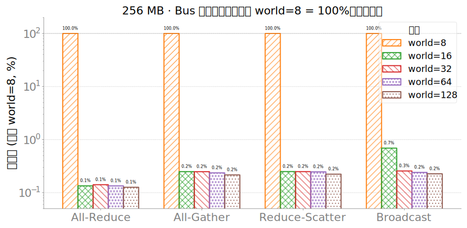

**nccl_256mb_step_bus_bw.svg**：固定 256MB，world 从 8→128 时 bus_bw 中位的阶梯变化。

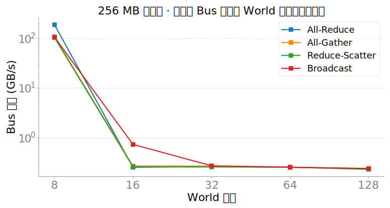

**nccl_256mb_step_per_op.svg**：固定 256MB，world 从 8→128 时 bus_bw 中位的阶梯变化。

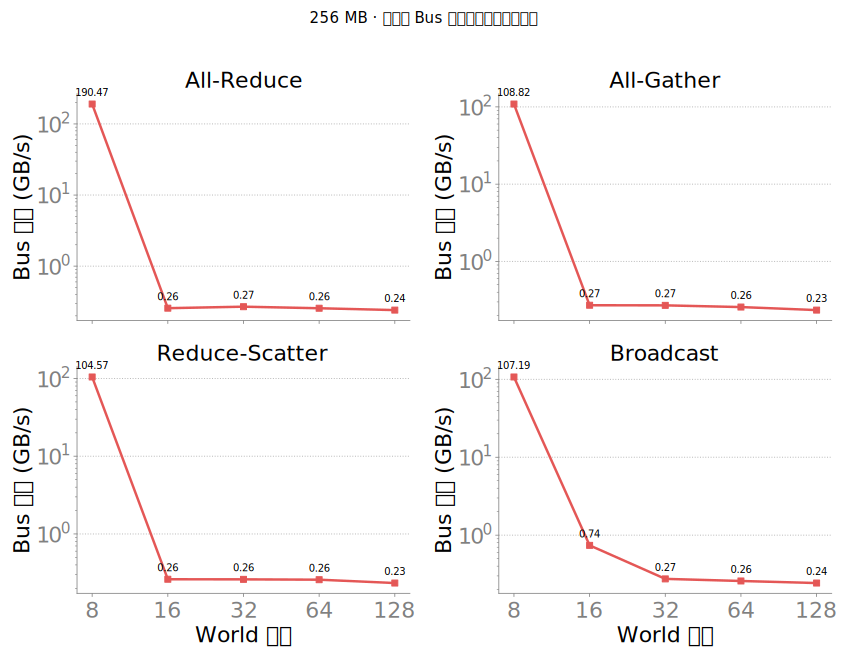

**nccl_bus_bw_vs_size_all_gather.svg**：**`all_gather` 的 bus_bw 随消息大小**。底层 `dist.all_gather`（all_gather/reduce_scatter 按 world 切分缓冲）；每点是该 (world,size) 下各 rank bus_bw 的中位。

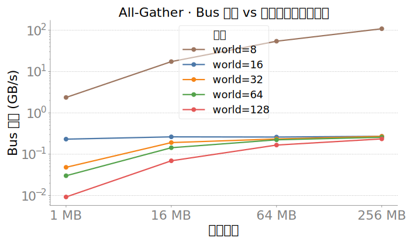

**nccl_bus_bw_vs_size_all_reduce.svg**：**`all_reduce` 的 bus_bw 随消息大小**。底层 `dist.all_reduce`（all_gather/reduce_scatter 按 world 切分缓冲）；每点是该 (world,size) 下各 rank bus_bw 的中位。

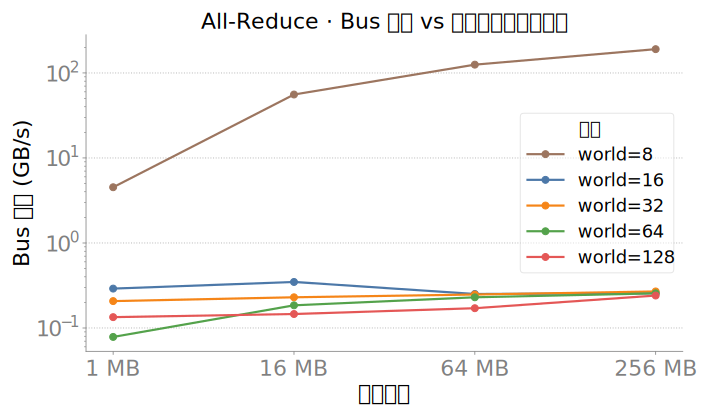

**nccl_bus_bw_vs_size_broadcast.svg**：**`broadcast` 的 bus_bw 随消息大小**。底层 `dist.broadcast`（all_gather/reduce_scatter 按 world 切分缓冲）；每点是该 (world,size) 下各 rank bus_bw 的中位。

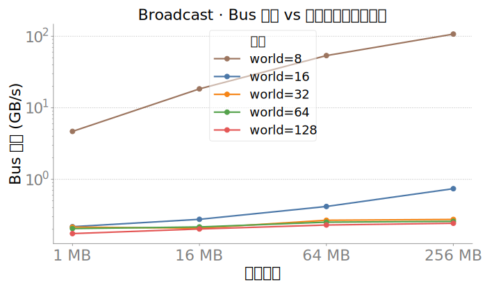

**nccl_bus_bw_vs_size_reduce_scatter.svg**：**`reduce_scatter` 的 bus_bw 随消息大小**。底层 `dist.reduce_scatter`（all_gather/reduce_scatter 按 world 切分缓冲）；每点是该 (world,size) 下各 rank bus_bw 的中位。

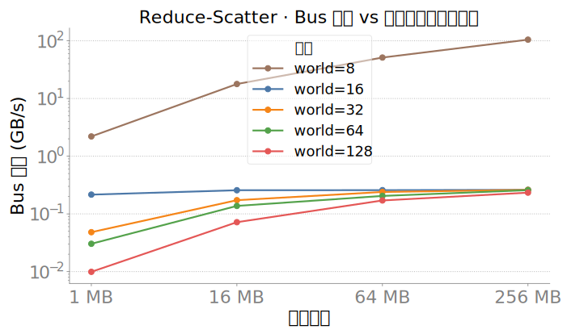

**nccl_rank_box_256mb_all_ops.svg**：同一 (op, 各 world, 256MB) 下**每个 rank 各自的 bus_bw** 分布。看是否个别 rank 拖总线折算带宽。

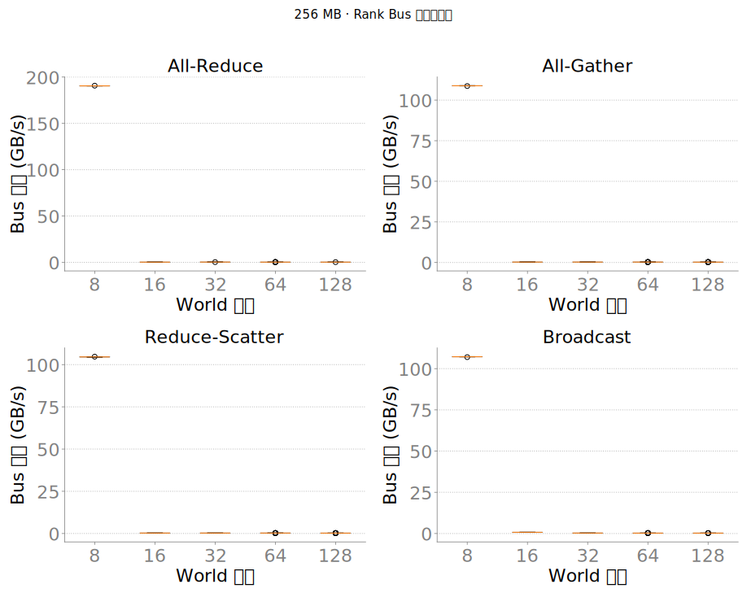

**nccl_rank_hist_w128_256mb.svg**：同一 (op, world=128, 256MB) 下**每个 rank 各自的 bus_bw** 分布。看是否个别 rank 拖总线折算带宽。

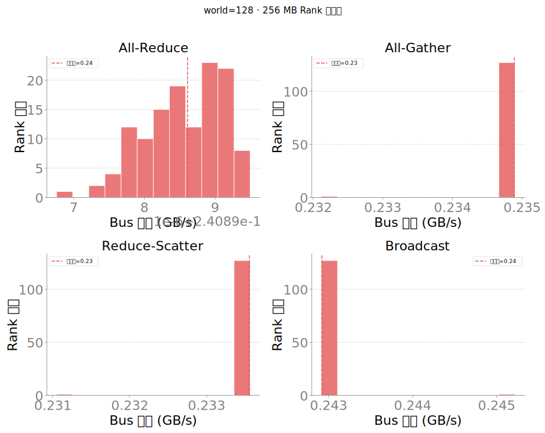

**nccl_rank_hist_w16_256mb.svg**：同一 (op, world=16, 256MB) 下**每个 rank 各自的 bus_bw** 分布。看是否个别 rank 拖总线折算带宽。

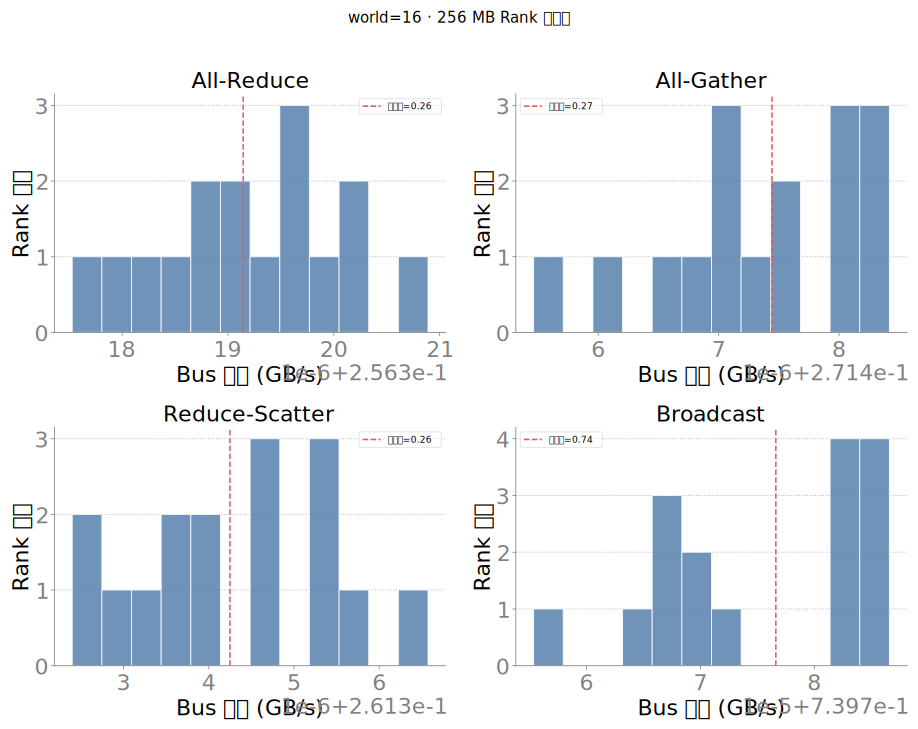

**nccl_rank_hist_w32_256mb.svg**：同一 (op, world=32, 256MB) 下**每个 rank 各自的 bus_bw** 分布。看是否个别 rank 拖总线折算带宽。

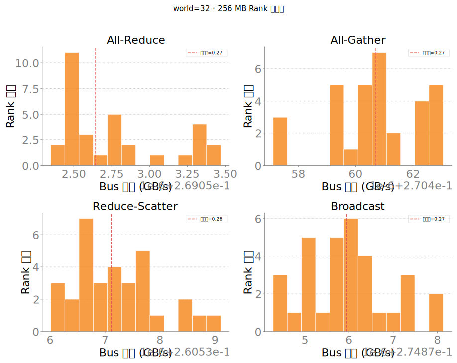

**nccl_rank_hist_w64_256mb.svg**：同一 (op, world=64, 256MB) 下**每个 rank 各自的 bus_bw** 分布。看是否个别 rank 拖总线折算带宽。

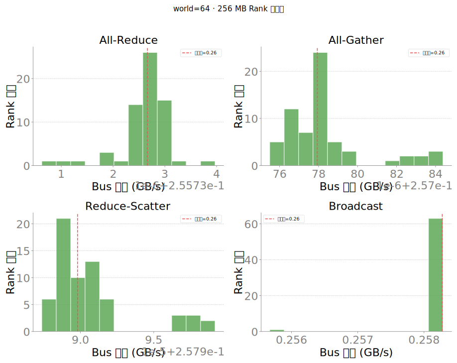

**nccl_rank_hist_w8_256mb.svg**：同一 (op, world=8, 256MB) 下**每个 rank 各自的 bus_bw** 分布。看是否个别 rank 拖总线折算带宽。

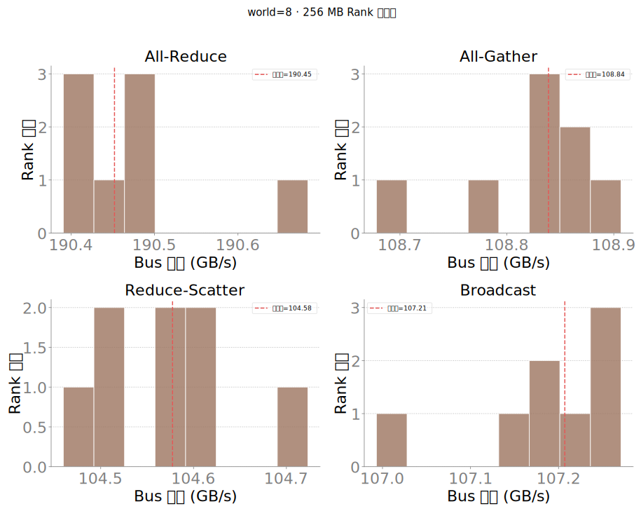

**nccl_rank_violin_256mb_all_gather.svg**：同一 (op, 各 world, 256MB) 下**每个 rank 各自的 bus_bw** 分布。看是否个别 rank 拖总线折算带宽。

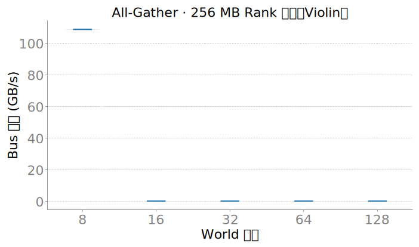

**nccl_rank_violin_256mb_all_reduce.svg**：同一 (op, 各 world, 256MB) 下**每个 rank 各自的 bus_bw** 分布。看是否个别 rank 拖总线折算带宽。

**nccl_rank_violin_256mb_broadcast.svg**：同一 (op, 各 world, 256MB) 下**每个 rank 各自的 bus_bw** 分布。看是否个别 rank 拖总线折算带宽。

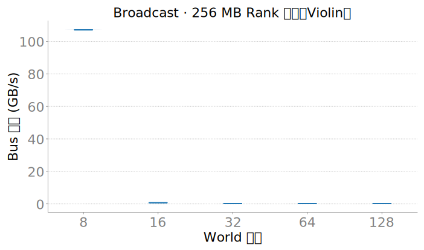

**nccl_rank_violin_256mb_reduce_scatter.svg**：同一 (op, 各 world, 256MB) 下**每个 rank 各自的 bus_bw** 分布。看是否个别 rank 拖总线折算带宽。

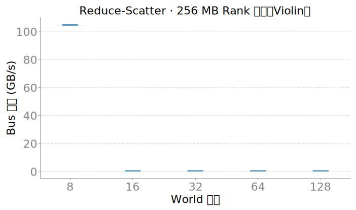

**p2p_box_compare_w16_w128_16777216.svg**：**点对点 isend/irecv 单向带宽**（GB/s）按边类型/规模对照，不是 bus_bw 公式。底层 `nccl_p2p_bench.py`，严格串行单对；`torch.cuda.synchronize`。

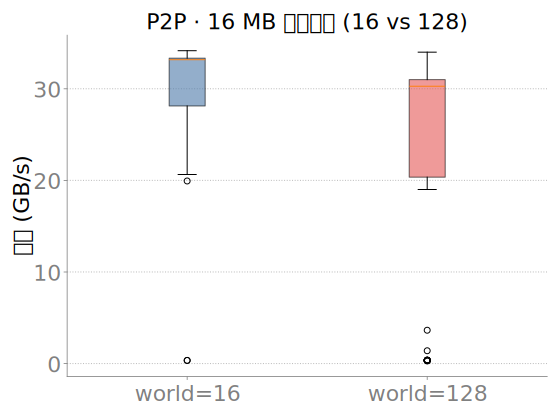

**p2p_box_compare_w16_w128_65536.svg**：**点对点 isend/irecv 单向带宽**（GB/s）按边类型/规模对照，不是 bus_bw 公式。底层 `nccl_p2p_bench.py`，严格串行单对；`torch.cuda.synchronize`。

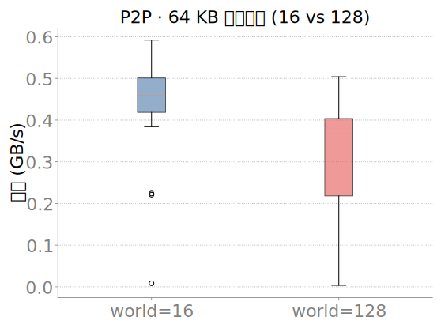

**p2p_bw_violin_by_kind_size.svg**：**点对点 isend/irecv 单向带宽**（GB/s）按边类型/规模对照，不是 bus_bw 公式。底层 `nccl_p2p_bench.py`，严格串行单对；`torch.cuda.synchronize`。

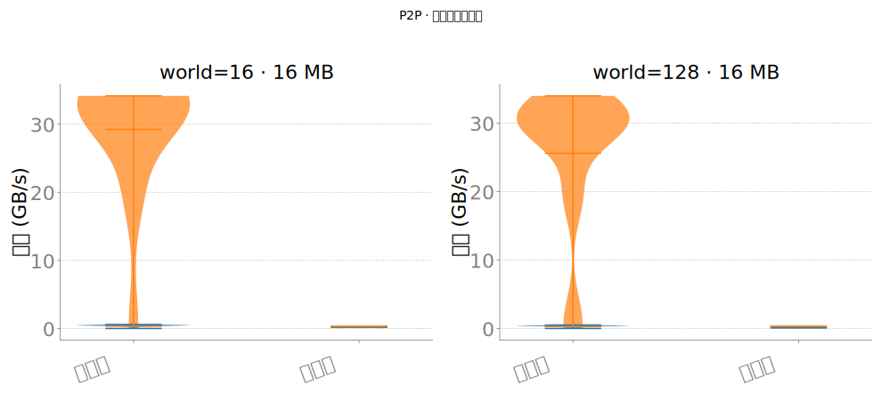

**p2p_fast_edges_top15_16mb.svg**：**点对点快边 TopK**（单向 isend/irecv GB/s）。底层 `nccl_p2p_bench.py`；对照机内 MetaXLink 饱和区。

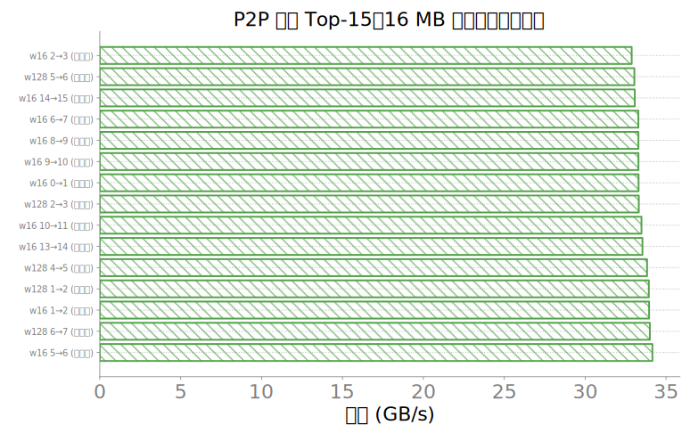

**p2p_kind_mean_compare_16mb.svg**：**点对点 isend/irecv 单向带宽**（GB/s）按边类型/规模对照，不是 bus_bw 公式。底层 `nccl_p2p_bench.py`，严格串行单对；`torch.cuda.synchronize`。

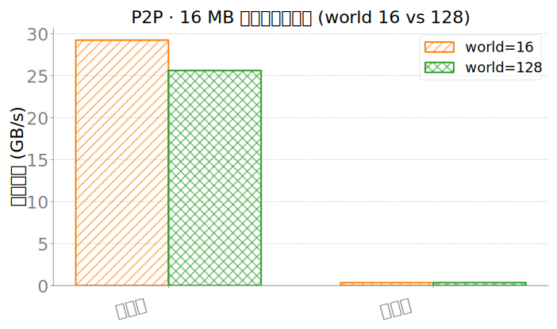

**p2p_slow_edges_top15_16mb.svg**：**点对点慢边 TopK**（单向 isend/irecv GB/s）。底层 `nccl_p2p_bench.py`；看跨节点/异常边是否拖后腿。

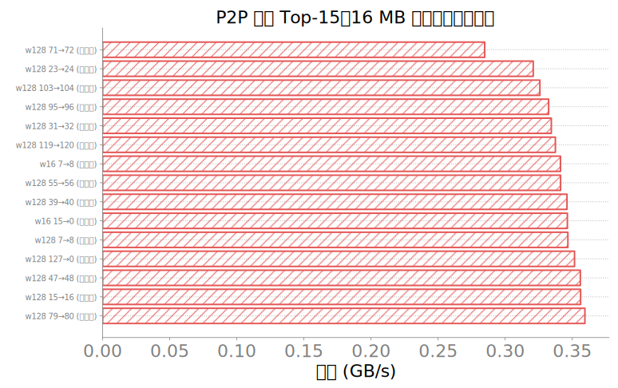

