# Card Constitution 分布报告

- 生成时间: 2026-07-15 11:57:43
- 卡数: 16
- 数据源: /Users/yinjinrun/Codespace/myportal/results/npu-dev-1/20260715_114622-constitution16-r1/constitution16.A03-R40-I48-253-0046364.JD.LOCAL.jsonl

> 本报告只做分布统计与可视化，不强调 slow / 坏卡判定。

## 跳过说明

- `aicore_freq_mhz`（AICore freq (MHz)）：字段缺失或全空，跳过
- `hbm_temp_c`（HBM temp (C)）：字段缺失或全空，跳过
- `power_limit_w`（Power limit (W)）：字段缺失或全空，跳过
- `gemm_shape_sample`：无可用曲线，跳过 shape

## 指标分布

| 指标 | n | median | mean | std | CV% | min | max | p5 | p50 | p95 |
|------|---|--------|------|-----|-----|-----|-----|----|----|-----|
| Cube func TFLOPS | 16 | 299.7 | 298.4 | 3.425 | 1.148 | 288.6 | 301.8 | 291.8 | 299.7 | 301.5 |
| HBM GB/s | 16 | 1258.8 | 1259.8 | 3.081 | 0.2445 | 1256.2 | 1268.5 | 1256.5 | 1258.8 | 1265.7 |
| Sustained TFLOPS | 16 | 294.2 | 293.8 | 5.647 | 1.922 | 282.8 | 303.4 | 285.6 | 294.2 | 302.4 |
| Vector GFLOPS | 16 | 98.68 | 98.85 | 0.3158 | 0.3194 | 98.49 | 99.46 | 98.5 | 98.68 | 99.44 |
| Scalar elems/s | 16 | 273774365.3 | 273772533.4 | 25184.0 | 0.009199 | 273717106.9 | 273820207.9 | 273730497.4 | 273774365.3 | 273800966.9 |
| MTE copy GB/s | 16 | 1267.0 | 1267.0 | 1.311 | 0.1035 | 1263.4 | 1268.7 | 1264.6 | 1267.0 | 1268.6 |
| Cube+Vector TFLOPS | 16 | 236.8 | 235.6 | 4.308 | 1.828 | 226.3 | 240.9 | 227.7 | 236.8 | 240.3 |
| SFU GFLOPS | 16 | 158.2 | 158.2 | 0.289 | 0.1827 | 157.7 | 158.8 | 157.8 | 158.2 | 158.7 |
| Launch sync p50 (us) | 16 | 5.391 | 5.36 | 0.1932 | 3.604 | 4.852 | 5.718 | 5.028 | 5.391 | 5.591 |
| Launch sync p99 (us) | 16 | 6.34 | 6.596 | 0.8205 | 12.44 | 5.696 | 8.615 | 5.776 | 6.34 | 8.37 |
| Host overhead p50 (us) | 16 | 191.8 | 192.5 | 3.323 | 1.726 | 189.3 | 202.8 | 189.7 | 191.8 | 199.4 |
| Host overhead p99 (us) | 16 | 521.4 | 521.9 | 6.027 | 1.155 | 513.0 | 540.4 | 513.5 | 521.4 | 529.5 |
| Burst total p50 (us) | 16 | 343.8 | 350.4 | 24.9 | 7.108 | 313.1 | 430.2 | 329.1 | 343.8 | 391.4 |
| Burst/kernel p50 (us) | 16 | 5.371 | 5.474 | 0.3891 | 7.108 | 4.892 | 6.721 | 5.142 | 5.371 | 6.115 |
| Health temp (C) | 8 | 50.5 | 50.5 | 1.323 | 2.62 | 49 | 52 | 49 | 50.5 | 52 |
| Health power (W) | 8 | 97.75 | 99.22 | 6.918 | 6.972 | 89.2 | 110.8 | 90.78 | 97.75 | 110.0 |
| Board temp (C) | 8 | 74.5 | 75.5 | 3.162 | 4.188 | 72 | 81 | 72 | 74.5 | 80.65 |
| AICore util % | 7 | 97 | 89.29 | 10.82 | 12.12 | 74 | 99 | 74 | 97 | 99 |
| AICPU util % | 8 | 0 | 0 | 0 | 0 | 0 | 0 | 0 | 0 | 0 |
| CtrlCPU util % | 8 | 3 | 2.75 | 1.479 | 53.78 | 1 | 6 | 1 | 3 | 4.95 |
| MemBW util % | 8 | 17.5 | 17.88 | 1.691 | 9.46 | 16 | 22 | 16.35 | 17.5 | 20.6 |
| Power (W) | 8 | 450.0 | 440.9 | 13.07 | 2.965 | 417.9 | 451.0 | 419.8 | 450.0 | 450.9 |
| Shape sweep peak TFLOPS | 16 | 281.4 | 279.7 | 4.981 | 1.781 | 272.1 | 288.4 | 272.3 | 281.4 | 287.7 |

## 相对中位数偏差

偏差 = `(值 - 集群中位数) / 集群中位数 × 100%`。

- **Cube func TFLOPS** (`func_tflops`): [-3.72%, +0.69%]，|偏差|均值 0.77%
- **HBM GB/s** (`hbm_gbps`): [-0.21%, +0.77%]，|偏差|均值 0.16%
- **Sustained TFLOPS** (`sustained_tflops`): [-3.89%, +3.12%]，|偏差|均值 1.67%
- **Vector GFLOPS** (`vector_gflops`): [-0.20%, +0.79%]，|偏差|均值 0.26%
- **Scalar elems/s** (`scalar_elems_per_s`): [-0.02%, +0.02%]，|偏差|均值 0.01%
- **MTE copy GB/s** (`mte_gbps`): [-0.28%, +0.14%]，|偏差|均值 0.07%
- **Cube+Vector TFLOPS** (`cube_vector_tflops`): [-4.41%, +1.72%]，|偏差|均值 1.41%
- **SFU GFLOPS** (`sfu_gflops`): [-0.31%, +0.39%]，|偏差|均值 0.13%
- **Launch sync p50 (us)** (`launch_sync_p50_us`): [-10.00%, +6.06%]，|偏差|均值 2.60%
- **Launch sync p99 (us)** (`launch_sync_p99_us`): [-10.15%, +35.89%]，|偏差|均值 8.69%
- **Host overhead p50 (us)** (`launch_host_overhead_p50_us`): [-1.33%, +5.71%]，|偏差|均值 1.04%
- **Host overhead p99 (us)** (`launch_host_overhead_p99_us`): [-1.62%, +3.66%]，|偏差|均值 0.75%
- **Burst total p50 (us)** (`launch_burst_p50_us`): [-8.92%, +25.14%]，|偏差|均值 4.28%
- **Burst/kernel p50 (us)** (`launch_burst_per_kernel_p50_us`): [-8.92%, +25.14%]，|偏差|均值 4.28%
- **Health temp (C)** (`health_temp_c`): [-2.97%, +2.97%]，|偏差|均值 2.48%
- **Health power (W)** (`health_power_w`): [-8.75%, +13.35%]，|偏差|均值 5.73%
- **Board temp (C)** (`board_temp_c`): [-3.36%, +8.72%]，|偏差|均值 3.36%
- **AICore util %** (`aicore_util_pct`): [-23.71%, +2.06%]，|偏差|均值 9.43%
- **AICPU util %** (`aicpu_util_pct`): [+0.00%, +0.00%]，|偏差|均值 0.00%
- **CtrlCPU util %** (`ctrlcpu_util_pct`): [-66.67%, +100.00%]，|偏差|均值 33.33%
- **MemBW util %** (`mem_bw_util_pct`): [-8.57%, +25.71%]，|偏差|均值 6.43%
- **Power (W)** (`power_w`): [-7.14%, +0.21%]，|偏差|均值 2.18%
- **Shape sweep peak TFLOPS** (`shape_sweep_peak_tflops`): [-3.28%, +2.49%]，|偏差|均值 1.40%

## 元数据

- hosts (1): A03-R40-I48-253-0046364
- backends: npu
- launch_timing_method: event

## 图表

### box overview

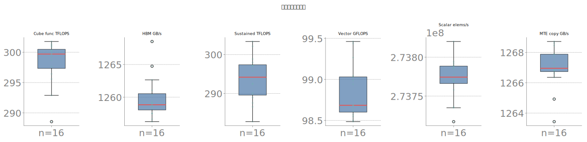

### hist func tflops

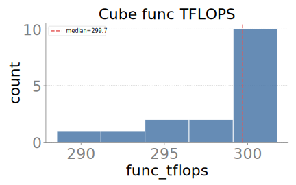

### hist hbm gbps

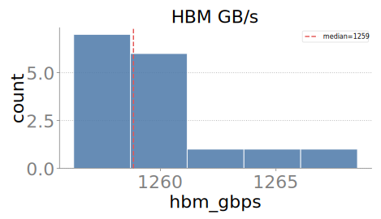

### hist sustained tflops

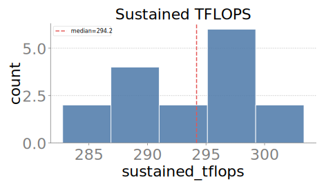

### hist vector gflops

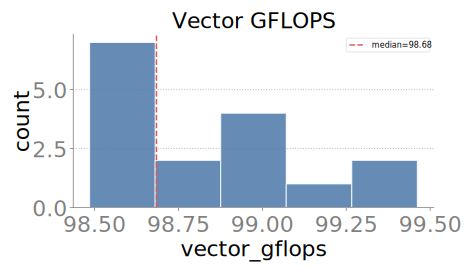

### hist scalar elems per s

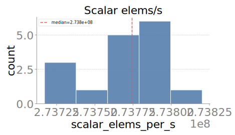

### hist mte gbps

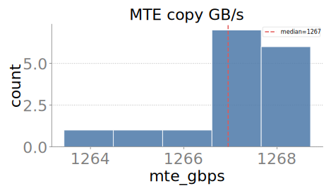

### hist cube vector tflops

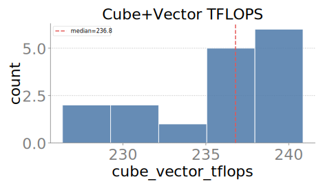

### hist sfu gflops

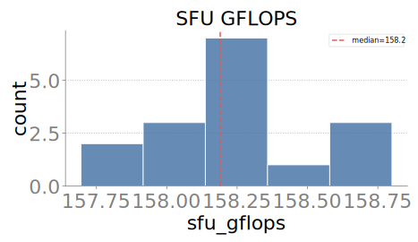

### hist launch sync p50 us

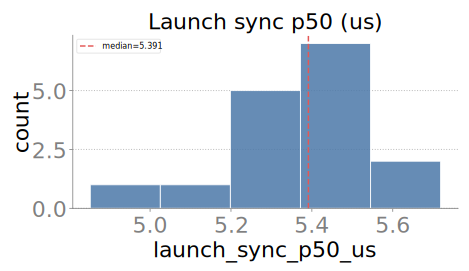

### hist launch sync p99 us

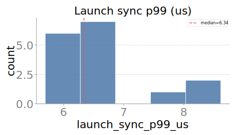

### hist launch host overhead p50 us

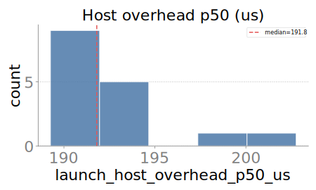

### hist launch host overhead p99 us

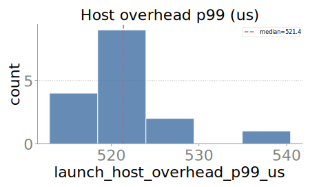

### hist launch burst p50 us

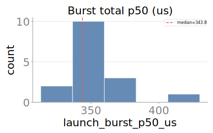

### hist launch burst per kernel p50 us

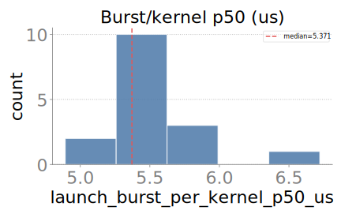

### hist health temp c

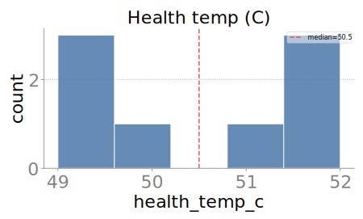

### hist health power w

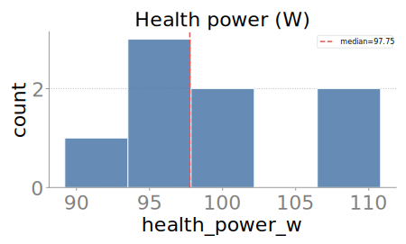

### hist board temp c

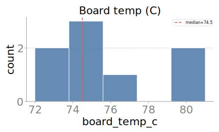

### hist aicore util pct

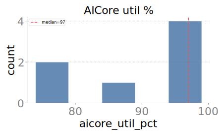

### hist aicpu util pct

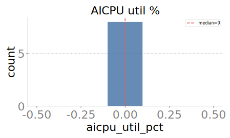

### hist ctrlcpu util pct

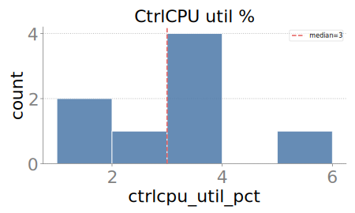

### hist mem bw util pct

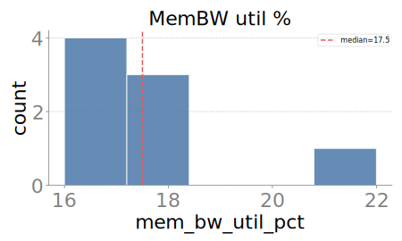

### hist power w

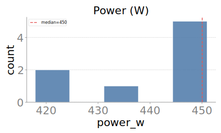

### hist shape sweep peak tflops

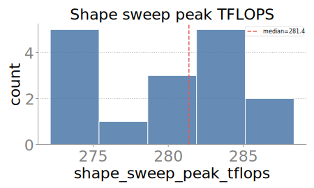

### heatmap relmed func tflops

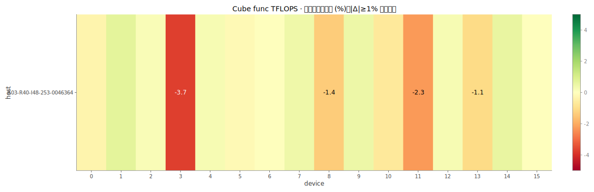

### box by host func tflops

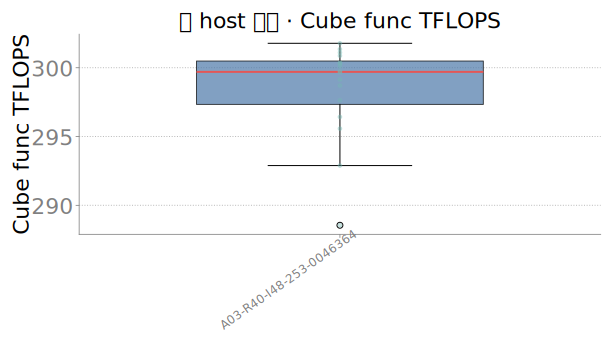

### sorted bar func tflops

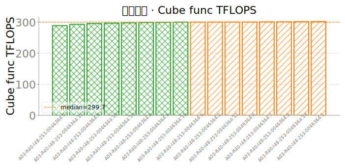

### bar host mean std func tflops

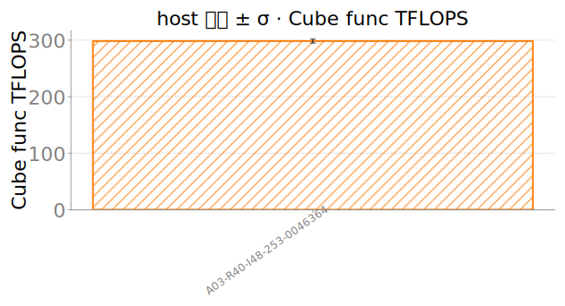

### heatmap relmed hbm gbps

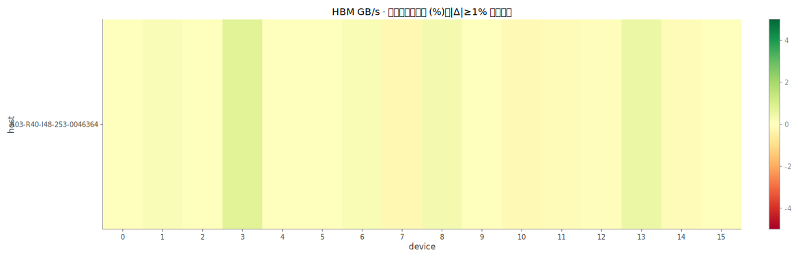

### box by host hbm gbps

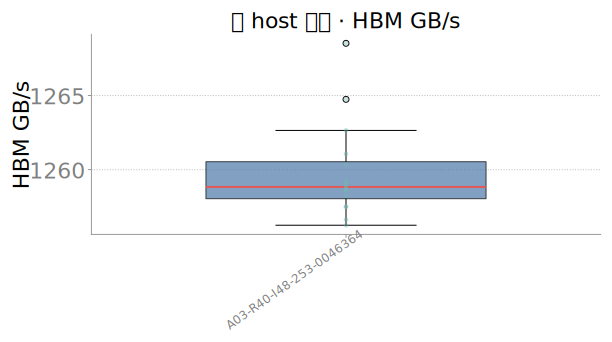

### sorted bar hbm gbps

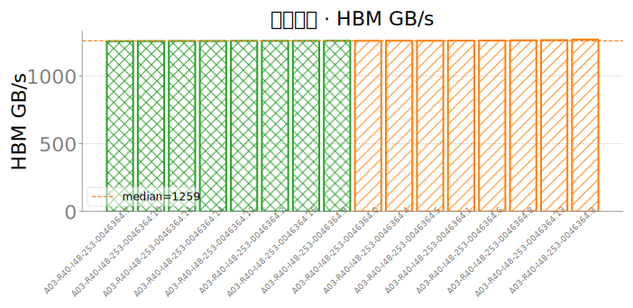

### bar host mean std hbm gbps

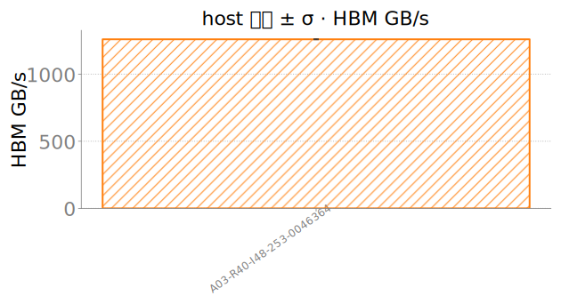

### heatmap relmed sustained tflops

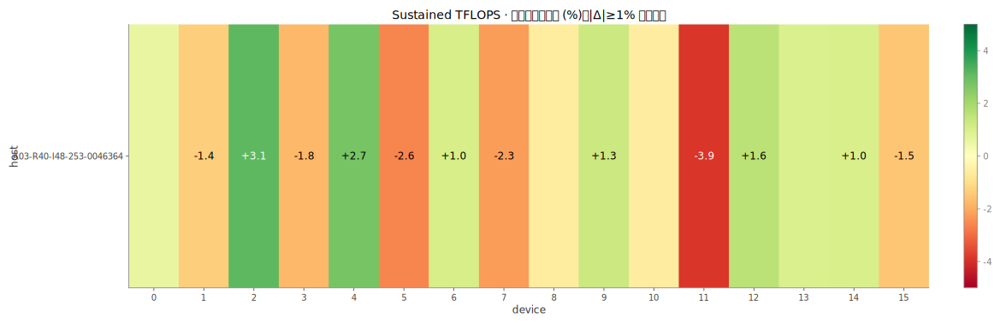

### box by host sustained tflops

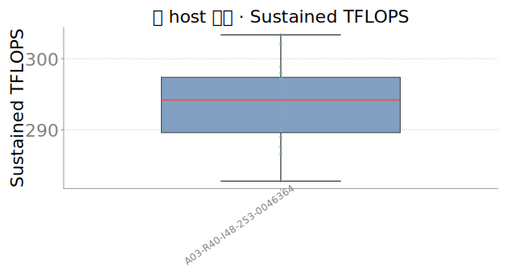

### sorted bar sustained tflops

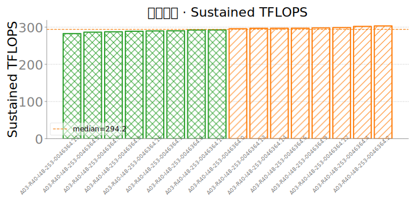

### bar host mean std sustained tflops

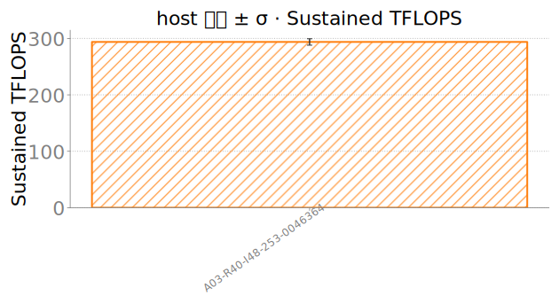

### heatmap relmed vector gflops

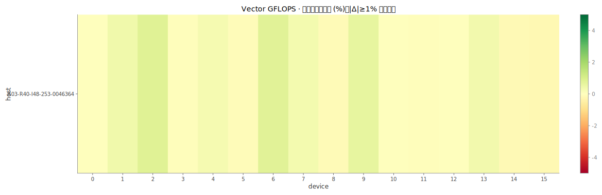

### box by host vector gflops

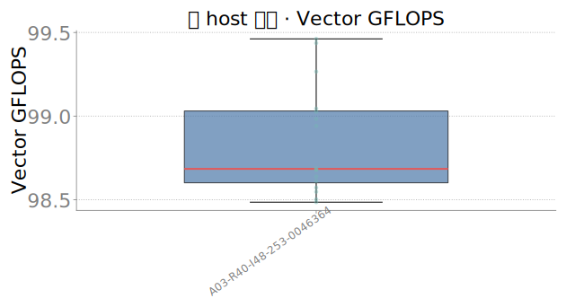

### sorted bar vector gflops

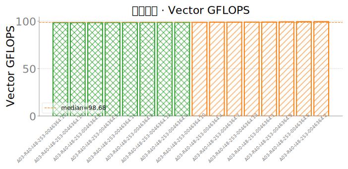

### bar host mean std vector gflops

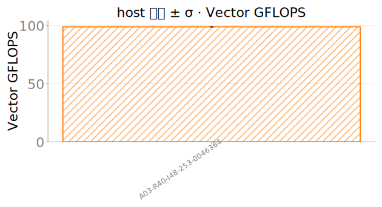

### heatmap relmed scalar elems per s

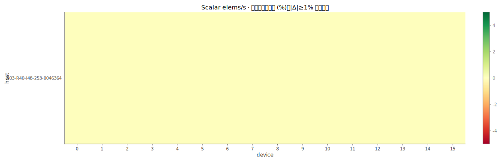

### box by host scalar elems per s

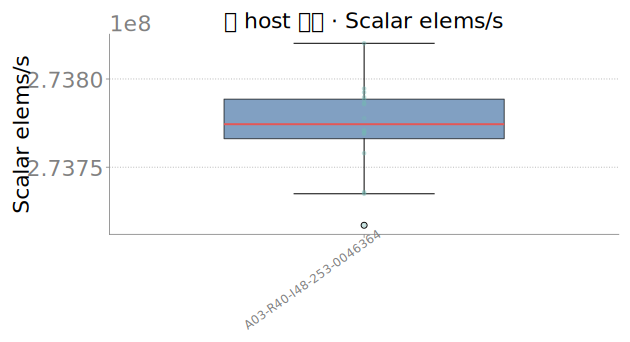

### sorted bar scalar elems per s

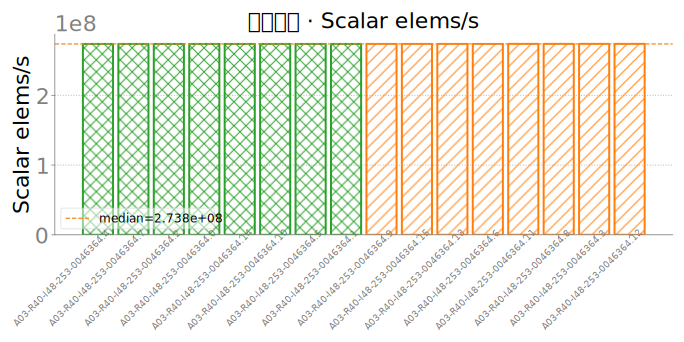

### bar host mean std scalar elems per s

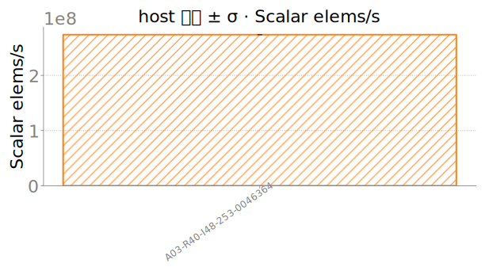

### heatmap relmed mte gbps

### box by host mte gbps

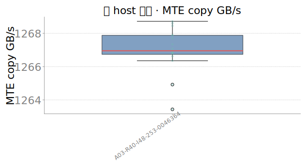

### sorted bar mte gbps

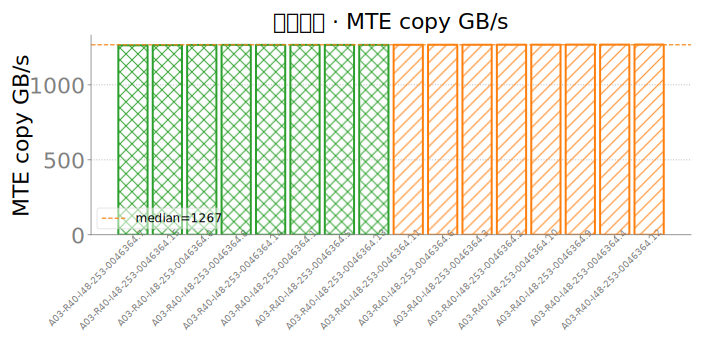

### bar host mean std mte gbps

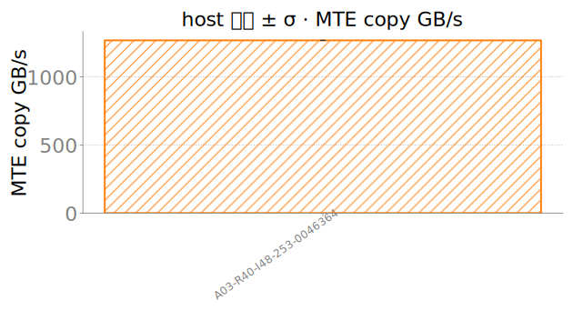

### heatmap relmed cube vector tflops

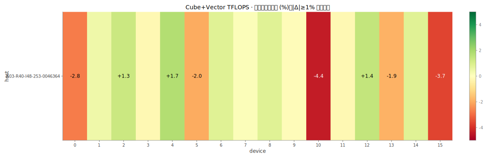

### box by host cube vector tflops

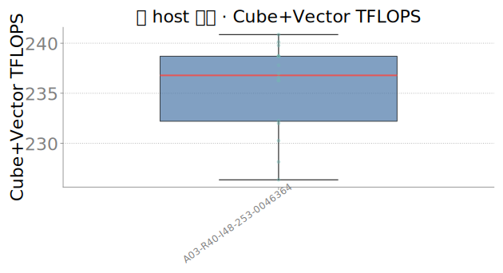

### sorted bar cube vector tflops

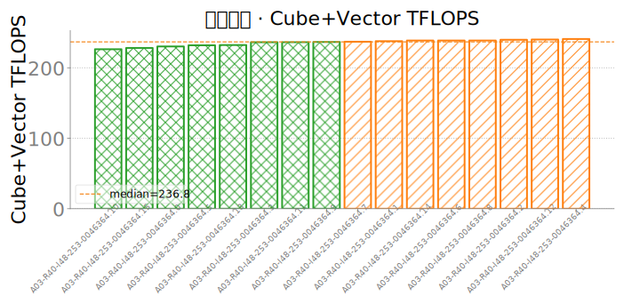

### bar host mean std cube vector tflops

### heatmap relmed sfu gflops

### box by host sfu gflops

### sorted bar sfu gflops

### bar host mean std sfu gflops

### heatmap relmed launch sync p50 us

### box by host launch sync p50 us

### sorted bar launch sync p50 us

### heatmap relmed launch sync p99 us

### box by host launch sync p99 us

### sorted bar launch sync p99 us

### heatmap relmed launch host overhead p50 us

### box by host launch host overhead p50 us

### sorted bar launch host overhead p50 us

### heatmap relmed launch host overhead p99 us

### box by host launch host overhead p99 us

### sorted bar launch host overhead p99 us

### heatmap relmed launch burst p50 us

### box by host launch burst p50 us

### sorted bar launch burst p50 us

### heatmap relmed launch burst per kernel p50 us

### box by host launch burst per kernel p50 us

### sorted bar launch burst per kernel p50 us

### heatmap relmed health temp c

### box by host health temp c

### sorted bar health temp c

### bar host mean std health temp c

### heatmap relmed health power w

### box by host health power w

### sorted bar health power w

### bar host mean std health power w

### heatmap relmed board temp c

### box by host board temp c

### sorted bar board temp c

### heatmap relmed aicore util pct

### box by host aicore util pct

### sorted bar aicore util pct

### heatmap relmed aicpu util pct

### box by host aicpu util pct

### sorted bar aicpu util pct

### heatmap relmed ctrlcpu util pct

### box by host ctrlcpu util pct

### sorted bar ctrlcpu util pct

### heatmap relmed mem bw util pct

### box by host mem bw util pct

### sorted bar mem bw util pct

### heatmap relmed power w

### box by host power w

### sorted bar power w

### bar host mean std power w

### heatmap relmed shape sweep peak tflops

### box by host shape sweep peak tflops

### sorted bar shape sweep peak tflops

### scatter func tflops vs vector gflops

### scatter hbm gbps vs mte gbps

### scatter power w vs func tflops

### scatter health power w vs func tflops

### scatter power w vs hbm gbps

### scatter health power w vs hbm gbps

### scatter launch host overhead p50 us vs ctrlcpu util pct

### timeseries sustained p05 p50

