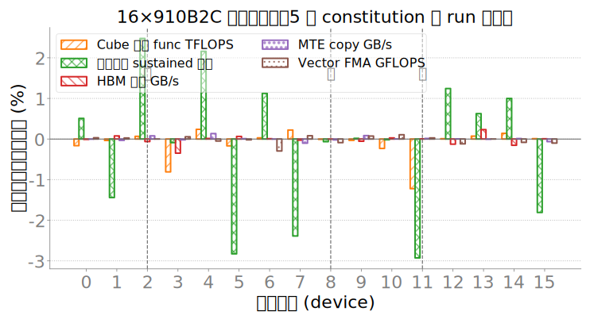
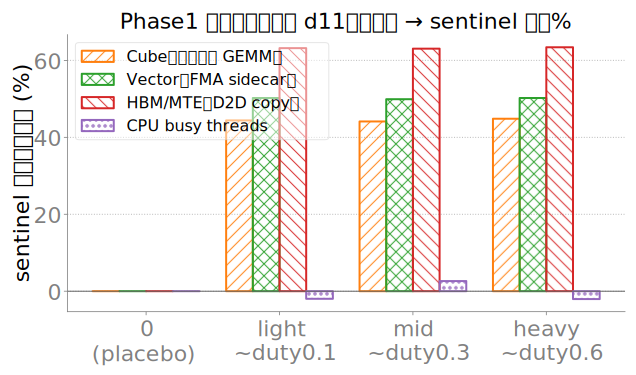
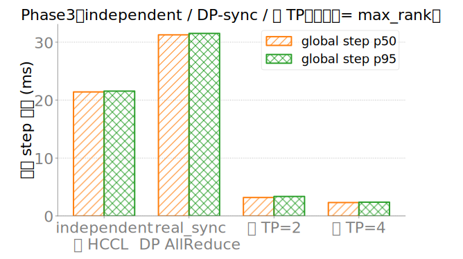

# npu-dev-1 Phase0–3 实验结果（交付）

> 实验已在公司 `npu-dev-1`（16×Ascend 910B2C）跑完；原始 jsonl 在 `myportal/results/npu-dev-1/`。

## 一句话结论

1. **卡间自然差异**：HBM/MTE/Vector 极齐（CV≪1%）；稳态 Cube 有约 ±3% 量级差；代表卡慢=11 / 中=8 / 快=2。
2. **可注入争用**：第二进程可把 Cube/Vector/HBM sentinel 打掉 ~45–63%；CPU busy 几乎无效。
3. **短窗算子测时几乎看不到争用**（Phase2 Event 计时 slowdown≈0%），与 Phase1 长窗对照——测时窗口决定是否暴露争用。
4. **同步代价**：independent 21.4ms → DP real_sync 31.3ms（+46%）；真 TP2/TP4 轨道已跑通。

## 图

### 图：卡体质相对偏差

**含义**：各卡相对本机 16 卡中位数的偏差；正=更快/更宽。

**字段**
- `func_tflops`：Stage A 方阵 GEMM（bf16 `a@b`）中位算力，含正确性门控
- `sustained_steady`：满载 GEMM 后半段窗口 TFLOPS 中位（**不是** card 末窗 `sustained_tflops`）
- `hbm_gbps`：大数组 `dst=src*2` 一读一写带宽
- `mte_gbps`：`Tensor.copy_` 纯 DMA/MTE 吞吐
- `vector_gflops`：逐元素 FMA（Vector ALU）

**采集**：`npu-smi` + `torch_npu`；CARD_SCREEN `config.constitution128.yaml`；16 卡并发 ×5 run。

**代表卡**：慢=11，中=8，快=2（虚线）。

### 图：Phase1 剂量–响应

**含义**：在代表慢卡 d11 上开第二进程干扰，CARD_SCREEN sentinel 主指标相对 placebo 的下降%。
下降越大 = 该部件争用越有效。

**sentinel 主指标**
- Cube → `func_tflops`（GEMM）
- Vector → `vector_gflops`（FMA）
- HBM/MTE → `mte_gbps`（`copy_`）
- CPU → `launch_host_overhead_p50_us`（host 侧 launch 开销）

**条件**：镜像 `vllm-ascend:v0.19.1rc1`；`ASCEND_RT_VISIBLE_DEVICES=11`；duty 初值 0/0.1/0.3/0.6。

**读图**：Cube/Vector/HBM 可打到 44–63%；CPU busy 对本机 launch 几乎无效（~0%）。

### 图：Phase3 全局 step

**含义**：`global_step_ms = max_over_ranks(local_step_ms)`。同步训练看全局，不看单卡局部。

**轨道**
- independent：16 卡各跑 Transformer-MLP Block，无 process group
- real_sync：同计算 + **grad AllReduce（DP）**，标签不是 TP
- 真 TP2/TP4：`tp_block_bench_npu.py` ColumnParallel+AG / RowParallel+RS

**条件**：`torch_npu` + HCCL；Block hidden=4096 seq=1024 layers=2；40 iter。

**读图**：indep≈21.4ms → real_sync≈31.3ms（同步约 +46%）；rank 间隙极小（同步会「藏慢卡」）。

## 数据路径

| 内容 | 路径 |
|------|------|
| 选卡 | `results/npu-dev-1/reps_final.json` |
| Phase1 dose | `.../20260715_123840-phase1-dose-d11/` |
| Phase2 | `.../20260715_130900-phase2-ops-d11/` |
| Phase3 | `.../20260715_131215-phase3-tracks/summary_global.json` |
| 计划进度 | `plans/npu-dev1-variation-causality.md` |
