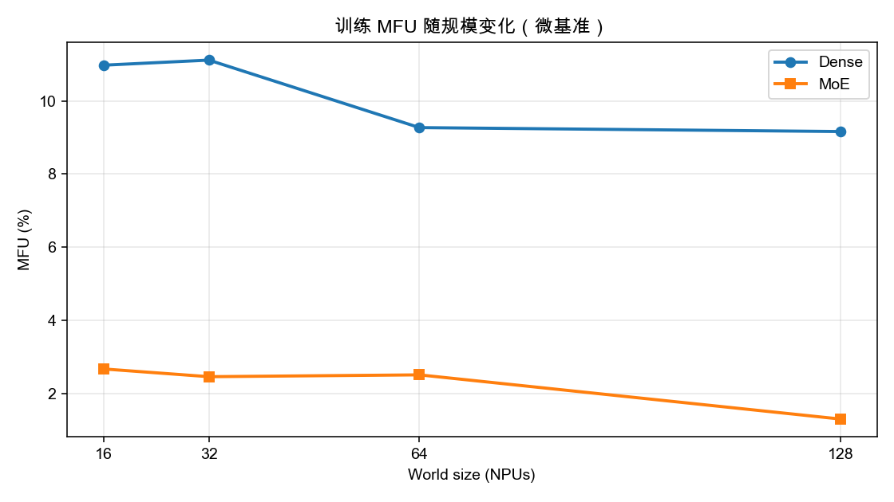
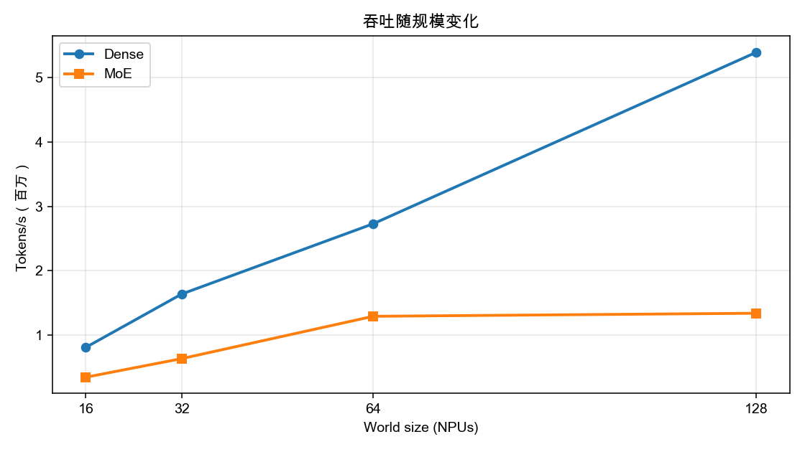
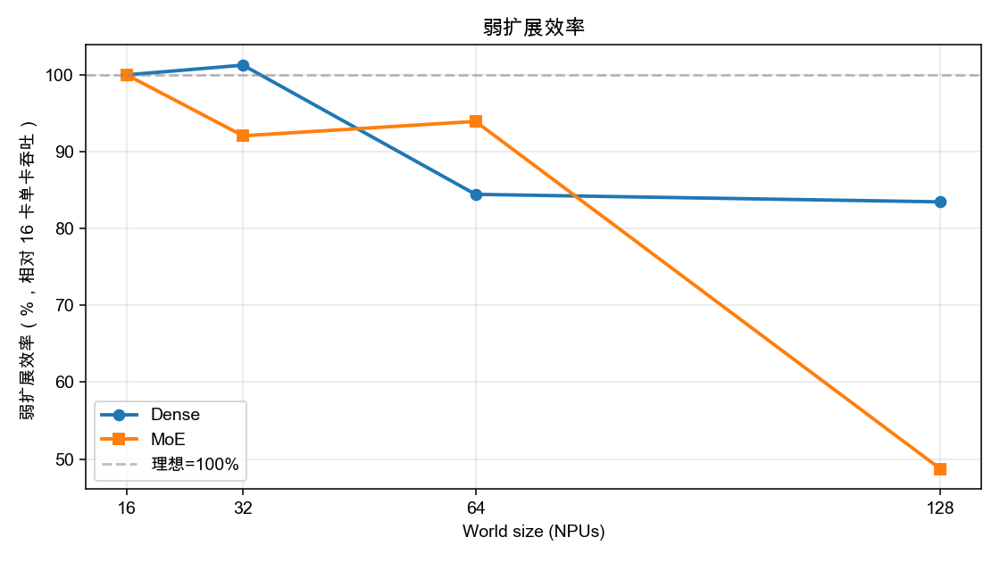

# 训练 MFU 128 卡扩展报告

> 数据：Dense `/Users/yinjinrun/random-thing/logs/mfu-dense-20260710_225626/results`；MoE `/Users/yinjinrun/random-thing/logs/mfu-moe-20260710_225844/results`  
> 生成时间：2026-07-10

## 1. 说明（重要）

本报告使用自研微基准 [`mfu_train_bench.py`](../scripts/cluster/mfu_train_bench.py)（torchrun + HCCL），**不是**完整 MindSpeed/Megatron Qwen3-8B / Qwen3-30B-A3B 训练。

原版 `geruijun` 脚本阻塞原因：

1. 路径写死 `/afs-grj`（实际为 `/afs-a3-241ceshi-shared/geruijun/`）
2. 脚本末尾 `| tee` 语法损坏
3. `PT_qwen3_8B.sh` 实际带 `NUM_EXPERTS`（MoE 形态）

因此按计划交付 **scale 阶梯 MFU/吞吐**，用可控微基准覆盖 16→128；完整 Qwen 需另修 wrapper。

峰值算力按 **320 TFLOPS/卡（bf16 估计）**；MFU = achieved / (peak × world_size)。

## 2. 关键结论

1. **Dense** 全档成功：16 卡 MFU **10.98%** → 128 卡 **9.16%**；吞吐从 0.81M 升至 5.40M tokens/s。
2. Dense 弱扩展效率 128 相对 16：**83.5%**（单卡吞吐略降，与 HCCL 跨节点开销一致）。
3. **MoE**（experts=8, topk=2）MFU 显著低于 Dense（约 **2.67%** @16），符合专家路由 + 额外通信开销预期。
4. MoE 已测档位：16, 32, 64, 128。

## 3. Dense 结果

配置：seq=1024, hidden=1024, layers=4（约 116M 参数）

| world | MFU | tokens/s | step_ms | achieved TFLOPS | peak TFLOPS | 弱扩展效率 |
|------:|----:|---------:|--------:|----------------:|------------:|----------:|
| 16 | 10.98% | 808218 | 20.3 | 562.0 | 5120 | 100.0% |
| 32 | 11.12% | 1636922 | 20.0 | 1138.2 | 10240 | 101.3% |
| 64 | 9.27% | 2730209 | 24.0 | 1898.4 | 20480 | 84.5% |
| 128 | 9.16% | 5397182 | 24.3 | 3752.7 | 40960 | 83.5% |

## 4. MoE 结果

配置：seq=512, hidden=1024, layers=2, experts=8, topk=2

| world | MFU | tokens/s | step_ms | achieved TFLOPS | peak TFLOPS | 弱扩展效率 |
|------:|----:|---------:|--------:|----------------:|------------:|----------:|
| 16 | 2.67% | 343524 | 23.8 | 136.7 | 5120 | 100.0% |
| 32 | 2.46% | 632590 | 25.9 | 251.8 | 10240 | 92.1% |
| 64 | 2.51% | 1290911 | 25.4 | 513.8 | 20480 | 93.9% |
| 128 | 1.30% | 1338531 | 49.0 | 532.7 | 40960 | 48.7% |

## 5. Dense vs MoE

| world | Dense MFU | MoE MFU | MoE/Dense |
|------:|----------:|--------:|----------:|
| 16 | 10.98% | 2.67% | 24.3% |
| 32 | 11.12% | 2.46% | 22.1% |
| 64 | 9.27% | 2.51% | 27.1% |
| 128 | 9.16% | 1.30% | 14.2% |

## 6. 图







## 7. 复现

```bash
# Dense
MODE=dense SCALES=16,32,64,128 ./scripts/cluster/run_mfu_bench_scale.sh

# MoE（注意递增 MASTER_PORT，避免 Bind_IP_Port）
MODE=moe SCALES=16,32,64,128 MASTER_PORT=31001 ./scripts/cluster/run_mfu_bench_scale.sh

# 出报告
python3 reports/gen_train_mfu_128_report.py
```

本地日志：`logs/mfu-dense-*`、`logs/mfu-moe-*`；AFS：`/afs-a3-241ceshi-shared/montyyin/results/mfu-*`。
